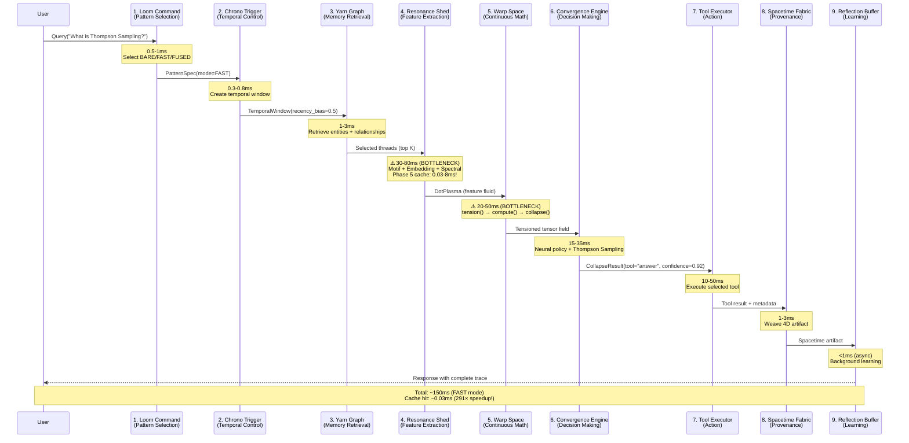
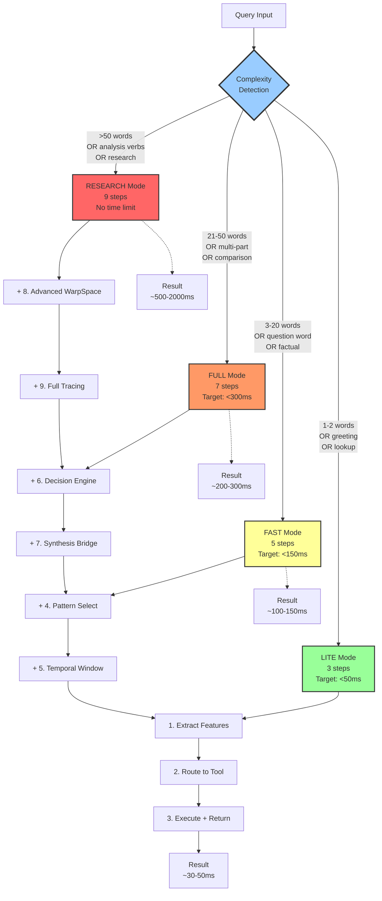
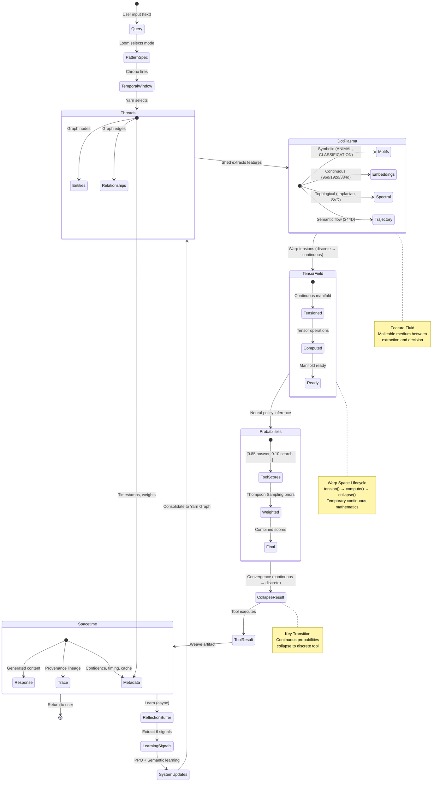

# HoloLoom Architecture Diagrams

**Comprehensive Mermaid visualizations of the 9-layer weaving system**

**Last Updated:** November 2, 2025

---

## Overview

This document provides comprehensive Mermaid diagrams for the HoloLoom weaving architecture. These diagrams complement the ASCII art in `ARCHITECTURE_VISUAL_MAP.md` with proper sequence diagrams, flowcharts, and component diagrams that render correctly in GitHub and VS Code.

**4 Core Diagrams:**
1. **Complete Weaving Cycle** - Sequence diagram showing all 9 steps with timing
2. **Progressive Complexity** - Flowchart showing mythRL LITE/FAST/FULL/RESEARCH routing
3. **Protocol-Based Architecture** - Component diagram showing warp thread isolation
4. **Data Transformations** - State diagram showing data evolution through pipeline

---

## 1. Complete Weaving Cycle (Sequence Diagram)

**What it shows:** The full 9-step weaving cycle from user query to final response, with timing information and bottleneck identification.

**Key insight:** Feature extraction (Resonance Shed) and continuous mathematics (Warp Space) are the primary bottlenecks, accounting for 50-130ms of the typical 150ms total latency.



**Legend:**
- ⚠️ = Bottleneck (>20ms typical)
- Green path = Happy path (all steps succeed)
- Async operations shown with dashed lines (-->>)

**Related files:**
- `HoloLoom/weaving_orchestrator.py` (lines 1-1963) - Main orchestrator
- `HoloLoom/loom/command.py` - Pattern selection
- `HoloLoom/chrono/trigger.py` - Temporal control
- `HoloLoom/resonance/shed.py` - Feature extraction
- `HoloLoom/warp/space.py` - Continuous mathematics
- `HoloLoom/convergence/engine.py` - Decision collapse

---

## 2. Progressive Complexity (mythRL 3-5-7-9 System)

**What it shows:** How queries are automatically routed to different complexity levels based on query characteristics. The mythRL system uses a 3-5-7-9 step progression.

**Key insight:** Simple queries (1-2 words, greetings) skip expensive processing, while complex queries (>50 words, analysis verbs) get the full 9-step treatment.



**Complexity Detection Logic:**

| Feature | LITE | FAST | FULL | RESEARCH |
|---------|------|------|------|----------|
| Word count | 1-2 | 3-20 | 21-50 | 50+ |
| Question words | No | Yes | Yes | Yes |
| Analysis verbs | No | No | Maybe | Yes |
| Multi-part | No | No | Yes | Yes |
| Time budget | <50ms | <150ms | <300ms | Unlimited |

**Examples:**
- LITE: "Hello", "What", "Thompson Sampling"
- FAST: "What is Thompson Sampling?", "How does it work?"
- FULL: "Compare Thompson Sampling to epsilon-greedy and explain the tradeoffs"
- RESEARCH: "Provide a comprehensive analysis of bandit algorithms including Thompson Sampling, UCB, epsilon-greedy, and softmax, with theoretical foundations and empirical comparisons"

**Related files:**
- `HoloLoom/weaving_orchestrator.py` (lines 600-750) - Complexity detection
- `HoloLoom/config.py` (lines 58-83) - ExecutionMode enum
- `HoloLoom/protocols/core.py` - ComplexityLevel protocol

---

## 3. Protocol-Based Architecture (Warp Thread Isolation)

**What it shows:** The "shuttle and warp threads" metaphor - independent modules (warp threads) coordinated by a single orchestrator (the shuttle).

**Key insight:** Warp threads NEVER import from each other, only from shared types/protocols. This enables independent development, testing, and swapping of implementations.

```mermaid
graph TB
    subgraph "Shared Layer (Foundation)"
        Types[documentation/types.py<br/>Query, Context, Features<br/>MemoryShard, Spacetime]
        Protocols[protocols/<br/>PatternSelectionProtocol<br/>FeatureExtractionProtocol<br/>WarpSpaceProtocol<br/>DecisionEngineProtocol]
        Config[config.py<br/>ExecutionMode<br/>MemoryBackend<br/>Settings]
    end

    subgraph "Warp Threads (Independent Modules)"
        Memory[memory/<br/>KGStore Protocol<br/>YarnGraph, AwarenessGraph<br/>INMEMORY/HYBRID/HYPERSPACE]
        Policy[policy/<br/>PolicyEngine Protocol<br/>NeuralCore + Thompson Sampling<br/>LoRA adapters]
        Embedding[embedding/<br/>Embedder Protocol<br/>MatryoshkaEmbeddings<br/>Multi-scale (96d, 192d, 384d)]
        Motif[motif/<br/>MotifDetector Protocol<br/>Regex, spaCy, Hybrid<br/>Symbolic features]
        Loom2[loom/<br/>LoomCommand<br/>PatternCard selector<br/>BARE/FAST/FUSED]
        Warp2[warp/<br/>WarpSpace<br/>Continuous manifold<br/>tension → detension]
        Shed2[resonance/<br/>ResonanceShed<br/>Feature fusion<br/>DotPlasma creation]
        Convergence2[convergence/<br/>ConvergenceEngine<br/>Decision collapse<br/>ARGMAX/THOMPSON/BLEND]
    end

    Orchestrator[weaving_orchestrator.py<br/>THE SHUTTLE<br/>Only cross-cutting module<br/>Weaves all threads together]

    Types -.->|Imports| Memory
    Types -.->|Imports| Policy
    Types -.->|Imports| Embedding
    Types -.->|Imports| Motif
    Types -.->|Imports| Loom2
    Types -.->|Imports| Warp2
    Types -.->|Imports| Shed2
    Types -.->|Imports| Convergence2

    Protocols -.->|Defines| Memory
    Protocols -.->|Defines| Policy
    Protocols -.->|Defines| Embedding
    Protocols -.->|Defines| Motif

    Config -.->|Configures| Memory
    Config -.->|Configures| Policy
    Config -.->|Configures| Embedding
    Config -.->|Configures| Motif

    Memory -->|Used by| Orchestrator
    Policy -->|Used by| Orchestrator
    Embedding -->|Used by| Orchestrator
    Motif -->|Used by| Orchestrator
    Loom2 -->|Used by| Orchestrator
    Warp2 -->|Used by| Orchestrator
    Shed2 -->|Used by| Orchestrator
    Convergence2 -->|Used by| Orchestrator

    style Orchestrator fill:#f96,stroke:#333,stroke-width:4px
    style Types fill:#9f9,stroke:#333,stroke-width:2px
    style Protocols fill:#9f9,stroke:#333,stroke-width:2px
    style Config fill:#9f9,stroke:#333,stroke-width:2px
    style Memory fill:#9cf,stroke:#333
    style Policy fill:#9cf,stroke:#333
    style Embedding fill:#9cf,stroke:#333
    style Motif fill:#9cf,stroke:#333
    style Loom2 fill:#9cf,stroke:#333
    style Warp2 fill:#9cf,stroke:#333
    style Shed2 fill:#9cf,stroke:#333
    style Convergence2 fill:#9cf,stroke:#333
```

**Design Principles:**

1. **Warp Thread Independence**: Each module is self-contained
   - No imports between warp threads
   - Only imports from shared types/protocols
   - Can be developed/tested in isolation

2. **Protocol-Based Contracts**: Clear interfaces
   - `PatternSelectionProtocol` - Pattern card selection
   - `FeatureExtractionProtocol` - Multi-modal feature extraction
   - `WarpSpaceProtocol` - Continuous mathematics operations
   - `DecisionEngineProtocol` - Tool selection strategies

3. **Shuttle Coordination**: Single orchestrator
   - Only the orchestrator imports from all modules
   - Weaves independent threads into coherent pipeline
   - Manages lifecycle and error handling

4. **Graceful Degradation**: Fallback at every layer
   - Motif: spaCy → regex fallback
   - Embedding: sentence-transformers → fallback embeddings
   - Memory: HYBRID → INMEMORY auto-fallback
   - Never crash due to missing dependencies

**Related files:**
- `HoloLoom/weaving_orchestrator.py` - The shuttle (imports all)
- `HoloLoom/protocols/core.py` - Protocol definitions
- `HoloLoom/documentation/types.py` - Shared data structures

---

## 4. Data Transformations (State Diagram)

**What it shows:** How data evolves from discrete → continuous → discrete through the weaving pipeline. The key philosophical insight: symbolic threads tension into continuous manifold, then collapse back to discrete decisions.

**Key insight:** The system seamlessly transitions between discrete (symbolic) and continuous (tensor) representations, enabling both interpretable reasoning and powerful neural computation.



**Data Representation Transitions:**

| Stage | Representation | Example | Size |
|-------|----------------|---------|------|
| Query | Text | "What is Thompson Sampling?" | Variable |
| Threads | Graph (discrete) | Entities + edges | ~5-20 entities |
| DotPlasma | Multi-modal features | Motifs + embeddings + spectral | ~400-800 dims |
| TensorField | Continuous manifold | Tensioned threads | ~400-800 dims |
| Probabilities | Continuous distribution | [0.85, 0.10, 0.03, 0.02] | 4-10 dims (tools) |
| CollapseResult | Discrete selection | "answer" | 1 tool |
| Spacetime | 4D artifact | Response + trace | Variable |

**Philosophical Insight: Discrete ↔ Continuous Duality**

HoloLoom embraces both symbolic (discrete) and neural (continuous) AI:

1. **Discrete → Continuous (tension)**
   - Symbolic knowledge graph → Continuous tensor field
   - Enables powerful neural computation
   - Learns from gradients

2. **Continuous → Discrete (collapse)**
   - Probability distributions → Discrete tool selection
   - Actionable decisions
   - Interpretable results

3. **Continuous → Discrete (detension)**
   - After computation, manifold collapses back to graph
   - Knowledge preserved in symbolic form
   - Human-readable memory

This duality enables the best of both worlds: neural power + symbolic interpretability.

**Related files:**
- `HoloLoom/warp/space.py` - tension() and detension()
- `HoloLoom/convergence/engine.py` - Collapse strategies
- `HoloLoom/fabric/spacetime.py` - 4D artifact structure

---

## Diagram Usage Guide

### When to Use Each Diagram

**1. Sequence Diagram (Complete Weaving Cycle)**
- Understanding end-to-end flow
- Identifying bottlenecks
- Debugging timing issues
- Performance optimization

**2. Flowchart (Progressive Complexity)**
- Query routing logic
- Complexity detection
- Performance vs quality tradeoffs
- Choosing the right mode

**3. Component Diagram (Protocol-Based Architecture)**
- System architecture
- Module dependencies
- Adding new components
- Understanding isolation

**4. State Diagram (Data Transformations)**
- Data flow
- Representation changes
- Understanding the discrete ↔ continuous duality
- Debugging data transformations

### Rendering These Diagrams

**GitHub:** All diagrams render automatically in `.md` files

**VS Code:** Install the "Markdown Preview Mermaid Support" extension

**Obsidian:** Native Mermaid support

**Notion:** Use Mermaid embeds

**Export to PNG/SVG:** Use the Mermaid CLI:
```bash
npm install -g @mermaid-js/mermaid-cli
mmdc -i ARCHITECTURE_DIAGRAMS.md -o diagrams/
```

---

## Symbol Legend

### Sequence Diagram
- Solid arrows (→) = Synchronous calls
- Dashed arrows (-->) = Asynchronous calls
- Note boxes = Timing information
- ⚠️ = Bottleneck (>20ms)

### Flowchart
- Rectangles = Process steps
- Diamonds = Decision points
- Dashed arrows = Alternative paths
- Color coding:
  - Green = Fast (<50ms)
  - Yellow = Medium (<150ms)
  - Orange = Slow (<300ms)
  - Red = Very slow (>300ms)

### Component Diagram
- Rectangles = Modules
- Dashed arrows (-.->) = Imports/dependencies
- Solid arrows (-->) = Used by
- Color coding:
  - Green = Shared/foundation layer
  - Blue = Warp threads (independent)
  - Red = Orchestrator (shuttle)

### State Diagram
- Circles = States
- Arrows = Transitions
- Composite states = Nested states
- [*] = Start/end states

---

## Cross-References

**Related Documentation:**
- `ARCHITECTURE_VISUAL_MAP.md` - ASCII art version (comprehensive text diagrams)
- `HOLOLOOM_MASTER_SCOPE_AND_SEQUENCE.md` - Complete architectural guide (25,000+ lines)
- `CURRENT_STATUS_AND_NEXT_STEPS.md` - Current state and priorities
- `CLAUDE.md` - Developer quick reference

**Key Source Files:**
- `HoloLoom/weaving_orchestrator.py` - Main orchestrator (1,963 lines)
- `HoloLoom/config.py` - Configuration (460 lines)
- `HoloLoom/protocols/core.py` - Protocol definitions
- `HoloLoom/documentation/types.py` - Shared types

**Performance Documentation:**
- `docs/completion-logs/PHASE_5_UG_COMPOSITIONAL_CACHE.md` - Compositional caching (291× speedup)
- `archive/session_docs/PHASE_5_COMPLETE.md` - Phase 5 complete summary
- `experiments/results/experiment_report.md` - Benchmark results

**Visualization Documentation:**
- `TUFTE_VISUALIZATION_ROADMAP.md` - Visualization principles
- `HoloLoom/visualization/` - All visualization modules

---

## Summary

These four Mermaid diagrams provide comprehensive visual documentation of the HoloLoom weaving architecture:

1. **Sequence Diagram**: Shows the complete 9-step weaving cycle with timing information
2. **Flowchart**: Illustrates the mythRL progressive complexity system (LITE/FAST/FULL/RESEARCH)
3. **Component Diagram**: Visualizes the protocol-based warp thread architecture
4. **State Diagram**: Maps data transformations through the discrete ↔ continuous pipeline

Together, they provide a complete visual understanding of how HoloLoom processes queries from input to intelligent response, with performance characteristics, architectural principles, and data flow clearly illustrated.

**Key Takeaways:**
- Feature extraction and continuous mathematics are the main bottlenecks
- Phase 5 compositional caching provides 291× speedups
- Protocol-based isolation enables independent module development
- Discrete ↔ continuous duality enables both neural power and symbolic interpretability

---

**For more details, see:**
- Architecture overview: `ARCHITECTURE_VISUAL_MAP.md`
- Complete guide: `HOLOLOOM_MASTER_SCOPE_AND_SEQUENCE.md`
- Developer reference: `CLAUDE.md`
