# HoloLoom Visual Architecture

**Last Updated**: 2025-11-15

This document provides comprehensive visual diagrams of the HoloLoom architecture, organized by major system components and data flows.

---

## Table of Contents

1. [9-Step Weaving Cycle](#1-9-step-weaving-cycle)
2. [Component Relationship Map](#2-component-relationship-map)
3. [Data Flow Architecture](#3-data-flow-architecture)
4. [Memory System Architecture](#4-memory-system-architecture)
5. [Learning Systems Timeline](#5-learning-systems-timeline)
6. [Integration Points](#6-integration-points)
7. [Phase Architectures](#7-phase-architectures)
8. [Backend Architecture](#8-backend-architecture)
9. [RAG System Architecture](#9-rag-system-architecture)
10. [Alignment Framework](#10-alignment-framework)

---

## 1. 9-Step Weaving Cycle

The complete weaving cycle from query input to fabric output with reflection learning.

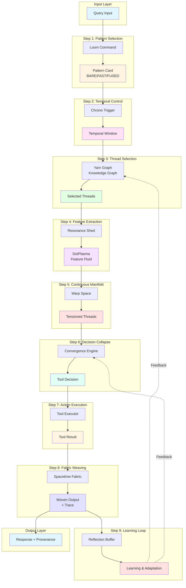

**Legend**:
- **Blue**: Input/Output layers
- **Yellow**: Pattern selection & temporal control
- **Pink**: Thread management
- **Green**: Feature extraction
- **Purple**: Continuous mathematics
- **Red**: Decision making & execution
- **Cyan**: Output synthesis
- **Orange**: Learning & feedback

---

## 2. Component Relationship Map

High-level view of all major HoloLoom components and their relationships.

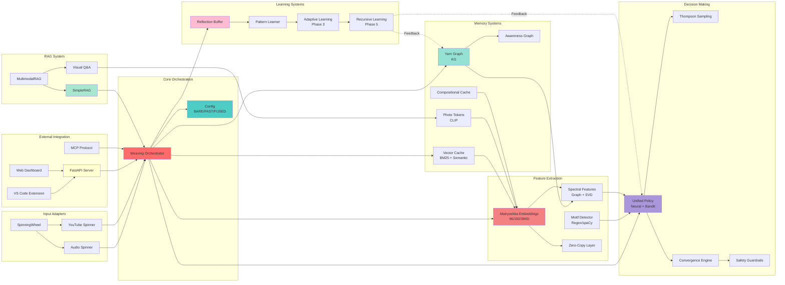

**Legend**:
- **Red**: Core orchestration
- **Cyan**: Configuration
- **Green**: Memory systems
- **Pink**: Feature extraction
- **Purple**: Decision making
- **Rose**: Learning systems
- **Yellow**: External integration
- **Light Green**: RAG system

---

## 3. Data Flow Architecture

Complete data transformation pipeline from raw input to final response.

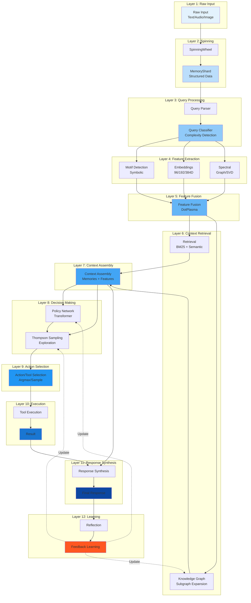

**Data Dimensions at Each Layer**:
1. Raw Input: Variable (text/bytes)
2. MemoryShard: Structured dict
3. Query: {text, context, metadata}
4. Features: {motifs: List, embeddings: [96/192/384], spectral: [10-50]}
5. DotPlasma: Concatenated feature vector
6. Context: {memories: List[MemoryShard], features: Features}
7. Policy Input: [batch, seq_len, mem_dim]
8. Action Logits: [batch, n_tools]
9. Tool Selection: int (tool index)
10. Result: {output: str, metadata: dict}
11. Spacetime: {response: str, trace: WeavingTrace, confidence: float}
12. Learning Signal: {success: bool, reward: float, patterns: List}

---

## 4. Memory System Architecture

The 11 integrated memory systems in HoloLoom.

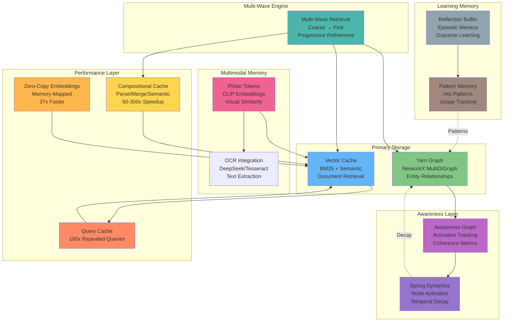

**Memory Characteristics**:

| System | Storage Type | Size | Access Time | Use Case |
|--------|-------------|------|-------------|----------|
| Yarn Graph | NetworkX | 10K-1M nodes | ~5ms | Entity relationships |
| Vector Cache | In-memory vectors | 100K docs | ~50ms | Semantic search |
| Awareness Graph | Activation map | Same as YG | <1ms | Activation tracking |
| Spring Dynamics | Timestamped activations | Same as YG | <1ms | Temporal decay |
| Photo Tokens | CLIP embeddings | 10K images | ~50ms | Visual similarity |
| Compositional Cache | LRU cache | 50K entries | <1ms | Parse reuse |
| Zero-Copy | Memory-mapped | 10K vectors | <0.1ms | Scale extraction |
| Query Cache | LRU cache | 1K queries | <0.01ms | Repeated queries |
| Reflection Buffer | Circular buffer | 1K episodes | ~1ms | Outcome learning |
| Pattern Memory | Hash map | 10K patterns | <1ms | Pattern matching |
| Multi-Wave | Virtual layer | N/A | +20ms | Progressive retrieval |

---

## 5. Learning Systems Timeline

The 7 learning systems organized by frequency and latency characteristics.

```mermaid
gantt
    title Learning Systems by Frequency & Overhead
    dateFormat X
    axisFormat %s

    section Per-Query (<5ms)
    Thompson Sampling (0.5ms)           :0, 1
    Policy Weight Updates (0.5ms)       :0, 1
    Heat Tracking (0.5ms)               :0, 1
    Provenance Logging (1ms)            :0, 1

    section Per-Success (~3ms)
    Pattern Extraction (1ms)            :active, 0, 1
    Reflection Storage (2ms)            :active, 0, 2

    section Hourly (50ms async)
    Pattern Mining (20ms)               :milestone, 0, 20
    Continuous Validation (20ms)        :milestone, 0, 20
    Pattern Deployment (10ms)           :milestone, 0, 10

    section Daily (100ms async)
    Performance Reports (50ms)          :crit, 0, 50
    Metrics Export (30ms)               :crit, 0, 30
    Alert Generation (20ms)             :crit, 0, 20

    section Weekly (offline)
    Model Retraining                    :done, 0, 1000
    Architecture Search                 :done, 0, 1000
```

**Learning System Details**:

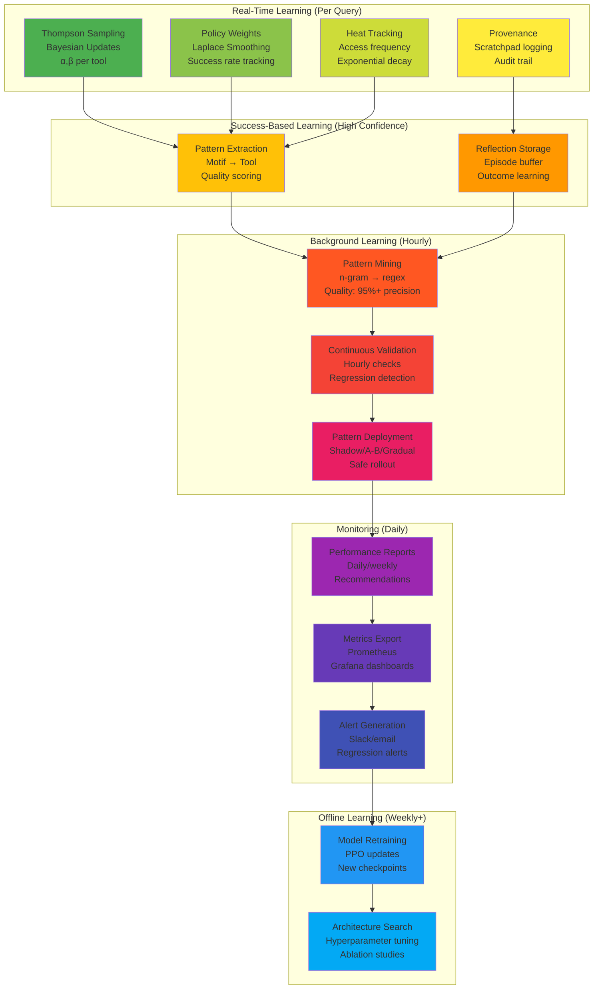

**Frequency Summary**:
- **Per-Query**: 4 systems, <5ms total
- **Per-Success**: 2 systems, ~3ms (10-20% of queries)
- **Hourly**: 3 systems, ~50ms (async, background)
- **Daily**: 3 systems, ~100ms (async, background)
- **Weekly**: 2 systems, offline (hours)

**Total Production Overhead**: ~5-8ms per query (real-time only)

---

## 6. Integration Points

External integration architecture showing all APIs and protocols.

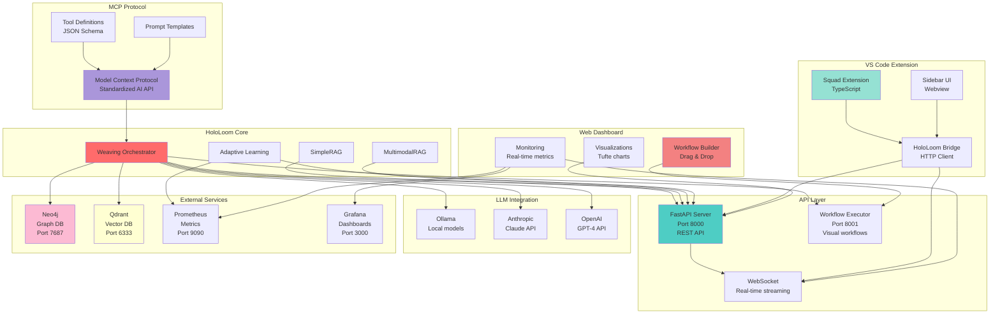

**API Endpoints**:

### FastAPI Server (Port 8000)

```
POST   /query              # Main query endpoint
POST   /query/batch        # Batch queries
GET    /health             # Health check
GET    /stats              # System statistics
GET    /audit-trail        # Audit log
POST   /memory/store       # Store memory
GET    /memory/search      # Search memories
POST   /reflect            # Submit feedback
```

### Workflow Executor (Port 8001)

```
POST   /api/workflow/execute      # Execute workflow
POST   /api/workflow/validate     # Validate workflow
GET    /api/agents/list           # List available agents
WS     /ws/workflow/{id}          # Real-time workflow updates
```

### MCP Tools

```json
{
  "tools": [
    {
      "name": "hololoom_query",
      "description": "Query HoloLoom with agentic reasoning",
      "parameters": {
        "query": "string",
        "mode": "direct|verify|research|plan_execute",
        "max_steps": "integer"
      }
    },
    {
      "name": "hololoom_memory_search",
      "description": "Search knowledge graph",
      "parameters": {
        "query": "string",
        "k": "integer"
      }
    }
  ]
}
```

---

## 7. Phase Architectures

### Phase 3: Adaptive Learning System

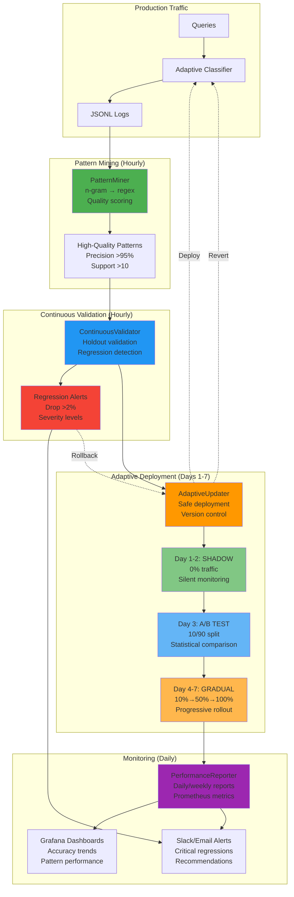

**Phase 3 Components**:
- **PatternMiner**: 425 lines, ~500ms hourly
- **ContinuousValidator**: 469 lines, ~2-5s hourly
- **AdaptiveUpdater**: 682 lines, ~100ms deployment
- **PerformanceReporter**: 627 lines, ~50ms daily

**Total Overhead**: <1ms per query (logging only), ~3-6s hourly (async)

### Phase 5: Compositional Cache

```mermaid
graph TB
    subgraph "Input"
        TXT[Text Input<br/>"the big red ball"]
    end

    subgraph "Tier 1: Parse Cache (10-50x)"
        XB[X-bar Parser<br/>Universal Grammar]
        PC[Parse Cache<br/>LRU 10K entries]
        TREE[Parse Tree<br/>NP[Det[the] Adj[big] Adj[red] N[ball]]]

        TXT --> XB
        XB --> PC
        PC --> TREE
    end

    subgraph "Tier 2: Merge Cache (5-10x)"
        MC[Merge Cache<br/>Compositional reuse<br/>LRU 50K entries]
        PHRASES["Cached Phrases:<br/>ball (reused)<br/>red ball (reused)<br/>big red ball (new)"]

        TREE --> MC
        MC --> PHRASES
    end

    subgraph "Tier 3: Semantic Cache (3-10x)"
        SC[Semantic Cache<br/>244D projections<br/>LRU 10K entries]
        EMB[Cached Embeddings<br/>ball: [0.1, 0.3, ...]<br/>red ball: [0.2, 0.5, ...]<br/>big red ball: [0.15, 0.4, ...]]

        PHRASES --> SC
        SC --> EMB
    end

    subgraph "Compositional Reuse"
        NEW["New Query:<br/>a big red ball"]
        REUSE["Reuse from cache:<br/>big red ball (100% match)<br/>Zero computation!"]

        NEW -.Match.-> MC
        MC -.Hit.-> REUSE
    end

    subgraph "Performance"
        COLD[Cold Cache<br/>~150ms<br/>Full parsing]
        WARM[Warm Cache<br/>~0.5ms<br/>300x speedup!]
    end

    TXT --> COLD
    REUSE --> WARM

    style XB fill:#4caf50
    style PC fill:#8bc34a
    style MC fill:#ffc107
    style SC fill:#ff9800
    style REUSE fill:#2196f3
    style WARM fill:#00bcd4
```

**Phase 5 Components**:
- **X-bar Parser**: Principled phrase structure
- **Parse Cache**: 10K entries, <1ms lookup
- **Merge Cache**: 50K entries, compositional reuse
- **Semantic Cache**: 10K entries, 244D vectors

**Total Speedup**: 50-300x (multiplicative, hot paths)

---

## 8. Backend Architecture

Memory backend hierarchy with auto-fallback chain.

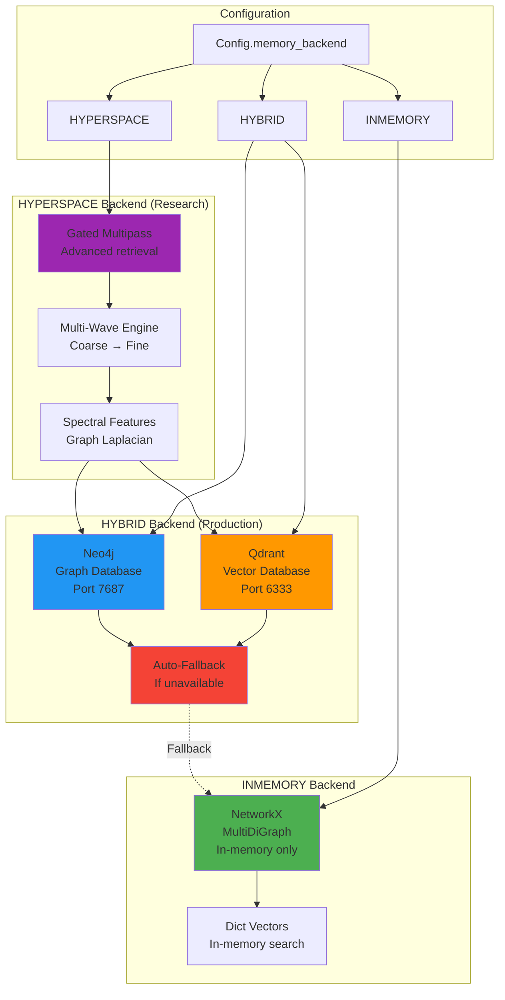

**Backend Comparison**:

| Backend | Storage | Latency | Scalability | Use Case |
|---------|---------|---------|-------------|----------|
| **INMEMORY** | NetworkX + Dict | ~5ms | 10K nodes | Development, testing |
| **HYBRID** | Neo4j + Qdrant | ~20ms | 10M+ nodes | Production (recommended) |
| **HYPERSPACE** | Neo4j + Qdrant + Advanced | ~50ms | 10M+ nodes | Research, complex queries |

**Auto-Fallback Chain**:
```
HYBRID → Check Neo4j available → Yes: Use Neo4j
                                → No: Check Qdrant available → Yes: Use Qdrant
                                                              → No: Fallback to INMEMORY
```

**Docker Setup**:
```yaml
services:
  neo4j:
    image: neo4j:latest
    ports:
      - "7474:7474"  # Browser
      - "7687:7687"  # Bolt
    environment:
      NEO4J_AUTH: neo4j/password

  qdrant:
    image: qdrant/qdrant
    ports:
      - "6333:6333"  # HTTP
      - "6334:6334"  # gRPC
```

---

## 9. RAG System Architecture

Complete RAG system with multimodal capabilities.

```mermaid
graph TB
    subgraph "RAG API Layer"
        SRAG[SimpleRAG<br/>Level 2-4 RAG<br/>Zero-config]
        MRAG[MultimodalRAG<br/>Text + Images<br/>CLIP + OCR]
    end

    subgraph "Reasoning Modes"
        DIR[DIRECT<br/>Single-pass<br/>~150ms]
        VER[VERIFY<br/>Answer + verify<br/>~600ms]
        RES[RESEARCH<br/>Multi-query<br/>~900ms]
        PLAN[PLAN_EXECUTE<br/>Goal decomposition<br/>~750ms]
    end

    subgraph "Text Path"
        ING[ingest()<br/>Any modality]
        QRY[query()<br/>Agentic reasoning]
        BAT[batch_query()<br/>Efficient batch]

        ING --> QRY
        QRY --> BAT
    end

    subgraph "Visual Path"
        PHOTO[ingest_photo()<br/>CLIP encoding]
        VQA[query_with_image()<br/>OCR + CLIP]
        REL[get_related_photos()<br/>Similarity search]

        PHOTO --> VQA
        VQA --> REL
    end

    subgraph "HoloLoom Integration"
        WO[Weaving Orchestrator<br/>Full pipeline]
        MEM[Memory Systems<br/>Yarn Graph + Vector]
        EMB[Matryoshka Embeddings<br/>Multi-scale]

        WO --> MEM
        WO --> EMB
    end

    subgraph "LLM Integration"
        OLL[Ollama<br/>Local (default)]
        ANT[Anthropic<br/>Claude 3.5]
        OAI[OpenAI<br/>GPT-4]
    end

    subgraph "Performance"
        CACHE[Query Cache<br/>100x speedup]
        COMP[Visual Compression<br/>5-20x tokens]
        DASH[RAG Dashboard<br/>5 panels]
    end

    %% Connections
    SRAG --> DIR
    SRAG --> VER
    SRAG --> RES
    SRAG --> PLAN

    MRAG --> SRAG
    MRAG --> PHOTO
    MRAG --> VQA

    SRAG --> ING
    SRAG --> QRY

    MRAG --> REL

    QRY --> WO
    VQA --> WO

    WO --> OLL
    WO --> ANT
    WO --> OAI

    QRY --> CACHE
    VQA --> COMP

    SRAG --> DASH

    style SRAG fill:#4caf50
    style MRAG fill:#8bc34a
    style DIR fill:#2196f3
    style VER fill:#03a9f4
    style RES fill:#00bcd4
    style PLAN fill:#0097a7
    style WO fill:#ff6b6b
    style CACHE fill:#ffc107
    style COMP fill:#ff9800
```

**RAG Features**:

1. **Level 2: Hybrid RAG** - BM25 + semantic search
2. **Level 3: Graph RAG** - Yarn Graph entity relationships
3. **Level 4: Agentic RAG** - Multi-step reasoning (4 modes)
4. **Multimodal**: Text + images with CLIP + OCR
5. **Performance**: Query cache (100x), visual compression (5-20x)

**RAG Dashboard** (5 Panels):
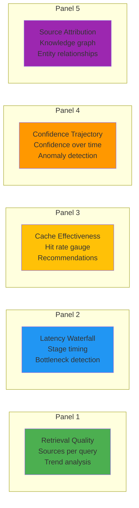

---

## 10. Alignment Framework

Production-ready safety and monitoring system.

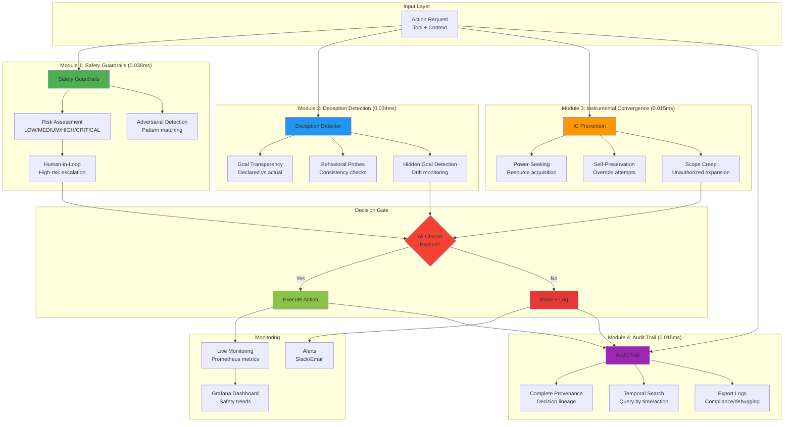

**Alignment Metrics** (Prometheus):
```
alignment_actions_total{status="allowed|blocked"}
alignment_risk_level{level="low|medium|high|critical"}
alignment_deception_score{threshold="0.8"}
alignment_power_seeking_detected{count}
alignment_audit_events_total{action_type}
```

**Performance Characteristics**:
- **Total Overhead**: 0.103 ms per query (29x faster than 3ms target)
- **Safety Guardrails**: 0.039 ms
- **Deception Detection**: 0.034 ms
- **IC Prevention**: 0.015 ms
- **Audit Trail**: 0.015 ms

**Test Coverage**: 46 functional tests + 13 performance benchmarks

---

## Summary: System Scale

**Code Statistics** (November 2025):

| Component | Files | Lines | Tests |
|-----------|-------|-------|-------|
| Core Orchestration | 8 | 4,665 | 24 |
| Memory Systems | 24 | 8,500 | 31 |
| Policy & Decision | 12 | 3,200 | 18 |
| RAG System | 11 | 6,811 | 45 |
| Alignment Framework | 8 | 4,200 | 59 |
| Adaptive Learning (Phase 3) | 6 | 3,148 | 13 |
| Recursive Learning (Phase 5) | 5 | 4,700 | 22 |
| Visualization | 10 | 5,400 | 39 |
| **TOTAL** | **84** | **40,624** | **251** |

**Performance Profile**:

| Operation | Latency | Throughput |
|-----------|---------|------------|
| Simple query (LITE) | ~45ms | 22 QPS |
| Standard query (FAST) | ~150ms | 6.7 QPS |
| Complex query (FULL) | ~300ms | 3.3 QPS |
| Research query | ~900ms | 1.1 QPS |
| Repeated query (cached) | <1ms | 1000+ QPS |
| Alignment checks | 0.1ms | N/A (per action) |
| Learning overhead | 5-8ms | N/A (per query) |

**Production Deployment**:
- **Docker services**: Neo4j, Qdrant, Prometheus, Grafana
- **APIs**: FastAPI (8000), Workflow Executor (8001)
- **Monitoring**: Prometheus metrics, Grafana dashboards, Slack alerts
- **Safety**: Alignment framework with <0.11ms overhead
- **Learning**: Background learning with <8ms per-query overhead

---

**Document Version**: 1.0.0
**Last Updated**: 2025-11-15
**Maintained By**: HoloLoom Team
