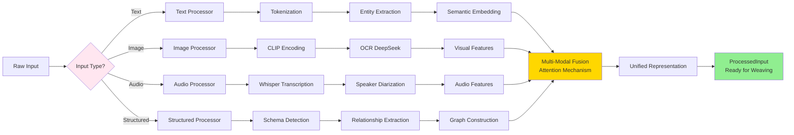
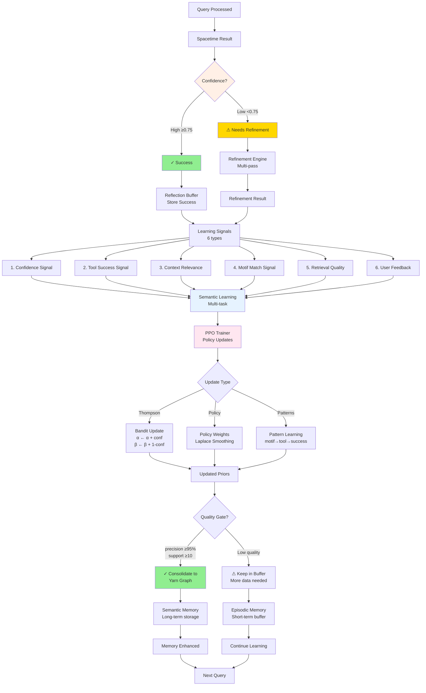

# HoloLoom Architecture: Visual Map
## The Complete System at a Glance

**Last Updated:** October 29, 2025

---

## 🎯 The Big Picture: 9-Layer Weaving System

```
┌─────────────────────────────────────────────────────────────────────────┐
│                         USER QUERY / INPUT DATA                         │
└─────────────────────────────────┬───────────────────────────────────────┘
                                  │
                                  ▼
┌─────────────────────────────────────────────────────────────────────────┐
│  LAYER 1: INPUT PROCESSING (Multi-Modal)                                │
│  ┌──────────┐  ┌──────────┐  ┌──────────┐  ┌──────────┐  ┌──────────┐ │
│  │  Text    │  │  Image   │  │  Audio   │  │ Structured│  │  Video   │ │
│  │Processor │  │Processor │  │Processor │  │ Processor │  │ (Future) │ │
│  └────┬─────┘  └────┬─────┘  └────┬─────┘  └────┬─────┘  └────┬─────┘ │
│       │             │              │              │              │       │
│       └─────────────┴──────────────┴──────────────┴──────────────┘       │
│                                  │                                        │
│                        [InputRouter: Auto-detect]                        │
│                                  │                                        │
│                        [MultiModalFusion]                                │
│                                  ▼                                        │
│                      ProcessedInput (unified)                            │
└─────────────────────────────────┬───────────────────────────────────────┘
                                  │
                                  ▼
┌─────────────────────────────────────────────────────────────────────────┐
│  LAYER 2: PATTERN SELECTION (Loom Command)                              │
│                                                                           │
│    Query Complexity Detector                                             │
│              │                                                            │
│              ├─ Simple?  → BARE Mode   (<50ms, regex motifs)            │
│              ├─ Standard? → FAST Mode   (100-200ms, hybrid)             │
│              └─ Complex?  → FUSED Mode  (200-500ms, full power)         │
│                      │                                                    │
│                      ▼                                                    │
│               PatternCard Selected                                       │
└─────────────────────────────────┬───────────────────────────────────────┘
                                  │
                                  ▼
┌─────────────────────────────────────────────────────────────────────────┐
│  LAYER 3: TEMPORAL CONTROL (Chrono Trigger)                             │
│                                                                           │
│    ┌─────────────────┐         ┌──────────────────┐                    │
│    │ TemporalWindow  │────────▶│ ExecutionLimits  │                    │
│    │ (valid time)    │         │ (timeout, halt)  │                    │
│    └─────────────────┘         └──────────────────┘                    │
│              │                           │                               │
│              └───────────┬───────────────┘                               │
│                          ▼                                               │
│                Activated Threads (time-constrained)                     │
└─────────────────────────────────┬───────────────────────────────────────┘
                                  │
                                  ▼
┌─────────────────────────────────────────────────────────────────────────┐
│  LAYER 4: MEMORY RETRIEVAL (Yarn Graph)                                 │
│                                                                           │
│    Backend Options:                                                      │
│    ┌──────────────┐  ┌────────────────┐  ┌──────────────────┐         │
│    │  INMEMORY    │  │    HYBRID      │  │   HYPERSPACE     │         │
│    │  NetworkX    │  │ Neo4j + Qdrant │  │ Gated Multipass  │         │
│    │  (dev, fast) │  │ (production)   │  │ (research)       │         │
│    └──────┬───────┘  └───────┬────────┘  └────────┬─────────┘         │
│           └──────────────────┴────────────────────┘                     │
│                              │                                           │
│                   ┌──────────┴──────────┐                               │
│                   │   AwarenessGraph    │                               │
│                   │ (activation fields) │                               │
│                   └──────────┬──────────┘                               │
│                              ▼                                           │
│                 Subgraph (entities + relationships)                     │
└─────────────────────────────────┬───────────────────────────────────────┘
                                  │
                                  ▼
┌─────────────────────────────────────────────────────────────────────────┐
│  LAYER 5: FEATURE EXTRACTION (Resonance Shed)                           │
│                                                                           │
│    Feature Threads:                                                      │
│    ┌─────────────────┐  ┌──────────────────┐  ┌─────────────────┐     │
│    │  Motif Thread   │  │ Embedding Thread │  │ Spectral Thread │     │
│    │  (symbolic)     │  │  (continuous)    │  │  (topological)  │     │
│    └────────┬────────┘  └────────┬─────────┘  └────────┬────────┘     │
│             │                    │                       │               │
│             └────────────────────┴───────────────────────┘               │
│                                  │                                        │
│                  ┌───────────────┴────────────────┐                     │
│                  │  Universal Grammar Chunker     │                     │
│                  │  (X-bar theory, Phase 5)       │                     │
│                  └───────────────┬────────────────┘                     │
│                                  │                                        │
│                  ┌───────────────┴────────────────┐                     │
│                  │  Compositional Cache (3-tier)  │                     │
│                  │  Parse→Merge→Semantic (291×!)  │                     │
│                  └───────────────┬────────────────┘                     │
│                                  ▼                                        │
│                      DotPlasma (feature fluid)                          │
└─────────────────────────────────┬───────────────────────────────────────┘
                                  │
                                  ▼
┌─────────────────────────────────────────────────────────────────────────┐
│  LAYER 6: CONTINUOUS MATHEMATICS (Warp Space)                           │
│                                                                           │
│    Lifecycle:                                                            │
│    ┌──────────┐    ┌──────────┐    ┌──────────┐    ┌──────────┐       │
│    │ tension()│───▶│ compute()│───▶│collapse()│───▶│detension()│       │
│    │ discrete │    │  tensor  │    │continuous│    │ back to  │       │
│    │→continuous    │operations│    │→discrete │    │  graph   │       │
│    └──────────┘    └──────────┘    └──────────┘    └──────────┘       │
│                                                                           │
│              Tensioned Threads (continuous manifold)                    │
└─────────────────────────────────┬───────────────────────────────────────┘
                                  │
                                  ▼
┌─────────────────────────────────────────────────────────────────────────┐
│  LAYER 7: DECISION MAKING (Convergence Engine)                          │
│                                                                           │
│    ┌──────────────────────────────────────────────────┐                 │
│    │          NeuralPolicy (Transformer)              │                 │
│    │  ┌────────────┐  ┌────────────┐  ┌────────────┐ │                 │
│    │  │Multi-head  │  │  Motif-   │  │   LoRA     │ │                 │
│    │  │ Attention  │  │  gated    │  │ Adapters   │ │                 │
│    │  └────────────┘  └────────────┘  └────────────┘ │                 │
│    └──────────────────────┬───────────────────────────┘                 │
│                           │                                              │
│                           ▼                                              │
│              Tool Probabilities (continuous)                            │
│                           │                                              │
│    ┌──────────────────────┴───────────────────────┐                    │
│    │     CollapseStrategy (discrete selection)    │                    │
│    │  • ARGMAX (exploit)                          │                    │
│    │  • EPSILON_GREEDY (90% exploit, 10% explore) │                    │
│    │  • BAYESIAN_BLEND (70% neural, 30% bandit)  │                    │
│    │  • PURE_THOMPSON (explore via posterior)    │                    │
│    └──────────────────────┬───────────────────────┘                    │
│                           │                                              │
│                           ▼                                              │
│                   ActionPlan (selected tool)                            │
└─────────────────────────────────┬───────────────────────────────────────┘
                                  │
                                  ▼
┌─────────────────────────────────────────────────────────────────────────┐
│  LAYER 8: EXECUTION & PROVENANCE (Spacetime)                            │
│                                                                           │
│    ┌──────────────────┐                                                 │
│    │  ToolExecutor    │                                                 │
│    │  (run action)    │                                                 │
│    └────────┬─────────┘                                                 │
│             │                                                            │
│             ▼                                                            │
│    ┌──────────────────────────────────────────────┐                    │
│    │         Spacetime (4D Fabric)                │                    │
│    │  ┌────────────────────────────────────────┐  │                    │
│    │  │ 3D: Semantic Space (entities, features)│  │                    │
│    │  │ 1D: Temporal Trace (provenance)       │  │                    │
│    │  └────────────────────────────────────────┘  │                    │
│    │                                                │                    │
│    │  Complete computational lineage:              │                    │
│    │  • Query → Features → Context → Decision     │                    │
│    │  • Tool execution → Result                   │                    │
│    │  • Confidence + Metadata                     │                    │
│    │  • Full reproducibility                      │                    │
│    └──────────────────────┬───────────────────────┘                    │
│                           │                                              │
│                           ▼                                              │
│                 Woven Artifact (serializable)                           │
└─────────────────────────────────┬───────────────────────────────────────┘
                                  │
                                  ▼
┌─────────────────────────────────────────────────────────────────────────┐
│  LAYER 9: LEARNING & REFLECTION (Reflection Buffer)                     │
│                                                                           │
│    ┌──────────────────────────────────────────────┐                    │
│    │        ReflectionBuffer (episodic)           │                    │
│    │  • Recent interactions                       │                    │
│    │  • Learning signals (6 types)                │                    │
│    │  • Performance metrics                       │                    │
│    └──────────────────────┬───────────────────────┘                    │
│                           │                                              │
│                           ▼                                              │
│    ┌──────────────────────────────────────────────┐                    │
│    │      Learning Systems (adaptive)             │                    │
│    │  ┌──────────────┐  ┌──────────────────────┐ │                    │
│    │  │  Semantic    │  │   PPO Trainer        │ │                    │
│    │  │  Learning    │  │   (RL policy update) │ │                    │
│    │  │  (6 signals) │  │                      │ │                    │
│    │  └──────────────┘  └──────────────────────┘ │                    │
│    └──────────────────────┬───────────────────────┘                    │
│                           │                                              │
│                           ▼                                              │
│         Consolidation: Episodic → Semantic Memory                       │
│         (successful patterns committed to Yarn Graph)                   │
└─────────────────────────────────┬───────────────────────────────────────┘
                                  │
                                  ▼
                          [Loop back to top]
```

---

## 🎨 Mermaid Diagrams: Interactive Visual Guide

### Complete 9-Layer System (Mermaid)

```mermaid
graph TD
    START[User Query / Input Data] --> L1[Layer 1: Input Processing]

    L1 --> L1a[Text Processor]
    L1 --> L1b[Image Processor]
    L1 --> L1c[Audio Processor]
    L1 --> L1d[Structured Processor]

    L1a --> L1m[Multi-Modal Fusion]
    L1b --> L1m
    L1c --> L1m
    L1d --> L1m

    L1m --> L2[Layer 2: Pattern Selection<br/>Loom Command]

    L2 --> L2a{Query Complexity?}
    L2a -->|Simple| L2b[BARE Mode<br/><50ms]
    L2a -->|Standard| L2c[FAST Mode<br/>100-200ms]
    L2a -->|Complex| L2d[FUSED Mode<br/>200-500ms]

    L2b --> L3
    L2c --> L3
    L2d --> L3

    L3[Layer 3: Temporal Control<br/>Chrono Trigger] --> L3a[Temporal Window]
    L3 --> L3b[Execution Limits]

    L3a --> L4
    L3b --> L4

    L4[Layer 4: Memory Retrieval<br/>Yarn Graph] --> L4a{Backend?}
    L4a -->|Dev| L4b[INMEMORY<br/>NetworkX]
    L4a -->|Prod| L4c[HYBRID<br/>Neo4j+Qdrant]
    L4a -->|Research| L4d[HYPERSPACE<br/>Gated Multipass]

    L4b --> L4e[Awareness Graph]
    L4c --> L4e
    L4d --> L4e

    L4e --> L5[Layer 5: Feature Extraction<br/>Resonance Shed]

    L5 --> L5a[Motif Thread<br/>Symbolic]
    L5 --> L5b[Embedding Thread<br/>Continuous]
    L5 --> L5c[Spectral Thread<br/>Topological]

    L5a --> L5d[DotPlasma Fusion]
    L5b --> L5d
    L5c --> L5d

    L5d --> L5e[Compositional Cache<br/>291x speedup]
    L5e --> L6[Layer 6: Warp Space<br/>Continuous Mathematics]

    L6 --> L6a[tension: discrete→continuous]
    L6a --> L6b[compute: tensor operations]
    L6b --> L6c[collapse: continuous→discrete]
    L6c --> L6d[detension: back to graph]

    L6d --> L7[Layer 7: Convergence Engine<br/>Decision Making]

    L7 --> L7a[Neural Policy<br/>Transformer]
    L7a --> L7b[Tool Probabilities]

    L7b --> L7c{Collapse Strategy?}
    L7c -->|ARGMAX| L7d[Exploit Best]
    L7c -->|EPSILON_GREEDY| L7e[90% Exploit<br/>10% Explore]
    L7c -->|BAYESIAN_BLEND| L7f[70% Neural<br/>30% Bandit]
    L7c -->|THOMPSON| L7g[Posterior Sampling]

    L7d --> L8
    L7e --> L8
    L7f --> L8
    L7g --> L8

    L8[Layer 8: Execution<br/>Spacetime] --> L8a[Tool Executor]
    L8a --> L8b[Spacetime 4D Fabric<br/>3D Semantic + 1D Temporal]
    L8b --> L8c[Complete Provenance]

    L8c --> L9[Layer 9: Learning<br/>Reflection Buffer]

    L9 --> L9a[Reflection Buffer<br/>Episodic Memory]
    L9a --> L9b[Learning Systems]
    L9b --> L9c[Semantic Learning<br/>6 signals]
    L9b --> L9d[PPO Trainer<br/>RL updates]

    L9c --> L9e[Consolidation]
    L9d --> L9e
    L9e --> L9f[Episodic → Semantic]

    L9f --> LOOP[Loop Back to Memory]
    LOOP --> L4

    style START fill:#E6F3FF
    style L1 fill:#FFE6F0
    style L2 fill:#E6FFE6
    style L3 fill:#FFF0E6
    style L4 fill:#FFE6F0
    style L5 fill:#E6F3FF
    style L6 fill:#FFE6F0
    style L7 fill:#E6FFE6
    style L8 fill:#FFF0E6
    style L9 fill:#FFE6F0
    style LOOP fill:#90EE90

    style L5d fill:#FFD700
    style L7a fill:#FFD700
    style L8b fill:#FFD700
```



---

### Input Processing & Multi-Modal Fusion



---

### Decision Making: Policy → Convergence

```mermaid
graph TD
    A[DotPlasma Features] --> B[Neural Policy<br/>Transformer-based]

    B --> B1[Multi-Head Attention<br/>16 heads]
    B1 --> B2[Motif-Gated Attention<br/>Symbolic guidance]
    B2 --> B3[Cross-Attention to Context<br/>Memory integration]
    B3 --> B4[LoRA Adapters<br/>4 adapters for modes]

    B4 --> C[Tool Probabilities<br/>[0.65, 0.25, 0.07, 0.03]]

    C --> D{Convergence Strategy}

    D -->|ARGMAX| E1[Max Probability<br/>Deterministic]
    D -->|EPSILON_GREEDY| E2[ε=0.1<br/>Explore 10%]
    D -->|BAYESIAN_BLEND| E3[Blend Weights<br/>70% Neural<br/>30% Bandit]
    D -->|PURE_THOMPSON| E4[Thompson Sampling<br/>Beta(α, β)]

    E1 --> F[Tool Selection]
    E2 --> F
    E3 --> F
    E4 --> F

    F --> G{Selected Tool?}
    G -->|answer| H1[Generate Direct Answer]
    G -->|research| H2[Multi-Query Research]
    G -->|verify| H3[Claim Verification]
    G -->|explore| H4[Graph Traversal]

    H1 --> I[Tool Execution]
    H2 --> I
    H3 --> I
    H4 --> I

    I --> J[Result + Metadata]
    J --> K[Spacetime Fabric<br/>With Provenance]

    style B fill:#E6F3FF
    style C fill:#FFD700
    style E3 fill:#90EE90
    style K fill:#E6FFE6
```

---

### Learning Loop: Reflection & Adaptation



---

## 🔄 The Three Core Operations

```
┌────────────────────────────────────────────────────────────────────────┐
│                                                                         │
│  loom.experience(content, metadata)                                    │
│      │                                                                  │
│      ├─ Process input (Layer 1)                                        │
│      ├─ Extract features (Layer 5)                                     │
│      ├─ Store in Yarn Graph (Layer 4)                                  │
│      └─ Return Memory object                                           │
│                                                                         │
│  loom.recall(query, limit, filters)                                    │
│      │                                                                  │
│      ├─ Full 9-layer weaving cycle                                     │
│      │   1. Pattern selection (BARE/FAST/FUSED)                        │
│      │   2. Temporal control                                           │
│      │   3. Memory retrieval (with awareness)                          │
│      │   4. Feature extraction (with caching!)                         │
│      │   5. Warp tensioning                                            │
│      │   6. Policy inference (tool selection)                          │
│      │   7. Tool execution                                             │
│      │   8. Spacetime weaving                                          │
│      │   9. (Reflection deferred)                                      │
│      └─ Return List[Memory]                                            │
│                                                                         │
│  loom.reflect(memories, feedback)                                      │
│      │                                                                  │
│      ├─ Store in ReflectionBuffer (Layer 9)                            │
│      ├─ Extract learning signals                                       │
│      ├─ Update policy weights (PPO)                                    │
│      ├─ Update semantic space projections                              │
│      └─ Consolidate to Yarn Graph (if high confidence)                 │
│                                                                         │
└────────────────────────────────────────────────────────────────────────┘
```

---

## 📊 Data Flow: From Query to Response

```
USER INPUT
    │
    ▼
┌──────────────────────────────────┐
│ "What are dogs?"                 │  ← Text query
└──────────────────┬───────────────┘
                   │
                   ▼
┌──────────────────────────────────┐
│ InputRouter                      │  ← Auto-detect: TEXT
│  └─ TextProcessor               │
│      • Tokenize                  │
│      • Extract entities          │
│      • Compute embedding         │
└──────────────────┬───────────────┘
                   │
                   ▼
┌──────────────────────────────────┐
│ ProcessedInput                   │
│  modality: TEXT                  │
│  features: {...}                 │
│  embedding: [0.23, -0.45, ...]  │
│  metadata: {"lang": "en"}        │
└──────────────────┬───────────────┘
                   │
                   ▼
┌──────────────────────────────────┐
│ LoomCommand                      │  ← Detect complexity: LOW
│  └─ Select: FAST mode            │     (simple factual query)
└──────────────────┬───────────────┘
                   │
                   ▼
┌──────────────────────────────────┐
│ YarnGraph.retrieve()             │
│  Query: "dogs"                   │
│  ┌─────────────────────────────┐ │
│  │ Entity: "dog"               │ │
│  │  type: animal               │ │
│  │  relations:                 │ │
│  │   - IS_A → mammal           │ │
│  │   - HAS → fur, tail         │ │
│  │   - BEHAVIOR → bark         │ │
│  │ Entity: "mammal"            │ │
│  │  type: biological_class     │ │
│  │  relations:                 │ │
│  │   - IS_A → vertebrate       │ │
│  └─────────────────────────────┘ │
│  Top 5 entities retrieved        │
└──────────────────┬───────────────┘
                   │
                   ▼
┌──────────────────────────────────┐
│ ResonanceShed                    │
│  Extract features:               │
│  ┌─────────────────────────────┐ │
│  │ Motifs:                     │ │
│  │  • ANIMAL                   │ │
│  │  • CLASSIFICATION           │ │
│  │ Embeddings:                 │ │
│  │  • Query: [96d, 192d, 384d]│ │
│  │  • Context: [96d, ...]     │ │
│  │ Spectral:                   │ │
│  │  • Laplacian: [0.12, ...]  │ │
│  │  • SVD topics: [0.45, ...] │ │
│  └─────────────────────────────┘ │
│  ↓ Fusion                        │
│  DotPlasma (unified features)    │
└──────────────────┬───────────────┘
                   │
                   ▼
┌──────────────────────────────────┐
│ WarpSpace                        │
│  tension() → continuous          │
│  • Thread 1: "dog" entity        │
│  • Thread 2: "mammal" entity     │
│  • Thread 3: "bark" behavior     │
│  Compute manifold distances      │
└──────────────────┬───────────────┘
                   │
                   ▼
┌──────────────────────────────────┐
│ NeuralPolicy                     │
│  Input: DotPlasma features       │
│  ┌─────────────────────────────┐ │
│  │ Transformer inference       │ │
│  │  • Attention over context   │ │
│  │  • Motif gating             │ │
│  │  • LoRA adapter (FAST)      │ │
│  └─────────────────────────────┘ │
│  Output: Tool probabilities      │
│   [0.85 answer, 0.10 search, ...] │
│                                  │
│ ConvergenceEngine                │
│  Strategy: EPSILON_GREEDY        │
│  → Select: "answer" (exploit)    │
└──────────────────┬───────────────┘
                   │
                   ▼
┌──────────────────────────────────┐
│ ToolExecutor                     │
│  Tool: "answer"                  │
│  Context: [dog, mammal, ...]    │
│  ↓                               │
│  Generate: "Dogs are mammals     │
│   that typically have fur, bark, │
│   and are domesticated animals." │
└──────────────────┬───────────────┘
                   │
                   ▼
┌──────────────────────────────────┐
│ Spacetime                        │
│  query: "What are dogs?"         │
│  features: DotPlasma {...}       │
│  context: [5 entities]           │
│  action_plan: "answer"           │
│  result: "Dogs are mammals..."   │
│  confidence: 0.92                │
│  trace: {                        │
│    pattern_selection: 2ms        │
│    retrieval: 45ms               │
│    feature_extraction: 60ms      │
│    policy_inference: 35ms        │
│    tool_execution: 25ms          │
│    total: 167ms                  │
│  }                               │
│  metadata: {                     │
│    cache_hit: false,             │
│    mode: "FAST"                  │
│  }                               │
└──────────────────┬───────────────┘
                   │
                   ▼
┌──────────────────────────────────┐
│ ReflectionBuffer.store()         │
│  (for future learning)           │
└──────────────────┬───────────────┘
                   │
                   ▼
            RETURN TO USER
      "Dogs are mammals that..."
```

---

## 🚀 Phase 5: Compositional Caching (The Magic)

```
TRADITIONAL CACHING:
─────────────────────────────────────────────────────
Query 1: "the big red ball"
         ↓
    [Full processing: 185ms]
         ↓
    Cache result for "the big red ball"
         ↓
    Result: {...}

Query 2: "a big red ball"  (different query!)
         ↓
    Cache MISS (not "the big red ball")
         ↓
    [Full processing: 185ms]  ← Wasteful!
         ↓
    Cache result for "a big red ball"
         ↓
    Result: {...}

NO REUSE between similar queries!


COMPOSITIONAL CACHING (Phase 5):
─────────────────────────────────────────────────────
Query 1: "the big red ball"
         ↓
    [X-bar Parser: detect phrases]
         ├─ NP: "the big red ball"
         │   ├─ Det: "the"
         │   └─ N': "big red ball"
         │       ├─ AP: "big"
         │       └─ N': "red ball"
         │           ├─ AP: "red"
         │           └─ N: "ball"
         ↓
    [Merge Operator: compose embeddings]
         ├─ Merge("ball") → emb_1
         ├─ Merge("red", "ball") → emb_2
         ├─ Merge("big", "red ball") → emb_3
         └─ Merge("the", "big red ball") → emb_4
         ↓
    [Cache all compositions!]
         Parse cache: "the big red ball" → X-bar tree
         Merge cache: "ball" → emb_1
         Merge cache: "red ball" → emb_2
         Merge cache: "big red ball" → emb_3
         Merge cache: "the big red ball" → emb_4
         ↓
    [Full processing: 7.91ms]
         ↓
    Result: {...}


Query 2: "a big red ball"  (similar but different!)
         ↓
    [X-bar Parser]
         Parse cache MISS (different text)
         ↓ Parse again (5ms)
         ├─ NP: "a big red ball"
         │   ├─ Det: "a"  (different!)
         │   └─ N': "big red ball"  (same!)
         ↓
    [Merge Operator]
         Merge cache HIT: "ball" → emb_1 ✅
         Merge cache HIT: "red ball" → emb_2 ✅
         Merge cache HIT: "big red ball" → emb_3 ✅
         Merge cache MISS: "a big red ball" (new combo)
         ↓ Compose only new part (1ms)
         └─ Merge("a", cached_emb_3) → emb_5
         ↓
    [Partial processing: 4.90ms]
         ↓ 1.6× faster from compositional reuse!
    Result: {...}


Query 3: "the big red ball"  (exact repeat)
         ↓
    Parse cache HIT: X-bar tree ✅
    Merge cache HIT: all compositions ✅
         ↓
    [Cached result: 0.03ms]
         ↓ 291× faster!
    Result: {...}


THE MAGIC:
─────────────────────────────────────────────────────
Different queries share compositional building blocks!
  "the big red ball"
  "a big red ball"
  "the red ball"
  "big red ball"
       ↓
All reuse: "ball", "red ball", "big red ball"

Multiplicative speedups across cache tiers:
  Tier 1 (Parse): 10-50×
  Tier 2 (Merge): 5-10×  ← Compositional reuse!
  Tier 3 (Semantic): 3-10×
  Total: 50-300× possible!

Measured: 291× speedup (cold → hot)
```

---

## 💾 Memory Architecture: Three Backends

```
┌──────────────────────────────────────────────────────────────────┐
│                    MEMORY BACKEND OPTIONS                        │
└──────────────────────────────────────────────────────────────────┘

┌──────────────────────────────────────────────────────────────────┐
│  1. INMEMORY (Development, Always Works)                         │
│  ┌────────────────────────────────────────────────────────────┐  │
│  │  NetworkX MultiDiGraph                                     │  │
│  │  • In-memory Python objects                                │  │
│  │  • No external dependencies                                │  │
│  │  • Fast for small graphs (<10K entities)                   │  │
│  │  • Lost on restart (ephemeral)                             │  │
│  │                                                             │  │
│  │  Use case: Development, testing, demos                     │  │
│  └────────────────────────────────────────────────────────────┘  │
└──────────────────────────────────────────────────────────────────┘

┌──────────────────────────────────────────────────────────────────┐
│  2. HYBRID (Production, Recommended)                             │
│  ┌────────────────────────────────────────────────────────────┐  │
│  │  Neo4j (Graph) + Qdrant (Vectors)                         │  │
│  │  ┌──────────────────┐       ┌──────────────────┐         │  │
│  │  │     Neo4j        │       │     Qdrant       │         │  │
│  │  │  • Entities      │◄─────►│  • Embeddings    │         │  │
│  │  │  • Relationships │ sync  │  • Fast search   │         │  │
│  │  │  • ACID          │       │  • HNSW index    │         │  │
│  │  │  • Cypher query  │       │  • Filtering     │         │  │
│  │  └──────────────────┘       └──────────────────┘         │  │
│  │                                                             │  │
│  │  Auto-fallback: HYBRID → INMEMORY if Docker down           │  │
│  │                                                             │  │
│  │  Use case: Production, persistent storage, scale           │  │
│  └────────────────────────────────────────────────────────────┘  │
└──────────────────────────────────────────────────────────────────┘

┌──────────────────────────────────────────────────────────────────┐
│  3. HYPERSPACE (Research, Advanced)                              │
│  ┌────────────────────────────────────────────────────────────┐  │
│  │  Gated Multipass Recursive Retrieval                       │  │
│  │                                                             │  │
│  │  Matryoshka Importance Gating:                             │  │
│  │  ┌────────────────────────────────────────────────────┐   │  │
│  │  │ Depth 0: threshold 0.6 (broad exploration)         │   │  │
│  │  │    ↓                                                │   │  │
│  │  │ Depth 1: threshold 0.75 (focused)                  │   │  │
│  │  │    ↓                                                │   │  │
│  │  │ Depth 2: threshold 0.85 (very focused)             │   │  │
│  │  │    ↓                                                │   │  │
│  │  │ Natural funnel: broad → focused                    │   │  │
│  │  │ Prevents infinite crawling                         │   │  │
│  │  └────────────────────────────────────────────────────┘   │  │
│  │                                                             │  │
│  │  Graph traversal:                                           │  │
│  │  • Follow entity relationships                              │  │
│  │  • Expand context subgraphs                                 │  │
│  │  • Path-weighted retrieval                                  │  │
│  │  • Multi-hop reasoning                                      │  │
│  │                                                             │  │
│  │  Use case: Complex multi-hop queries, research             │  │
│  └────────────────────────────────────────────────────────────┘  │
└──────────────────────────────────────────────────────────────────┘

Configuration:
─────────────────────────────────────────────────────────────────
from HoloLoom import Config, MemoryBackend

config = Config.fast()
config.memory_backend = MemoryBackend.INMEMORY   # Default
config.memory_backend = MemoryBackend.HYBRID     # Production
config.memory_backend = MemoryBackend.HYPERSPACE # Research
```

---

## 🎨 Visualization System: Tufte Principles

```
┌──────────────────────────────────────────────────────────────────┐
│           DASHBOARD STRATEGY SELECTOR (8 strategies)             │
└──────────────────────────────────────────────────────────────────┘
                               │
                ┌──────────────┴──────────────┐
                │  Query Intent Detection     │
                │  (from query text + context)│
                └──────────────┬──────────────┘
                               │
         ┌─────────────────────┼─────────────────────┐
         │                     │                     │
         ▼                     ▼                     ▼
┌──────────────────┐  ┌──────────────────┐  ┌──────────────────┐
│ EXPLORATORY      │  │ FACTUAL          │  │ OPTIMIZATION     │
│ "Show me         │  │ "What is X?"     │  │ "Where is slow?" │
│  everything"     │  │                  │  │                  │
│                  │  │ Panels:          │  │ Panels:          │
│ Panels:          │  │ • Metrics        │  │ • Waterfall      │
│ • Knowledge Graph│  │ • Timeline       │  │ • Bottleneck     │
│ • Small Multiples│  │ • Evidence       │  │ • Cache gauge    │
│ • Semantic Space │  │ • Confidence     │  │ • Heatmap        │
│ • Timeline       │  │                  │  │                  │
└──────────────────┘  └──────────────────┘  └──────────────────┘

         │                     │                     │
         └─────────────────────┼─────────────────────┘
                               │
                               ▼
┌──────────────────────────────────────────────────────────────────┐
│                    15+ VISUALIZATION TYPES                       │
│  ┌───────────────┬───────────────┬───────────────┬────────────┐ │
│  │ Sparklines    │ Small Multiples│ Density Tables│ Waterfall  │ │
│  │ (inline trend)│ (comparison)  │ (max info)    │ (pipeline) │ │
│  └───────────────┴───────────────┴───────────────┴────────────┘ │
│  ┌───────────────┬───────────────┬───────────────┬────────────┐ │
│  │ Confidence    │ Cache Gauge   │ Knowledge     │ Semantic   │ │
│  │ Trajectory    │ (performance) │ Graph (force) │ Space (3D) │ │
│  │ (anomalies)   │               │               │            │ │
│  └───────────────┴───────────────┴───────────────┴────────────┘ │
│  ┌───────────────┬───────────────┬───────────────┬────────────┐ │
│  │ Heatmaps      │ Parallel      │ Slopegraphs   │ Strip      │ │
│  │ (semantic)    │ Coordinates   │ (change)      │ Plots      │ │
│  └───────────────┴───────────────┴───────────────┴────────────┘ │
└──────────────────────────────────────────────────────────────────┘
                               │
                               ▼
┌──────────────────────────────────────────────────────────────────┐
│                    TUFTE PRINCIPLES                              │
│                                                                   │
│  1. Maximize data-ink ratio (remove chartjunk)                   │
│     Traditional: ~30% data-ink                                   │
│     HoloLoom: 60-70% data-ink ✅                                 │
│                                                                   │
│  2. Meaning first (not decoration)                               │
│     Bad:  "Latency"                                              │
│     Good: "Latency: 45ms (good, -15% from target)" ✅           │
│                                                                   │
│  3. Small multiples enable comparison                            │
│     Show 4-6 queries side-by-side with consistent scales ✅      │
│                                                                   │
│  4. High information density                                     │
│     Traditional: 1 metric visible                                │
│     HoloLoom: 16-24 metrics visible ✅ (16-24× more data!)       │
│                                                                   │
│  5. Content-rich labels (inform, not just identify)              │
│     Labels explain significance, not just name ✅                │
│                                                                   │
│  6. Zero external dependencies                                   │
│     Pure HTML/CSS/SVG (no D3, no Chart.js) ✅                    │
│                                                                   │
└──────────────────────────────────────────────────────────────────┘
```

---

## 🧠 Learning & Adaptation: The Reflection Loop

```
┌──────────────────────────────────────────────────────────────────┐
│                    REFLECTION LOOP (Layer 9)                     │
└──────────────────────────────────────────────────────────────────┘

Every interaction:
    Query → Process → Result → Store in ReflectionBuffer
                                         │
                                         ▼
┌──────────────────────────────────────────────────────────────────┐
│  ReflectionBuffer (Episodic Memory)                              │
│  ┌────────────────────────────────────────────────────────────┐  │
│  │ Recent Interactions (last 1000)                            │  │
│  │  • Spacetime artifacts                                     │  │
│  │  • User feedback                                           │  │
│  │  • Performance metrics                                     │  │
│  │  • Tool selection outcomes                                 │  │
│  └────────────────────────────────────────────────────────────┘  │
└──────────────────────────────────┬───────────────────────────────┘
                                   │
                                   ▼
┌──────────────────────────────────────────────────────────────────┐
│  Learning Signal Extraction (6 types)                            │
│  ┌────────────────────────────────────────────────────────────┐  │
│  │ 1. Tool Selection Accuracy                                 │  │
│  │    Was selected tool appropriate?                          │  │
│  │                                                             │  │
│  │ 2. Confidence Calibration                                  │  │
│  │    Was confidence score accurate?                          │  │
│  │                                                             │  │
│  │ 3. Pattern Card Appropriateness                            │  │
│  │    Was BARE/FAST/FUSED correct choice?                     │  │
│  │                                                             │  │
│  │ 4. Feature Quality                                         │  │
│  │    Were extracted features useful?                         │  │
│  │                                                             │  │
│  │ 5. Retrieval Relevance                                     │  │
│  │    Were retrieved memories relevant?                       │  │
│  │                                                             │  │
│  │ 6. User Feedback                                           │  │
│  │    Explicit ratings (helpful: true/false)                  │  │
│  └────────────────────────────────────────────────────────────┘  │
└──────────────────────────────────┬───────────────────────────────┘
                                   │
                   ┌───────────────┴───────────────┐
                   │                               │
                   ▼                               ▼
┌─────────────────────────────────┐ ┌─────────────────────────────┐
│  SemanticLearning               │ │  PPO Trainer                │
│  (Multi-task learner)           │ │  (Reinforcement learning)   │
│  ┌───────────────────────────┐  │ │  ┌───────────────────────┐  │
│  │ Gradient-based updates    │  │ │  │ GAE (advantage est.)  │  │
│  │ 6 loss terms (one per     │  │ │  │ Policy updates        │  │
│  │  signal type)             │  │ │  │ Value function        │  │
│  │ Meta-learning enabled     │  │ │  │ ICM/RND curiosity     │  │
│  └───────────────────────────┘  │ │  └───────────────────────┘  │
└─────────────────┬───────────────┘ └─────────────┬───────────────┘
                  │                               │
                  └───────────────┬───────────────┘
                                  │
                                  ▼
┌──────────────────────────────────────────────────────────────────┐
│  System Updates                                                  │
│  ┌────────────────────────────────────────────────────────────┐  │
│  │ • Policy network weights updated                           │  │
│  │ • Bandit statistics adjusted                               │  │
│  │ • Pattern card selection improved                          │  │
│  │ • Feature extraction refined                               │  │
│  │ • Semantic space projections tuned                         │  │
│  └────────────────────────────────────────────────────────────┘  │
└──────────────────────────────────┬───────────────────────────────┘
                                   │
                                   ▼
┌──────────────────────────────────────────────────────────────────┐
│  Consolidation (Episodic → Semantic)                             │
│  ┌────────────────────────────────────────────────────────────┐  │
│  │ If confidence > 0.8:                                       │  │
│  │   Extract pattern from successful episode                  │  │
│  │   ↓                                                        │  │
│  │   Commit to Yarn Graph (permanent knowledge)               │  │
│  │   ↓                                                        │  │
│  │   Future queries can reuse this pattern                   │  │
│  └────────────────────────────────────────────────────────────┘  │
└──────────────────────────────────────────────────────────────────┘

Result: System continuously improves from every interaction!
```

---

## 🔗 Quick Reference: Key Files

```
CORE SYSTEM
───────────────────────────────────────────────────────────
HoloLoom/hololoom.py                    - 10/10 API (410 lines)
HoloLoom/config.py                      - Configuration (390 lines)
HoloLoom/weaving_orchestrator.py        - Full 9-step cycle (1100+ lines)

MEMORY
───────────────────────────────────────────────────────────
HoloLoom/memory/protocol.py             - Memory interfaces (120 lines)
HoloLoom/memory/graph.py                - Yarn Graph (800+ lines)
HoloLoom/memory/awareness_graph.py      - Activation fields (650+ lines)
HoloLoom/memory/multimodal_memory.py    - Multi-modal KG (400+ lines)
HoloLoom/memory/backend_factory.py      - Backend creation (231 lines)

INPUT PROCESSING
───────────────────────────────────────────────────────────
HoloLoom/input/router.py                - Auto-routing (220 lines)
HoloLoom/input/text_processor.py        - Text features (269 lines)
HoloLoom/input/image_processor.py       - Image features (300 lines)
HoloLoom/input/audio_processor.py       - Audio features (270 lines)
HoloLoom/input/structured_processor.py  - Structured data (314 lines)
HoloLoom/input/fusion.py                - Modal fusion (280 lines)

FEATURES & CACHING (Phase 5)
───────────────────────────────────────────────────────────
HoloLoom/embedding/spectral.py          - Matryoshka (500+ lines)
HoloLoom/motif/xbar_chunker.py          - X-bar theory (673 lines)
HoloLoom/warp/merge.py                  - Merge operator (475 lines)
HoloLoom/performance/compositional_cache.py - 3-tier cache (658 lines)

DECISION & LEARNING
───────────────────────────────────────────────────────────
HoloLoom/policy/unified.py              - Neural policy (1200+ lines)
HoloLoom/convergence/engine.py          - Decision collapse (500+ lines)
HoloLoom/reflection/buffer.py           - Episodic memory (730 lines)
HoloLoom/reflection/semantic_learning.py - Multi-task learning (600+ lines)

VISUALIZATION
───────────────────────────────────────────────────────────
HoloLoom/visualization/strategy_selector.py - Auto-strategy (400+ lines)
HoloLoom/visualization/dashboard.py      - Panel composition (600+ lines)
HoloLoom/visualization/html_renderer.py  - HTML generation (1000+ lines)
HoloLoom/visualization/knowledge_graph.py - Force-directed (600+ lines)
HoloLoom/visualization/confidence_trajectory.py - Anomaly detection (500+ lines)

DOCUMENTATION
───────────────────────────────────────────────────────────
HOLOLOOM_MASTER_SCOPE_AND_SEQUENCE.md   - Complete guide (this file!)
CURRENT_STATUS_AND_NEXT_STEPS.md        - Current state & tasks
CLAUDE.md                                - Developer guide (1000+ lines)
PHASE_5_COMPLETE.md                      - Compositional caching (420 lines)
CONNECTING_ANIMATIONS_ANALYSIS.md       - Dashboard animations (816 lines)
```

---

## 📝 Summary: The Complete System

**HoloLoom** is a **9-layer weaving system** that transforms queries into intelligent responses through:

1. **Multi-modal input processing** (6 modalities)
2. **Adaptive pattern selection** (BARE/FAST/FUSED)
3. **Temporal control** (ChronoTrigger)
4. **Awareness-based retrieval** (3 backend options)
5. **Feature extraction** (with **291× speedups** from compositional caching!)
6. **Continuous mathematics** (WarpSpace manifolds)
7. **Neural decision making** (Transformers + Thompson Sampling)
8. **Provenance tracking** (Spacetime artifacts)
9. **Continuous learning** (Reflection loop)

**Result:** A production-ready, theoretically-grounded, self-improving AI memory system that's **fast** (291× speedups), **smart** (learns from feedback), and **beautiful** (Tufte visualizations).

---

**Next:** See [CURRENT_STATUS_AND_NEXT_STEPS.md](CURRENT_STATUS_AND_NEXT_STEPS.md) for what to build next!
