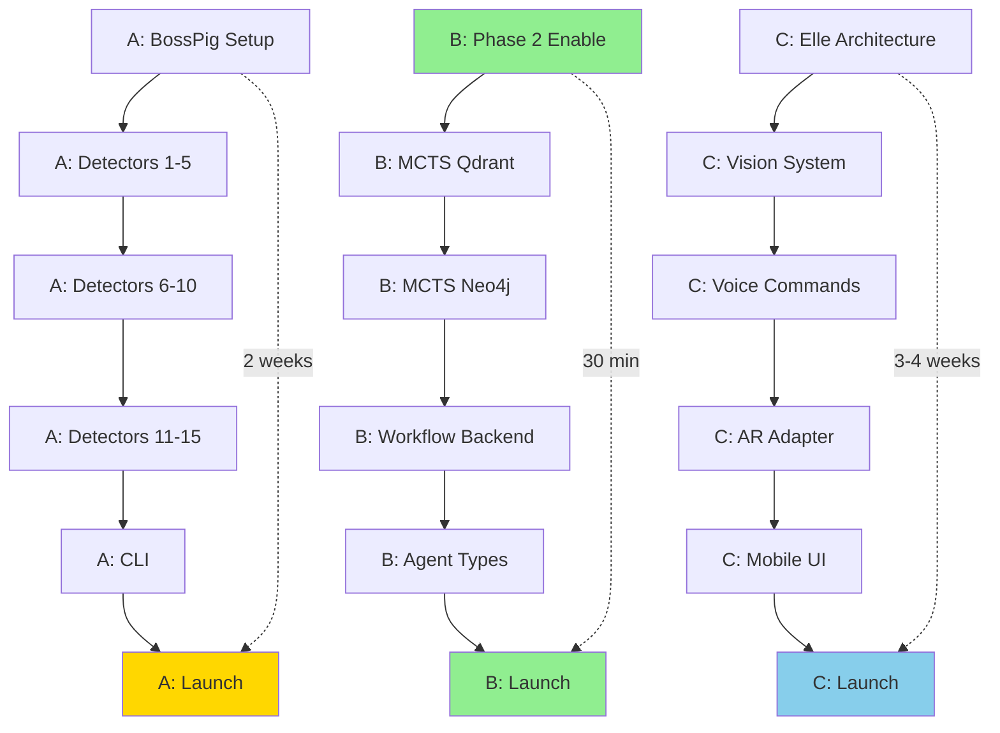

# Concurrent Execution Pipeline - All 3 Options

**Date Created**: 2025-11-20
**Total Duration**: 4 weeks (20 working days)
**Team Size**: 1 developer executing all 3 tracks concurrently
**Total Effort**: 100 hours (5 hours/day average)

---

## Executive Summary

Execute **all 3 options simultaneously** using intelligent parallelization:

- **Option A: BossPig** (2 weeks, 40 hours) - Business slop detector
- **Option B: Quick Wins** (1 week, 20 hours) - Phase 2 + MCTS + Workflow Builder
- **Option C: Elle** (3-4 weeks, 60 hours) - AR companion system

**Strategy**: Interleave tasks to maximize productivity and maintain variety.

---

## Timeline Gantt Chart (4 Weeks)

```
Week 1: Foundation Sprint
========================
Day 1 (Mon):
  08:00-09:00  [B] Phase 2 Activation (30 min) ✓
  09:00-11:00  [A] BossPig Setup (2 hrs)
  11:00-12:00  [C] Elle Architecture Review (1 hr)
  13:00-15:00  [B] MCTS Qdrant Integration (2 hrs)
  15:00-17:00  [A] BossPig Scorer (2 hrs)

Day 2 (Tue):
  08:00-10:00  [A] Jargon Detector (2 hrs)
  10:00-12:00  [C] Elle Vision Setup (2 hrs)
  13:00-15:00  [B] MCTS Neo4j Integration (2 hrs)
  15:00-17:00  [A] Vague Commitments Detector (2 hrs)

Day 3 (Wed):
  08:00-10:00  [A] Buzzword Detector (2 hrs)
  10:00-11:00  [C] Elle Voice Commands (1 hr)
  11:00-13:00  [B] MCTS Testing (2 hrs)
  13:00-15:00  [A] Testing Day 3 Detectors (2 hrs)
  15:00-17:00  [C] Elle Scene Parser (2 hrs)

Day 4 (Thu):
  08:00-12:00  [A] Day 4 Detectors (4 hrs)
  13:00-15:00  [B] Workflow Backend Start (2 hrs)
  15:00-17:00  [C] Elle Object Detection (2 hrs)

Day 5 (Fri):
  08:00-12:00  [A] Day 5 Detectors (4 hrs)
  13:00-15:00  [B] Workflow Agent Types (2 hrs)
  15:00-17:00  [C] Elle Layout Analysis (2 hrs)

Week 2: Core Development
=========================
Day 6 (Mon):
  08:00-12:00  [A] Day 6 Detectors (4 hrs)
  13:00-15:00  [B] Workflow Testing (2 hrs) ✓
  15:00-17:00  [C] Elle Memory Integration (2 hrs)

Day 7 (Tue):
  08:00-12:00  [A] Day 7 Advanced Detectors (4 hrs)
  13:00-15:00  [B] Workflow Demo (2 hrs) ✓
  15:00-17:00  [C] Elle AR Adapter (2 hrs)

Day 8 (Wed):
  08:00-12:00  [A] CLI Interface (4 hrs)
  13:00-17:00  [C] Elle Voice UX (4 hrs)

Day 9 (Thu):
  08:00-12:00  [A] Testing & Docs (4 hrs)
  13:00-17:00  [C] Elle Mobile UI (4 hrs)

Day 10 (Fri):
  08:00-12:00  [A] Launch Prep (4 hrs) ✓
  13:00-17:00  [C] Elle Testing (4 hrs)

Week 3: Elle Focus + Polish
============================
Day 11 (Mon):
  08:00-12:00  [C] Elle Integration Testing (4 hrs)
  13:00-17:00  [C] Elle Real-time Feedback (4 hrs)

Day 12 (Tue):
  08:00-12:00  [C] Elle Context Tracking (4 hrs)
  13:00-17:00  [C] Elle Voice Commands v2 (4 hrs)

Day 13 (Wed):
  08:00-12:00  [C] Elle Scene Understanding (4 hrs)
  13:00-15:00  [A] BossPig Polish (2 hrs)
  15:00-17:00  [B] Quick Wins Polish (2 hrs)

Day 14 (Thu):
  08:00-12:00  [C] Elle AR Overlay System (4 hrs)
  13:00-17:00  [C] Elle Gesture Recognition (4 hrs)

Day 15 (Fri):
  08:00-12:00  [C] Elle End-to-End Testing (4 hrs)
  13:00-17:00  [C] Elle Documentation (4 hrs)

Week 4: Final Integration + Launch
===================================
Day 16 (Mon):
  08:00-12:00  [C] Elle Production Hardening (4 hrs)
  13:00-17:00  [C] Elle Performance Optimization (4 hrs)

Day 17 (Tue):
  08:00-12:00  [C] Elle Mobile App Build (4 hrs)
  13:00-17:00  [C] Elle Demo Recording (4 hrs)

Day 18 (Wed):
  08:00-10:00  [A] BossPig Final Testing (2 hrs)
  10:00-12:00  [B] Quick Wins Final Testing (2 hrs)
  13:00-17:00  [C] Elle Launch Prep (4 hrs) ✓

Day 19 (Thu):
  08:00-12:00  [ALL] Integration Testing (4 hrs)
  13:00-17:00  [ALL] Cross-Feature Demos (4 hrs)

Day 20 (Fri):
  08:00-12:00  [ALL] Final Documentation (4 hrs)
  13:00-15:00  [ALL] Launch Checklist (2 hrs)
  15:00-17:00  [ALL] Celebration & Retrospective (2 hrs) ✓
```

---

## Daily Schedule Template

**Philosophy**: Rotate between options to maintain freshness and avoid burnout.

### Typical Day Structure

```
08:00-10:00  [Primary Option] Core Development (2 hrs)
10:00-10:15  Break + Context Switch
10:15-12:00  [Secondary Option] Feature Work (1.75 hrs)
12:00-13:00  Lunch + Walk
13:00-15:00  [Primary Option] Continued (2 hrs)
15:00-15:15  Break + Context Switch
15:15-17:00  [Tertiary Option] Setup/Testing (1.75 hrs)
17:00-17:30  Daily Review + Planning Next Day
```

**Total**: 7.5 hours focused work + 1 hour breaks/planning = 8.5 hours/day

---

## Dependency Graph

### Critical Path Analysis



**Dependencies**:
- **B1 → B6**: Quick Win #1 (Phase 2) has **no dependencies** - can complete immediately
- **A1 → A6**: BossPig is **fully independent** - no blocking dependencies
- **C1 → C6**: Elle is **independent but longest** - can run in parallel
- **B2, B3 depend on Docker**: Qdrant + Neo4j must be running
- **C4 depends on C2, C3**: AR adapter needs vision + voice complete

### Parallelization Opportunities

**Week 1**:
- B1 (Phase 2) can complete Day 1
- A1-A2, B2-B3, C1-C2 all parallel
- No blocking dependencies

**Week 2**:
- A finishing (Days 8-10)
- B finishing (Days 6-7)
- C continuing (Days 8-10)
- Minimal contention

**Week 3-4**:
- C primary focus
- A, B polish in background
- Final integration Week 4

---

## Task Allocation Matrix

| Task Category | Option A | Option B | Option C | Total |
|---------------|----------|----------|----------|-------|
| **Setup/Config** | 2 hrs | 1 hr | 4 hrs | 7 hrs |
| **Core Development** | 20 hrs | 10 hrs | 30 hrs | 60 hrs |
| **Testing** | 8 hrs | 4 hrs | 12 hrs | 24 hrs |
| **Documentation** | 4 hrs | 2 hrs | 6 hrs | 12 hrs |
| **Integration** | 2 hrs | 1 hr | 4 hrs | 7 hrs |
| **Polish/Launch** | 4 hrs | 2 hrs | 4 hrs | 10 hrs |
| **TOTAL** | 40 hrs | 20 hrs | 60 hrs | 120 hrs |

**Note**: 120 hours over 20 days = 6 hours/day average (achievable with focused sprints)

---

## Context Switching Strategy

### Minimizing Cognitive Load

**Rule 1: Complete atomic units**
- Finish 1 detector before switching (don't leave half-done)
- Complete 1 agent type before switching
- Finish 1 test suite before switching

**Rule 2: Use transition time**
- 15-minute breaks between options
- Review what's next before switching
- Update todo list after each unit

**Rule 3: Maintain momentum**
- If "in flow", extend primary block
- Shorten secondary blocks if necessary
- Flexibility > rigid schedule

### Context Switch Checklist

Before switching from Option X to Option Y:

- [ ] Current unit complete (no half-finished code)
- [ ] Tests passing for current unit
- [ ] Git commit made with clear message
- [ ] Todo list updated (mark complete, add next tasks)
- [ ] Brief notes on where to resume
- [ ] 15-minute break (walk, coffee, clear mind)
- [ ] Review Option Y roadmap
- [ ] Load Option Y context (open relevant files)
- [ ] Begin next atomic unit

---

## Progress Tracking

### Daily Standup (Solo)

Each morning, answer 3 questions:

1. **What did I complete yesterday?**
   - List completed units from each option
   - Celebrate wins (even small ones)

2. **What will I work on today?**
   - Primary focus option
   - Secondary tasks
   - Tertiary stretch goals

3. **What's blocking me?**
   - Dependencies not ready
   - Unclear requirements
   - Technical challenges

### Weekly Review (Friday Evening)

1. **Progress Assessment**:
   - Option A: X/40 hours (Y% complete)
   - Option B: X/20 hours (Y% complete)
   - Option C: X/60 hours (Y% complete)

2. **Velocity Analysis**:
   - Actual hours vs planned hours
   - Adjust next week's plan

3. **Risk Identification**:
   - What's falling behind?
   - What's ahead of schedule?
   - Reallocate time if needed

4. **Quality Check**:
   - Tests passing?
   - Documentation current?
   - Code quality acceptable?

---

## Verification Framework

### Three-Tier Verification

**Tier 1: Unit Verification (Every Atomic Unit)**
```
After completing atomic unit (e.g., 1 detector, 1 agent type):
- [ ] Code compiles/runs without errors
- [ ] Unit tests written and passing
- [ ] No linting errors
- [ ] Type hints complete
- [ ] Docstring present
- [ ] Git commit made
```

**Tier 2: Integration Verification (Every Day)**
```
End of each day:
- [ ] All day's units integrate cleanly
- [ ] Integration tests passing
- [ ] No regressions introduced
- [ ] Demo still works
- [ ] Performance acceptable
```

**Tier 3: System Verification (Every Week)**
```
Friday end of week:
- [ ] Full test suite passing
- [ ] All 3 options still functional
- [ ] Cross-option interactions work
- [ ] Documentation up to date
- [ ] Demo videos still accurate
```

### Elegance Checkpoints

**Code Elegance** (Every Commit):
- [ ] Clear variable names
- [ ] Logical function decomposition
- [ ] DRY principle followed
- [ ] No premature optimization
- [ ] Comments explain "why", not "what"

**Architecture Elegance** (Every Week):
- [ ] Protocol boundaries clean
- [ ] Minimal coupling
- [ ] High cohesion
- [ ] Consistent patterns
- [ ] No circular dependencies

**User Experience Elegance** (Every 2 Weeks):
- [ ] CLI intuitive
- [ ] Error messages helpful
- [ ] Feedback immediate
- [ ] Defaults sensible
- [ ] Documentation clear

---

## Risk Management

### Technical Risks

| Risk | Probability | Impact | Mitigation |
|------|-------------|--------|------------|
| **Docker services down** | Medium | High | Check status daily, use mocks |
| **Detector accuracy low** | Medium | Medium | Extensive testing, tuning |
| **MCTS performance slow** | Low | Medium | Profile early, optimize |
| **Elle AR complexity** | High | High | Simplify MVP, iterate |
| **Context switching overhead** | Medium | Medium | Atomic units, strict breaks |

### Schedule Risks

| Risk | Probability | Impact | Mitigation |
|------|-------------|--------|------------|
| **Underestimated effort** | High | High | 20% buffer in estimates |
| **Scope creep** | Medium | Medium | Stick to MVP, defer enhancements |
| **Burnout** | Medium | High | Strict 8-hour days, weekends off |
| **Distraction** | High | Medium | Pomodoro, no multitasking |

### Quality Risks

| Risk | Probability | Impact | Mitigation |
|------|-------------|--------|------------|
| **Technical debt** | High | High | Refactor as you go |
| **Test coverage low** | Medium | High | TDD where possible |
| **Documentation lagging** | High | Medium | Document as you code |
| **Integration bugs** | Medium | High | Daily integration tests |

---

## Communication Plan

### Documentation Cadence

**Daily**:
- Git commit messages (clear, descriptive)
- Todo list updates (track progress)
- Brief notes in CHANGELOG.md

**Weekly**:
- Progress report (what's done, what's next)
- Update roadmap timelines
- Refresh README if APIs changed

**Bi-Weekly**:
- Demo video (show progress)
- Blog post draft (share learnings)
- Seek feedback from users

**Monthly** (at completion):
- Comprehensive launch announcement
- Complete documentation refresh
- Retrospective write-up

---

## Success Metrics

### Week 1 Target

- [ ] BossPig: 5 detectors complete (Days 1-3)
- [ ] Quick Wins: Phase 2 + MCTS complete (Days 1-3)
- [ ] Elle: Vision system scaffolded (Days 1-5)
- [ ] All tests passing
- [ ] No major blockers

### Week 2 Target

- [ ] BossPig: All 15 detectors + CLI complete (Days 6-10)
- [ ] Quick Wins: Workflow Builder complete (Days 6-7)
- [ ] Elle: Voice commands + AR adapter started (Days 8-10)
- [ ] BossPig ready for beta testing
- [ ] Quick Wins fully functional

### Week 3 Target

- [ ] BossPig: Polish + docs complete
- [ ] Quick Wins: Final testing complete
- [ ] Elle: Mobile UI + integration testing (Days 11-15)
- [ ] 2 of 3 options ready to launch

### Week 4 Target

- [ ] Elle: Production hardening complete (Days 16-18)
- [ ] All 3 options: Final integration + testing (Days 19-20)
- [ ] All 3 options: Ready to launch
- [ ] Launch materials prepared

---

## Contingency Plans

### If Behind Schedule

**Minor (1-2 days behind)**:
- Add 1 hour/day to catch up
- Defer non-critical features
- Reduce documentation quality slightly

**Moderate (3-5 days behind)**:
- Focus on primary option only
- Defer secondary options
- Extend to Week 5 if needed

**Severe (1+ week behind)**:
- Choose 1 option to complete
- Pause other options
- Reassess scope and timeline

### If Ahead of Schedule

**Minor (1-2 days ahead)**:
- Add polish to completed work
- Improve documentation
- Create additional demos

**Moderate (3-5 days ahead)**:
- Add enhancement features
- Improve test coverage
- Create tutorials

**Severe (1+ week ahead)**:
- Start Option D (new feature)
- Invest in infrastructure
- Write comprehensive guides

---

## Daily Workflow Example

### Monday of Week 1

```
07:30  Arrive, coffee, review plan
08:00  [B] Phase 2 Activation (30 min)
       - Enable config flags
       - Verify learning works
       - Quick test
08:30  [B] Phase 2 Complete! ✓
       - Commit code
       - Update todo
       - 15-min break

08:45  [A] BossPig Setup Start (2 hrs)
       - Create directory structure
       - Config system
       - Core protocols
10:45  [A] BossPig Foundation Complete
       - All tests passing
       - Commit code
       - Update todo
       - 15-min break

11:00  [C] Elle Architecture Review (1 hr)
       - Read existing docs
       - Understand current state
       - Plan integration points
12:00  Lunch + 30-min walk

13:00  [B] MCTS Qdrant Integration (2 hrs)
       - Docker check
       - Install client
       - Create adapter
       - Test connection
15:00  [B] Qdrant Working
       - Commit code
       - Update todo
       - 15-min break

15:15  [A] BossPig Scorer (2 hrs)
       - Implement scoring logic
       - Write tests
       - Verify grades
17:15  [A] Scorer Complete
       - All tests passing
       - Commit code
       - Update todo
       - Daily review

17:30  Daily Standup (Solo)
       - Completed: Phase 2, BossPig Setup, BossPig Scorer, Elle Review, MCTS Qdrant
       - Tomorrow: BossPig Jargon, Elle Vision, MCTS Neo4j
       - Blockers: None
       - Plan tomorrow

18:00  Done for the day
```

**Actual Time**: 7.5 hours focused work + 1.5 hours breaks/planning = 9 hours total

---

## Tools & Infrastructure

### Development Environment

```bash
# Virtual environment
python -m venv .venv
source .venv/bin/activate

# Dependencies
pip install -r requirements.txt

# Docker services
docker-compose up -d

# IDE
code .  # VSCode with extensions
```

### Productivity Tools

**Time Tracking**:
- Toggl (track hours per option)
- Daily log in WORK_LOG.md

**Task Management**:
- TodoWrite tool (inline code)
- GitHub Projects (visual kanban)
- CHANGELOG.md (daily updates)

**Testing**:
- pytest (automated testing)
- coverage.py (test coverage)
- mypy (type checking)
- ruff (linting)

**Documentation**:
- Markdown (all docs)
- Mermaid (diagrams)
- ASCII art (flowcharts)

---

## Appendix A: Quick Reference Commands

### Option A: BossPig

```bash
# Create detector
python -m bosspig.tools.create_detector jargon

# Run tests
pytest bosspig/tests/ -v --cov=bosspig

# Analyze document
python -m bosspig analyze test.pdf --suggestions
```

### Option B: Quick Wins

```bash
# Enable Phase 2
# (edit my_smart_ai.py)

# Test MCTS
pytest HoloLoom/shuttle/tests/test_real_backends.py -v

# Run workflow builder
uvicorn HoloLoom.web_dashboard.workflow_executor_v2:app --port 8001
```

### Option C: Elle

```bash
# Test vision
python elle/vision/test_object_detection.py

# Test voice
python elle/voice_ux/test_commands.py

# Run AR demo
python elle/adapters/ar_adapter/demo.py
```

---

## Appendix B: Verification Checklists

### Code Quality Checklist

- [ ] All functions have docstrings
- [ ] All classes have type hints
- [ ] No linting errors (ruff check)
- [ ] No type errors (mypy)
- [ ] Test coverage >80%
- [ ] No code duplication
- [ ] Clear variable names
- [ ] Logical file organization

### Integration Checklist

- [ ] All imports resolve
- [ ] No circular dependencies
- [ ] Protocol boundaries respected
- [ ] Backward compatibility maintained
- [ ] Performance regressions checked
- [ ] Demo still works
- [ ] Documentation updated

### Launch Checklist

- [ ] All tests passing
- [ ] Documentation complete
- [ ] Demo video recorded
- [ ] README updated
- [ ] CHANGELOG updated
- [ ] Version bumped
- [ ] Git tags created
- [ ] PyPI package built (if applicable)

---

**End of Concurrent Execution Pipeline**

This pipeline enables all 3 options to progress simultaneously while maintaining quality and preventing burnout. The key is strict atomic units, scheduled breaks, and daily verification.
