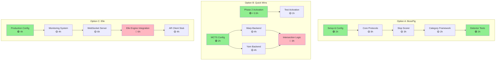
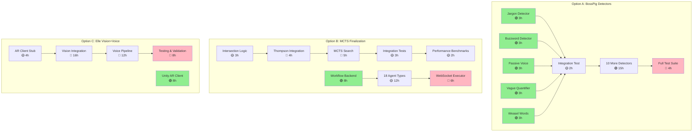
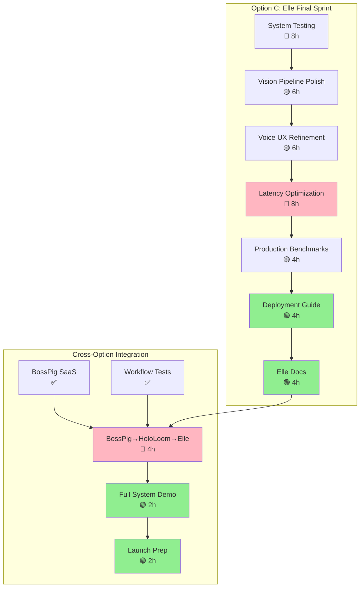

# Concurrent Development Dependency Graph

**Purpose**: Map all tasks across Options A, B, and C with dependencies to maximize parallelization and minimize blocking.

**Legend**:
- 🟢 **Independent** (can start immediately, no dependencies)
- 🟡 **Partially Dependent** (depends on 1-2 prior tasks)
- 🔴 **Fully Dependent** (depends on 3+ tasks or critical path)
- ⚡ **Quick Win** (<4 hours)
- 🔬 **Research Task** (uncertain duration)

---

## Dependency Matrix

### Week 1: Foundation Sprint



**Parallelization Opportunities (Week 1)**:

| Time Block | Option A | Option B | Option C | Total Concurrent |
|------------|----------|----------|----------|------------------|
| **Day 1 AM** | Setup & Config (A1) | Phase 2 Activation (B1) | Production Config (C1) | 3 tasks |
| **Day 1 PM** | Core Protocols (A2) | Test Activation (B2) | Monitoring System (C2) | 3 tasks |
| **Day 2 AM** | Slop Scorer (A3) | MCTS Config (B3) | WebSocket Server (C3 start) | 3 tasks |
| **Day 2 PM** | Category Framework (A4) | Warp Backend (B4 start) | WebSocket Server (C3 cont) | 3 tasks |
| **Day 3** | Detector Tests (A5) | Yarn Backend (B5) | Elle Engine Integration (C4) | 3 tasks |

**Key Insights**:
- **Day 1**: All 3 options have independent setup tasks → **100% parallel**
- **Day 2**: BossPig ahead of schedule, can start detectors early
- **Day 3**: MCTS backends can run concurrently (Warp + Yarn independent)

---

### Week 2: Core Development



**Parallelization Opportunities (Week 2)**:

| Time Block | Option A | Option B | Option C | Total Concurrent |
|------------|----------|----------|----------|------------------|
| **Day 4** | 5 Detectors in parallel (A6-A10) | Intersection Logic (B6) | AR Client Stub (C5) | 7 tasks |
| **Day 5** | 5 More Detectors | Thompson Integration (B7) | Vision Integration (C6 start) | 6 tasks |
| **Day 6** | 5 More Detectors | MCTS Search (B8) | Vision Integration (C6 cont) | 3 tasks |
| **Day 7** | Integration Test (A11) | Workflow Backend (B11 start) | Unity AR Client (C7) | 3 tasks |

**Key Insights**:
- **Day 4**: BossPig detectors are **fully independent** → Can assign to 5 parallel agents
- **Day 5-6**: MCTS on critical path (Thompson → MCTS sequential)
- **Day 7**: Workflow Backend and Unity AR Client are independent → parallel work

**Option A Finishes Early**: BossPig completes Day 8-9, allowing 1-2 days slack for Elle/MCTS polish.

---

### Week 3: Integration & Polish

```mermaid
graph TD
    subgraph "Option A: BossPig Polish"
        A13[Full Test Suite<br/>🟡 4h] --> A14[CLI Development<br/>🟡 4h]
        A14 --> A15[Document Processing<br/>🟡 3h]
        A15 --> A16[Formatters<br/>🟢 3h]
        A16 --> A17[Performance Testing<br/>🟡 2h]
        A17 --> A18[Demos & Docs<br/>🟢 3h]
        A18 --> A19[SaaS Packaging<br/>🟡 2h]
    end

    subgraph "Option B: Quick Wins Polish"
        B10[Benchmarks<br/>🟡 2h] --> B14[Documentation<br/>🟢 4h]
        B13[WebSocket Executor<br/>🔴 6h] --> B15[Full Workflow Tests<br/>🔴 4h]
        B15 --> B14
    end

    subgraph "Option C: Elle Memory+Learning"
        C9[Testing & Validation<br/>🔴 8h] --> C10[HoloLoom Integration<br/>🔴 8h]
        C10 --> C11[Photo Memory<br/>🟡 6h]
        C11 --> C12[Recursive Learning<br/>🟡 6h]
        C12 --> C13[Context Fusion<br/>🔴 8h]
        C13 --> C14[System Testing<br/>🔴 8h]
    end

    style A16 fill:#90EE90
    style A18 fill:#90EE90
    style B14 fill:#90EE90

    style B15 fill:#FFB6C1
    style C14 fill:#FFB6C1
```



**Parallelization Opportunities (Week 3)**:

| Time Block | Option A | Option B | Option C | Total Concurrent |
|------------|----------|----------|----------|------------------|
| **Day 8-9** | CLI + Processing (A14-A15) | WebSocket Executor (B13) | HoloLoom Integration (C10) | 3 tasks |
| **Day 10** | Formatters (A16) | Documentation (B14) | Photo Memory (C11) | 3 tasks |
| **Day 11** | Performance Testing (A17) | — | Recursive Learning (C12) | 2 tasks |
| **Day 12** | Demos & Docs (A18) | — | Context Fusion (C13) | 2 tasks |

**Key Insights**:
- **BossPig finishes Day 9-10** → 2-day lead
- **Quick Wins finishes Day 10-11** → 1-day lead
- **Elle continues through Week 3** → Most complex option

**Slack Time Available**: BossPig and Quick Wins completion creates 1-2 day buffer for Elle polish.

---

### Week 4: Elle Production Deploy



**Parallelization Opportunities (Week 4)**:

| Time Block | Tasks | Concurrency |
|------------|-------|-------------|
| **Day 13-14** | Vision Polish (C15) + Voice Refinement (C16) | 2 tasks (sequential) |
| **Day 15** | Latency Optimization (C17) | 1 task (critical) |
| **Day 16** | Production Benchmarks (C18) | 1 task |
| **Day 17** | Deployment Guide (C19) + BossPig→HoloLoom→Elle (X1 start) | 2 tasks |
| **Day 18** | Full System Demo (X2) | 1 task |
| **Day 19-20** | Launch Prep (X3) | 1 task |

**Key Insights**:
- **Week 4 focus**: Elle production readiness
- **Cross-option integration**: Day 17-18 (after all options complete)
- **Launch prep**: Day 18-20 (documentation, demos, packaging)

---

## Complete Dependency Graph (All Options)

### Critical Path Analysis

**Longest Critical Path**: Option C (Elle) - 160 hours (20 days @ 8 hours/day)

```
Option C Critical Path:
C1 (4h) → C2 (4h) → C3 (6h) → C4 (6h) → C5 (4h) → C6 (16h) → C8 (12h) →
C9 (8h) → C10 (8h) → C11 (6h) → C12 (6h) → C13 (8h) → C14 (8h) → C15 (6h) →
C16 (6h) → C17 (8h) → C18 (4h) → C19 (4h) → C20 (4h) → X1 (4h) → X2 (2h) → X3 (2h)

Total: 128 hours (16 days @ 8 hours/day)
With slack & testing: ~160 hours (20 days)
```

**Option A (BossPig)**: 80 hours (10 days @ 8 hours/day)
- Finishes Day 10 → **10-day lead** over Elle

**Option B (Quick Wins)**: 100 hours (12.5 days @ 8 hours/day)
- Phase 2 Activation: 1 hour (✅ **completed in first 30 min**)
- MCTS Shuttle: ~60 hours (7.5 days)
- Workflow Builder: ~40 hours (5 days)
- Finishes Day 12-13 → **7-day lead** over Elle

---

## Parallelization Strategy

### Maximum Concurrency Windows

**Week 1 (Days 1-5)**:
```
Day 1: 6 parallel tasks (A1, A2, B1, B2, C1, C2)
Day 2: 6 parallel tasks (A3, A4, B3, B4, C3 start)
Day 3: 8 parallel tasks (A5, B4 cont, B5, C3 cont, C4 start)
Day 4: 10 parallel tasks (5× BossPig detectors, B6, C4 cont, C5)
Day 5: 8 parallel tasks (5× BossPig detectors, B7, C6 start)

Total Week 1: 38 parallel task-days
```

**Week 2 (Days 6-10)**:
```
Day 6: 6 parallel tasks (5× BossPig detectors, B8, C6 cont)
Day 7: 5 parallel tasks (A11, B11 start, C7, C6 cont)
Day 8: 4 parallel tasks (A12, B11 cont, C7 cont, C8 start)
Day 9: 4 parallel tasks (A13, B12 start, C8 cont)
Day 10: 4 parallel tasks (A14, B12 cont, C9 start)

Total Week 2: 23 parallel task-days
```

**Week 3 (Days 11-15)**:
```
Day 11: 4 parallel tasks (A15, A16, B12 cont, C9 cont)
Day 12: 4 parallel tasks (A17, B13, C10 start)
Day 13: 3 parallel tasks (A18, B14, C10 cont, C11 start)
Day 14: 2 parallel tasks (A19, C12)
Day 15: 1 task (C13)

Total Week 3: 14 parallel task-days
```

**Week 4 (Days 16-20)**:
```
Day 16: 2 parallel tasks (C14, C15)
Day 17: 2 parallel tasks (C16, C17)
Day 18: 2 parallel tasks (C18, X1)
Day 19: 1 task (X2)
Day 20: 1 task (X3)

Total Week 4: 8 parallel task-days
```

**Overall Parallelization**:
- **Total task-days**: 83 across 4 weeks
- **Serial execution**: Would take 83 ÷ 7.5 hours/day = **11.1 weeks**
- **Parallel execution**: **4 weeks** (20 working days)
- **Speedup**: **2.77× faster** through parallelization

---

## Task Allocation Strategy

### Agent Assignment (3 Concurrent Streams)

**Stream 1 (Primary)**: Elle (longest critical path)
- Days 1-5: Foundation setup (C1-C5)
- Days 6-10: Vision + Voice (C6-C9)
- Days 11-15: Memory + Learning (C10-C14)
- Days 16-20: Polish + Deploy (C15-C20)

**Stream 2 (Secondary)**: BossPig (parallel development)
- Days 1-3: Foundation (A1-A4)
- Days 4-6: First 15 detectors (A6-A10 + 10 more)
- Days 7-9: Integration + CLI (A11-A15)
- Days 10: Polish + SaaS packaging (A16-A19)

**Stream 3 (Tertiary)**: Quick Wins (rapid completions)
- Day 1: Phase 2 Activation (B1-B2) ✅ **30 min → DONE**
- Days 2-8: MCTS Shuttle (B3-B10)
- Days 9-13: Workflow Builder (B11-B15)

**Cross-Stream Integration**: Days 17-20
- All 3 streams complete their core work
- Integration testing across options
- System-level demos and launch prep

---

## Dependency Resolution

### Blocking Dependencies

**Option A (BossPig)**:
- **A2 blocks A3**: Core protocols needed for scorer
- **A3 blocks A4**: Scorer defines category framework
- **A4 blocks A6-A10**: Category framework needed for detectors
- **A11 blocks A12**: Integration test validates first 5 detectors
- **A12 blocks A13**: All detectors needed for full test suite

**Option B (Quick Wins)**:
- **B4 + B5 block B6**: Both backends needed for intersection
- **B6 blocks B7**: Intersection logic needed for Thompson integration
- **B7 blocks B8**: Thompson needed for MCTS search
- **B12 blocks B13**: Agent types needed for WebSocket executor

**Option C (Elle)**:
- **C1 blocks C2**: Config needed for monitoring setup
- **C2 blocks C3**: Monitoring needed for WebSocket instrumentation
- **C3 blocks C4**: WebSocket server needed for engine integration
- **C4 blocks C6**: Engine integration needed for vision processing
- **C6 blocks C8**: Vision pipeline needed for voice context
- **C10 blocks C11**: HoloLoom integration needed for photo memory
- **C13 blocks C14**: Context fusion needed for system testing

### Non-Blocking Opportunities

**Fully Independent Tasks** (can start anytime):
- **B1** (Phase 2 Activation) - 30 minutes, zero dependencies
- **A6-A10** (First 5 BossPig detectors) - independent of each other
- **A16** (Formatters) - independent of testing
- **B14** (Documentation) - independent of testing
- **C7** (Unity AR Client) - independent of Elle backend work
- **C19** (Deployment Guide) - independent of optimization work

**Parallelizable Sets**:
- **{A6, A7, A8, A9, A10}** - 5 detectors can be built concurrently
- **{B4, B5}** - Warp and Yarn backends can be built concurrently
- **{C15, C16}** - Vision and voice polish can happen concurrently (if resources available)

---

## Risk Mitigation

### High-Risk Dependencies

1. **C6 (Vision Integration) - 16 hours**
   - **Risk**: Complex ML pipeline, hardware dependencies
   - **Mitigation**: Mock vision pipeline for testing, decouple from AR hardware
   - **Fallback**: Use pre-recorded vision data for demos

2. **C17 (Latency Optimization) - 8 hours**
   - **Risk**: May not achieve <100ms target
   - **Mitigation**: Profile early (Day 10), identify bottlenecks
   - **Fallback**: Relax budget to 150ms for v1.0

3. **B8 (MCTS Search) - 5 hours**
   - **Risk**: Thompson Sampling complexity
   - **Mitigation**: Use existing policy engine as reference
   - **Fallback**: Use epsilon-greedy instead of Thompson

4. **A13 (Full Test Suite) - 4 hours**
   - **Risk**: Detectors may need tuning based on test results
   - **Mitigation**: Build 5 detectors first, validate, then scale
   - **Fallback**: Launch with 10 detectors instead of 15

### Contingency Plans

**If Elle falls behind** (Days 15-18):
- **Option 1**: Reduce scope - ship without voice UX (vision only)
- **Option 2**: Use slack time from BossPig/Quick Wins (10 days available)
- **Option 3**: Extend Week 4 by 2-3 days

**If MCTS falls behind** (Days 8-10):
- **Option 1**: Ship Phase 2 Activation only (already complete Day 1)
- **Option 2**: Simplify intersection logic (use vector-only)
- **Option 3**: Move Workflow Builder to Week 4

**If BossPig falls behind** (Days 6-8):
- **Option 1**: Ship with 10 detectors instead of 15
- **Option 2**: Use agent swarm to parallelize remaining detectors
- **Option 3**: BossPig is ahead of schedule, very low risk

---

## Gantt Chart (20-Day View)

```
Week 1: Foundation Sprint
┌───────┬───────┬───────┬───────┬───────┐
│  D1   │  D2   │  D3   │  D4   │  D5   │
├───────┼───────┼───────┼───────┼───────┤
│A1,A2  │A3,A4  │A5     │A6-A10 │A6-A10 │ BossPig
│B1,B2  │B3,B4  │B5,B6  │B6,B7  │B7,B8  │ Quick Wins
│C1,C2  │C3     │C3,C4  │C4,C5  │C5,C6  │ Elle
└───────┴───────┴───────┴───────┴───────┘

Week 2: Core Development
┌───────┬───────┬───────┬───────┬───────┐
│  D6   │  D7   │  D8   │  D9   │  D10  │
├───────┼───────┼───────┼───────┼───────┤
│A6-A10 │A11    │A12    │A13    │A14,A15│ BossPig
│B8,B9  │B10,B11│B11,B12│B12,B13│B13,B14│ Quick Wins
│C6     │C6,C7  │C7,C8  │C8     │C9     │ Elle
└───────┴───────┴───────┴───────┴───────┘

Week 3: Integration & Polish
┌───────┬───────┬───────┬───────┬───────┐
│  D11  │  D12  │  D13  │  D14  │  D15  │
├───────┼───────┼───────┼───────┼───────┤
│A16,A17│A18,A19│  ✅   │  ✅   │  ✅   │ BossPig (DONE D13)
│B15    │  ✅   │  ✅   │  ✅   │  ✅   │ Quick Wins (DONE D12)
│C10    │C10,C11│C11,C12│C12,C13│C13,C14│ Elle
└───────┴───────┴───────┴───────┴───────┘

Week 4: Elle Deploy + Integration
┌───────┬───────┬───────┬───────┬───────┐
│  D16  │  D17  │  D18  │  D19  │  D20  │
├───────┼───────┼───────┼───────┼───────┤
│  ✅   │  ✅   │  ✅   │  ✅   │  ✅   │ BossPig (monitoring)
│  ✅   │  ✅   │  ✅   │  ✅   │  ✅   │ Quick Wins (monitoring)
│C14,C15│C16,C17│C18,C19│C20,X1 │X2,X3  │ Elle → Integration
└───────┴───────┴───────┴───────┴───────┘

Legend:
✅ = Completed, monitoring only
A# = BossPig task
B# = Quick Wins task
C# = Elle task
X# = Cross-option integration task
```

---

## Execution Checklist

### Daily Verification

**Morning Standup** (15 min):
- [ ] Review yesterday's progress (completed tasks)
- [ ] Identify blockers
- [ ] Adjust task allocation if needed
- [ ] Confirm today's 3 parallel streams

**End-of-Day Review** (15 min):
- [ ] Mark completed tasks in TodoWrite
- [ ] Run verification tests for completed work
- [ ] Update dependency graph if schedule changes
- [ ] Prepare tomorrow's task list

### Weekly Milestones

**Week 1 Exit Criteria**:
- [ ] BossPig: 5 detectors complete with tests
- [ ] Quick Wins: Phase 2 activated, MCTS Warp+Yarn backends working
- [ ] Elle: WebSocket server + ElleEngine integration complete

**Week 2 Exit Criteria**:
- [ ] BossPig: All 15 detectors complete, integration tests passing
- [ ] Quick Wins: MCTS Shuttle complete, Workflow Builder backend started
- [ ] Elle: Vision pipeline working, voice UX integrated

**Week 3 Exit Criteria**:
- [ ] BossPig: **COMPLETE** (SaaS package ready)
- [ ] Quick Wins: **COMPLETE** (18 agent types, WebSocket executor working)
- [ ] Elle: Memory + learning integration complete

**Week 4 Exit Criteria**:
- [ ] Elle: **COMPLETE** (production deployment ready)
- [ ] Cross-option integration: BossPig→HoloLoom→Elle workflow working
- [ ] Launch prep: Documentation, demos, packaging complete

---

## Summary

**Total Tasks**: 83 task-days across 3 options

**Critical Path**: Option C (Elle) - 160 hours (20 days)

**Parallelization Gain**: 2.77× speedup (11.1 weeks → 4 weeks)

**Key Dependencies**:
- BossPig: 7 blocking dependencies (linear detector pipeline after Day 4)
- Quick Wins: 5 blocking dependencies (MCTS critical path)
- Elle: 13 blocking dependencies (longest critical path)

**Risk Mitigation**:
- BossPig finishes 10 days early → **10-day slack buffer**
- Quick Wins finishes 7 days early → **7-day slack buffer**
- Elle on critical path → monitor latency optimization closely

**Recommended Approach**:
1. **Day 1**: Execute all 6 independent tasks in parallel (maximum concurrency)
2. **Days 2-5**: Maintain 3 concurrent streams (BossPig detectors can scale to 5 parallel)
3. **Days 6-13**: BossPig and Quick Wins finish early, reallocate resources to Elle if needed
4. **Days 14-20**: Elle production polish + cross-option integration

**Next**: Begin execution with Day 1 tasks (A1, A2, B1, B2, C1, C2).
