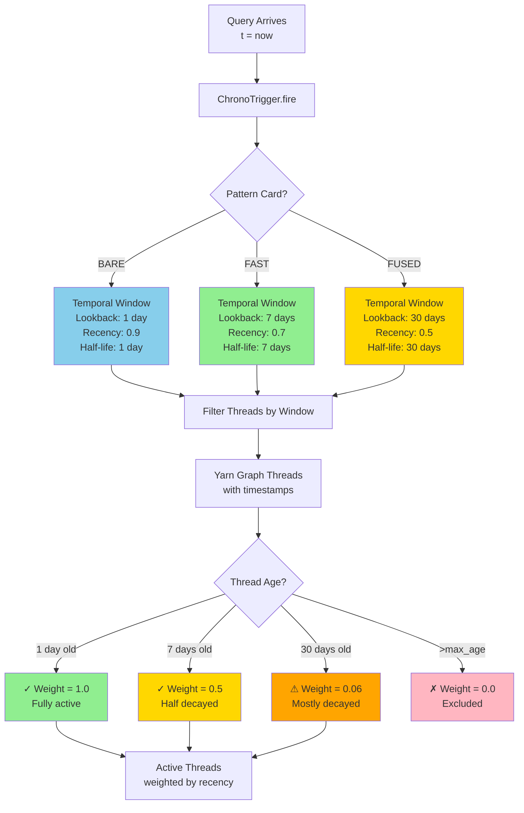
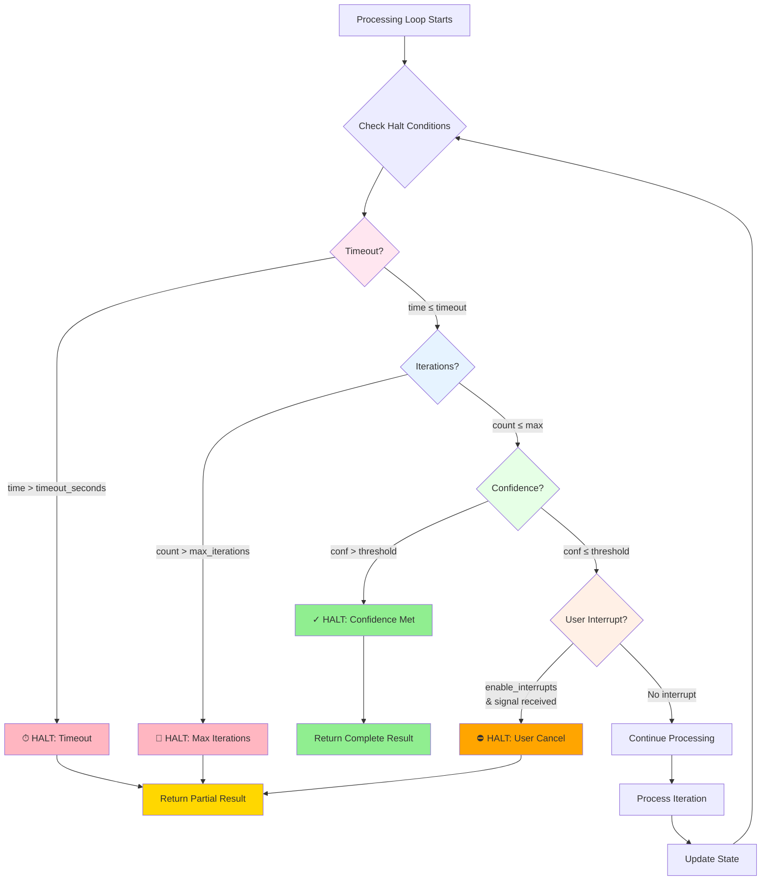

# Chrono Trigger - Temporal Control System

**Status**: ✅ Production Ready (November 2025)
**Location**: `HoloLoom/chrono/`
**Code**: 548 lines across 2 files

---

## Overview

The **Chrono Trigger** is HoloLoom's temporal orchestrator that manages all time-dependent aspects of the weaving process. It controls when threads activate, how long operations run, the cadence of background processes, and the evolution of the system over time.

**Philosophy**: Time is the fourth dimension of weaving. The Chrono Trigger ensures threads activate at the right moment, computations complete on time, and the knowledge graph evolves through temporal decay and learning.

---

## Responsibilities

### 1. Temporal Control
**When to activate threads from Yarn Graph**
- Creates temporal windows defining activation boundaries
- Filters threads by recency, relevance, and decay
- Ensures fresh knowledge takes priority

### 2. Execution Limits
**How long operations can run**
- Enforces timeouts per pattern card (5s/30s/120s)
- Prevents runaway computations
- Graceful timeout handling

### 3. Rhythm (Heartbeat)
**Cadence of background processes**
- Reflection buffer flushes
- Pattern mining cycles
- Metrics export
- Cache cleanup

### 4. Halt Conditions
**When to stop**
- Confidence thresholds met
- Maximum iterations reached
- Timeout exceeded
- User interruption

### 5. Thread Decay
**Aging of knowledge**
- Exponential decay over time
- Priority to recent memories
- Prevents stale information dominance

### 6. System Evolution
**Learning and adaptation**
- Triggers learning cycles
- Manages model checkpoints
- Coordinates reflection periods

---

## Architecture

### File Structure

```
HoloLoom/chrono/
├── __init__.py       # 11 lines - Public exports
└── trigger.py        # 537 lines - ChronoTrigger implementation
```

### Core Classes

#### `ChronoTrigger`

The main temporal control system.

```python
from HoloLoom.chrono import ChronoTrigger
from datetime import timedelta

# Create trigger with default settings
trigger = ChronoTrigger(
    heartbeat_interval=60.0,      # 1 minute
    default_timeout=30.0,          # 30 seconds
    enable_decay=True,             # Thread aging
    decay_half_life=timedelta(days=7)  # 7-day half-life
)

# Fire trigger to create temporal window
window = trigger.fire(
    pattern="fast",
    query_time=datetime.now()
)

# Use window to filter threads
active_threads = trigger.filter_threads_by_window(
    all_threads,
    window
)
```

#### `TemporalWindow`

Defines time boundaries for thread activation and controls how threads decay over time:



**Decay Formula**: `weight = 0.5^(age / half_life)`

**Data Structure:**

```python
@dataclass
class TemporalWindow:
    start: datetime              # Window start time
    end: datetime                # Window end time
    recency_weight: float        # 0.0-1.0 (prefer recent?)
    decay_rate: float            # Exponential decay rate
    max_age: timedelta           # Maximum thread age
    query_timestamp: datetime    # When query was made
```

#### `ExecutionLimits`

Timeout and iteration constraints with multiple halt conditions:



**Data Structure:**

```python
@dataclass
class ExecutionLimits:
    timeout_seconds: float       # Max execution time
    max_iterations: int          # Max processing cycles
    confidence_threshold: float  # Stop if confidence exceeds
    enable_interrupts: bool      # Allow user cancellation
```

---

## Usage Examples

### Example 1: Basic Temporal Window

```python
from HoloLoom.chrono import ChronoTrigger
from datetime import datetime, timedelta

trigger = ChronoTrigger()

# Fire to create window
window = trigger.fire(
    pattern="fast",
    query_time=datetime.now()
)

print(f"Window: {window.start} → {window.end}")
print(f"Recency weight: {window.recency_weight}")
print(f"Max age: {window.max_age}")

# Window is typically:
# - 7 days lookback for FAST pattern
# - Exponential decay (half-life: 7 days)
# - Recency weight: 0.7 (prefer recent threads)
```

### Example 2: Thread Filtering by Recency

```python
from HoloLoom.memory.protocol import Memory

# Threads from Yarn Graph
threads = [
    Memory(content="Info from 1 day ago", timestamp=now - timedelta(days=1)),
    Memory(content="Info from 7 days ago", timestamp=now - timedelta(days=7)),
    Memory(content="Info from 30 days ago", timestamp=now - timedelta(days=30)),
]

# Create temporal window
window = trigger.fire(pattern="fast")

# Filter threads
active = trigger.filter_threads_by_window(threads, window)

# Result: Recent threads have higher activation weight
# - 1 day: weight ≈ 1.0 (fully active)
# - 7 days: weight ≈ 0.5 (half-life)
# - 30 days: weight ≈ 0.06 (mostly decayed)
```

### Example 3: Execution Limits

```python
# Configure strict timeouts for BARE pattern
limits = trigger.create_execution_limits(
    pattern="bare",
    timeout_override=5.0,  # 5 second limit
    max_iterations=3       # Maximum 3 cycles
)

print(f"Timeout: {limits.timeout_seconds}s")
print(f"Max iterations: {limits.max_iterations}")

# Use in processing loop
start_time = time.time()
iteration = 0

while iteration < limits.max_iterations:
    # Check timeout
    if time.time() - start_time > limits.timeout_seconds:
        raise TimeoutError("Execution limit exceeded")

    # Process...
    iteration += 1
```

### Example 4: Heartbeat for Background Tasks

```python
import asyncio

async def background_tasks():
    trigger = ChronoTrigger(heartbeat_interval=60.0)  # 1 minute

    while True:
        # Wait for heartbeat
        await trigger.wait_for_heartbeat()

        # Run periodic tasks
        await flush_reflection_buffer()
        await export_metrics()
        await cleanup_cache()

        print(f"Heartbeat: {datetime.now()}")

# Start background loop
asyncio.create_task(background_tasks())
```

### Example 5: Decay Function

```python
from datetime import datetime, timedelta

trigger = ChronoTrigger(
    enable_decay=True,
    decay_half_life=timedelta(days=7)
)

# Calculate decay weight for a thread
thread_age = timedelta(days=14)  # 2 weeks old
decay_weight = trigger.compute_decay_weight(thread_age)

print(f"Age: {thread_age.days} days")
print(f"Decay weight: {decay_weight:.3f}")
# Output: 0.25 (two half-lives = 0.5^2)

# Decay function: weight = 0.5 ^ (age / half_life)
```

---

## Integration with Orchestrator

```python
from HoloLoom.weaving_orchestrator import WeavingOrchestrator
from HoloLoom.chrono import ChronoTrigger

# Create chrono trigger
trigger = ChronoTrigger(
    default_timeout=30.0,
    enable_decay=True
)

# Orchestrator uses trigger for timing
orchestrator = WeavingOrchestrator(
    chrono_trigger=trigger,
    # ... other config
)

# During weaving:
# 1. Trigger fires, creates temporal window
# 2. Threads filtered by window (recent threads prioritized)
# 3. Execution limits enforced (timeout, max iterations)
# 4. Heartbeat manages background tasks
# 5. Decay weights applied to thread activation
```

---

## Temporal Window Creation

### Pattern-Specific Windows

```python
# BARE pattern: Fast, limited lookback
window = trigger.fire(pattern="bare")
- Lookback: 1 day
- Recency weight: 0.9 (highly prefer recent)
- Decay rate: fast (half-life: 1 day)

# FAST pattern: Balanced
window = trigger.fire(pattern="fast")
- Lookback: 7 days
- Recency weight: 0.7 (prefer recent)
- Decay rate: moderate (half-life: 7 days)

# FUSED pattern: Deep history
window = trigger.fire(pattern="fused")
- Lookback: 30 days
- Recency weight: 0.5 (balanced)
- Decay rate: slow (half-life: 30 days)
```

---

## API Reference

### Core Methods

#### `ChronoTrigger.__init__()`
```python
def __init__(
    self,
    heartbeat_interval: float = 60.0,
    default_timeout: float = 30.0,
    enable_decay: bool = True,
    decay_half_life: timedelta = timedelta(days=7)
)
```

#### `ChronoTrigger.fire()`
```python
def fire(
    self,
    pattern: str,  # "bare" / "fast" / "fused"
    query_time: Optional[datetime] = None
) -> TemporalWindow
```

#### `ChronoTrigger.filter_threads_by_window()`
```python
def filter_threads_by_window(
    self,
    threads: List[Memory],
    window: TemporalWindow
) -> List[Tuple[Memory, float]]  # (thread, activation_weight)
```

#### `ChronoTrigger.compute_decay_weight()`
```python
def compute_decay_weight(
    self,
    age: timedelta
) -> float  # 0.0-1.0
```

#### `ChronoTrigger.wait_for_heartbeat()`
```python
async def wait_for_heartbeat(self) -> None
```

---

## Performance

| Operation | Latency | Notes |
|-----------|---------|-------|
| **Fire trigger** | <0.1ms | Create temporal window |
| **Filter threads** | <1ms per 100 threads | Decay computation |
| **Check timeout** | <0.01ms | Simple time comparison |
| **Heartbeat wait** | Async | No blocking |

**Memory**: Negligible (<1KB per window)

---

## Dependencies

**Internal**:
```python
from HoloLoom.memory.protocol import Memory
from HoloLoom.performance.prometheus_metrics import metrics  # Optional
```

**External**:
```python
import asyncio
import math
import time
from datetime import datetime, timedelta
from dataclasses import dataclass
from typing import List, Tuple, Optional
```

---

## Quick Reference Card

### Most Common Usage Patterns

**1. Basic Temporal Window Creation**
```python
from HoloLoom.chrono import ChronoTrigger

trigger = ChronoTrigger()
window = trigger.fire(pattern="fast")
# Creates 7-day lookback window with exponential decay
```

**2. Thread Filtering by Recency**
```python
active_threads = trigger.filter_threads_by_window(all_threads, window)
# Returns: List[Tuple[Memory, float]] - (thread, activation_weight)
# Recent threads have weight ≈ 1.0, old threads have weight ≈ 0.0
```

**3. Execution Limits Enforcement**
```python
limits = trigger.create_execution_limits(pattern="fast")

start = time.time()
while True:
    if time.time() - start > limits.timeout_seconds:
        raise TimeoutError("Execution limit exceeded")
    # Process...
```

### Pattern-Specific Windows

| Pattern | Lookback | Recency Weight | Half-Life | Max Age | Use Case |
|---------|----------|----------------|-----------|---------|----------|
| **BARE** | 1 day | 0.9 | 1 day | 3 days | Fast queries, recent context only |
| **FAST** | 7 days | 0.7 | 7 days | 30 days | **Production default** |
| **FUSED** | 30 days | 0.5 | 30 days | 90 days | Research, deep history |

### Execution Limits by Pattern

| Pattern | Timeout | Max Iterations | Confidence Threshold | Interrupts |
|---------|---------|----------------|----------------------|------------|
| **BARE** | 5s | 3 | 0.90 | ❌ |
| **FAST** | 30s | 10 | 0.85 | ✅ |
| **FUSED** | 120s | 50 | 0.75 | ✅ |

### Decay Weight Examples

| Thread Age | BARE (1d half-life) | FAST (7d half-life) | FUSED (30d half-life) |
|------------|---------------------|---------------------|------------------------|
| **1 day** | 0.50 | 0.91 | 0.98 |
| **7 days** | 0.01 | 0.50 | 0.85 |
| **30 days** | 0.00 | 0.04 | 0.50 |
| **90 days** | 0.00 | 0.00 | 0.13 |

**Formula**: `weight = 0.5^(age_days / half_life_days)`

### Key Methods

```python
# Create trigger
trigger = ChronoTrigger(
    heartbeat_interval=60.0,              # Heartbeat every 60s
    default_timeout=30.0,                 # Default 30s timeout
    enable_decay=True,                    # Enable thread aging
    decay_half_life=timedelta(days=7)     # 7-day half-life
)

# Fire trigger (create temporal window)
window = trigger.fire(
    pattern="fast",                       # BARE/FAST/FUSED
    query_time=datetime.now()             # Optional: defaults to now
)

# Filter threads by window
active = trigger.filter_threads_by_window(
    threads=all_threads,                  # List[Memory]
    window=window                         # TemporalWindow
)
# Returns: List[Tuple[Memory, float]] - (thread, weight)

# Create execution limits
limits = trigger.create_execution_limits(
    pattern="fast",                       # BARE/FAST/FUSED
    timeout_override=45.0,                # Optional: override default
    max_iterations=15                     # Optional: override default
)

# Compute decay for specific age
weight = trigger.compute_decay_weight(
    age=timedelta(days=14)                # Age of thread
)

# Wait for heartbeat (async)
await trigger.wait_for_heartbeat()
```

### Heartbeat Background Tasks

```python
import asyncio

async def background_loop():
    trigger = ChronoTrigger(heartbeat_interval=60.0)

    while True:
        await trigger.wait_for_heartbeat()

        # Run periodic tasks every 60s
        await flush_reflection_buffer()
        await mine_patterns()
        await export_metrics()
        await cleanup_cache()

# Start background tasks
asyncio.create_task(background_loop())
```

### Troubleshooting

**Problem**: Old threads are dominating results
- **Cause**: Decay disabled or half-life too long
- **Solution**: Enable decay with `enable_decay=True`, reduce `decay_half_life`
- **Check**: Verify `window.decay_rate` is > 0, compare thread weights

**Problem**: Timeouts occurring too frequently
- **Cause**: Timeout too restrictive for query complexity
- **Solution**: Use FUSED pattern (120s) or override timeout
- **Check**: Monitor execution time vs timeout: `execution_time / limits.timeout_seconds`

**Problem**: No threads being returned
- **Cause**: All threads older than `max_age`
- **Solution**: Increase lookback window via FUSED pattern or custom window
- **Check**: Verify youngest thread age < `window.max_age`

**Problem**: Background tasks not running
- **Cause**: Heartbeat interval too long or `wait_for_heartbeat()` not awaited
- **Solution**: Reduce `heartbeat_interval`, ensure proper async/await usage
- **Check**: Add logging to heartbeat loop to verify execution

**Problem**: High memory usage from temporal windows
- **Cause**: Creating too many windows without cleanup
- **Solution**: Reuse windows when possible, let windows go out of scope
- **Check**: Windows are lightweight (~1KB), but thousands can add up

### Integration Example

```python
from HoloLoom.weaving_orchestrator import WeavingOrchestrator
from HoloLoom.chrono import ChronoTrigger
from HoloLoom.config import Config

# Create trigger with custom settings
trigger = ChronoTrigger(
    heartbeat_interval=60.0,
    enable_decay=True,
    decay_half_life=timedelta(days=7)
)

# Orchestrator integrates trigger
config = Config.fast()
async with WeavingOrchestrator(
    cfg=config,
    chrono_trigger=trigger,
    shards=shards
) as orchestrator:
    # Trigger fires automatically:
    # 1. Creates temporal window based on pattern
    # 2. Filters threads by recency
    # 3. Enforces execution limits
    # 4. Manages background heartbeat

    spacetime = await orchestrator.weave(query)
```

---

## Summary

The Chrono Trigger provides:

✅ **Temporal windows** for thread activation
✅ **Execution limits** (timeouts, max iterations)
✅ **Thread decay** (exponential aging)
✅ **Heartbeat rhythm** for background tasks
✅ **Halt conditions** (confidence thresholds)
✅ **Pattern-specific timing** (BARE/FAST/FUSED)
✅ **Sub-millisecond overhead** (<1ms for filtering)

Time is the fourth dimension—the Chrono Trigger orchestrates when everything happens.
