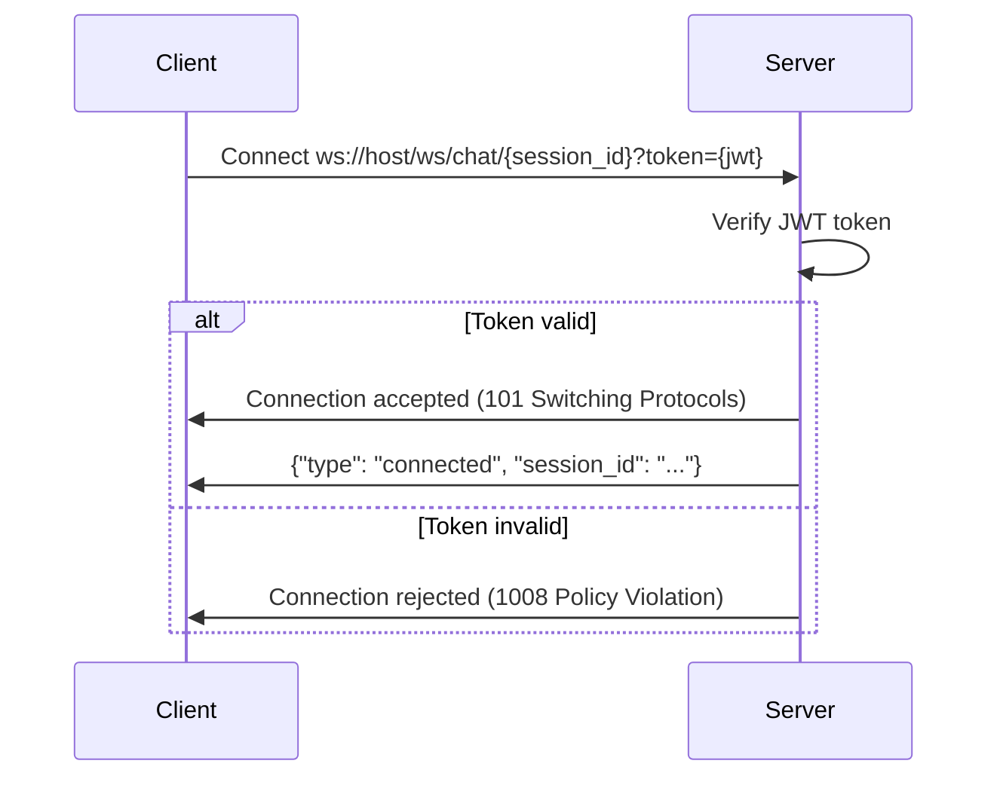
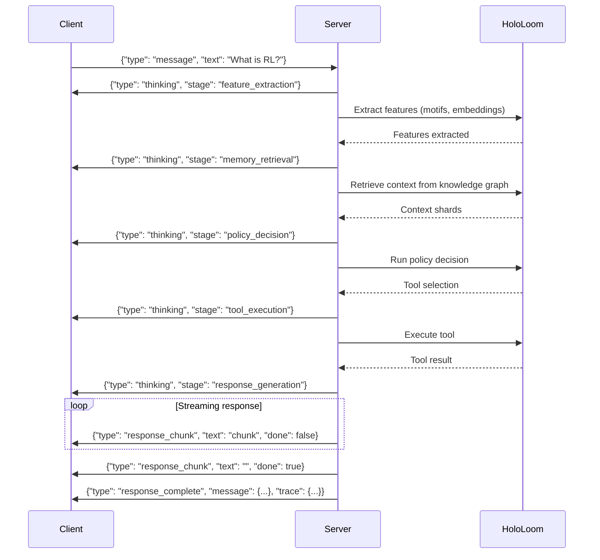

# HoloLoom WebSocket Protocol

Real-time chat communication protocol for mobile clients.

## Connection

### Endpoint
```
wss://api.hololoom.ai/ws/chat/{session_id}?token={jwt_token}
```

### Parameters
- `session_id`: Session identifier from login response
- `token`: JWT access token (query parameter for WebSocket compatibility)

### Connection Flow



### Connection Example (Swift)

```swift
let url = URL(string: "wss://api.hololoom.ai/ws/chat/\(sessionId)?token=\(token)")!
let webSocket = URLSession.shared.webSocketTask(with: url)
webSocket.resume()
```

### Connection Example (Kotlin)

```kotlin
val client = OkHttpClient()
val request = Request.Builder()
    .url("wss://api.hololoom.ai/ws/chat/$sessionId?token=$token")
    .build()
val webSocket = client.newWebSocket(request, listener)
```

---

## Message Protocol

All messages are JSON-encoded with a `type` field indicating the message type.

### Client → Server Messages

#### 1. Send Message

Send a chat message to the server.

```json
{
  "type": "message",
  "text": "What is Thompson Sampling?",
  "metadata": {
    "client_message_id": "msg_local_123",
    "timestamp": "2025-01-15T10:30:00Z",
    "attachments": ["file_xyz789"]
  }
}
```

**Fields:**
- `type` (required): `"message"`
- `text` (required): Message content (max 4096 characters)
- `metadata` (optional): Additional metadata
  - `client_message_id`: Client-side message ID for deduplication
  - `timestamp`: ISO 8601 timestamp
  - `attachments`: Array of file IDs from upload endpoint

#### 2. Heartbeat (Ping)

Keep connection alive.

```json
{
  "type": "ping"
}
```

Server responds with:

```json
{
  "type": "pong"
}
```

**Recommended interval:** Every 30 seconds

#### 3. Typing Indicator

Notify server that user is typing.

```json
{
  "type": "typing",
  "active": true
}
```

**Fields:**
- `active` (required): `true` when typing starts, `false` when typing stops

#### 4. Stop Generation

Request to stop ongoing AI response generation.

```json
{
  "type": "stop_generation",
  "message_id": "msg_abc123"
}
```

---

### Server → Client Messages

#### 1. Connected

Sent immediately after successful connection.

```json
{
  "type": "connected",
  "session_id": "admin_1234567890.123",
  "server_time": "2025-01-15T10:30:00Z"
}
```

#### 2. Thinking Indicator

Indicates server is processing the message.

```json
{
  "type": "thinking",
  "message": "Processing query...",
  "stage": "feature_extraction"
}
```

**Stages:**
- `feature_extraction`: Extracting motifs and embeddings
- `memory_retrieval`: Searching knowledge graph
- `policy_decision`: Running neural policy
- `tool_execution`: Executing selected tool
- `response_generation`: Generating final response

#### 3. Response Chunk (Streaming)

Streamed response text in chunks.

```json
{
  "type": "response_chunk",
  "text": "Thompson Sampling is a",
  "done": false,
  "message_id": "msg_abc123"
}
```

**Final chunk** (indicates completion):

```json
{
  "type": "response_chunk",
  "text": "",
  "done": true,
  "message_id": "msg_abc123"
}
```

**Fields:**
- `text`: Text chunk (empty string when done)
- `done`: `true` when response is complete
- `message_id`: Server-assigned message ID

#### 4. Complete Response

Sent after streaming completes with full message metadata.

```json
{
  "type": "response_complete",
  "message": {
    "message_id": "msg_abc123",
    "session_id": "admin_1234567890.123",
    "role": "assistant",
    "content": "Thompson Sampling is a Bayesian approach...",
    "timestamp": "2025-01-15T10:30:05Z",
    "metadata": {
      "execution_time_ms": 234.5,
      "tokens": 87
    }
  },
  "trace": {
    "motifs": ["question", "technical", "algorithm"],
    "embeddings": {
      "scales": [96, 192, 384],
      "similarity_scores": [0.82, 0.85, 0.87]
    },
    "tool_selection": {
      "selected_tool": "knowledge_search",
      "confidence": 0.87,
      "strategy": "epsilon_greedy"
    },
    "execution_time_ms": 234.5
  }
}
```

**Fields:**
- `message`: Complete message object
- `trace`: Weaving trace with computational provenance

#### 5. Error

Error occurred during processing.

```json
{
  "type": "error",
  "error": "Invalid message length",
  "error_code": "VALIDATION_ERROR",
  "details": {
    "max_length": 4096,
    "received_length": 5000
  }
}
```

**Error Codes:**
- `VALIDATION_ERROR`: Invalid message format/content
- `RATE_LIMIT_EXCEEDED`: Too many requests
- `PROCESSING_ERROR`: Server error during processing
- `TIMEOUT_ERROR`: Processing timeout
- `UNAUTHORIZED`: Authentication failed

#### 6. Message Status Update

Message delivery status changed.

```json
{
  "type": "message_status",
  "message_id": "msg_abc123",
  "status": "delivered",
  "timestamp": "2025-01-15T10:30:05Z"
}
```

**Status values:**
- `sending`: Client is sending
- `sent`: Server received
- `delivered`: Confirmed persisted
- `failed`: Error occurred

---

## Complete Chat Flow



---

## Error Handling

### Connection Errors

| Close Code | Reason | Action |
|------------|--------|--------|
| 1000 | Normal closure | Reconnect if needed |
| 1001 | Going away | Reconnect after delay |
| 1006 | Abnormal closure | Reconnect with backoff |
| 1008 | Policy violation (auth) | Re-authenticate |
| 1009 | Message too large | Reduce message size |
| 1011 | Server error | Reconnect with backoff |

### Reconnection Strategy

```swift
// Swift example
func reconnect(attempt: Int) {
    let delay = min(pow(2.0, Double(attempt)), 60.0) // Exponential backoff, max 60s
    DispatchQueue.main.asyncAfter(deadline: .now() + delay) {
        self.connect()
    }
}
```

```kotlin
// Kotlin example
fun reconnect(attempt: Int) {
    val delay = min(2.0.pow(attempt.toDouble()), 60.0) * 1000 // ms
    handler.postDelayed({
        connect()
    }, delay.toLong())
}
```

### Message Queueing

When offline, queue messages locally and send when reconnected:

```json
{
  "type": "message",
  "text": "Offline message",
  "metadata": {
    "client_message_id": "msg_local_456",
    "queued_at": "2025-01-15T10:25:00Z",
    "sent_at": "2025-01-15T10:30:00Z"
  }
}
```

Server deduplicates using `client_message_id`.

---

## Performance Guidelines

### Message Size Limits

- **Text messages:** 4096 characters
- **Metadata:** 1KB
- **Total message:** 5KB

### Heartbeat

- **Interval:** 30 seconds
- **Timeout:** 90 seconds (3 missed pings)

### Compression

Enable WebSocket compression (permessage-deflate) for bandwidth savings:

```swift
// Swift
var request = URLRequest(url: url)
request.setValue("permessage-deflate", forHTTPHeaderField: "Sec-WebSocket-Extensions")
```

```kotlin
// Kotlin (OkHttp handles automatically)
val client = OkHttpClient.Builder()
    .addInterceptor(WebSocketCompressionInterceptor())
    .build()
```

### Bandwidth Optimization

- **Typing indicators:** Debounce (500ms)
- **Heartbeats:** Only when no other activity
- **Chunk size:** 10-50 characters for smooth streaming

---

## Security

### Authentication

- **Token in query:** WebSocket URL includes JWT token
- **Token validation:** Server validates on connect
- **Token expiry:** Reconnect with refreshed token before expiry

### Message Validation

Server validates all messages:
- Required fields present
- Field types correct
- Content length within limits
- Valid JSON structure

### Rate Limiting

- **Messages:** 10 per minute per session
- **Heartbeats:** 1 per 30 seconds
- **Typing indicators:** 1 per second

Exceeded limits result in `RATE_LIMIT_EXCEEDED` error.

---

## Example Implementations

### Swift (iOS)

```swift
class ChatWebSocket: NSObject, URLSessionWebSocketDelegate {
    private var webSocketTask: URLSessionWebSocketTask?
    private let sessionId: String
    private let token: String

    init(sessionId: String, token: String) {
        self.sessionId = sessionId
        self.token = token
        super.init()
    }

    func connect() {
        let url = URL(string: "wss://api.hololoom.ai/ws/chat/\(sessionId)?token=\(token)")!
        webSocketTask = URLSession.shared.webSocketTask(with: url)
        webSocketTask?.delegate = self
        webSocketTask?.resume()
        receiveMessage()
    }

    func sendMessage(_ text: String) {
        let message: [String: Any] = [
            "type": "message",
            "text": text,
            "metadata": [
                "client_message_id": UUID().uuidString,
                "timestamp": ISO8601DateFormatter().string(from: Date())
            ]
        ]

        guard let data = try? JSONSerialization.data(withJSONObject: message),
              let jsonString = String(data: data, encoding: .utf8) else {
            return
        }

        webSocketTask?.send(.string(jsonString)) { error in
            if let error = error {
                print("Send error: \(error)")
            }
        }
    }

    private func receiveMessage() {
        webSocketTask?.receive { [weak self] result in
            switch result {
            case .success(let message):
                switch message {
                case .string(let text):
                    self?.handleMessage(text)
                case .data(let data):
                    if let text = String(data: data, encoding: .utf8) {
                        self?.handleMessage(text)
                    }
                @unknown default:
                    break
                }
                self?.receiveMessage() // Continue receiving

            case .failure(let error):
                print("Receive error: \(error)")
                self?.reconnect()
            }
        }
    }

    private func handleMessage(_ text: String) {
        guard let data = text.data(using: .utf8),
              let json = try? JSONSerialization.jsonObject(with: data) as? [String: Any],
              let type = json["type"] as? String else {
            return
        }

        switch type {
        case "connected":
            print("Connected to session: \(json["session_id"] ?? "")")
        case "thinking":
            print("Status: \(json["message"] ?? "")")
        case "response_chunk":
            if let text = json["text"] as? String, !text.isEmpty {
                print(text, terminator: "")
            }
        case "error":
            print("Error: \(json["error"] ?? "")")
        default:
            break
        }
    }

    func disconnect() {
        webSocketTask?.cancel(with: .normalClosure, reason: nil)
    }
}
```

### Kotlin (Android)

```kotlin
class ChatWebSocket(
    private val sessionId: String,
    private val token: String,
    private val listener: ChatListener
) {
    private val client = OkHttpClient()
    private var webSocket: WebSocket? = null

    interface ChatListener {
        fun onConnected(sessionId: String)
        fun onThinking(message: String, stage: String)
        fun onResponseChunk(text: String, done: Boolean)
        fun onError(error: String)
    }

    fun connect() {
        val url = "wss://api.hololoom.ai/ws/chat/$sessionId?token=$token"
        val request = Request.Builder().url(url).build()

        webSocket = client.newWebSocket(request, object : WebSocketListener() {
            override fun onOpen(webSocket: WebSocket, response: Response) {
                println("WebSocket connected")
            }

            override fun onMessage(webSocket: WebSocket, text: String) {
                handleMessage(text)
            }

            override fun onFailure(webSocket: WebSocket, t: Throwable, response: Response?) {
                println("WebSocket error: ${t.message}")
                reconnect()
            }

            override fun onClosed(webSocket: WebSocket, code: Int, reason: String) {
                println("WebSocket closed: $code - $reason")
            }
        })
    }

    fun sendMessage(text: String) {
        val message = JSONObject().apply {
            put("type", "message")
            put("text", text)
            put("metadata", JSONObject().apply {
                put("client_message_id", UUID.randomUUID().toString())
                put("timestamp", Instant.now().toString())
            })
        }

        webSocket?.send(message.toString())
    }

    private fun handleMessage(text: String) {
        val json = JSONObject(text)
        when (json.getString("type")) {
            "connected" -> {
                listener.onConnected(json.getString("session_id"))
            }
            "thinking" -> {
                listener.onThinking(
                    json.getString("message"),
                    json.optString("stage", "")
                )
            }
            "response_chunk" -> {
                listener.onResponseChunk(
                    json.optString("text", ""),
                    json.getBoolean("done")
                )
            }
            "error" -> {
                listener.onError(json.getString("error"))
            }
        }
    }

    fun disconnect() {
        webSocket?.close(1000, "Client disconnect")
    }

    private fun reconnect() {
        // Implement exponential backoff
    }
}
```

---

## Testing

### Test Connection

```bash
# Using wscat
wscat -c "wss://api.hololoom.ai/ws/chat/test_session?token=YOUR_JWT_TOKEN"

# Send message
> {"type": "message", "text": "Hello"}

# Receive responses
< {"type": "thinking", "message": "Processing..."}
< {"type": "response_chunk", "text": "Hello! ", "done": false}
< {"type": "response_chunk", "text": "How can I help?", "done": false}
< {"type": "response_chunk", "text": "", "done": true}
```

### Mock Server

For development, use the provided mock WebSocket server:

```python
# Run mock server
python HoloLoom/mobile/mock_server.py --port 8000
```

Provides same protocol with simulated responses.

---

## FAQ

**Q: How do I handle token expiration?**

A: Monitor `error` messages with `UNAUTHORIZED` error_code. Refresh token via REST API and reconnect with new token.

**Q: Should I use WebSocket or REST for sending messages?**

A: WebSocket for real-time chat with streaming responses. REST (`POST /chat/sessions/{id}/messages`) for non-streaming use cases.

**Q: How do I implement offline support?**

A: Queue messages locally when offline. On reconnect, send with `client_message_id` for deduplication. Use `/sync/pull` and `/sync/push` for bulk sync.

**Q: What's the maximum message length?**

A: 4096 characters. For longer content, split into multiple messages or upload as a file attachment.

**Q: How often should I send heartbeats?**

A: Every 30 seconds when no other activity. Skip if messages sent/received within last 30s.
