# LMS Orchestration Architecture - Visual Diagrams
**Date**: 2025-11-17
**Purpose**: Visual representations of the LMS orchestration ecosystem

## Table of Contents
1. [System Overview](#system-overview)
2. [Plugin Architecture](#plugin-architecture)
3. [Theme System](#theme-system)
4. [Knowledge Graph](#knowledge-graph)
5. [Request Flow](#request-flow)
6. [Data Flow](#data-flow)

---

## System Overview

High-level architecture showing all major components:

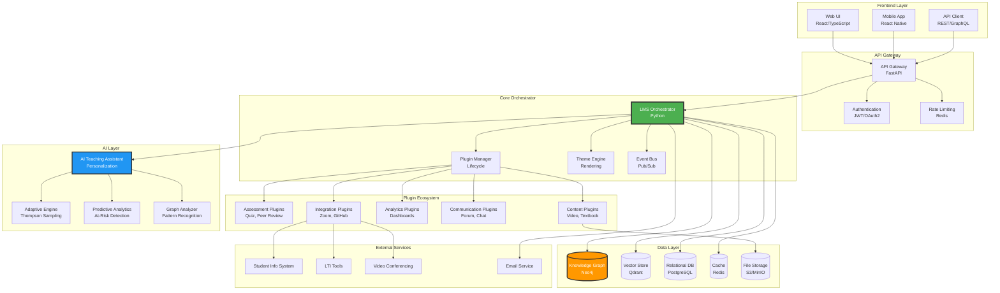

---

## Plugin Architecture

Detailed view of plugin system with lifecycle and communication:

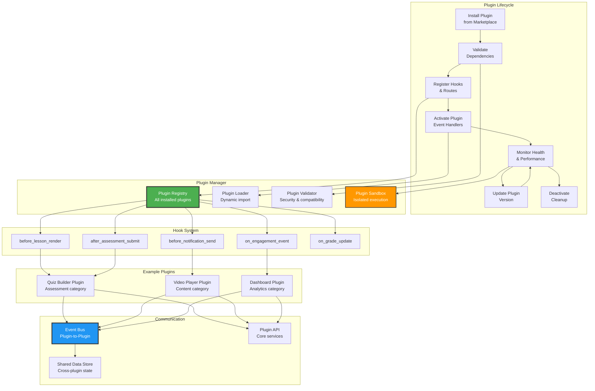

---

## Theme System

How themes orchestrate the complete learning experience:

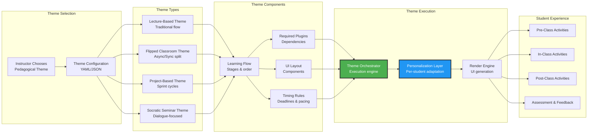

---

## Knowledge Graph

Student knowledge graph structure and relationships:

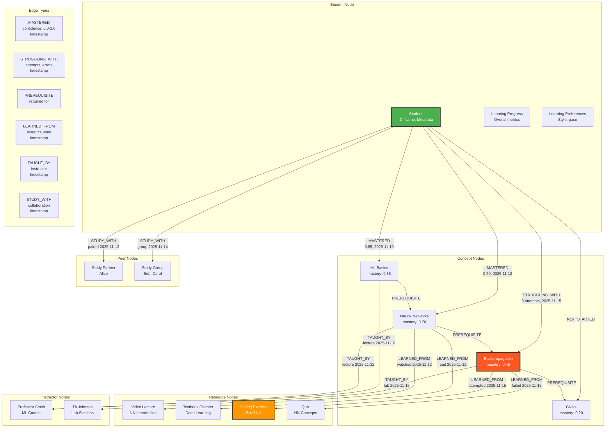

---

## Request Flow

End-to-end request flow for a student viewing a lesson:

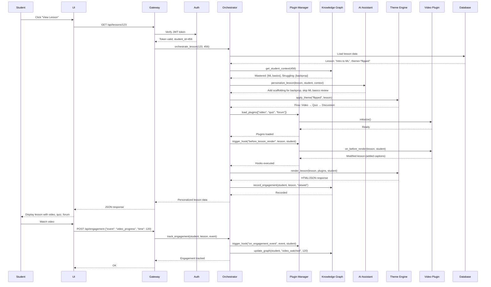

---

## Data Flow

How data flows through the system for different operations:

### Content Creation Flow

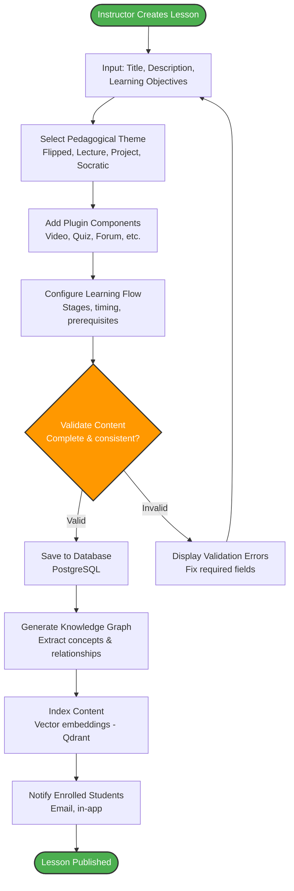

### Student Learning Flow

```mermaid
flowchart TB
    Start([Student Accesses Lesson])

    LoadContext[Load Student Context<br/>from Knowledge Graph]
    LoadLesson[Load Lesson Data<br/>from Database]

    CheckPrereq{Prerequisites<br/>satisfied?}

    PersonalizeContent[Personalize Content<br/>AI Assistant adaptation]
    ApplyTheme[Apply Theme<br/>Render learning flow]
    LoadPlugins[Load Required Plugins<br/>Video, Quiz, etc.]

    DisplayLesson[Display Personalized Lesson<br/>To student]

    StudentInteracts[Student Interacts<br/>Watch, answer, discuss]
    TrackEngagement[Track Engagement Events<br/>View, click, submit]
    UpdateGraph[Update Knowledge Graph<br/>Add mastery evidence]

    CheckComplete{Lesson<br/>completed?}

    AssessLearning[Assess Learning<br/>Quiz, exercise, discussion]
    CalculateMastery[Calculate Mastery Score<br/>0.0 - 1.0]
    UpdateProgress[Update Student Progress<br/>in Knowledge Graph]

    CheckIntervention{Needs<br/>intervention?}

    SuggestIntervention[AI Suggests Intervention<br/>Tutoring, review, etc.]
    NotifyInstructor[Notify Instructor<br/>At-risk student]

    NextLesson([Proceed to Next Lesson])
    ShowPrereqError[Show Prerequisites Required<br/>Suggest review materials]

    Start --> LoadContext
    LoadContext --> LoadLesson
    LoadLesson --> CheckPrereq

    CheckPrereq -->|Yes| PersonalizeContent
    CheckPrereq -->|No| ShowPrereqError
    ShowPrereqError --> Start

    PersonalizeContent --> ApplyTheme
    ApplyTheme --> LoadPlugins
    LoadPlugins --> DisplayLesson

    DisplayLesson --> StudentInteracts
    StudentInteracts --> TrackEngagement
    TrackEngagement --> UpdateGraph
    UpdateGraph --> CheckComplete

    CheckComplete -->|No| StudentInteracts
    CheckComplete -->|Yes| AssessLearning

    AssessLearning --> CalculateMastery
    CalculateMastery --> UpdateProgress
    UpdateProgress --> CheckIntervention

    CheckIntervention -->|Yes| SuggestIntervention
    CheckIntervention -->|No| NextLesson

    SuggestIntervention --> NotifyInstructor
    NotifyInstructor --> NextLesson

    style Start fill:#4CAF50,stroke:#333,stroke-width:2px,color:#fff
    style NextLesson fill:#4CAF50,stroke:#333,stroke-width:2px,color:#fff
    style CheckIntervention fill:#FF9800,stroke:#333,stroke-width:2px,color:#fff
    style SuggestIntervention fill:#FF5722,stroke:#333,stroke-width:2px,color:#fff
```

### Analytics Pipeline

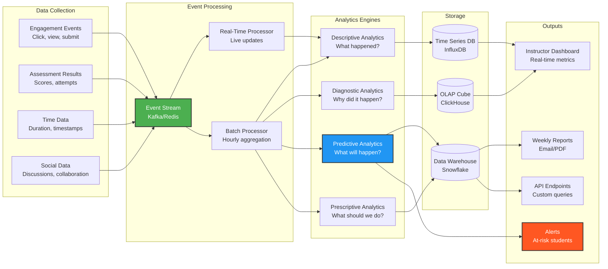

---

## Deployment Architecture

Production deployment with high availability:

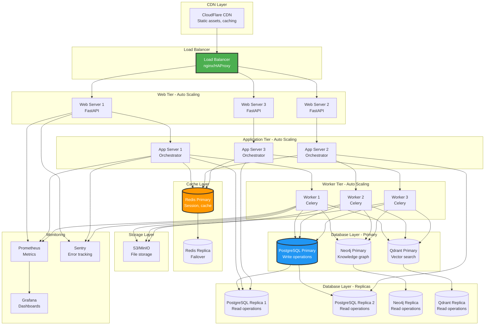

---

## Plugin Development Workflow

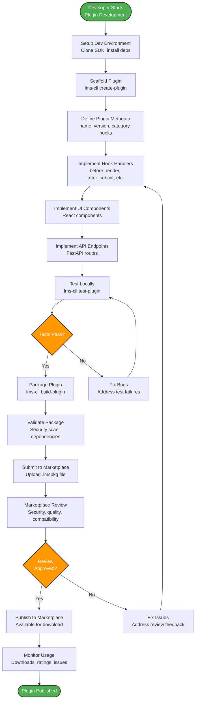

---

## Security Architecture

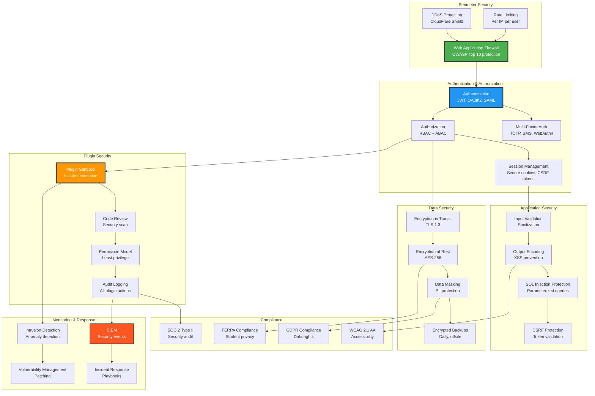

---

## Scalability Strategy

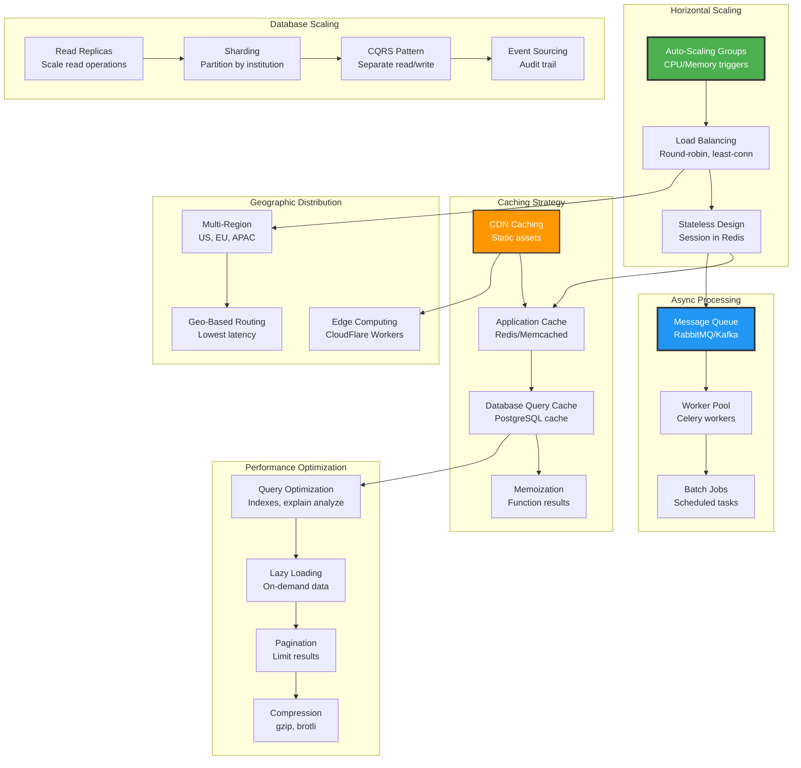

---

## Notes

All diagrams use Mermaid syntax for easy rendering in:
- GitHub/GitLab README files
- Documentation sites (MkDocs, Docusaurus, etc.)
- VS Code with Mermaid extensions
- Notion, Confluence, etc.

To render locally:
```bash
npm install -g @mermaid-js/mermaid-cli
mmdc -i LMS_ARCHITECTURE_DIAGRAMS.md -o diagrams.pdf
```

Or use online tools:
- https://mermaid.live/
- https://mermaid.ink/

---

**Author**: Claude Code
**Date**: 2025-11-17
**Version**: 1.0
