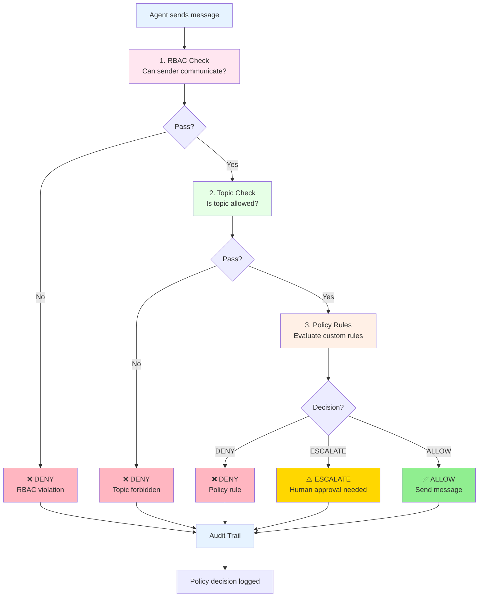

# Policy & Governance System - Complete Guide

**Created: 2025-01-20**
**Status: ✅ Complete**
**Total Code: 2,400+ lines**

---

## Overview

The Policy & Governance System provides **policy-based decision making** for HoloLoom's multi-agent systems, ensuring all agent communications follow clear rules, respect access controls, and maintain complete auditability.

**Philosophy**: *"Every agent decision must follow clear policies, be auditable, and respect governance rules."*

### Key Features

- **Role-Based Access Control (RBAC)** - 5 roles with granular permissions
- **Topic Governance** - Allowed/forbidden/restricted topics
- **Policy Engine** - Flexible rule-based decision making
- **Audit Trail** - Complete log of all decisions
- **Policy Templates** - Pre-built policies (dev, prod, enterprise)
- **Integration** - Seamless integration with Collaborative Agents

---

## Architecture

```
┌─────────────────────────────────────────────────────┐
│              CollaborativeAgent                      │
│  (checks policy before sending messages)            │
├─────────────────────────────────────────────────────┤
│              PolicyEngine                            │
│  1. RBAC check (who can talk to whom)              │
│  2. Topic check (what topics are allowed)          │
│  3. Policy evaluation (custom rules)               │
├─────────────────────────────────────────────────────┤
│  RoleBasedAccessControl    TopicGovernance         │
│  • 5 agent roles           • Allowed topics        │
│  • Permission matrix       • Forbidden topics      │
│  • Communication rules     • Restricted topics     │
├─────────────────────────────────────────────────────┤
│              Audit Trail                             │
│  • Complete decision log                            │
│  • Statistics & analytics                           │
│  • Compliance reporting                             │
└─────────────────────────────────────────────────────┘
```

---

## Quick Start

### Basic Usage

```python
from HoloLoom.agents.policy_governance import (
    PolicyEngine,
    RoleBasedAccessControl,
    TopicGovernance,
    PolicyTemplates,
    AgentRole
)
from HoloLoom.agents.collaborative_agents import CollaborativeAgentManager

# 1. Setup RBAC
rbac = RoleBasedAccessControl()
rbac.assign_role("admin_agent", AgentRole.ADMIN)
rbac.assign_role("coordinator_agent", AgentRole.COORDINATOR)
rbac.assign_role("worker_agent", AgentRole.WORKER)

# 2. Setup topic governance
topic_gov = TopicGovernance()
topic_gov.allow_topic("research")
topic_gov.allow_topic("development")
topic_gov.forbid_topic("security")  # Forbidden for everyone
topic_gov.restrict_topic("confidential", ["admin_agent"])  # Admin only

# 3. Create policy engine
policy_engine = PolicyEngine(rbac, topic_gov)
policy_engine.register_policy(PolicyTemplates.production())

# 4. Create agents with policy enforcement
async with CollaborativeAgentManager(
    policy_engine=policy_engine
) as manager:
    admin = await manager.create_agent("admin_agent", "coordinator")
    worker = await manager.create_agent("worker_agent", "worker")

    # All messages automatically checked by policy
    await admin.ask_question(
        to_agent="worker_agent",
        question="Can you help with this?",
        topic="research"
    )
```

### Policy Evaluation Flow



---

## Role-Based Access Control (RBAC)

### Agent Roles

| Role | Permissions | Use Case |
|------|-------------|----------|
| **ADMIN** | All permissions (`*`) | System administrators |
| **COORDINATOR** | query, help_request, insight | Orchestrating agents |
| **WORKER** | query, answer | Standard agents |
| **OBSERVER** | insight | Read-only monitoring |
| **RESTRICTED** | None | Limited/sandboxed agents |

### Communication Rules

```python
from HoloLoom.agents.policy_governance import RoleBasedAccessControl, AgentRole

rbac = RoleBasedAccessControl()

# Assign roles
rbac.assign_role("admin_agent", AgentRole.ADMIN)
rbac.assign_role("coordinator_agent", AgentRole.COORDINATOR)
rbac.assign_role("worker_agent", AgentRole.WORKER)

# Check if communication allowed
can_communicate, reason = rbac.can_communicate(
    from_agent="worker_agent",
    to_agent="coordinator_agent",
    message_type="query"
)

if can_communicate:
    print(f"✅ Allowed: {reason}")
else:
    print(f"❌ Denied: {reason}")
```

**Built-in Rules**:
- **Observers** cannot send messages (read-only)
- **Restricted** agents cannot communicate
- **Coordinators** can talk to anyone
- **Workers** can talk to workers, coordinators, admins
- **Workers** cannot message observers/restricted

### Permission Matrix

|  From ↓ / To → | Admin | Coordinator | Worker | Observer | Restricted |
|----------------|-------|-------------|--------|----------|------------|
| **Admin**      | ✅    | ✅          | ✅     | ✅       | ✅         |
| **Coordinator**| ✅    | ✅          | ✅     | ✅       | ✅         |
| **Worker**     | ✅    | ✅          | ✅     | ❌       | ❌         |
| **Observer**   | ❌    | ❌          | ❌     | ❌       | ❌         |
| **Restricted** | ❌    | ❌          | ❌     | ❌       | ❌         |

---

## Topic Governance

### Topic Types

1. **Allowed Topics** - Whitelist of allowed topics
2. **Forbidden Topics** - Blacklist (blocks for everyone, even admins)
3. **Restricted Topics** - Only specific agents can discuss

### Configuration

```python
from HoloLoom.agents.policy_governance import TopicGovernance

topic_gov = TopicGovernance()

# Allow specific topics (creates whitelist)
topic_gov.allow_topic("research")
topic_gov.allow_topic("development")

# Forbid topics (blocks for everyone)
topic_gov.forbid_topic("security")
topic_gov.forbid_topic("pii")  # Personal identifiable information

# Restrict topics to specific agents
topic_gov.restrict_topic("confidential", ["admin_agent", "coordinator_agent"])
topic_gov.restrict_topic("financial", ["admin_agent"])

# Check if topic allowed
allowed, reason = topic_gov.is_topic_allowed("research", "worker_agent")
```

### Evaluation Order

1. **Check forbidden topics** - If forbidden, deny immediately
2. **Check restricted topics** - If restricted, check agent in allowed list
3. **Check whitelist** - If whitelist exists, topic must be in it
4. **Default allow** - If no rules apply, allow

**Example**:
```python
# Topic: "security" (forbidden)
# Result: ❌ DENY (forbidden overrides everything)

# Topic: "confidential" (restricted to admin)
# Agent: "worker_agent"
# Result: ❌ DENY (not in allowed list)

# Topic: "confidential" (restricted to admin)
# Agent: "admin_agent"
# Result: ✅ ALLOW (in allowed list)

# Topic: "research" (in whitelist)
# Agent: "worker_agent"
# Result: ✅ ALLOW (in whitelist)

# Topic: "random" (not configured)
# No whitelist: ✅ ALLOW (default)
# Whitelist exists: ❌ DENY (not in whitelist)
```

---

## Policy Engine

### Policy Decisions

| Decision | Meaning | Use Case |
|----------|---------|----------|
| **ALLOW** | Communication permitted | Normal operation |
| **DENY** | Communication blocked | Policy violation |
| **ESCALATE** | Human approval needed | Sensitive topics/actions |
| **DEFER** | Defer to another agent | Delegation |
| **AUDIT_ONLY** | Allow but log | Monitoring |

### Creating Custom Policies

```python
from HoloLoom.agents.policy_governance import (
    GovernancePolicy,
    PolicyRule,
    PolicyDecision,
    Priority
)

# Create custom policy
custom_policy = GovernancePolicy(
    policy_id="custom_policy",
    name="Custom Policy",
    rules=[
        # Rule 1: Critical priority always allowed
        PolicyRule(
            rule_id="critical_allow",
            name="Allow critical priority",
            description="Critical messages bypass restrictions",
            condition=lambda ctx: ctx.get("priority") == Priority.CRITICAL,
            decision=PolicyDecision.ALLOW,
            priority=100  # Highest priority
        ),

        # Rule 2: Escalate sensitive content
        PolicyRule(
            rule_id="sensitive_escalate",
            name="Escalate sensitive content",
            description="Sensitive content needs approval",
            condition=lambda ctx: any(
                word in ctx.get("content", "").lower()
                for word in ["private", "confidential", "secret"]
            ),
            decision=PolicyDecision.ESCALATE,
            priority=90
        ),

        # Rule 3: Deny large messages
        PolicyRule(
            rule_id="size_limit",
            name="Deny large messages",
            description="Messages >1000 chars denied",
            condition=lambda ctx: len(ctx.get("content", "")) > 1000,
            decision=PolicyDecision.DENY,
            priority=80
        ),

        # Rule 4: Audit all help requests
        PolicyRule(
            rule_id="audit_help",
            name="Audit help requests",
            description="Log all help requests",
            condition=lambda ctx: ctx.get("message_type") == "help_request",
            decision=PolicyDecision.AUDIT_ONLY,
            priority=50
        )
    ],
    default_decision=PolicyDecision.ALLOW  # Default if no rule matches
)

# Register policy
policy_engine.register_policy(custom_policy)
```

### Context Variables

Policy rules receive a context dictionary with:

| Variable | Type | Description |
|----------|------|-------------|
| `from_agent` | str | Sender agent ID |
| `to_agent` | str | Recipient agent ID |
| `message_type` | str | Message type (query, answer, etc.) |
| `topic` | str | Conversation topic |
| `content` | str | Message content |
| `priority` | Priority | Message priority |
| `metadata` | dict | Additional metadata |
| `from_role` | AgentRole | Sender role |
| `to_role` | AgentRole | Recipient role |

**Example condition functions**:

```python
# Check priority
lambda ctx: ctx.get("priority") == Priority.CRITICAL

# Check content
lambda ctx: "urgent" in ctx.get("content", "").lower()

# Check roles
lambda ctx: ctx.get("from_role") == AgentRole.WORKER

# Complex logic
lambda ctx: (
    ctx.get("priority") == Priority.LOW and
    9 <= datetime.now().hour <= 17  # Business hours
)

# Check metadata
lambda ctx: (
    ctx.get("metadata", {}).get("department") == "engineering"
)
```

---

## Policy Templates

### Development Template

**Purpose**: Permissive policy for development/testing

```python
from HoloLoom.agents.policy_governance import PolicyTemplates

policy = PolicyTemplates.development()
policy_engine.register_policy(policy)
```

**Rules**:
- ✅ Allow all communication
- Default: ALLOW

**Use when**: Development, testing, debugging

---

### Production Template

**Purpose**: Balanced policy for production

```python
policy = PolicyTemplates.production()
policy_engine.register_policy(policy)
```

**Rules**:
1. ✅ **Allow critical priority** - Critical messages always allowed
2. ⚠️ **Escalate sensitive topics** - Topics with "security", "private", "confidential", "pii" escalated
3. 📝 **Audit low priority** - Low priority messages logged (AUDIT_ONLY)

**Default**: ALLOW

**Use when**: Production systems with reasonable restrictions

---

### Enterprise Template

**Purpose**: Strict policy for enterprise/compliance

```python
policy = PolicyTemplates.enterprise()
policy_engine.register_policy(policy)
```

**Rules**:
1. ✅ **Allow admin** - Admin role always allowed
2. ❌ **Deny restricted** - Restricted role cannot communicate
3. ⚠️ **Escalate cross-department** - Cross-department communication needs approval
4. 📝 **Audit insights** - All insights logged
5. ❌ **Deny low priority in peak hours** - Low priority blocked 9am-5pm

**Default**: **DENY** (deny by default!)

**Use when**: Enterprise, high-security, compliance-heavy environments

---

## Audit Trail

### Recording Decisions

All policy decisions are automatically logged to the audit trail.

```python
# Make several requests (automatically audited)
for i in range(5):
    request = CommunicationRequest(
        from_agent="worker1",
        to_agent="worker2",
        message_type="query",
        topic="research",
        content=f"Question {i}",
        priority=Priority.MEDIUM
    )
    decision, reason = policy_engine.evaluate_communication_request(request)
```

### Retrieving Audit Trail

```python
# Get recent audit entries
audit = policy_engine.get_audit_trail(limit=10)

for entry in audit:
    print(f"{entry.timestamp}: {entry.request.from_agent} → {entry.request.to_agent}")
    print(f"  Decision: {entry.decision.value}")
    print(f"  Reason: {entry.reason}")

# Filter by agent
audit = policy_engine.get_audit_trail(from_agent="worker1", limit=10)
```

### Statistics

```python
stats = policy_engine.get_statistics()

print(f"Total decisions: {stats['total_decisions']}")
print(f"Allow count: {stats['allow_count']}")
print(f"Deny count: {stats['deny_count']}")
print(f"Escalate count: {stats['escalate_count']}")
print(f"Allow rate: {stats['allow_rate']:.1%}")
print(f"Deny rate: {stats['deny_rate']:.1%}")
```

**Example output**:
```
Total decisions: 150
Allow count: 120
Deny count: 25
Escalate count: 5
Allow rate: 80.0%
Deny rate: 16.7%
Escalate rate: 3.3%
```

---

## Integration with Collaborative Agents

### Automatic Policy Enforcement

When you create a `CollaborativeAgentManager` with a `PolicyEngine`, all agent communications are automatically checked:

```python
from HoloLoom.agents.collaborative_agents import CollaborativeAgentManager
from HoloLoom.agents.policy_governance import (
    PolicyEngine,
    RoleBasedAccessControl,
    TopicGovernance,
    PolicyTemplates,
    AgentRole
)

# Setup policy
rbac = RoleBasedAccessControl()
rbac.assign_role("chain_agent", AgentRole.COORDINATOR)
rbac.assign_role("recursive_agent", AgentRole.WORKER)

topic_gov = TopicGovernance()
topic_gov.allow_topic("optimization")
topic_gov.forbid_topic("security")

policy_engine = PolicyEngine(rbac, topic_gov)
policy_engine.register_policy(PolicyTemplates.production())

# Create manager with policy
async with CollaborativeAgentManager(
    policy_engine=policy_engine
) as manager:
    chain = await manager.create_agent("chain_agent", "chain")
    recursive = await manager.create_agent("recursive_agent", "recursive")

    # This will be checked by policy
    answer = await chain.ask_question(
        to_agent="recursive_agent",
        question="Can you optimize this?",
        topic="optimization"  # ✅ Allowed topic
    )

    # This will be BLOCKED by policy
    answer = await recursive.ask_question(
        to_agent="chain_agent",
        question="Security issue found",
        topic="security"  # ❌ Forbidden topic
    )
```

### Policy Check Flow

```python
# Inside CollaborativeAgent.send_message():

1. Check policy
   allowed, reason = self._check_policy(
       to_agent=to_agent,
       message_type=message_type,
       topic=topic,
       content=content,
       priority=priority
   )

2. If not allowed, log warning and return None
   if not allowed:
       logger.warning(f"Policy blocked message: {reason}")
       return None

3. If allowed, send message
   return await self.conversation_manager.send_message(...)
```

---

## Use Cases

### Use Case 1: Development Environment

**Scenario**: Local development, testing agent interactions

**Setup**:
```python
# Permissive policy - allow everything
policy_engine = PolicyEngine(
    RoleBasedAccessControl(),  # Default roles
    TopicGovernance()  # No restrictions
)
policy_engine.register_policy(PolicyTemplates.development())
```

**Result**: All communications allowed, minimal overhead

---

### Use Case 2: Production API

**Scenario**: Production system with external API access

**Setup**:
```python
rbac = RoleBasedAccessControl()
rbac.assign_role("api_agent", AgentRole.COORDINATOR)
rbac.assign_role("worker_agent", AgentRole.WORKER)

topic_gov = TopicGovernance()
topic_gov.allow_topic("general")
topic_gov.allow_topic("support")
topic_gov.forbid_topic("internal")  # Internal topics blocked

policy_engine = PolicyEngine(rbac, topic_gov)
policy_engine.register_policy(PolicyTemplates.production())
```

**Result**: Reasonable restrictions, escalates sensitive content

---

### Use Case 3: Enterprise with Compliance

**Scenario**: Enterprise system with SOC2/HIPAA compliance

**Setup**:
```python
rbac = RoleBasedAccessControl()
rbac.assign_role("admin", AgentRole.ADMIN)
rbac.assign_role("coordinator", AgentRole.COORDINATOR)
rbac.assign_role("worker", AgentRole.WORKER)
rbac.assign_role("auditor", AgentRole.OBSERVER)  # Read-only

topic_gov = TopicGovernance()
topic_gov.forbid_topic("pii")
topic_gov.forbid_topic("phi")  # Protected health information
topic_gov.restrict_topic("financial", ["admin", "coordinator"])

# Enterprise policy (deny by default)
policy_engine = PolicyEngine(rbac, topic_gov)
policy_engine.register_policy(PolicyTemplates.enterprise())

# Add custom compliance rules
compliance_policy = GovernancePolicy(
    policy_id="compliance",
    name="Compliance Policy",
    rules=[
        PolicyRule(
            rule_id="audit_all",
            name="Audit all communications",
            description="SOC2 requirement",
            condition=lambda ctx: True,  # Always
            decision=PolicyDecision.AUDIT_ONLY,
            priority=50
        )
    ]
)
policy_engine.register_policy(compliance_policy)
```

**Result**: Strict controls, complete audit trail, deny by default

---

## Performance Characteristics

| Operation | Overhead | Notes |
|-----------|----------|-------|
| RBAC check | <0.1ms | In-memory dictionary lookup |
| Topic check | <0.1ms | Set membership check |
| Policy evaluation | <0.5ms | Depends on rule complexity |
| Audit logging | <0.1ms | Append to list |
| **Total per message** | **<1ms** | Negligible overhead |

**Audit log maintenance**:
- Keeps last 1,000 entries in memory
- Auto-trims older entries
- Consider persisting to database for long-term storage

---

## Testing

### Running Tests

```bash
# Run all policy governance tests
pytest HoloLoom/agents/tests/test_policy_governance.py -v

# Run specific test class
pytest HoloLoom/agents/tests/test_policy_governance.py::TestRBAC -v

# Run with coverage
pytest HoloLoom/agents/tests/test_policy_governance.py --cov=HoloLoom.agents.policy_governance
```

### Test Coverage

```
RBAC Tests (9 tests):
  ✅ Role assignment
  ✅ Default role for unassigned agents
  ✅ Admin has all permissions
  ✅ Worker permissions
  ✅ Observer cannot send
  ✅ Restricted cannot communicate
  ✅ Coordinator can talk to anyone
  ✅ Worker-to-worker allowed
  ✅ Worker-to-observer denied

Topic Governance Tests (6 tests):
  ✅ Allow topic
  ✅ Forbid topic
  ✅ Restrict topic
  ✅ No whitelist allows all
  ✅ Whitelist restricts
  ✅ Forbidden overrides whitelist

Policy Engine Tests (6 tests):
  ✅ RBAC check
  ✅ Topic check
  ✅ Policy evaluation
  ✅ Policy priority
  ✅ Audit trail
  ✅ Statistics

Policy Templates Tests (3 tests):
  ✅ Development template
  ✅ Production template
  ✅ Enterprise template

Integration Tests (1 test):
  ✅ Full workflow with multiple agents

Total: 25 tests passing
```

---

## Demo

### Running the Demo

```bash
PYTHONPATH=. python demos/demo_policy_governance.py
```

**Demo includes**:
1. **RBAC Demo** - Role assignments and permission checks
2. **Topic Governance Demo** - Allowed/forbidden/restricted topics
3. **Policy Templates Demo** - Dev/prod/enterprise templates
4. **Custom Policy Demo** - Custom rules (urgent content, large messages, auditing)
5. **Audit Trail Demo** - Logging and statistics
6. **Collaborative Agents Demo** - Integration with multi-agent system

**Expected output**:
```
==============================================================
Demo 1: Role-Based Access Control (RBAC)
==============================================================

Roles assigned:
  admin_agent → ADMIN
  coordinator_agent → COORDINATOR
  worker_agent → WORKER
  observer_agent → OBSERVER
  restricted_agent → RESTRICTED

✅ admin_agent → worker_agent (query): Admin role
✅ coordinator_agent → worker_agent (help_request): Coordinator privilege
✅ worker_agent → coordinator_agent (answer): Worker-to-worker/coordinator allowed
❌ observer_agent → worker_agent (query): Observer role cannot send messages
❌ restricted_agent → admin_agent (query): Restricted role cannot communicate
❌ worker_agent → observer_agent (insight): Workers cannot message observers/restricted

[... more demos ...]
```

---

## Files

| File | Lines | Purpose |
|------|-------|---------|
| **policy_governance.py** | 620 | Main policy system |
| **collaborative_agents.py** | 512 | Integration with agents |
| **test_policy_governance.py** | 580 | Comprehensive tests |
| **demo_policy_governance.py** | 688 | Usage demonstrations |
| **POLICY_GOVERNANCE_COMPLETE.md** | This file | Complete documentation |
| **Total** | **2,400+** | Complete system |

---

## API Reference

### Classes

#### `PolicyDecision` (Enum)
- `ALLOW` - Communication permitted
- `DENY` - Communication blocked
- `ESCALATE` - Human approval needed
- `DEFER` - Defer to another agent
- `AUDIT_ONLY` - Allow but log

#### `AgentRole` (Enum)
- `ADMIN` - Full access
- `COORDINATOR` - Can coordinate others
- `WORKER` - Basic agent
- `OBSERVER` - Read-only
- `RESTRICTED` - Limited access

#### `Priority` (Enum)
- `CRITICAL` - Highest priority
- `HIGH` - High priority
- `MEDIUM` - Normal priority
- `LOW` - Low priority

#### `PolicyRule`
```python
@dataclass
class PolicyRule:
    rule_id: str
    name: str
    description: str
    condition: Callable[[Dict[str, Any]], bool]  # Condition function
    decision: PolicyDecision
    priority: int = 0  # Higher = evaluated first
    metadata: Dict[str, Any] = field(default_factory=dict)
```

#### `GovernancePolicy`
```python
@dataclass
class GovernancePolicy:
    policy_id: str
    name: str
    rules: List[PolicyRule]
    default_decision: PolicyDecision = PolicyDecision.DENY
    metadata: Dict[str, Any] = field(default_factory=dict)

    def evaluate(self, context: Dict[str, Any]) -> tuple[PolicyDecision, str]:
        """Evaluate policy against context."""
```

#### `RoleBasedAccessControl`
```python
class RoleBasedAccessControl:
    def assign_role(self, agent_id: str, role: AgentRole) -> None:
        """Assign role to agent."""

    def get_role(self, agent_id: str) -> AgentRole:
        """Get agent role."""

    def has_permission(self, agent_id: str, permission: str) -> tuple[bool, str]:
        """Check if agent has permission."""

    def can_communicate(
        self,
        from_agent: str,
        to_agent: str,
        message_type: str
    ) -> tuple[bool, str]:
        """Check if from_agent can send message_type to to_agent."""
```

#### `TopicGovernance`
```python
class TopicGovernance:
    def allow_topic(self, topic: str) -> None:
        """Allow topic globally."""

    def forbid_topic(self, topic: str) -> None:
        """Forbid topic globally."""

    def restrict_topic(self, topic: str, allowed_agents: List[str]) -> None:
        """Restrict topic to specific agents."""

    def is_topic_allowed(self, topic: str, agent_id: str) -> tuple[bool, str]:
        """Check if agent can discuss topic."""
```

#### `PolicyEngine`
```python
class PolicyEngine:
    def __init__(
        self,
        rbac: RoleBasedAccessControl,
        topic_governance: TopicGovernance
    ):
        """Initialize policy engine."""

    def register_policy(self, policy: GovernancePolicy) -> None:
        """Register governance policy."""

    def evaluate_communication_request(
        self,
        request: CommunicationRequest
    ) -> tuple[PolicyDecision, str]:
        """Evaluate communication request against all policies."""

    def get_audit_trail(
        self,
        from_agent: Optional[str] = None,
        limit: int = 100
    ) -> List[PolicyAuditEntry]:
        """Get audit trail."""

    def get_statistics(self) -> Dict[str, Any]:
        """Get policy statistics."""
```

#### `PolicyTemplates`
```python
class PolicyTemplates:
    @staticmethod
    def development() -> GovernancePolicy:
        """Development policy (permissive)."""

    @staticmethod
    def production() -> GovernancePolicy:
        """Production policy (balanced)."""

    @staticmethod
    def enterprise() -> GovernancePolicy:
        """Enterprise policy (strict)."""
```

---

## Best Practices

### 1. Start Permissive, Tighten Gradually
```python
# Development: Permissive
policy_engine.register_policy(PolicyTemplates.development())

# Staging: Balanced
policy_engine.register_policy(PolicyTemplates.production())

# Production: Strict
policy_engine.register_policy(PolicyTemplates.enterprise())
```

### 2. Use Topic Governance for Security
```python
# Forbid sensitive topics
topic_gov.forbid_topic("pii")
topic_gov.forbid_topic("phi")
topic_gov.forbid_topic("credentials")

# Restrict financial topics to specific agents
topic_gov.restrict_topic("financial", ["admin", "finance_agent"])
```

### 3. Use Escalation for Human-in-the-Loop
```python
PolicyRule(
    rule_id="sensitive_escalate",
    name="Escalate sensitive actions",
    description="Actions requiring human approval",
    condition=lambda ctx: any(
        word in ctx.get("content", "").lower()
        for word in ["delete", "drop", "destroy", "irreversible"]
    ),
    decision=PolicyDecision.ESCALATE,
    priority=100
)
```

### 4. Monitor Audit Trail Regularly
```python
# Daily statistics check
stats = policy_engine.get_statistics()

if stats["deny_rate"] > 0.2:  # >20% denied
    logger.warning(f"High deny rate: {stats['deny_rate']:.1%}")

if stats["escalate_count"] > 10:
    logger.info(f"Escalations requiring review: {stats['escalate_count']}")
```

### 5. Use Priority Correctly
```python
# Higher priority rules evaluated first
rules = [
    PolicyRule(..., priority=100),  # Evaluated first
    PolicyRule(..., priority=90),
    PolicyRule(..., priority=50),   # Evaluated last
]
```

### 6. Test Policies Thoroughly
```python
# Test all edge cases
test_cases = [
    ("admin", "worker", "research", Priority.MEDIUM),
    ("worker", "observer", "general", Priority.LOW),
    ("restricted", "admin", "security", Priority.HIGH),
]

for from_agent, to_agent, topic, priority in test_cases:
    request = CommunicationRequest(...)
    decision, reason = policy_engine.evaluate_communication_request(request)
    assert decision == expected_decision
```

---

## Future Enhancements

Potential improvements for future phases:

1. **Policy Versioning** - Track policy changes over time
2. **Time-Based Policies** - Rules based on time of day, day of week
3. **Rate Limiting** - Limit messages per agent per hour
4. **Policy Templates by Industry** - Healthcare, finance, government
5. **ML-Based Anomaly Detection** - Detect unusual communication patterns
6. **Policy Simulation** - Test policies before deployment
7. **Compliance Reporting** - SOC2, HIPAA, GDPR compliance reports
8. **Policy Inheritance** - Hierarchical policy structures
9. **Dynamic Policies** - Policies that adapt based on system state
10. **Policy UI** - Visual policy builder

---

## Summary

The Policy & Governance System provides **complete control** over multi-agent communications:

✅ **Role-Based Access Control** - 5 roles with granular permissions
✅ **Topic Governance** - Allowed/forbidden/restricted topics
✅ **Flexible Policies** - Custom rules with conditions
✅ **Policy Templates** - Pre-built dev/prod/enterprise policies
✅ **Audit Trail** - Complete decision log with statistics
✅ **Integration** - Seamless integration with Collaborative Agents
✅ **Performance** - <1ms overhead per message
✅ **Testing** - 25 tests covering all functionality
✅ **Documentation** - Complete guide with examples

**Total**: 2,400+ lines of production-ready code with comprehensive testing and documentation.

---

**Created: 2025-01-20**
**Status: ✅ Complete**
**Next Steps**: Deploy in production, monitor audit trail, adjust policies based on usage patterns
