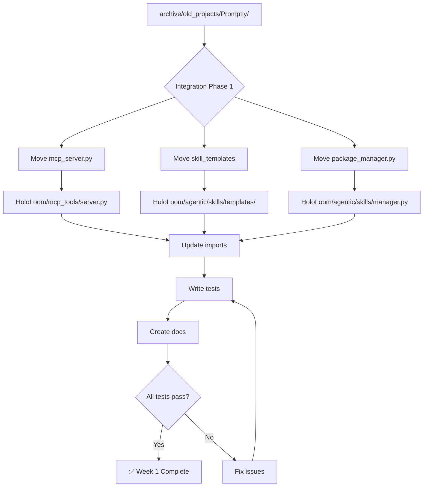
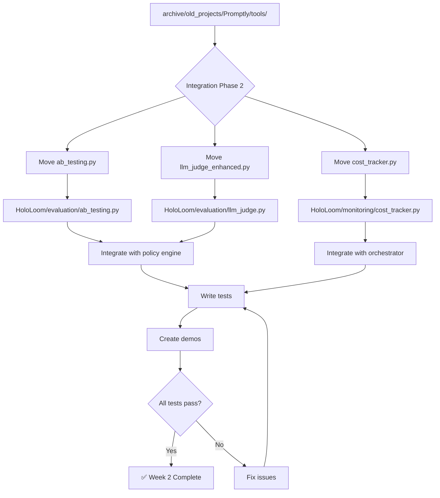
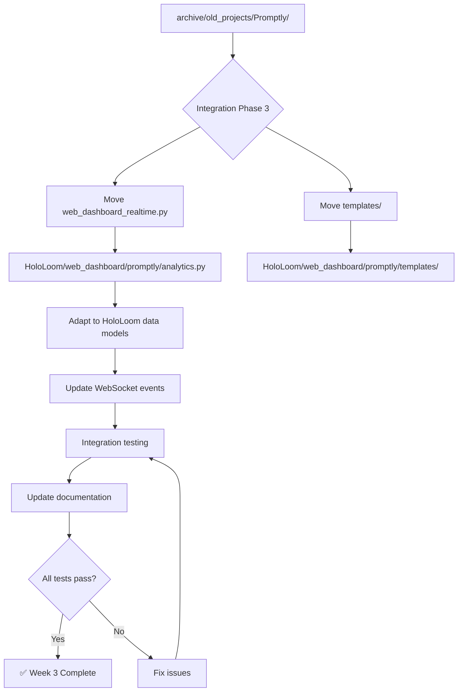

# Promptly Integration Roadmap

**Visual guide for Option B (Selective Integration)**

---

## Current State (Archive)

```
archive/old_projects/Promptly/
├── promptly/
│   ├── promptly.py (1,200 lines) - Version control
│   ├── recursive_loops.py (900 lines) - 6 loop types
│   ├── team_collaboration.py (400 lines) - Multi-user
│   ├── loop_composition.py (320 lines) - DSL
│   ├── web_dashboard_realtime.py (500 lines) - WebSocket
│   │
│   ├── integrations/
│   │   ├── hololoom_bridge.py (450 lines) - Memory integration
│   │   └── mcp_server.py (800 lines) - 27 MCP tools
│   │
│   └── tools/
│       ├── ab_testing.py (450 lines) - A/B framework
│       ├── llm_judge_enhanced.py (600 lines) - LLM-as-judge
│       ├── cost_tracker.py (400 lines) - Cost tracking
│       └── prompt_analytics.py (470 lines) - Analytics
│
├── demos/ (15 demo files)
└── docs/ (20+ documentation files)

Total: 17,000 lines (50+ files)
```

---

## Target State (After Integration)

### HoloLoom Structure (Integrated Features)

```
HoloLoom/
├── mcp_tools/                    ← NEW FROM PROMPTLY
│   ├── __init__.py
│   ├── server.py (800 lines)
│   ├── tools/
│   │   ├── prompt_tools.py       # 10 prompt management tools
│   │   ├── chain_tools.py        # 5 chain composition tools
│   │   ├── eval_tools.py         # 7 evaluation tools
│   │   └── analytics_tools.py    # 5 analytics tools
│   ├── tests/
│   │   └── test_mcp_tools.py
│   └── README.md
│
├── agentic/
│   └── skills/                   ← NEW FROM PROMPTLY
│       ├── __init__.py
│       ├── manager.py (from package_manager.py)
│       ├── templates/
│       │   ├── code_review.yaml
│       │   ├── bug_analysis.yaml
│       │   ├── refactoring.yaml
│       │   ├── documentation.yaml
│       │   └── ... (13 templates total)
│       ├── tests/
│       │   └── test_skills.py
│       └── README.md
│
├── evaluation/                   ← NEW MODULE
│   ├── __init__.py
│   ├── ab_testing.py (450 lines) ← FROM PROMPTLY
│   ├── llm_judge.py (600 lines)  ← FROM PROMPTLY
│   ├── tests/
│   │   ├── test_ab_testing.py
│   │   └── test_llm_judge.py
│   └── README.md
│
├── monitoring/                   ← ENHANCED
│   └── cost_tracker.py (400 lines) ← FROM PROMPTLY
│
└── web_dashboard/
    └── promptly/                 ← NEW FROM PROMPTLY
        ├── analytics.py (500 lines)
        ├── templates/
        │   └── dashboard_realtime.html
        └── README.md
```

### Promptly Structure (Remains Separate)

```
promptly/                         ← MOVED FROM ARCHIVE
├── promptly/
│   ├── promptly.py              # Version control (1,200 lines)
│   ├── team_collaboration.py    # Multi-user (400 lines)
│   ├── recursive_loops.py       # User-facing loops (900 lines)
│   ├── loop_composition.py      # DSL (320 lines)
│   ├── integrations/
│   │   └── hololoom_bridge.py   # Bridge to HoloLoom
│   └── tools/
│       └── prompt_analytics.py  # Analytics DB
│
├── demos/ (15 demo files)
├── docs/ (20+ documentation files)
├── tests/ (test files)
├── requirements.txt
└── README.md
```

---

## Integration Flow

### Week 1: MCP Tools + Skills



### Week 2: Evaluation Tools



### Week 3: Web Dashboard + Testing



---

## Feature Integration Matrix

| Promptly Feature | HoloLoom Destination | Integration | Effort |
|------------------|---------------------|-------------|--------|
| **MCP Tools (27)** | `mcp_tools/server.py` | Move + Update imports | 3 days |
| **Skills (13)** | `agentic/skills/` | Move + Create manager | 2 days |
| **A/B Testing** | `evaluation/ab_testing.py` | Move + Policy integration | 2 days |
| **LLM-as-Judge** | `evaluation/llm_judge.py` | Move + Agentic integration | 2 days |
| **Cost Tracker** | `monitoring/cost_tracker.py` | Move + Orchestrator hook | 1 day |
| **Web Dashboard** | `web_dashboard/promptly/` | Move + Data model adaptation | 3 days |
| **Analytics Bridge** | `analytics/promptly_bridge.py` | Create new | 1 day |
| **Tests** | `*/tests/` | Create new | 2 days |
| **Documentation** | `*/README.md` + CLAUDE.md | Create + Update | 2 days |

**Total Integration**: ~2,950 lines
**Total Effort**: 18 days (~3 weeks)

---

## Data Flow After Integration

### User Query Flow (with Promptly Features)

```
1. User Query
   ↓
2. HoloLoom Orchestrator
   ↓
3. Agentic Reasoning
   ├─→ Skills System (from Promptly)
   │   └─ Load skill template
   │   └─ Execute with context
   │
   └─→ Policy Engine
       ├─→ A/B Testing (from Promptly)
       │   └─ Compare strategies
       │
       └─→ LLM-as-Judge (from Promptly)
           └─ Evaluate quality
   ↓
4. Tool Execution
   ├─→ Cost Tracker (from Promptly)
   │   └─ Log API usage
   │
   └─→ MCP Tools (from Promptly)
       └─ 27 Claude Desktop tools
   ↓
5. Spacetime Result
   ↓
6. Web Dashboard (from Promptly)
   └─ Real-time WebSocket updates
```

### User Prompt Engineering Flow (Promptly CLI)

```
1. User: promptly add sql-opt "Optimize: {query}"
   ↓
2. Promptly CLI
   └─ Store in SQLite (version control)
   ↓
3. User: promptly loop refine sql-opt --iterations=5
   ↓
4. Promptly Recursive Loops
   ├─→ HoloLoom Bridge
   │   └─ Store results in HoloLoom memory
   │
   └─→ Quality scoring
   ↓
5. User: promptly analytics sql-opt
   ↓
6. Promptly Analytics
   └─ SQLite query + visualization
```

**Key Insight**: Two independent flows that complement each other:
- **HoloLoom Flow**: Agent-facing reasoning with Promptly features
- **Promptly Flow**: User-facing prompt engineering with HoloLoom storage

---

## Dependency Graph

### Before Integration (Separate)

```
Promptly ──────────────→ HoloLoom
(weak dependency)        (independent)
via hololoom_bridge.py
```

### After Integration (Unified)

```
HoloLoom
├── mcp_tools/          (no dependencies)
├── agentic/skills/     (depends on agentic/core.py)
├── evaluation/
│   ├── ab_testing.py   (depends on policy/)
│   └── llm_judge.py    (depends on weaving_orchestrator_llm.py)
└── monitoring/
    └── cost_tracker.py (depends on weaving_orchestrator.py)

Promptly
└── integrations/
    └── hololoom_bridge.py (depends on HoloLoom.memory)
```

**No circular dependencies**: HoloLoom doesn't depend on Promptly CLI

---

## Testing Strategy

### Unit Tests (Per Feature)

```bash
# MCP Tools
pytest HoloLoom/mcp_tools/tests/test_mcp_tools.py -v

# Skills System
pytest HoloLoom/agentic/skills/tests/test_skills.py -v
pytest HoloLoom/agentic/skills/tests/test_manager.py -v

# Evaluation
pytest HoloLoom/evaluation/tests/test_ab_testing.py -v
pytest HoloLoom/evaluation/tests/test_llm_judge.py -v

# Monitoring
pytest HoloLoom/monitoring/tests/test_cost_tracker.py -v
```

### Integration Tests

```bash
# Test Promptly features work in HoloLoom
pytest HoloLoom/tests/integration/test_promptly_integration.py -v

# Test HoloLoom still works without regressions
pytest HoloLoom/tests/integration/ -v
```

### End-to-End Tests

```bash
# Demo: Skills system
PYTHONPATH=. python demos/demo_skills_system.py

# Demo: A/B testing
PYTHONPATH=. python demos/demo_ab_testing.py

# Demo: LLM-as-judge
PYTHONPATH=. python demos/demo_llm_judge.py

# Demo: Full integration
PYTHONPATH=. python demos/demo_promptly_integration.py
```

### Promptly CLI Tests (Verify Still Works)

```bash
cd promptly/
python QUICK_TEST.py  # Should still pass after integration
```

---

## Documentation Updates

### New Documentation Files

1. **`HoloLoom/mcp_tools/README.md`** (new)
   - 27 MCP tools reference
   - Installation for Claude Desktop
   - Usage examples

2. **`HoloLoom/agentic/skills/README.md`** (new)
   - 13 skill templates reference
   - How to create custom skills
   - Integration with agentic reasoning

3. **`HoloLoom/evaluation/README.md`** (new)
   - A/B testing guide
   - LLM-as-judge API reference
   - Quality scoring examples

4. **`promptly/README.md`** (update)
   - Update to reflect new location (not archive)
   - Add integration examples with HoloLoom
   - Update installation instructions

### Updates to Existing Files

1. **`CLAUDE.md`** (update)
   - Add "Promptly Integration" section
   - Document MCP tools, skills, evaluation
   - Update architecture diagrams

2. **`VISUAL_QUICK_START.md`** (update)
   - Add learning path for Promptly features
   - Visual diagrams for skills system
   - MCP tools quickstart

3. **`HOLOLOOM_MASTER_SCOPE_AND_SEQUENCE.md`** (update)
   - Add Phase 6: Promptly Integration
   - Update deliverables count
   - Update learning sequence

---

## Migration Checklist

### Pre-Migration (Day 0)

- [ ] Backup entire `archive/old_projects/Promptly/` directory
- [ ] Create new branch: `feature/promptly-integration`
- [ ] Run HoloLoom test suite (baseline)
- [ ] Run Promptly test suite (baseline)

### Week 1: MCP Tools + Skills

**Day 1-3: MCP Tools**
- [ ] Create `HoloLoom/mcp_tools/` directory
- [ ] Move `mcp_server.py` → `HoloLoom/mcp_tools/server.py`
- [ ] Update all imports
- [ ] Create `HoloLoom/mcp_tools/README.md`
- [ ] Write tests: `test_mcp_tools.py`
- [ ] Test with Claude Desktop
- [ ] Run HoloLoom test suite (verify no regressions)

**Day 4-5: Skills System**
- [ ] Create `HoloLoom/agentic/skills/` directory
- [ ] Move `skill_templates_extended.py` → `HoloLoom/agentic/skills/`
- [ ] Move `package_manager.py` → `HoloLoom/agentic/skills/manager.py`
- [ ] Move 13 skill templates to `templates/`
- [ ] Create `HoloLoom/agentic/skills/README.md`
- [ ] Write tests: `test_skills.py`, `test_manager.py`
- [ ] Create demo: `demos/demo_skills_system.py`
- [ ] Run HoloLoom test suite (verify no regressions)

### Week 2: Evaluation Tools

**Day 1-2: A/B Testing**
- [ ] Create `HoloLoom/evaluation/` directory
- [ ] Move `ab_testing.py` → `HoloLoom/evaluation/ab_testing.py`
- [ ] Integrate with policy engine
- [ ] Create `HoloLoom/evaluation/README.md`
- [ ] Write tests: `test_ab_testing.py`
- [ ] Create demo: `demos/demo_ab_testing.py`
- [ ] Run HoloLoom test suite (verify no regressions)

**Day 3-4: LLM-as-Judge**
- [ ] Move `llm_judge_enhanced.py` → `HoloLoom/evaluation/llm_judge.py`
- [ ] Integrate with agentic reasoning
- [ ] Write tests: `test_llm_judge.py`
- [ ] Create demo: `demos/demo_llm_judge.py`
- [ ] Run HoloLoom test suite (verify no regressions)

**Day 5: Cost Tracker**
- [ ] Move `cost_tracker.py` → `HoloLoom/monitoring/cost_tracker.py`
- [ ] Integrate with weaving orchestrator
- [ ] Add Prometheus metrics export
- [ ] Write tests: `test_cost_tracker.py`
- [ ] Run HoloLoom test suite (verify no regressions)

### Week 3: Web Dashboard + Testing

**Day 1-3: Dashboard**
- [ ] Create `HoloLoom/web_dashboard/promptly/` directory
- [ ] Move `web_dashboard_realtime.py` → `analytics.py`
- [ ] Move templates to `promptly/templates/`
- [ ] Adapt to HoloLoom data models (Spacetime, etc.)
- [ ] Update WebSocket events
- [ ] Test real-time updates
- [ ] Create `README.md`

**Day 4: Analytics Bridge**
- [ ] Create `HoloLoom/analytics/promptly_bridge.py`
- [ ] Export HoloLoom executions to Promptly format
- [ ] Test cross-system queries
- [ ] Write tests: `test_promptly_bridge.py`

**Day 5: Integration Testing**
- [ ] Run all unit tests
- [ ] Run all integration tests
- [ ] Test Promptly CLI (verify still works)
- [ ] Run end-to-end demos
- [ ] Fix any issues found

### Post-Migration (Day 16-18)

**Documentation**
- [ ] Update `CLAUDE.md` (add Promptly Integration section)
- [ ] Update `VISUAL_QUICK_START.md` (add Promptly features)
- [ ] Update `HOLOLOOM_MASTER_SCOPE_AND_SEQUENCE.md` (add Phase 6)
- [ ] Create `PROMPTLY_INTEGRATION_COMPLETE.md` (summary)

**Final Verification**
- [ ] All HoloLoom tests passing
- [ ] All new tests passing
- [ ] Promptly CLI tests passing
- [ ] All demos working
- [ ] Documentation up to date
- [ ] Code review complete

**Deployment**
- [ ] Merge `feature/promptly-integration` → `master`
- [ ] Tag release: `v1.1.0-promptly-integration`
- [ ] Update README.md
- [ ] Announce integration

---

## Success Metrics

### Code Metrics
- ✅ ~2,950 lines integrated into HoloLoom
- ✅ 5 new HoloLoom modules (mcp_tools, skills, evaluation, monitoring enhancement, dashboard)
- ✅ ~14,000 lines remain in Promptly CLI
- ✅ Zero code duplication

### Functionality Metrics
- ✅ 27 MCP tools working in HoloLoom
- ✅ 13 skill templates loadable
- ✅ A/B testing compares strategies
- ✅ LLM-as-judge evaluates responses
- ✅ Cost tracking integrated
- ✅ Web dashboard shows HoloLoom metrics

### Quality Metrics
- ✅ All tests passing (unit + integration + e2e)
- ✅ No regressions in HoloLoom
- ✅ Promptly CLI still works
- ✅ Documentation complete and up-to-date

### User Experience Metrics
- ✅ Clear separation: HoloLoom (agents) vs Promptly (users)
- ✅ Seamless integration (no breaking changes)
- ✅ Easy to use (good documentation + demos)

---

**Ready to start Week 1?** 🚀
