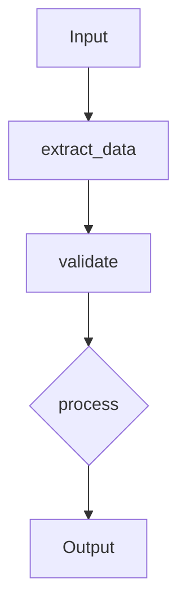

# Advanced Chain Processing for Promptly

Complete guide to building powerful workflow engines with conditional logic, parallel execution, loops, retry mechanisms, and data transformation.

## Table of Contents

1. [Overview](#overview)
2. [Processors](#processors)
3. [Chain DSL](#chain-dsl)
4. [Visualization](#visualization)
5. [Execution Tracing](#execution-tracing)
6. [Example Workflows](#example-workflows)
7. [API Reference](#api-reference)
8. [Best Practices](#best-practices)

## Overview

Promptly's advanced chain processing transforms simple sequential prompt execution into a powerful workflow engine supporting:

- **Conditional Logic**: If/else/elif branching based on outputs
- **Parallel Execution**: Concurrent task execution with aggregation
- **Loop Patterns**: For-each, while, map/reduce operations
- **Retry Mechanisms**: Exponential backoff and circuit breakers
- **Data Transformation**: Extract, convert, validate, and sanitize data
- **YAML DSL**: Declarative workflow definitions
- **Visualization**: Graph and trace visualization
- **Tracing**: Detailed execution monitoring and debugging

## Processors

### ConditionalProcessor

Execute different branches based on conditions.

#### Features

- **Pattern Types**: regex, keyword, numeric, custom predicates
- **Operators**: gt, lt, eq, ne, ge, le
- **Short-circuit Evaluation**: Stop at first match
- **Nested Conditions**: Complex decision trees

#### Example

```python
from promptly.plugins.processors import ConditionalProcessor

processor = ConditionalProcessor()

config = {
    "conditions": [
        {
            "type": "numeric",
            "field": "score",
            "operator": "gt",
            "value": 0.7,
            "action": {
                "type": "set",
                "field": "result",
                "value": "high_quality"
            }
        },
        {
            "type": "regex",
            "field": "output",
            "pattern": r"error|failed",
            "action": {
                "type": "set",
                "field": "status",
                "value": "error"
            }
        }
    ],
    "default": {
        "type": "set",
        "field": "result",
        "value": "unknown"
    },
    "short_circuit": true
}

result = processor.process(input_data, config)
```

#### YAML Configuration

```yaml
- name: classify_quality
  type: conditional
  config:
    conditions:
      - type: numeric
        field: confidence_score
        operator: gt
        value: 0.8
        action:
          type: set
          field: quality
          value: "excellent"
      - type: keyword
        field: output
        keywords: ["error", "failed", "invalid"]
        action:
          type: set
          field: status
          value: "error"
    default:
      type: set
      field: quality
      value: "acceptable"
```

### ParallelProcessor

Execute multiple tasks concurrently with result aggregation.

#### Features

- **Aggregation Strategies**: concat, voting, weighted, first, all, best
- **Error Handling**: fail-fast, best-effort, retry, fallback
- **Timeout Management**: Per-task timeouts
- **Thread Pool**: Configurable worker count

#### Example

```python
from promptly.plugins.processors import ParallelProcessor

processor = ParallelProcessor()
processor.set_executor(your_model_function)

config = {
    "tasks": [
        {
            "name": "task1",
            "prompt": "Analyze from perspective A: {input}",
            "inputs": {"perspective": "A"}
        },
        {
            "name": "task2",
            "prompt": "Analyze from perspective B: {input}",
            "inputs": {"perspective": "B"}
        }
    ],
    "aggregation": "concat",
    "error_strategy": "best_effort",
    "timeout": 30.0,
    "max_workers": 5
}

result = processor.process(input_data, config)
```

#### YAML Configuration

```yaml
- name: multi_perspective_analysis
  type: parallel
  config:
    tasks:
      - name: technical_analysis
        prompt: "Technical analysis: {query}"
      - name: business_analysis
        prompt: "Business analysis: {query}"
      - name: user_analysis
        prompt: "User perspective: {query}"
    aggregation: all
    error_strategy: best_effort
    timeout: 30.0
    max_workers: 3
```

### LoopProcessor

Execute iterative operations over collections.

#### Features

- **Loop Types**: for_each, while, map, reduce, accumulate
- **Break/Continue**: Control flow within loops
- **Max Iterations**: Safety limits
- **Accumulator Patterns**: Collect results across iterations

#### Example

```python
from promptly.plugins.processors import LoopProcessor

processor = LoopProcessor()

config = {
    "loop_type": "for_each",
    "items": "documents",
    "max_iterations": 100,
    "action": {
        "type": "process",
        "prompt": "Summarize: {item}"
    },
    "accumulator": "summaries",
    "break_on": {
        "type": "numeric",
        "field": "confidence",
        "operator": "lt",
        "value": 0.5
    }
}

result = processor.process(input_data, config)
```

#### Map/Reduce Example

```python
# Map operation
map_config = {
    "loop_type": "map",
    "items": "documents",
    "action": {
        "type": "extract",
        "field": "title"
    }
}

# Reduce operation
reduce_config = {
    "loop_type": "reduce",
    "items": "numbers",
    "reduce_function": "sum",
    "initial_value": 0
}
```

#### YAML Configuration

```yaml
- name: process_documents
  type: loop
  config:
    loop_type: for_each
    items: documents
    max_iterations: 1000
    action:
      type: summarize
      prompt: "Summarize this document: {item}"
    accumulator: summaries
    break_on:
      field: error_count
      operator: gt
      value: 5
```

### RetryProcessor

Execute with retry logic, circuit breaker, and rate limiting.

#### Features

- **Backoff Strategies**: constant, linear, exponential, fibonacci, jitter
- **Circuit Breaker**: Prevent cascading failures
- **Rate Limiting**: Token bucket algorithm
- **Fallback**: Graceful degradation

#### Example

```python
from promptly.plugins.processors import RetryProcessor

processor = RetryProcessor()

config = {
    "max_attempts": 5,
    "backoff_strategy": "exponential",
    "initial_delay": 1.0,
    "max_delay": 60.0,
    "backoff_multiplier": 2.0,
    "circuit_breaker": {
        "enabled": true,
        "failure_threshold": 5,
        "success_threshold": 2,
        "timeout": 60.0
    },
    "rate_limit": {
        "enabled": true,
        "requests_per_second": 10,
        "burst_size": 20
    },
    "action": {
        "type": "execute",
        "prompt": "Process: {input}"
    },
    "fallback": {
        "type": "set",
        "value": "Service temporarily unavailable"
    }
}

result = processor.process(input_data, config)
```

#### YAML Configuration

```yaml
- name: api_call_with_retry
  type: retry
  config:
    max_attempts: 3
    backoff_strategy: exponential
    initial_delay: 1.0
    circuit_breaker:
      enabled: true
      failure_threshold: 5
      timeout: 60.0
    action:
      type: execute
      prompt: "Call API: {endpoint}"
    fallback:
      type: set
      value: "API unavailable"
```

### TransformProcessor

Extract, convert, validate, and sanitize data.

#### Features

- **Extraction Methods**: JSON, regex, split, CSV, key-value
- **Format Conversion**: JSON, YAML, CSV, XML
- **Validation**: Type checking, regex, range, custom validators
- **Sanitization**: HTML escape, whitespace, special chars

#### Example

```python
from promptly.plugins.processors import TransformProcessor

processor = TransformProcessor()

# Extract JSON
extract_config = {
    "transform_type": "extract",
    "method": "json",
    "source_field": "output",
    "target_field": "data"
}

# Validate
validate_config = {
    "transform_type": "validate",
    "source_field": "email",
    "validation_rules": [
        {"type": "required"},
        {"type": "regex", "pattern": r"^[\w\.-]+@[\w\.-]+\.\w+$"}
    ]
}

# Sanitize
sanitize_config = {
    "transform_type": "sanitize",
    "source_field": "user_input",
    "sanitize_rules": [
        {"type": "html_escape"},
        {"type": "normalize_whitespace"},
        {"type": "truncate", "max_length": 500}
    ]
}
```

#### YAML Configuration

```yaml
- name: extract_and_validate
  type: transform
  config:
    transform_type: extract
    method: json
    source_field: api_response
    target_field: parsed_data

- name: validate_data
  type: transform
  depends_on: [extract_and_validate]
  config:
    transform_type: validate
    source_field: parsed_data
    validation_rules:
      - type: required
      - type: type
        expected_type: dict
```

## Chain DSL

Define workflows declaratively using YAML.

### Basic Structure

```yaml
name: workflow_name
description: Workflow description
version: "1.0"

variables:
  timeout: 30
  max_retries: 3

steps:
  - name: step1
    type: processor_type
    config:
      # processor configuration
    depends_on: []
    condition:
      type: simple
      field: some_field
      operator: eq
      value: some_value
```

### Example Workflow

```yaml
name: data_processing_pipeline
description: Extract, validate, and process data
version: "1.0"

variables:
  quality_threshold: 0.7

steps:
  # Extract
  - name: extract_data
    type: transform
    config:
      transform_type: extract
      method: json
      source_field: input

  # Validate
  - name: validate
    type: transform
    depends_on: [extract_data]
    config:
      transform_type: validate
      source_field: data
      validation_rules:
        - type: required

  # Conditional processing
  - name: process
    type: conditional
    depends_on: [validate]
    config:
      conditions:
        - type: keyword
          field: is_valid
          keywords: ["true"]
          action:
            type: execute
            prompt: "Process: {data}"
```

### Using Chain DSL

```python
from promptly.chain_dsl import ChainDSL

dsl = ChainDSL()

# Load from file
chain_def = dsl.load_chain("workflow.yaml")

# Load from string
chain_def = dsl.load_chain_from_string(yaml_string)

# Validate
validation = dsl.validate_chain(chain_def)
if not validation['valid']:
    print(f"Errors: {validation['errors']}")

# Execute
result = dsl.execute_chain(chain_def, initial_input)

# Access results
print(result['final_output'])
print(result['trace'])
```

## Visualization

Visualize workflows and execution traces.

### Chain Visualization

```python
from promptly.chain_visualization import visualize_chain

# Mermaid diagram
mermaid = visualize_chain(chain_def, format="mermaid")
print(mermaid)

# Graphviz DOT
dot = visualize_chain(chain_def, format="graphviz")

# ASCII art
ascii_art = visualize_chain(chain_def, format="ascii")

# JSON
json_graph = visualize_chain(chain_def, format="json")
```

### Mermaid Output



### Trace Visualization

```python
from promptly.chain_visualization import visualize_trace

# Timeline
timeline = visualize_trace(trace, format="timeline")
print(timeline)

# HTML report
html = visualize_trace(trace, format="html")

# JSON summary
json_trace = visualize_trace(trace, format="json")
```

## Execution Tracing

Monitor and debug chain execution.

### Basic Tracing

```python
from promptly.chain_tracing import create_tracer

# Create tracer
tracer = create_tracer(trace_level="standard")

# Start execution
tracer.start_execution()

# Trace steps
tracer.start_step("step1", "transform", input_data)
# ... execute step ...
tracer.end_step("step1", "completed", output_data)

# End execution
tracer.end_execution()

# Get summary
summary = tracer.get_summary()
print(f"Duration: {summary['total_duration']}")
print(f"Completed: {summary['completed']}/{summary['total_steps']}")

# Export trace
json_trace = tracer.export_trace(format="json")
markdown_report = tracer.export_trace(format="markdown")
```

### Trace Levels

- **minimal**: Only step names and status
- **standard**: + timing and basic results
- **detailed**: + full inputs/outputs
- **debug**: + internal processor state

### Performance Metrics

```python
metrics = tracer.get_performance_metrics()

print(f"Total duration: {metrics['total_duration']}")
print(f"Slowest steps: {metrics['slowest_steps']}")
print(f"Processor stats: {metrics['processor_stats']}")
```

## Example Workflows

### RAG Pipeline

Advanced retrieval-augmented generation with multi-source retrieval, reranking, and fallbacks.

**File**: `/home/user/hello-world/Promptly/examples/workflows/rag_pipeline.yaml`

**Features**:
- Parallel retrieval from multiple sources
- Reranking with retry logic
- Threshold-based filtering
- Conditional response generation
- Fallback for insufficient context

### A/B Testing

Statistical A/B testing framework for prompt variants.

**File**: `/home/user/hello-world/Promptly/examples/workflows/ab_testing.yaml`

**Features**:
- Parallel variant execution
- Statistical significance testing
- Effect size calculation
- Automated recommendations
- Detailed reporting

### Multi-Agent System

Multi-agent workflow with coordinator, specialists, and consensus building.

**File**: `/home/user/hello-world/Promptly/examples/workflows/multi_agent.yaml`

**Features**:
- Coordinator task analysis
- Parallel specialist agents
- Iterative consensus building
- Voting fallback mechanism
- Execution reporting

## API Reference

### Processors

#### ConditionalProcessor

```python
processor = ConditionalProcessor()

# Register custom predicate
processor.register_predicate("is_valid_email", email_validator_fn)

# Process
result = processor.process(input_data, config)
```

#### ParallelProcessor

```python
processor = ParallelProcessor()

# Set executor
processor.set_executor(model_function)

# Set scoring function (for BEST aggregation)
processor.set_scoring_function(scoring_fn)

# Process
result = processor.process(input_data, config)
```

#### LoopProcessor

```python
processor = LoopProcessor()

# Register custom reduce function
processor.register_reduce_function("custom_reduce", reduce_fn)

# Process
result = processor.process(input_data, config)
```

#### RetryProcessor

```python
processor = RetryProcessor()

# Get circuit breaker state
state = processor.get_circuit_state("circuit_key")

# Reset circuit
processor.reset_circuit("circuit_key")

# Process
result = processor.process(input_data, config)
```

#### TransformProcessor

```python
processor = TransformProcessor()

# Register custom validator
processor.register_validator("custom_validator", validator_fn)

# Register custom sanitizer
processor.register_sanitizer("custom_sanitizer", sanitizer_fn)

# Register custom converter
processor.register_converter("custom_format", converter_fn)

# Process
result = processor.process(input_data, config)
```

### Chain DSL

```python
dsl = ChainDSL()

# Register custom processor
dsl.register_processor("custom", CustomProcessor())

# Set executor
dsl.set_executor(model_function)

# Load chain
chain_def = dsl.load_chain("workflow.yaml")

# Validate chain
validation = dsl.validate_chain(chain_def)

# Execute chain
result = dsl.execute_chain(chain_def, initial_input, context)

# Export chain
dsl.export_chain(chain_def, "output.yaml")
```

### Visualization

```python
from promptly.chain_visualization import ChainVisualizer, ExecutionTraceVisualizer

# Chain visualizer
visualizer = ChainVisualizer()
visualizer.build_graph_from_chain(chain_def)

mermaid = visualizer.to_mermaid()
graphviz = visualizer.to_graphviz()
ascii_art = visualizer.to_ascii()
json_graph = visualizer.to_json()

# Trace visualizer
trace_viz = ExecutionTraceVisualizer()
timeline = trace_viz.trace_to_timeline(trace)
html = trace_viz.trace_to_html(trace)
json_trace = trace_viz.trace_to_json(trace)
```

### Tracing

```python
from promptly.chain_tracing import ExecutionTracer, PerformanceMonitor

# Tracer
tracer = ExecutionTracer(trace_level=TraceLevel.STANDARD)

tracer.start_execution()
tracer.start_step(name, type, input_data)
tracer.add_event("custom_event", {"data": "value"})
tracer.end_step(name, status, output_data, error)
tracer.end_execution()

# Register event handler
tracer.register_event_handler(handler_fn)

# Get results
summary = tracer.get_summary()
metrics = tracer.get_performance_metrics()
trace = tracer.get_trace()

# Export
json_export = tracer.export_trace(format="json")

# Performance monitor
monitor = PerformanceMonitor()
monitor.measure("operation", duration)
stats = monitor.get_stats("operation")
bottlenecks = monitor.detect_bottlenecks(threshold_multiplier=2.0)
```

## Best Practices

### 1. Error Handling

Always include error handling and fallbacks:

```yaml
- name: api_call
  type: retry
  config:
    max_attempts: 3
    backoff_strategy: exponential
    fallback:
      type: set
      value: "Service unavailable"
```

### 2. Timeouts

Set appropriate timeouts for external operations:

```yaml
- name: parallel_requests
  type: parallel
  config:
    timeout: 30.0
    error_strategy: best_effort
```

### 3. Validation

Validate data at workflow boundaries:

```yaml
- name: validate_input
  type: transform
  config:
    transform_type: validate
    validation_rules:
      - type: required
      - type: type
        expected_type: dict
```

### 4. Circuit Breakers

Use circuit breakers for unreliable services:

```yaml
- name: external_service
  type: retry
  config:
    circuit_breaker:
      enabled: true
      failure_threshold: 5
      timeout: 60.0
```

### 5. Tracing

Enable tracing for production workflows:

```python
tracer = create_tracer(trace_level="standard")
# ... execute chain ...
metrics = tracer.get_performance_metrics()

# Log slow steps
for step in metrics['slowest_steps']:
    if step['duration'] > 5.0:
        logger.warning(f"Slow step: {step['name']} - {step['duration']:.2f}s")
```

### 6. Resource Limits

Set limits to prevent runaway execution:

```yaml
- name: loop_processing
  type: loop
  config:
    max_iterations: 1000
    break_on:
      field: error_count
      operator: gt
      value: 10
```

### 7. Parallel Execution

Balance concurrency and resource usage:

```yaml
- name: batch_processing
  type: parallel
  config:
    max_workers: 5  # Don't overwhelm system
    timeout: 30.0
    error_strategy: best_effort
```

### 8. Monitoring

Monitor circuit breaker and rate limiter state:

```python
circuit_state = retry_processor.get_circuit_state()
if circuit_state['state'] == 'open':
    logger.error("Circuit breaker opened - service degraded")
```

### 9. Testing

Test workflows with mock executors:

```python
def mock_executor(prompt, inputs):
    return f"Mock response for: {prompt}"

dsl = ChainDSL()
dsl.set_executor(mock_executor)
result = dsl.execute_chain(chain_def, test_input)
```

### 10. Documentation

Document complex workflows:

```yaml
name: complex_workflow
description: |
  This workflow implements a multi-stage data processing pipeline:
  1. Extract and validate input
  2. Parallel processing across multiple models
  3. Consensus building through voting
  4. Quality checks and fallbacks

variables:
  # Maximum retries for API calls
  max_retries: 3
  # Quality threshold for output
  quality_threshold: 0.7
```

## Running the Demo

Execute the comprehensive demo:

```bash
cd /home/user/hello-world/Promptly
python examples/chain_processing_demo.py
```

This demonstrates all processors, DSL features, visualization, and tracing capabilities.

## Additional Resources

- **Examples**: `/home/user/hello-world/Promptly/examples/workflows/`
- **Demo Script**: `/home/user/hello-world/Promptly/examples/chain_processing_demo.py`
- **Source Code**: `/home/user/hello-world/Promptly/promptly/plugins/processors/`

## License

See main Promptly LICENSE file.

## Contributing

Contributions welcome! Please see CONTRIBUTING.md for guidelines.
