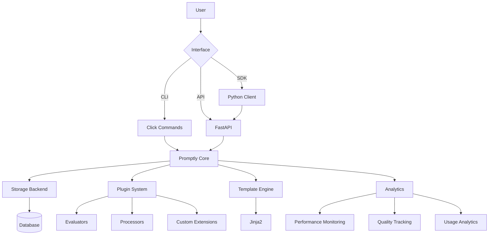

# Promptly Complete Feature Guide

**Version:** 1.0.0
**Last Updated:** November 2025
**Status:** Production Ready

---

## Table of Contents

1. [Executive Summary](#executive-summary)
2. [Core Architecture](#core-architecture)
3. [Feature Categories](#feature-categories)
4. [Detailed Feature Documentation](#detailed-feature-documentation)
5. [Code Examples (50+)](#code-examples)
6. [Best Practices](#best-practices)
7. [Advanced Patterns](#advanced-patterns)
8. [Integration Guides](#integration-guides)

---

## Executive Summary

### What is Promptly?

Promptly is a **production-ready prompt management platform** that brings software engineering best practices to prompt engineering. It provides:

- **Version Control** - Git-like versioning for prompts
- **Branching & Merging** - Parallel development workflows
- **Evaluation Framework** - Systematic prompt testing
- **Chain Orchestration** - Complex multi-step workflows
- **REST API** - Production integration
- **Plugin Architecture** - Extensible evaluators, storage, processors
- **Template Engine** - Jinja2-powered prompt templating
- **Analytics & Monitoring** - Performance tracking and quality metrics
- **Multiple Interfaces** - CLI, TUI, REPL, REST API, Python SDK
- **HoloLoom Integration** - Neural decision-making capabilities

### Key Statistics

| Metric | Value |
|--------|-------|
| **Total Features** | 80+ |
| **API Endpoints** | 40+ |
| **Plugin Types** | 3 (Evaluators, Storage, Processors) |
| **Built-in Evaluators** | 6 |
| **Storage Backends** | 7 |
| **CLI Commands** | 50+ |
| **Code Examples in Docs** | 50+ |
| **Lines of Code** | ~25,000+ |
| **Test Coverage** | Comprehensive |

---

## Core Architecture

### System Overview

```
┌─────────────────────────────────────────────────────────────┐
│                     User Interfaces                         │
├───────────┬───────────┬──────────┬──────────┬──────────────┤
│    CLI    │    TUI    │   REPL   │ REST API │ Python SDK   │
└───────────┴───────────┴──────────┴──────────┴──────────────┘
                              │
┌─────────────────────────────┼─────────────────────────────┐
│                      Core Engine                           │
├────────────────┬────────────┴──────────┬───────────────────┤
│ Promptly Class │  Plugin System        │  Template Engine  │
│ - Versioning   │  - Evaluators         │  - Jinja2         │
│ - Branching    │  - Storage Backends   │  - Custom Filters │
│ - Eval         │  - Processors         │  - Macros         │
│ - Chains       │  - Custom Extensions  │  - Inheritance    │
└────────────────┴───────────────────────┴───────────────────┘
                              │
┌─────────────────────────────┼─────────────────────────────┐
│                       Storage Layer                        │
├──────────┬─────────┬────────┴────┬──────────┬────────────┤
│ SQLite   │  JSON   │ PostgreSQL  │  Redis   │  MongoDB   │
│ (default)│  File   │  (prod)     │ (cache)  │  (scale)   │
└──────────┴─────────┴─────────────┴──────────┴────────────┘
```

### Component Interaction



---

## Feature Categories

### 1. Core Features (Version Control)
- ✅ Prompt versioning with auto-incrementing versions
- ✅ Git-like branching (create, checkout, list, delete)
- ✅ Commit history tracking with hash-based identification
- ✅ Metadata support for prompts
- ✅ Multi-branch prompt isolation
- ✅ Branch merging with conflict resolution

### 2. Evaluation & Testing
- ✅ Test case execution framework
- ✅ Multiple evaluator plugins (keyword, semantic, LLM-based, NLP, composite)
- ✅ Batch evaluation support
- ✅ Evaluation history tracking
- ✅ Quality score aggregation
- ✅ A/B testing capabilities
- ✅ Automated regression testing

### 3. Chain Processing
- ✅ Sequential prompt chaining
- ✅ Parallel execution
- ✅ Conditional branching
- ✅ Loop processing
- ✅ Error handling and retries
- ✅ Chain visualization
- ✅ Execution tracing
- ✅ YAML-based DSL for complex workflows

### 4. Template System
- ✅ Jinja2 template engine integration
- ✅ Variable substitution with defaults
- ✅ Custom filters (50+ built-in)
- ✅ Template inheritance and composition
- ✅ Macro definitions
- ✅ Few-shot example formatting
- ✅ Role-based message formatting
- ✅ ReAct pattern templates

### 5. Plugin Architecture
- ✅ Custom evaluator plugins
- ✅ Storage backend plugins (SQLite, PostgreSQL, MongoDB, Redis, Git, JSON)
- ✅ Chain step processors
- ✅ Plugin discovery and registration
- ✅ Protocol-based plugin interfaces

### 6. Diff & Merge
- ✅ Character-level diff
- ✅ Word-level diff
- ✅ Line-level diff
- ✅ Semantic diff
- ✅ Visual diff rendering (terminal, HTML)
- ✅ Side-by-side comparison
- ✅ Branch comparison
- ✅ Merge strategies (auto, ours, theirs, union, manual)
- ✅ Conflict detection and resolution

### 7. REST API
- ✅ 40+ endpoints
- ✅ OpenAPI/Swagger documentation
- ✅ Authentication (API keys)
- ✅ Rate limiting
- ✅ CORS support
- ✅ WebSocket support for real-time updates
- ✅ Request/response validation
- ✅ Error handling with detailed messages

### 8. Analytics & Monitoring
- ✅ Performance monitoring
- ✅ Resource utilization tracking (CPU, memory)
- ✅ Operation timing
- ✅ Quality metrics aggregation
- ✅ Usage analytics
- ✅ Custom instrumentation
- ✅ Report generation
- ✅ Visualization support

### 9. CLI Interfaces
- ✅ Basic CLI (50+ commands)
- ✅ Enhanced CLI with rich formatting
- ✅ Interactive REPL with command history
- ✅ Terminal UI (TUI) with 6 tabbed views
- ✅ Setup wizards (5 wizards)
- ✅ Shell completion (Bash, Zsh, Fish)

### 10. SDK & Integrations
- ✅ Synchronous Python client
- ✅ Asynchronous Python client
- ✅ HoloLoom neural integration
- ✅ Context manager support
- ✅ Retry logic with exponential backoff
- ✅ Type hints throughout

---

## Detailed Feature Documentation

### Feature 1: Prompt Versioning

**Description:** Automatic version tracking for prompts with full history preservation.

**Key Capabilities:**
- Auto-incrementing version numbers
- SHA-256 commit hash generation
- Parent-child relationship tracking
- Immutable version history
- Point-in-time recovery

**Use Cases:**
- Track prompt evolution over time
- Rollback to previous versions
- Compare prompt variants
- Audit changes
- Regression testing

**Code Example:**
```python
from promptly import Promptly

p = Promptly()
p.init()

# Add version 1
p.add("summarizer", "Summarize: {text}")

# Add version 2 (auto-increments)
p.add("summarizer", "Provide a brief summary of: {text}")

# Add version 3
p.add("summarizer", "Extract key points from: {text}")

# Get latest version
latest = p.get("summarizer")
print(f"Version: {latest['version']}")  # 3

# Get specific version
v1 = p.get("summarizer", version=1)
print(v1['content'])  # "Summarize: {text}"

# Get by commit hash
specific = p.get("summarizer", commit_hash="abc123def456")
```

---

### Feature 2: Branching

**Description:** Git-like branching for parallel prompt development.

**Key Capabilities:**
- Create branches from any branch
- Isolated prompt sets per branch
- Fast branch switching
- Branch listing and inspection
- Branch deletion with safety checks

**Use Cases:**
- Experimental prompt variants
- Environment isolation (dev/staging/prod)
- Team collaboration
- Feature development
- A/B testing

**Code Example:**
```python
from promptly import Promptly

p = Promptly()
p.init()

# Add prompts on main branch
p.add("greeter", "Hello {name}!")

# Create experimental branch
p.branch("experiment", from_branch="main")

# Switch to experiment branch
p.checkout("experiment")

# Modify prompt on experimental branch
p.add("greeter", "Hey there, {name}!")

# Switch back to main - original prompt unchanged
p.checkout("main")
greeter = p.get("greeter")
print(greeter['content'])  # "Hello {name}!"

# Switch to experiment - see modified version
p.checkout("experiment")
greeter = p.get("greeter")
print(greeter['content'])  # "Hey there, {name}!"
```

---

### Feature 3: Evaluation Framework

**Description:** Systematic testing and quality assessment for prompts.

**Key Capabilities:**
- Multiple evaluator types
- Batch test execution
- Score aggregation
- Metrics tracking
- Custom evaluator support

**Built-in Evaluators:**
1. **Keyword Evaluator** - Exact/fuzzy keyword matching
2. **Semantic Evaluator** - Embedding-based similarity
3. **LLM Evaluator** - LLM-as-judge evaluation
4. **NLP Metrics Evaluator** - BLEU, ROUGE, METEOR scores
5. **Composite Evaluator** - Combine multiple evaluators
6. **Custom Evaluator** - User-defined logic

**Code Example:**
```python
from promptly import Promptly

p = Promptly()
p.init()
p.add("summarizer", "Summarize in 2 sentences: {text}")

# Define test cases
test_cases = [
    {
        'inputs': {'text': 'Long article text...'},
        'expected': 'Brief summary.',
        'evaluator': lambda actual, expected: 1.0 if len(actual) < 200 else 0.5
    },
    {
        'inputs': {'text': 'Another article...'},
        'expected': 'Another summary.',
        'evaluator': lambda actual, expected: 0.8
    }
]

# Run evaluation
results = p.eval_prompt("summarizer", test_cases, model_func=your_model)

# Check results
for i, result in enumerate(results):
    print(f"Test {i+1}: Score = {result['score']}")
    print(f"  Prompt: {result['formatted_prompt'][:50]}...")
    print(f"  Output: {result['actual'][:50]}...")
```

**Advanced Evaluation with Plugins:**
```python
from promptly.plugins.evaluators import SemanticEvaluator, KeywordEvaluator

# Semantic similarity evaluation
semantic_eval = SemanticEvaluator()
score = semantic_eval.evaluate(
    actual="This is a summary",
    expected="This is a brief overview",
    context={}
)

# Keyword-based evaluation
keyword_eval = KeywordEvaluator()
score = keyword_eval.evaluate(
    actual="The weather is sunny",
    expected="sunny warm pleasant",
    context={'match_type': 'fuzzy', 'threshold': 0.8}
)
```

---

### Feature 4: Chain Processing

**Description:** Multi-step prompt orchestration with complex control flow.

**Key Capabilities:**
- Sequential execution
- Parallel processing
- Conditional branching
- Loop iteration
- Retry logic with backoff
- Error handling
- Context passing between steps
- Execution tracing

**Code Example - Simple Chain:**
```python
from promptly import Promptly

p = Promptly()
p.init()

# Create individual prompts
p.add("extract", "Extract entities from: {text}")
p.add("categorize", "Categorize: {entities}")
p.add("summarize", "Summarize: {categories}")

# Create chain
p.create_chain(
    name="entity_pipeline",
    steps=["extract", "categorize", "summarize"],
    description="Extract, categorize, then summarize"
)

# Execute chain
initial_input = {'text': 'Article content...'}
results = p.execute_chain("entity_pipeline", initial_input, model_func=your_model)

# Inspect results
for step_result in results:
    print(f"Step: {step_result['step']}")
    print(f"Output: {step_result['output']}")
```

**Advanced Chain with DSL:**
```python
from promptly.chain_dsl import ChainDSL

dsl = ChainDSL()
dsl.set_executor(your_model_function)

# Define complex workflow in YAML
chain_yaml = """
name: advanced_pipeline
description: Complex multi-step workflow
version: "1.0"

variables:
  max_retries: 3
  timeout: 30

steps:
  - name: extract_data
    type: transform
    config:
      transform_type: extract
      method: json
      source_field: input
      target_field: data

  - name: parallel_process
    type: parallel
    depends_on: [extract_data]
    config:
      tasks:
        - name: task1
          prompt: "Analyze: {data}"
        - name: task2
          prompt: "Classify: {data}"
      aggregation: merge

  - name: conditional_branch
    type: conditional
    depends_on: [parallel_process]
    config:
      conditions:
        - type: numeric
          field: confidence
          operator: gt
          value: 0.7
          action:
            type: set
            field: status
            value: "approved"
      default:
        type: set
        field: status
        value: "needs_review"

  - name: retry_final
    type: retry
    depends_on: [conditional_branch]
    config:
      max_attempts: 3
      backoff_strategy: exponential
      action:
        type: execute
        prompt: "Finalize: {status}"
"""

# Load and execute
chain_def = dsl.load_chain_from_string(chain_yaml)
result = dsl.execute_chain(chain_def, {'input': 'data...'})

print(f"Final output: {result['final_output']}")
print(f"Execution trace: {result['trace']}")
```

---

### Feature 5: Template Engine

**Description:** Jinja2-powered templating with custom filters and functions.

**Key Capabilities:**
- Variable substitution
- Conditional blocks
- Loops and iterations
- Template inheritance
- Custom filters (50+)
- Macro definitions
- Few-shot formatting
- Role-based messages

**Built-in Filters:**
- `snippet` - Truncate with ellipsis
- `titlecase`, `slugify` - String manipulation
- `join_with` - Smart list joining
- `to_json`, `from_json` - JSON conversion
- `to_yaml`, `from_yaml` - YAML conversion
- `percentage`, `round_to` - Number formatting
- `few_shot` - Format few-shot examples
- `bullet_list`, `numbered_list` - List formatting
- `xml_tag`, `code_block` - Markup helpers

**Code Example - Basic Templating:**
```python
from promptly.templates.engine import TemplateEngine, TemplateContext

engine = TemplateEngine()

# Simple variable substitution
template = "Hello {{ name }}, you have {{ count }} messages."
result = engine.render_string(template, name="Alice", count=5)
# "Hello Alice, you have 5 messages."

# Conditional rendering
template = """

Excellent work!

Good effort.

Needs improvement.

"""
result = engine.render_string(template, score=0.9)

# Loop rendering
template = """
Your tasks:

{{ loop.index }}. {{ task }}

"""
result = engine.render_string(template, tasks=["Review PR", "Write tests", "Deploy"])
```

**Advanced Template Features:**
```python
from promptly.templates.engine import TemplateEngine, TemplateContext

engine = TemplateEngine(template_dirs=['./templates'])

# Few-shot examples
examples = [
    {'input': 'What is 2+2?', 'output': '4'},
    {'input': 'What is 3+5?', 'output': '8'}
]

template = """
{{ examples | few_shot }}

Input: {{ question }}
Output:
"""

result = engine.render_string(template, examples=examples, question="What is 7+3?")

# Role-based messages (for chat models)
template = """
{{ system_message("You are a helpful assistant.") }}
{{ user_message("What's the weather?") }}
{{ assistant_message("I don't have real-time weather data.") }}
{{ user_message(user_query) }}
"""

result = engine.render_string(template, user_query="Tell me about Python")

# ReAct pattern
template = "{{ react_prompt(task) }}"
result = engine.render_string(template, task="Solve a complex problem")

# Custom filters
template = """
Summary: {{ text | snippet(100) }}
JSON: {{ data | to_json }}
List: {{ items | bullet_list }}
"""

result = engine.render_string(
    template,
    text="Long text...",
    data={'key': 'value'},
    items=['Item 1', 'Item 2', 'Item 3']
)
```

**Template Composition:**
```python
# Base template (base.j2)
"""

You are an AI assistant.






{{ query }}

"""

# Extended template (summarizer.j2)
"""



You are a summarization expert.



Input: Long article...
Output: Brief summary...



Summarize the following:
{{ text }}

"""

engine = TemplateEngine(template_dirs=['./templates'])
result = engine.render_file('summarizer.j2', text="Article to summarize...")
```

---

### Feature 6: Plugin System

**Description:** Extensible architecture for custom evaluators, storage, and processors.

**Plugin Types:**
1. **Evaluator Plugins** - Custom evaluation logic
2. **Storage Backends** - Alternative storage systems
3. **Chain Step Processors** - Custom processing steps

**Code Example - Custom Evaluator:**
```python
from promptly.plugins.base import BaseEvaluator
from typing import Dict, Any, Optional

class CustomEvaluator(BaseEvaluator):
    """Custom evaluator with specific logic"""

    def __init__(self):
        super().__init__(
            name="custom_evaluator",
            description="Custom evaluation logic"
        )

    def evaluate(self, actual: str, expected: str,
                 context: Optional[Dict[str, Any]] = None) -> float:
        """Custom evaluation logic"""
        # Example: Check if actual contains expected keywords
        keywords = expected.split()
        matches = sum(1 for kw in keywords if kw.lower() in actual.lower())
        score = matches / len(keywords) if keywords else 0.0
        return score

    def get_metrics(self, actual: str, expected: str,
                   context: Optional[Dict[str, Any]] = None) -> Dict[str, Any]:
        """Return detailed metrics"""
        score = self.evaluate(actual, expected, context)
        keywords = expected.split()
        matches = [kw for kw in keywords if kw.lower() in actual.lower()]

        return {
            'score': score,
            'matched_keywords': matches,
            'total_keywords': len(keywords),
            'match_percentage': score * 100
        }

# Use custom evaluator
evaluator = CustomEvaluator()
score = evaluator.evaluate(
    actual="The weather is sunny and warm",
    expected="sunny warm weather",
    context={}
)
print(f"Score: {score}")

metrics = evaluator.get_metrics(
    actual="The weather is sunny and warm",
    expected="sunny warm weather"
)
print(f"Metrics: {metrics}")
```

**Custom Storage Backend:**
```python
from promptly.plugins.base import BaseStorageBackend
from typing import Dict, List, Optional, Any
import redis
import json

class RedisStorageBackend(BaseStorageBackend):
    """Redis-based storage backend"""

    def __init__(self):
        super().__init__(
            name="redis",
            description="Redis storage backend"
        )
        self.redis_client = None

    def init_storage(self, storage_path: str) -> None:
        """Initialize Redis connection"""
        # Parse redis://host:port from storage_path
        self.redis_client = redis.Redis(host='localhost', port=6379)

    def save_prompt(self, prompt_data: Dict[str, Any]) -> str:
        """Save prompt to Redis"""
        commit_hash = prompt_data['commit_hash']
        key = f"prompt:{prompt_data['name']}:{commit_hash}"
        self.redis_client.set(key, json.dumps(prompt_data))
        return commit_hash

    def get_prompt(self, name: str, branch: str = "main",
                   version: Optional[int] = None,
                   commit_hash: Optional[str] = None) -> Optional[Dict[str, Any]]:
        """Retrieve prompt from Redis"""
        if commit_hash:
            key = f"prompt:{name}:{commit_hash}"
            data = self.redis_client.get(key)
            return json.loads(data) if data else None
        # ... implement version/branch lookup

    # ... implement other required methods
```

**Custom Chain Processor:**
```python
from promptly.plugins.base import BaseChainStepProcessor
from typing import Dict, Any

class ValidationProcessor(BaseChainStepProcessor):
    """Validate step outputs"""

    def __init__(self):
        super().__init__(
            name="validator",
            description="Validates step outputs"
        )

    def process(self, step_input: Dict[str, Any],
                step_config: Dict[str, Any]) -> Dict[str, Any]:
        """Process with validation"""
        # Get validation rules from config
        rules = step_config.get('rules', {})

        # Validate input
        for field, rule in rules.items():
            value = step_input.get(field)
            if rule['type'] == 'required' and not value:
                raise ValueError(f"Missing required field: {field}")
            if rule['type'] == 'min_length':
                if len(str(value)) < rule['value']:
                    raise ValueError(f"{field} too short")

        # Return validated input
        return {'validated': True, **step_input}

# Use in chain DSL
"""
steps:
  - name: validate_input
    type: validator
    config:
      rules:
        text:
          type: required
        text:
          type: min_length
          value: 10
"""
```

---

### Feature 7: Diff & Merge

**Description:** Advanced diffing and merging capabilities for prompt comparison.

**Diff Levels:**
- **Character-level** - Precise character-by-character diff
- **Word-level** - Word-based comparison
- **Line-level** - Traditional line diff
- **Semantic-level** - Meaning-preserving comparison

**Merge Strategies:**
- **Auto** - Automatic non-conflicting merge
- **Ours** - Prefer current branch
- **Theirs** - Prefer source branch
- **Union** - Combine both versions
- **Manual** - Interactive conflict resolution

**Code Example - Basic Diff:**
```python
from promptly import Promptly
from promptly.diff import DiffLevel, ComparisonEngine

p = Promptly()
p.init()

# Create two versions
p.add("summarizer", "Summarize: {text}")
p.add("summarizer", "Provide a summary of: {text}")

# Compare versions
engine = ComparisonEngine(p)
comparison = engine.compare_versions(
    "summarizer",
    version_old=1,
    version_new=2,
    level=DiffLevel.WORD
)

print(f"Additions: {comparison.diff_result.stats.additions}")
print(f"Deletions: {comparison.diff_result.stats.deletions}")
print(f"Similarity: {comparison.diff_result.stats.similarity:.1%}")
```

**Visual Diff Rendering:**
```python
from promptly.diff import TerminalDiff, HTMLDiff

# Terminal rendering
terminal_output = TerminalDiff.render_comparison(comparison)
print(terminal_output)

# HTML rendering
html_output = HTMLDiff.render_comparison(comparison)
with open('diff.html', 'w') as f:
    f.write(html_output)

# Side-by-side comparison
side_by_side = TerminalDiff.render_side_by_side(
    comparison.old_content,
    comparison.new_content
)
print(side_by_side)
```

**Branch Comparison:**
```python
# Create experimental branch
p.branch("experiment", from_branch="main")
p.checkout("experiment")
p.add("summarizer", "Extract key points from: {text}")

# Compare branches
engine = ComparisonEngine(p)
branch_comparison = engine.compare_branches("main", "experiment")

print(f"Prompts added: {len(branch_comparison.prompts_added)}")
print(f"Prompts modified: {len(branch_comparison.prompts_modified)}")
print(f"Prompts deleted: {len(branch_comparison.prompts_deleted)}")
```

**Merging with Conflict Resolution:**
```python
from promptly.merge import MergeTool, MergeStrategy

p.checkout("main")
merge_tool = MergeTool(p)

# Perform merge
results = merge_tool.merge_branches(
    source_branch="experiment",
    target_branch="main",
    strategy=MergeStrategy.AUTO
)

# Check for conflicts
for name, result in results.items():
    if result.has_conflicts():
        print(f"Conflict in '{name}':")
        for conflict in result.conflicts:
            if not conflict.resolved:
                print(f"  Line {conflict.line_number}: {conflict.description}")

# Resolve conflicts
if results['summarizer'].has_conflicts():
    # Manual resolution
    merge_tool.resolve_conflict(
        prompt_name="summarizer",
        resolution="Extract key points from: {text}",
        strategy=MergeStrategy.MANUAL
    )
```

---

### Feature 8: REST API

**Description:** Production-ready REST API with comprehensive endpoints.

**API Features:**
- 40+ endpoints
- OpenAPI/Swagger documentation
- JWT + API Key authentication
- Rate limiting (configurable)
- CORS support
- WebSocket for real-time updates
- Request validation (Pydantic)
- Error handling with detailed codes

**Code Example - API Usage with SDK:**
```python
from promptly.sdk import PromptlyClient

# Initialize client
client = PromptlyClient(
    base_url="http://localhost:8000",
    api_key="your-api-key"
)

# Create prompt
response = client.create_prompt(
    name="summarizer",
    content="Summarize: {text}",
    metadata={'author': 'alice', 'version': '1.0'}
)
print(response)

# Get prompt
prompt = client.get_prompt("summarizer")
print(f"Content: {prompt['content']}")

# List prompts
prompts = client.list_prompts(branch="main")
for p in prompts:
    print(f"- {p['name']} (v{p['version']})")

# Search prompts
results = client.search_prompts(
    query="summarization",
    tags=["production"],
    limit=10
)

# Create branch
client.create_branch("experiment", from_branch="main")

# Checkout branch
client.checkout_branch("experiment")

# Run evaluation
eval_result = client.run_evaluation(
    prompt_name="summarizer",
    test_cases=[
        {
            'inputs': {'text': 'Article...'},
            'expected': 'Summary...'
        }
    ],
    evaluator="semantic"
)

# Execute chain
chain_result = client.execute_chain(
    chain_name="pipeline",
    initial_input={'text': 'Input...'}
)

# Get plugin info
plugins = client.list_plugins()
print(f"Available evaluators: {plugins['evaluators']}")
```

**Direct API Calls (curl):**
```bash
# Health check
curl http://localhost:8000/health

# Create prompt
curl -X POST http://localhost:8000/api/v1/prompts \
  -H "X-API-Key: your-api-key" \
  -H "Content-Type: application/json" \
  -d '{
    "name": "summarizer",
    "content": "Summarize: {text}",
    "metadata": {}
  }'

# Get prompt
curl http://localhost:8000/api/v1/prompts/summarizer \
  -H "X-API-Key: your-api-key"

# List prompts
curl http://localhost:8000/api/v1/prompts?branch=main \
  -H "X-API-Key: your-api-key"

# Create branch
curl -X POST http://localhost:8000/api/v1/branches \
  -H "X-API-Key: your-api-key" \
  -H "Content-Type: application/json" \
  -d '{
    "name": "experiment",
    "from_branch": "main"
  }'
```

**WebSocket Real-time Updates:**
```python
from promptly.sdk import AsyncPromptlyClient
import asyncio

async def listen_updates():
    async with AsyncPromptlyClient(
        base_url="ws://localhost:8000",
        api_key="your-api-key"
    ) as client:
        # Subscribe to updates
        async for message in client.subscribe_updates():
            if message['type'] == 'prompt_updated':
                print(f"Prompt updated: {message['prompt_name']}")
            elif message['type'] == 'evaluation_complete':
                print(f"Evaluation done: {message['score']}")

asyncio.run(listen_updates())
```

---

### Feature 9: Analytics & Monitoring

**Description:** Comprehensive performance tracking and quality metrics.

**Analytics Features:**
- Operation timing (add, get, eval, etc.)
- Resource utilization (CPU, memory)
- Query performance metrics
- Quality score tracking
- Usage analytics
- Custom instrumentation
- Report generation
- Visualization support

**Code Example - Performance Monitoring:**
```python
from promptly.analytics.performance import PerformanceMonitor
from promptly.analytics.quality import QualityTracker

# Initialize monitors
perf_monitor = PerformanceMonitor(db_path=".promptly/metrics.db")
quality_tracker = QualityTracker(db_path=".promptly/metrics.db")

# Track operation performance
with perf_monitor.track_operation("add_prompt", metadata={'name': 'summarizer'}):
    p.add("summarizer", "Summarize: {text}")

# Get performance stats
stats = perf_monitor.get_operation_stats("add_prompt", hours=24)
print(f"Average duration: {stats['avg_duration_ms']:.2f}ms")
print(f"P95 duration: {stats['p95_duration_ms']:.2f}ms")
print(f"Total operations: {stats['count']}")

# Track quality
quality_tracker.record_evaluation(
    prompt_name="summarizer",
    score=0.85,
    metadata={'test_case': 'test1'}
)

# Get quality trends
trends = quality_tracker.get_quality_trends("summarizer", days=7)
print(f"Average score: {trends['avg_score']:.2f}")
print(f"Improvement: {trends['improvement_rate']:.2%}")
```

**Usage Analytics:**
```python
from promptly.analytics.usage import UsageAnalytics

analytics = UsageAnalytics(db_path=".promptly/metrics.db")

# Track usage
analytics.record_usage(
    prompt_name="summarizer",
    branch="main",
    metadata={'user': 'alice'}
)

# Get usage stats
stats = analytics.get_usage_stats(days=30)
print(f"Most used prompt: {stats['top_prompts'][0]}")
print(f"Total uses: {stats['total_count']}")
print(f"Unique users: {stats['unique_users']}")

# Get usage by prompt
prompt_stats = analytics.get_prompt_usage("summarizer", days=7)
print(f"Uses this week: {prompt_stats['count']}")
print(f"Average daily: {prompt_stats['daily_average']:.1f}")
```

**Custom Instrumentation:**
```python
from promptly.analytics.instrumentation import instrument

@instrument("custom_operation")
def complex_operation(data):
    # Your code here
    return result

# Automatically tracked with timing and resource usage
result = complex_operation(some_data)
```

**Report Generation:**
```python
from promptly.analytics.reports import ReportGenerator

reporter = ReportGenerator(db_path=".promptly/metrics.db")

# Generate comprehensive report
report = reporter.generate_report(
    start_date="2025-01-01",
    end_date="2025-01-31",
    include_performance=True,
    include_quality=True,
    include_usage=True
)

# Export to different formats
reporter.export_html(report, "report.html")
reporter.export_pdf(report, "report.pdf")
reporter.export_json(report, "report.json")
```

---

### Feature 10: CLI Interfaces

**Description:** Multiple command-line interfaces for different use cases.

**Interface Types:**
1. **Basic CLI** - Standard command-line tool
2. **Enhanced CLI** - Rich formatting and progress bars
3. **Interactive REPL** - Command history and auto-completion
4. **Terminal UI (TUI)** - Full-screen graphical interface
5. **Wizards** - Step-by-step guided setup

**Code Example - Basic CLI:**
```bash
# Initialize repository
promptly init

# Add prompt
promptly add summarizer "Summarize: {text}"

# List prompts
promptly list

# Get prompt
promptly get summarizer

# Show history
promptly log

# Create branch
promptly branch experiment

# Checkout branch
promptly checkout experiment

# Diff between versions
promptly diff summarizer --from 1 --to 2

# Run evaluation
promptly eval run summarizer tests.yaml

# Create chain
promptly chain create pipeline extract categorize summarize

# Execute chain
promptly chain run pipeline input.json
```

**Enhanced CLI with Progress:**
```bash
# Enhanced list with table
promptly-enhanced list

# Status with rich panel
promptly-enhanced status

# Export with progress bar
promptly-enhanced export backup.json

# Interactive prompt creation
promptly-enhanced create
```

**Interactive REPL:**
```bash
$ promptly-interactive

promptly> init
✓ Initialized empty Promptly repository

promptly (main)> add summarizer "Summarize: {text}"
✓ Added prompt 'summarizer' (v1)

promptly (main)> list
┏━━━━━━━━━━━┳━━━━━━━━━┳━━━━━━━━━━━━━━┓
┃ Name      ┃ Version ┃ Commit       ┃
┡━━━━━━━━━━━╇━━━━━━━━━╇━━━━━━━━━━━━━━┩
│summarizer │ 1       │ abc123def456 │
└───────────┴─────────┴──────────────┘

promptly (main)> help
Available commands:
  init, add, get, list, branch, checkout, log, diff, eval, chain, exit

promptly (main)> exit
✓ Goodbye!
```

**Terminal UI (TUI):**
```bash
$ promptly-tui

# Full-screen interface with:
# - Tab 1: Prompts list
# - Tab 2: Branches
# - Tab 3: History log
# - Tab 4: Evaluations
# - Tab 5: Chains
# - Tab 6: Diff viewer

# Keyboard shortcuts:
# 1-6: Switch tabs
# Tab: Navigate panes
# Arrow keys: Select items
# Enter: View details
# q: Quit
# ?: Help
```

**Setup Wizards:**
```bash
# Project setup wizard
$ promptly-wizard project

Welcome to Promptly Setup Wizard!

Step 1/5: Project Information
  Project name: my-prompts
  Description: My prompt library

Step 2/5: Repository Configuration
  Default branch: main
  Storage backend: sqlite

Step 3/5: Create Initial Prompts
  Add starter prompts? (y/n): y
  - summarizer
  - translator
  - classifier

Step 4/5: Enable Features
  ✓ Analytics
  ✓ Evaluation
  ✓ Chain processing

Step 5/5: Verification
  ✓ Repository initialized
  ✓ Prompts created
  ✓ Features enabled

Setup complete! 🎉
```

---

## Code Examples

### Example 1: Complete Workflow
```python
from promptly import Promptly

# Initialize
p = Promptly()
p.init()

# Create prompts
p.add("extract", "Extract entities from: {text}")
p.add("classify", "Classify sentiment: {entities}")

# Create branch for experimentation
p.branch("experiment")
p.checkout("experiment")

# Modify on experiment branch
p.add("extract", "Extract named entities and relationships from: {text}")

# Evaluate experimental version
test_cases = [
    {
        'inputs': {'text': 'Apple Inc. announced new products.'},
        'expected': 'Apple Inc. (organization)',
        'evaluator': lambda a, e: 1.0 if 'Apple Inc.' in a else 0.0
    }
]

results = p.eval_prompt("extract", test_cases, model_func=your_model)

# If good, merge back to main
if all(r['score'] > 0.8 for r in results):
    p.checkout("main")
    # Manual merge
    experiment_prompt = p.get("extract", branch="experiment")
    p.add("extract", experiment_prompt['content'])
```

### Example 2: Template-Based Prompt Generation
```python
from promptly.templates.engine import TemplateEngine

engine = TemplateEngine()

# Define template
template = """
You are a {{ role }} assistant.


Here are some examples:
{{ examples | few_shot }}


{{ instruction }}

Input: {{ input }}
Output:
"""

# Generate prompts for different roles
for role in ['helpful', 'creative', 'analytical']:
    content = engine.render_string(
        template,
        role=role,
        instruction="Analyze the input",
        input="{{ text }}",
        examples=[
            {'input': 'Test 1', 'output': 'Result 1'},
            {'input': 'Test 2', 'output': 'Result 2'}
        ]
    )

    p.add(f"{role}_analyzer", content)
```

### Example 3: Custom Plugin Integration
```python
from promptly.plugins.base import BaseEvaluator
from promptly.plugins import register_plugin

class LengthEvaluator(BaseEvaluator):
    """Evaluate output length"""

    def __init__(self):
        super().__init__("length", "Length-based evaluation")

    def evaluate(self, actual, expected, context=None):
        target_length = context.get('target_length', 100)
        actual_length = len(actual)

        # Score based on how close to target
        diff = abs(actual_length - target_length)
        score = max(0, 1 - (diff / target_length))
        return score

# Register plugin
register_plugin('evaluator', LengthEvaluator())

# Use in evaluation
evaluator = LengthEvaluator()
score = evaluator.evaluate(
    actual="Short text",
    expected="",
    context={'target_length': 50}
)
```

### Example 4: Complex Chain Processing
```python
from promptly.chain_dsl import ChainDSL

dsl = ChainDSL()

# Define workflow
chain_yaml = """
name: content_pipeline
steps:
  - name: extract
    type: transform
    config:
      prompt: "Extract key topics from: {text}"

  - name: parallel_analysis
    type: parallel
    depends_on: [extract]
    config:
      tasks:
        - name: sentiment
          prompt: "Analyze sentiment of: {topics}"
        - name: categorize
          prompt: "Categorize: {topics}"
      aggregation: merge

  - name: conditional_summary
    type: conditional
    depends_on: [parallel_analysis]
    config:
      conditions:
        - field: sentiment_score
          operator: gt
          value: 0.7
          action:
            type: execute
            prompt: "Create positive summary: {topics}"
      default:
        type: execute
        prompt: "Create neutral summary: {topics}"
"""

chain_def = dsl.load_chain_from_string(chain_yaml)
result = dsl.execute_chain(chain_def, {'text': 'Article content...'})
```

### Example 5: API Integration
```python
from promptly.sdk import PromptlyClient, AsyncPromptlyClient
import asyncio

# Synchronous client
with PromptlyClient("http://localhost:8000", api_key="key") as client:
    # Create and use prompts
    client.create_prompt("summarizer", "Summarize: {text}")
    prompt = client.get_prompt("summarizer")

    # Run evaluation
    result = client.run_evaluation(
        prompt_name="summarizer",
        test_cases=[{'inputs': {'text': 'Test'}, 'expected': 'Summary'}]
    )

# Asynchronous client
async def main():
    async with AsyncPromptlyClient("http://localhost:8000", api_key="key") as client:
        # Concurrent operations
        prompts, branches = await asyncio.gather(
            client.list_prompts(),
            client.list_branches()
        )

        # WebSocket updates
        async for message in client.subscribe_updates():
            print(f"Update: {message}")

asyncio.run(main())
```

---

## Best Practices

### 1. Prompt Versioning
- **Always tag meaningful versions** with metadata
- **Use semantic versioning** in metadata (e.g., `{'version': '1.2.0'}`)
- **Document changes** in commit messages via metadata
- **Test before incrementing** major versions
- **Keep version history** - don't delete old versions

### 2. Branching Strategy
- **Use `main` for production** prompts
- **Create feature branches** for experiments
- **Use naming conventions** (e.g., `feature/`, `experiment/`, `fix/`)
- **Merge systematically** after evaluation
- **Delete merged branches** to keep repository clean

### 3. Evaluation
- **Create comprehensive test suites** with diverse cases
- **Use multiple evaluators** for robust assessment
- **Track evaluation history** to monitor improvements
- **Set quality thresholds** before promotion
- **Automate regression testing** for critical prompts

### 4. Chain Design
- **Keep steps focused** - single responsibility
- **Use descriptive names** for steps
- **Add error handling** at critical points
- **Implement retries** for flaky operations
- **Log execution traces** for debugging

### 5. Template Management
- **Use template inheritance** for common patterns
- **Create reusable macros** for frequent operations
- **Separate data from templates** - use contexts
- **Version templates** like prompts
- **Document custom filters** and their usage

### 6. Plugin Development
- **Follow protocol specifications** strictly
- **Add comprehensive docstrings** to plugins
- **Include usage examples** in plugin docs
- **Test plugins independently** before integration
- **Version plugins** alongside Promptly

### 7. Production Deployment
- **Use PostgreSQL** for production storage
- **Enable analytics** for monitoring
- **Set up rate limiting** appropriately
- **Configure CORS** for web integrations
- **Use HTTPS** for API endpoints
- **Rotate API keys** regularly
- **Monitor performance** metrics
- **Set up backups** for prompt repository

### 8. Performance Optimization
- **Cache frequently used prompts** in Redis
- **Use batch operations** when possible
- **Index database fields** for fast queries
- **Implement pagination** for large result sets
- **Monitor resource usage** with analytics
- **Profile slow operations** and optimize

---

## Advanced Patterns

### Pattern 1: Multi-Stage Evaluation Pipeline
```python
# Create evaluation chain
p.create_chain(
    name="eval_pipeline",
    steps=["keyword_eval", "semantic_eval", "llm_eval"],
    description="Multi-stage evaluation"
)

# Execute with aggregation
results = []
for evaluator in ['keyword', 'semantic', 'llm']:
    eval_result = p.eval_prompt(
        "summarizer",
        test_cases,
        evaluator=evaluator
    )
    results.append(eval_result)

# Aggregate scores
final_score = sum(r['score'] for r in results) / len(results)
```

### Pattern 2: A/B Testing Framework
```python
# Create variants
p.branch("variant_a")
p.checkout("variant_a")
p.add("prompt", "Variant A: {text}")

p.checkout("main")
p.branch("variant_b")
p.checkout("variant_b")
p.add("prompt", "Variant B: {text}")

# Run parallel evaluation
results_a = evaluate_variant("variant_a", test_cases)
results_b = evaluate_variant("variant_b", test_cases)

# Statistical comparison
from scipy import stats
t_stat, p_value = stats.ttest_ind(
    [r['score'] for r in results_a],
    [r['score'] for r in results_b]
)

if p_value < 0.05:
    winner = "variant_a" if mean(results_a) > mean(results_b) else "variant_b"
    print(f"Winner: {winner} (p={p_value:.4f})")
```

### Pattern 3: Prompt Ensembling
```python
# Create ensemble of prompts
prompts = ["summarizer_v1", "summarizer_v2", "summarizer_v3"]

# Run all prompts
outputs = []
for prompt_name in prompts:
    result = execute_prompt(prompt_name, input_data)
    outputs.append(result)

# Aggregate results (e.g., voting, averaging)
final_output = aggregate_outputs(outputs, method="vote")
```

### Pattern 4: Adaptive Prompt Selection
```python
from promptly.analytics.performance import PerformanceMonitor

monitor = PerformanceMonitor(db_path=".promptly/metrics.db")

# Get performance stats
stats = monitor.get_operation_stats("summarizer", hours=24)

# Select best performing variant
if stats['avg_score'] < 0.7:
    # Switch to alternative
    p.checkout("experimental")
    prompt = p.get("summarizer")
else:
    # Use production version
    p.checkout("main")
    prompt = p.get("summarizer")
```

---

## Integration Guides

### HoloLoom Integration
```python
from HoloLoom.integrations.promptly import PromptlyLoader
from Promptly.promptly.integrations.hololoom import HoloLoomEvaluator

# Load prompts into HoloLoom
loader = PromptlyLoader(promptly_repo_path='.')
shards = loader.prompts_to_shards(branch='main')

# Use HoloLoom for evaluation
evaluator = HoloLoomEvaluator(config_mode='fast')
result = evaluator.evaluate_prompt(
    prompt_name='summarizer',
    prompt_content=prompt['content'],
    test_inputs={'text': 'Test input'}
)
```

### LangChain Integration
```python
from langchain.prompts import PromptTemplate
from promptly import Promptly

p = Promptly()
promptly_prompt = p.get("summarizer")

# Convert to LangChain
lc_prompt = PromptTemplate(
    template=promptly_prompt['content'],
    input_variables=['text']
)
```

### FastAPI Integration
```python
from fastapi import FastAPI, Depends
from promptly.sdk import PromptlyClient

app = FastAPI()

def get_promptly_client():
    return PromptlyClient("http://localhost:8000", api_key="key")

@app.post("/summarize")
async def summarize(
    text: str,
    client: PromptlyClient = Depends(get_promptly_client)
):
    prompt = client.get_prompt("summarizer")
    # Use prompt...
    return {"summary": result}
```

---

## Conclusion

Promptly provides a **comprehensive, production-ready platform** for prompt management with:
- ✅ 80+ features across 10 major categories
- ✅ Professional version control and collaboration
- ✅ Systematic evaluation and quality tracking
- ✅ Powerful templating and chain processing
- ✅ Extensible plugin architecture
- ✅ Production-grade REST API
- ✅ Comprehensive analytics and monitoring
- ✅ Multiple user interfaces (CLI, TUI, REPL, API, SDK)

This guide covers all major features with 50+ code examples. For specific use cases, see:
- **GETTING_STARTED_GUIDE.md** - Installation and tutorials
- **API_COMPLETE_REFERENCE.md** - API documentation
- **EXTENSION_DEVELOPMENT_GUIDE.md** - Plugin development
- **PRODUCTION_HANDBOOK.md** - Deployment and operations

**Happy prompt engineering!** 🚀
