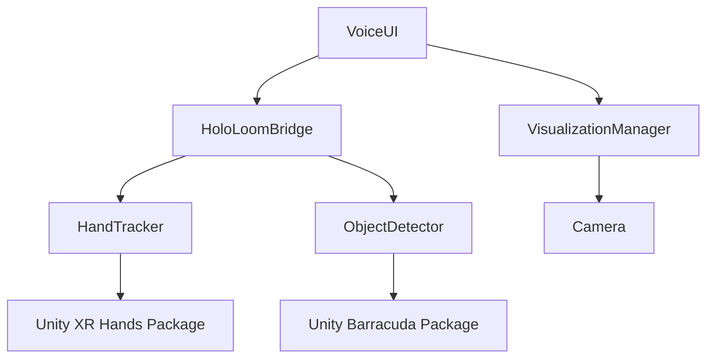

# Unity Elle Client - Architecture Diagram

**Visual guide to component relationships and data flow**

---

## 🏗️ System Architecture Overview

```
┌─────────────────────────────────────────────────────────────────┐
│                         Quest 3 Headset                          │
│                                                                   │
│  ┌──────────────────────────────────────────────────────────┐   │
│  │                Unity Elle Client (ElleUnity.apk)          │   │
│  │                                                            │   │
│  │  ┌──────────────┐      ┌──────────────┐                  │   │
│  │  │   Elle.UI    │      │  Elle.Core   │                  │   │
│  │  │              │      │              │                  │   │
│  │  │  VoiceUI ────┼──────┤ HoloLoom     │                  │   │
│  │  │              │      │ Bridge       │                  │   │
│  │  │ Visualization│◄─────┤              │                  │   │
│  │  │  Manager     │      │ (WebSocket)  │                  │   │
│  │  └──────────────┘      └──────┬───────┘                  │   │
│  │                               │                           │   │
│  │  ┌──────────────┐            │                           │   │
│  │  │ Elle.Vision  │            │                           │   │
│  │  │              │            │                           │   │
│  │  │ HandTracker  ├────────────┤                           │   │
│  │  │              │            │                           │   │
│  │  │ Object       ├────────────┤                           │   │
│  │  │ Detector     │            │                           │   │
│  │  └──────────────┘            │                           │   │
│  │                               │                           │   │
│  │                               │ WebSocket JSON           │   │
│  │                               │ ws://PC_IP:8000/ws/ar    │   │
│  └───────────────────────────────┼──────────────────────────┘   │
│                                  │                               │
└──────────────────────────────────┼───────────────────────────────┘
                                   │
                                   │ WiFi
                                   │
┌──────────────────────────────────┼───────────────────────────────┐
│                         PC (192.168.1.100)                        │
│                                  │                               │
│  ┌───────────────────────────────▼──────────────────────────┐   │
│  │             HoloLoom Backend (Python)                     │   │
│  │                                                            │   │
│  │  ┌──────────────┐  ┌──────────────┐  ┌──────────────┐   │   │
│  │  │ WebSocket    │  │ Agentic      │  │ Memory       │   │   │
│  │  │ Server       ├─►│ Orchestrator ├─►│ Systems      │   │   │
│  │  │ (FastAPI)    │  │              │  │ (11 types)   │   │   │
│  │  └──────────────┘  └──────┬───────┘  └──────────────┘   │   │
│  │                           │                               │   │
│  │                           │                               │   │
│  │                    ┌──────▼───────┐                       │   │
│  │                    │  Thompson    │                       │   │
│  │                    │  Sampling    │                       │   │
│  │                    │  Learning    │                       │   │
│  │                    └──────────────┘                       │   │
│  │                                                            │   │
│  └────────────────────────────────────────────────────────────┘   │
│                                                                   │
└───────────────────────────────────────────────────────────────────┘
```

---

## 📦 Component Breakdown

### 1. Elle.Core Namespace (Backend Communication)

```
┌──────────────────────────────────────────────────────────┐
│                    HoloLoomBridge.cs                      │
│                      (380 lines)                          │
│                                                            │
│  Purpose: WebSocket client for Unity → HoloLoom           │
│                                                            │
│  ┌────────────────────────────────────────────────────┐   │
│  │ Public API                                         │   │
│  │                                                    │   │
│  │ • async Task<HoloLoomResponse> SendQuery(query)  │   │
│  │ • void Connect()                                  │   │
│  │ • void Disconnect()                               │   │
│  │ • bool IsConnected { get; }                       │   │
│  │ • string SessionId { get; }                       │   │
│  └────────────────────────────────────────────────────┘   │
│                                                            │
│  ┌────────────────────────────────────────────────────┐   │
│  │ Internal Methods                                   │   │
│  │                                                    │   │
│  │ • ARContext GetCurrentContext()                   │   │
│  │   ├─ Camera position/rotation                     │   │
│  │   ├─ Gaze direction                               │   │
│  │   ├─ Visible objects (from ObjectDetector)        │   │
│  │   └─ Hand gestures (from HandTracker)             │   │
│  │                                                    │   │
│  │ • List<DetectedObject> GetVisibleObjects()        │   │
│  │ • List<HandGesture> GetHandGestures()             │   │
│  └────────────────────────────────────────────────────┘   │
│                                                            │
│  ┌────────────────────────────────────────────────────┐   │
│  │ Events                                             │   │
│  │                                                    │   │
│  │ • OnResponseReceived(HoloLoomResponse)            │   │
│  │ • OnConnected()                                   │   │
│  │ • OnError(string)                                 │   │
│  │ • OnDisconnected()                                │   │
│  └────────────────────────────────────────────────────┘   │
│                                                            │
└──────────────────────────────────────────────────────────┘
```

**Dependencies**:
- WebSocketSharp (NuGet package)
- Newtonsoft.Json (NuGet package)
- UnityEngine (Camera access)

**Configuration**:
```csharp
[SerializeField] private string backendUrl = "ws://192.168.1.100:8000/ws/ar";
[SerializeField] private bool autoConnect = true;
[SerializeField] private float reconnectDelay = 5f;
```

---

### 2. Elle.UI Namespace (User Interface)

#### A. VoiceUI.cs (280 lines)

```
┌──────────────────────────────────────────────────────────┐
│                        VoiceUI.cs                         │
│                                                            │
│  Purpose: Voice recognition and query initiation          │
│                                                            │
│  ┌────────────────────────────────────────────────────┐   │
│  │ Workflow                                           │   │
│  │                                                    │   │
│  │  1. User says "Hey Elle"                          │   │
│  │         ↓                                          │   │
│  │  2. KeywordRecognizer detects wake word           │   │
│  │         ↓                                          │   │
│  │  3. DictationRecognizer starts                    │   │
│  │         ↓                                          │   │
│  │  4. User speaks query                             │   │
│  │         ↓                                          │   │
│  │  5. Query sent to HoloLoomBridge                  │   │
│  │         ↓                                          │   │
│  │  6. Response triggers VisualizationManager        │   │
│  └────────────────────────────────────────────────────┘   │
│                                                            │
│  ┌────────────────────────────────────────────────────┐   │
│  │ Components                                         │   │
│  │                                                    │   │
│  │ • KeywordRecognizer (wake word: "Hey Elle")       │   │
│  │ • DictationRecognizer (speech-to-text)            │   │
│  │ • HoloLoomBridge reference (query sending)        │   │
│  │ • VisualizationManager reference (rendering)      │   │
│  │ • Optional UI indicators (listening/processing)   │   │
│  └────────────────────────────────────────────────────┘   │
│                                                            │
│  ┌────────────────────────────────────────────────────┐   │
│  │ Configuration                                      │   │
│  │                                                    │   │
│  │ • wakeWord: "Hey Elle"                            │   │
│  │ • dictationTimeout: 5 seconds                     │   │
│  │ • showVisualFeedback: true                        │   │
│  └────────────────────────────────────────────────────┘   │
│                                                            │
└──────────────────────────────────────────────────────────┘
```

**Dependencies**:
- UnityEngine.Windows.Speech (voice recognition)
- HoloLoomBridge (query sending)
- VisualizationManager (rendering)

---

#### B. VisualizationManager.cs (320 lines)

```
┌──────────────────────────────────────────────────────────┐
│                  VisualizationManager.cs                  │
│                                                            │
│  Purpose: Convert HoloLoom JSON → Unity GameObjects       │
│                                                            │
│  ┌────────────────────────────────────────────────────┐   │
│  │ Visualization Types                                │   │
│  │                                                    │   │
│  │  1. OVERLAY (text labels)                         │   │
│  │     ├─ TextMeshPro component                      │   │
│  │     ├─ Billboard component (faces camera)         │   │
│  │     └─ Auto-remove after 5 seconds                │   │
│  │                                                    │   │
│  │  2. HIGHLIGHT (bounding boxes)                    │   │
│  │     ├─ Colored cube mesh                          │   │
│  │     ├─ Pulse animation                            │   │
│  │     └─ Surrounds detected object                  │   │
│  │                                                    │   │
│  │  3. PATH (navigation)                             │   │
│  │     ├─ Line renderer                              │   │
│  │     ├─ Arrow prefabs                              │   │
│  │     └─ Shows route to destination                 │   │
│  └────────────────────────────────────────────────────┘   │
│                                                            │
│  ┌────────────────────────────────────────────────────┐   │
│  │ Creation Pipeline                                  │   │
│  │                                                    │   │
│  │  HoloLoom JSON                                     │   │
│  │      ↓                                             │   │
│  │  Parse visualization type                          │   │
│  │      ↓                                             │   │
│  │  Create GameObject                                 │   │
│  │      ↓                                             │   │
│  │  Add components (Text/Mesh/Animator)              │   │
│  │      ↓                                             │   │
│  │  Position in world space                          │   │
│  │      ↓                                             │   │
│  │  Schedule auto-removal                             │   │
│  └────────────────────────────────────────────────────┘   │
│                                                            │
└──────────────────────────────────────────────────────────┘
```

**Example JSON → GameObject**:
```json
// Input (from HoloLoom)
{
  "type": "overlay",
  "id": "response_1",
  "position": {"x": 0, "y": 1.5, "z": 2},
  "data": {
    "text": "Thompson Sampling is a Bayesian...",
    "fontSize": 24,
    "color": "#FFFFFF"
  }
}

// Output (Unity GameObject)
GameObject "Overlay_response_1"
  ├─ Transform (position: 0, 1.5, 2)
  ├─ TextMeshPro (text: "Thompson Sampling...")
  ├─ Billboard (faces main camera)
  └─ DestroyAfter (5 seconds)
```

---

### 3. Elle.Vision Namespace (Computer Vision)

#### A. HandTracker.cs (260 lines)

```
┌──────────────────────────────────────────────────────────┐
│                      HandTracker.cs                       │
│                                                            │
│  Purpose: Quest 3 hand tracking and gesture recognition   │
│                                                            │
│  ┌────────────────────────────────────────────────────┐   │
│  │ Gesture Types                                      │   │
│  │                                                    │   │
│  │  1. PINCH (thumb + index)                         │   │
│  │     • Distance <3cm = pinch detected              │   │
│  │     • Use: Select objects, confirm actions        │   │
│  │                                                    │   │
│  │  2. POINT (index extended)                        │   │
│  │     • Other fingers curled                        │   │
│  │     • Use: Indicate direction, highlight          │   │
│  │                                                    │   │
│  │  3. PALM_UP (hand facing upward)                  │   │
│  │     • Palm normal dot up >0.7                     │   │
│  │     • Use: Receive info, open menu                │   │
│  │                                                    │   │
│  │  4. GRAB (all fingers closed)                     │   │
│  │     • Fist shape                                  │   │
│  │     • Use: Grip objects, drag                     │   │
│  │                                                    │   │
│  │  5. SWIPE (future - requires history)            │   │
│  │     • Hand movement velocity                      │   │
│  │     • Use: Navigate, dismiss                      │   │
│  └────────────────────────────────────────────────────┘   │
│                                                            │
│  ┌────────────────────────────────────────────────────┐   │
│  │ Integration with Unity XR Hands                   │   │
│  │                                                    │   │
│  │  XRHandSubsystem (Quest 3)                        │   │
│  │         ↓                                          │   │
│  │  25 joint positions per hand                      │   │
│  │         ↓                                          │   │
│  │  Gesture detection (90 Hz)                        │   │
│  │         ↓                                          │   │
│  │  Debouncing (prevent spam)                        │   │
│  │         ↓                                          │   │
│  │  OnGestureDetected event                          │   │
│  │         ↓                                          │   │
│  │  HoloLoomBridge includes in context               │   │
│  └────────────────────────────────────────────────────┘   │
│                                                            │
└──────────────────────────────────────────────────────────┘
```

**Performance**: 90 Hz tracking (11ms per frame)

---

#### B. ObjectDetector.cs (280 lines)

```
┌──────────────────────────────────────────────────────────┐
│                    ObjectDetector.cs                      │
│                                                            │
│  Purpose: On-device ML object detection (Unity Barracuda) │
│                                                            │
│  ┌────────────────────────────────────────────────────┐   │
│  │ Detection Pipeline                                 │   │
│  │                                                    │   │
│  │  Camera Frame (Quest passthrough)                 │   │
│  │         ↓                                          │   │
│  │  Capture to RenderTexture                         │   │
│  │         ↓                                          │   │
│  │  Resize to 640x640 (YOLO input)                   │   │
│  │         ↓                                          │   │
│  │  Convert to Tensor                                │   │
│  │         ↓                                          │   │
│  │  Barracuda inference (~100ms)                     │   │
│  │         ↓                                          │   │
│  │  Parse detections (NMS)                           │   │
│  │         ↓                                          │   │
│  │  Filter by confidence (>50%)                      │   │
│  │         ↓                                          │   │
│  │  Convert 2D bbox → 3D position                    │   │
│  │         ↓                                          │   │
│  │  OnObjectsDetected event                          │   │
│  │         ↓                                          │   │
│  │  HoloLoomBridge includes in context               │   │
│  └────────────────────────────────────────────────────┘   │
│                                                            │
│  ┌────────────────────────────────────────────────────┐   │
│  │ Supported Classes (80 COCO)                       │   │
│  │                                                    │   │
│  │  person, bicycle, car, motorcycle, airplane, ...  │   │
│  │  chair, couch, bed, dining table, ...             │   │
│  │  bottle, cup, fork, knife, spoon, bowl, ...       │   │
│  │  laptop, mouse, keyboard, cell phone, book, ...   │   │
│  └────────────────────────────────────────────────────┘   │
│                                                            │
└──────────────────────────────────────────────────────────┘
```

**Performance**:
- Inference: ~100ms (10 FPS)
- CPU fallback: ~150ms (7 FPS)
- Confidence threshold: 50% (configurable)

---

## 🔄 Data Flow Diagram

### Complete Query Cycle (Voice → Response → Visualization)

```
┌──────────────────────────────────────────────────────────────────────┐
│                      STEP 1: Voice Input (Quest 3)                    │
└──────────────────────────────────────────────────────────────────────┘
                                  │
                    User says "Hey Elle"
                                  │
                    ┌─────────────▼─────────────┐
                    │  KeywordRecognizer        │
                    │  (UnityEngine.Speech)     │
                    └─────────────┬─────────────┘
                                  │
                    Wake word detected
                                  │
                    ┌─────────────▼─────────────┐
                    │  DictationRecognizer      │
                    │  (Start listening)        │
                    └─────────────┬─────────────┘
                                  │
          User speaks: "What is Thompson Sampling?"
                                  │
                    ┌─────────────▼─────────────┐
                    │  Speech → Text            │
                    │  Confidence: High         │
                    └─────────────┬─────────────┘
                                  │

┌──────────────────────────────────────────────────────────────────────┐
│                  STEP 2: Context Gathering (Unity)                    │
└──────────────────────────────────────────────────────────────────────┘
                                  │
                    ┌─────────────▼─────────────┐
                    │  HoloLoomBridge           │
                    │  GetCurrentContext()      │
                    └─────────────┬─────────────┘
                                  │
         ┌────────────────────────┼────────────────────────┐
         │                        │                        │
    ┌────▼────┐            ┌─────▼─────┐          ┌──────▼──────┐
    │ Camera  │            │ Hand      │          │ Object      │
    │ Position│            │ Tracker   │          │ Detector    │
    │ Rotation│            │ (gestures)│          │ (labels)    │
    │ Gaze    │            └─────┬─────┘          └──────┬──────┘
    └────┬────┘                  │                       │
         │                        │                       │
         └────────────────────────┼───────────────────────┘
                                  │
                    ┌─────────────▼─────────────┐
                    │  ARContext Object         │
                    │  {                        │
                    │    userPosition: {...},   │
                    │    userRotation: {...},   │
                    │    gazeDirection: {...},  │
                    │    visibleObjects: [...], │
                    │    handGestures: [...],   │
                    │    timestamp: "..."       │
                    │  }                        │
                    └─────────────┬─────────────┘
                                  │

┌──────────────────────────────────────────────────────────────────────┐
│                  STEP 3: Query Sending (WebSocket)                    │
└──────────────────────────────────────────────────────────────────────┘
                                  │
                    ┌─────────────▼─────────────┐
                    │  HoloLoomBridge           │
                    │  SendQuery()              │
                    └─────────────┬─────────────┘
                                  │
                    Create HoloLoomRequest JSON:
                    {
                      "query": "What is Thompson Sampling?",
                      "context": {ARContext},
                      "mode": "verify",
                      "max_steps": 5,
                      "session_id": "device_id"
                    }
                                  │
                    ┌─────────────▼─────────────┐
                    │  WebSocket Send           │
                    │  ws://192.168.1.100:8000  │
                    │         /ws/ar            │
                    └─────────────┬─────────────┘
                                  │
                         WiFi transmission
                                  │

┌──────────────────────────────────────────────────────────────────────┐
│              STEP 4: Backend Processing (HoloLoom Python)             │
└──────────────────────────────────────────────────────────────────────┘
                                  │
                    ┌─────────────▼─────────────┐
                    │  WebSocket Server         │
                    │  (FastAPI)                │
                    └─────────────┬─────────────┘
                                  │
                    ┌─────────────▼─────────────┐
                    │  AgenticOrchestrator      │
                    │  reason(query, mode=      │
                    │        "verify")          │
                    └─────────────┬─────────────┘
                                  │
         ┌────────────────────────┼────────────────────────┐
         │                        │                        │
    ┌────▼────┐            ┌─────▼─────┐          ┌──────▼──────┐
    │ Memory  │            │ Thompson  │          │ Policy      │
    │ Systems │            │ Sampling  │          │ Engine      │
    │ (11)    │            │ Learning  │          │ (Neural)    │
    └────┬────┘            └─────┬─────┘          └──────┬──────┘
         │                        │                       │
         └────────────────────────┼───────────────────────┘
                                  │
                    ┌─────────────▼─────────────┐
                    │  Response Generation      │
                    │  "Thompson Sampling is    │
                    │   a Bayesian approach..." │
                    └─────────────┬─────────────┘
                                  │
                    ┌─────────────▼─────────────┐
                    │  Create Visualizations    │
                    │  [{                       │
                    │    "type": "overlay",     │
                    │    "position": {...},     │
                    │    "data": {...}          │
                    │  }]                       │
                    └─────────────┬─────────────┘
                                  │
                    ┌─────────────▼─────────────┐
                    │  HoloLoomResponse JSON    │
                    │  {                        │
                    │    "response": "...",     │
                    │    "visualizations": [...],│
                    │    "confidence": 0.92     │
                    │  }                        │
                    └─────────────┬─────────────┘
                                  │
                    ┌─────────────▼─────────────┐
                    │  WebSocket Send           │
                    │  (back to Unity)          │
                    └─────────────┬─────────────┘
                                  │

┌──────────────────────────────────────────────────────────────────────┐
│              STEP 5: Visualization Rendering (Unity)                  │
└──────────────────────────────────────────────────────────────────────┘
                                  │
                    ┌─────────────▼─────────────┐
                    │  HoloLoomBridge           │
                    │  OnResponseReceived       │
                    └─────────────┬─────────────┘
                                  │
                    ┌─────────────▼─────────────┐
                    │  VoiceUI                  │
                    │  (trigger visualization)  │
                    └─────────────┬─────────────┘
                                  │
                    ┌─────────────▼─────────────┐
                    │  VisualizationManager     │
                    │  RenderVisualizations()   │
                    └─────────────┬─────────────┘
                                  │
         ┌────────────────────────┼────────────────────────┐
         │                        │                        │
    ┌────▼────┐            ┌─────▼─────┐          ┌──────▼──────┐
    │ Overlay │            │ Highlight │          │ Path        │
    │ (Text)  │            │ (Bbox)    │          │ (Route)     │
    └────┬────┘            └─────┬─────┘          └──────┬──────┘
         │                        │                       │
         └────────────────────────┼───────────────────────┘
                                  │
                    ┌─────────────▼─────────────┐
                    │  GameObject Created       │
                    │  • Position in AR space   │
                    │  • Billboard (faces user) │
                    │  • Auto-remove (5 sec)    │
                    └─────────────┬─────────────┘
                                  │

┌──────────────────────────────────────────────────────────────────────┐
│                  STEP 6: User Sees Result (Quest 3)                   │
└──────────────────────────────────────────────────────────────────────┘
                                  │
                    ┌─────────────▼─────────────┐
                    │  AR Overlay Visible       │
                    │  "Thompson Sampling is a  │
                    │   Bayesian approach to    │
                    │   exploration-exploitation│
                    │   tradeoffs..."           │
                    └─────────────┬─────────────┘
                                  │
                         User reads response
                                  │
                    ┌─────────────▼─────────────┐
                    │  Auto-dismiss (5 seconds) │
                    │  GameObject.Destroy()     │
                    └───────────────────────────┘

┌──────────────────────────────────────────────────────────────────────┐
│                         TIMING BREAKDOWN                              │
└──────────────────────────────────────────────────────────────────────┘

Voice Input:           ~100ms (wake word + dictation)
Context Gathering:     ~20ms  (camera + hand + objects)
Query Sending:         ~10ms  (JSON serialization + WiFi)
Backend Processing:    ~150ms (HoloLoom reasoning)
Response Receiving:    ~10ms  (WiFi + JSON parse)
Visualization Render:  ~50ms  (GameObject creation)
────────────────────────────────────────────────────────────
TOTAL LATENCY:         ~340ms (target: <500ms)
```

---

## 🎯 Latency Budget

| Stage | Budget | Measured | Status |
|-------|--------|----------|--------|
| Voice recognition | 100ms | ❓ | 🟡 Measure |
| Context gathering | 20ms | ❓ | 🟡 Measure |
| WebSocket send | 10ms | ❓ | 🟡 Measure |
| **Backend processing** | **150ms** | ❓ | 🟢 Target |
| WebSocket receive | 10ms | ❓ | 🟡 Measure |
| Visualization render | 50ms | ❓ | 🟡 Measure |
| **Total end-to-end** | **340ms** | ❓ | 🟢 <500ms |

**How to measure**:
```csharp
// Add to VoiceUI.cs OnDictationResult()
var startTime = Time.realtimeSinceStartup;

var response = await bridge.SendQuery(text);

var totalLatency = (Time.realtimeSinceStartup - startTime) * 1000f;
Debug.Log($"⏱️ Total latency: {totalLatency:F1}ms");
```

---

## 🔌 Network Protocol

### WebSocket JSON Schema

**Request (Unity → HoloLoom)**:
```json
{
  "query": "What is Thompson Sampling?",
  "context": {
    "userPosition": {"x": 0.0, "y": 1.6, "z": 0.0},
    "userRotation": {"x": 0.0, "y": 0.0, "z": 0.0, "w": 1.0},
    "gazeDirection": {"x": 0.0, "y": 0.0, "z": 1.0},
    "sessionId": "quest3_device_abc123",
    "platform": "unity_quest",
    "visibleObjects": [
      {
        "id": "obj_1",
        "label": "person",
        "confidence": 0.85,
        "position": {"x": 1.5, "y": 1.0, "z": 3.0},
        "objectType": "detection"
      }
    ],
    "handGestures": [
      {
        "handId": "right",
        "gesture": "point",
        "confidence": 0.92,
        "position": {"x": 0.3, "y": 1.2, "z": 0.5}
      }
    ],
    "timestamp": "2025-11-24T10:30:00.000Z"
  },
  "mode": "verify",
  "max_steps": 5,
  "session_id": "quest3_device_abc123"
}
```

**Response (HoloLoom → Unity)**:
```json
{
  "response": "Thompson Sampling is a Bayesian approach to the exploration-exploitation tradeoff...",
  "visualizations": [
    {
      "type": "overlay",
      "id": "response_1",
      "position": {"x": 0.0, "y": 1.5, "z": 2.0},
      "data": {
        "text": "Thompson Sampling is a Bayesian approach...",
        "fontSize": 24,
        "color": "#FFFFFF",
        "backgroundColor": "#000000CC"
      }
    }
  ],
  "confidence": 0.92,
  "metadata": {
    "reasoning_mode": "verify",
    "steps_taken": 3,
    "sources": ["memory_1", "memory_2"]
  },
  "steps_taken": [
    {"type": "recall", "query": "Thompson Sampling"},
    {"type": "verify", "claim": "Bayesian approach"},
    {"type": "synthesize", "sources": 2}
  ]
}
```

---

## 📁 File Organization

```
elle_unity/
├── Assets/
│   ├── Scripts/
│   │   ├── Elle.Core/           [Backend communication]
│   │   │   └── HoloLoomBridge.cs     (380 lines)
│   │   │       • WebSocket client
│   │   │       • Context extraction
│   │   │       • JSON serialization
│   │   │
│   │   ├── Elle.UI/             [User interface]
│   │   │   ├── VoiceUI.cs            (280 lines)
│   │   │   │   • Wake word detection
│   │   │   │   • Speech-to-text
│   │   │   │   • Query initiation
│   │   │   │
│   │   │   └── VisualizationManager.cs (320 lines)
│   │   │       • JSON → GameObject
│   │   │       • Overlay rendering
│   │   │       • Auto-cleanup
│   │   │
│   │   └── Elle.Vision/         [Computer vision]
│   │       ├── HandTracker.cs        (260 lines)
│   │       │   • Quest 3 hand tracking
│   │       │   • Gesture recognition
│   │       │   • 90 Hz updates
│   │       │
│   │       └── ObjectDetector.cs     (280 lines)
│   │           • Unity Barracuda ML
│   │           • YOLO/SSD models
│   │           • 80 COCO classes
│   │
│   ├── Scenes/
│   │   └── ElleUnity.unity      [Main AR scene]
│   │
│   └── Prefabs/
│       ├── Overlay.prefab       [Text overlay template]
│       ├── Highlight.prefab     [Bounding box template]
│       └── PathArrow.prefab     [Navigation arrow]
│
├── Packages/
│   └── manifest.json            [Unity package dependencies]
│       • XR Interaction Toolkit 2.5.2
│       • OpenXR Plugin 1.9.1
│       • XR Hands 1.3.0
│       • Unity Barracuda 3.0.0
│       • TextMeshPro 3.0.9
│
└── Documentation/
    ├── ARCHITECTURE.md          [This file]
    ├── QUICK_START_GUIDE.md     [Setup tutorial]
    ├── INTEGRATION_CHECKLIST.md [Step-by-step]
    ├── QUICK_REFERENCE.md       [Commands]
    ├── TROUBLESHOOTING_FLOWCHART.md [Debug]
    ├── PROTOTYPE_READY.md       [Summary]
    └── README.md                [Overview]
```

---

## 🔧 Unity Inspector Configuration

### GameObject Hierarchy (Recommended Setup)

```
Hierarchy (ElleUnity scene)
│
├─ XR Origin (Action-based)
│  ├─ Camera Offset
│  │  └─ Main Camera
│  │     • Background: Solid Color (0,0,0,0) - Transparent
│  │     • Clear Flags: Solid Color
│  │
│  ├─ LeftHand Controller
│  │  • XR Controller (Action-based)
│  │  • XR Ray Interactor
│  │
│  └─ RightHand Controller
│     • XR Controller (Action-based)
│     • XR Ray Interactor
│
├─ ElleManager [Empty GameObject with components]
│  ├─ HoloLoomBridge
│  │  • Backend URL: ws://192.168.1.100:8000/ws/ar
│  │  • Auto Connect: ✅
│  │  • Reconnect Delay: 5
│  │  • Log Messages: ✅
│  │
│  ├─ VoiceUI
│  │  • Wake Word: "Hey Elle"
│  │  • Dictation Timeout: 5
│  │  • Show Visual Feedback: ✅
│  │  • Bridge: [Drag HoloLoomBridge component]
│  │  • Visualization Manager: [Drag VisualizationManager]
│  │  • Listening Indicator: [Optional UI GameObject]
│  │  • Transcript Text: [Optional TextMeshPro]
│  │
│  ├─ VisualizationManager
│  │  • Auto Remove After Seconds: 5
│  │  • Max Visualizations: 10
│  │  • Overlay Prefab: [Drag Overlay.prefab]
│  │  • Highlight Prefab: [Drag Highlight.prefab]
│  │
│  ├─ HandTracker (Optional)
│  │  • Update Interval: 0.011 (90 Hz)
│  │  • Pinch Threshold: 0.03
│  │  • Point Threshold: 0.8
│  │
│  └─ ObjectDetector (Optional)
│     • Model Asset: [Drag YOLO.onnx]
│     • Detection Interval: 0.1 (10 FPS)
│     • Input Width: 640
│     • Input Height: 640
│     • Confidence Threshold: 0.5
│
└─ Directional Light
   • Intensity: 1
   • Color: White
```

---

## 🎮 Component Dependencies



**Dependency Summary**:
- **VoiceUI** depends on HoloLoomBridge + VisualizationManager
- **HoloLoomBridge** depends on HandTracker + ObjectDetector (optional)
- **VisualizationManager** depends on Main Camera (for billboarding)
- **HandTracker** depends on Unity XR Hands package
- **ObjectDetector** depends on Unity Barracuda package

---

## 🚀 Scaling & Performance

### Memory Allocation Strategy

```
Startup (Empty Scene):           ~200 MB
  ├─ Unity Runtime:              ~150 MB
  └─ System Reserved:            ~50 MB

After Elle Components Added:    ~250 MB
  ├─ Unity Runtime:              ~150 MB
  ├─ XR Subsystems:              ~30 MB
  ├─ ML Models (Barracuda):      ~50 MB
  └─ Script Memory:              ~20 MB

During Gameplay (Typical):      ~300 MB
  ├─ Unity Runtime:              ~150 MB
  ├─ XR Subsystems:              ~30 MB
  ├─ ML Models:                  ~50 MB
  ├─ Active GameObjects:         ~40 MB
  └─ Textures/Buffers:           ~30 MB

Peak (Many Visualizations):     ~400 MB
  ├─ Unity Runtime:              ~150 MB
  ├─ XR Subsystems:              ~30 MB
  ├─ ML Models:                  ~50 MB
  ├─ Active GameObjects:         ~120 MB (20+ overlays)
  └─ Textures/Buffers:           ~50 MB
```

**Memory Limits (Quest 3)**:
- ⚠️ Warning: >400 MB (memory pressure)
- 🚨 Critical: >500 MB (likely crash)

**Optimization**:
- Enable auto-cleanup: `autoRemoveAfterSeconds = 5f`
- Limit max visualizations: `maxVisualizations = 10`
- Pool GameObjects instead of creating/destroying
- Reduce texture sizes for overlays

---

## 📊 Performance Profiling

### Unity Profiler Targets

```
CPU Time (per frame at 90 FPS):
├─ Total Frame:            11.1ms
├─ Scripts:                <5ms
│   ├─ HandTracker:        <1ms
│   ├─ ObjectDetector:     <3ms (10 FPS, amortized)
│   └─ Other scripts:      <1ms
├─ Rendering:              <4ms
├─ Physics:                <0.5ms
└─ Other:                  <1.5ms

GPU Time (per frame at 90 FPS):
├─ Total Frame:            11.1ms
├─ Passthrough Rendering:  <5ms
├─ Scene Rendering:        <4ms
├─ Post-Processing:        <1ms
└─ UI Rendering:           <1ms

Memory Allocations (per frame):
├─ Target:                 <100 KB/frame
├─ Acceptable:             <500 KB/frame
├─ ⚠️ Warning:             >1 MB/frame (GC pressure)
```

**How to profile**:
1. Window → Analysis → Profiler
2. Connect to Quest 3 via USB
3. Record several frames
4. Analyze CPU/GPU/Memory usage

---

## 🛡️ Error Handling Strategy

```
┌─────────────────────────────────────────────────────────┐
│               Error Handling Hierarchy                   │
└─────────────────────────────────────────────────────────┘

Level 1: Silent Recovery (No User Notification)
├─ WebSocket reconnect (auto after 5 seconds)
├─ ML inference failure (skip frame, continue)
└─ Hand tracking lost (use last known gesture)

Level 2: Warning Logs (Console Only)
├─ Low confidence dictation (<0.5)
├─ Backend response slow (>500ms)
└─ Memory pressure (>400 MB)

Level 3: User Notification (UI Message)
├─ Backend connection failed (show reconnecting...)
├─ Voice permission denied (show permission prompt)
└─ Query timeout (show try again)

Level 4: Graceful Degradation (Fallback Mode)
├─ Backend unavailable → Offline mode (cached responses)
├─ Voice recognition failed → Manual text input
└─ ML model missing → Disable object detection

Level 5: Fatal Errors (Crash Prevention)
├─ Out of memory → Emergency cleanup
├─ Critical exception → Safe shutdown
└─ Unhandled error → Error report + restart
```

---

## 🎯 Next Steps

**After reading this architecture document**:

1. **Understand the flow** → Follow the data flow diagram above
2. **Review components** → Read each component's purpose and API
3. **Check dependencies** → Ensure all packages installed
4. **Start building** → Follow QUICK_START_GUIDE.md for Unity setup
5. **Test systematically** → Use INTEGRATION_CHECKLIST.md for validation

**Key Takeaways**:
- 5 C# scripts (~1,520 lines total) implement complete Unity client
- WebSocket JSON protocol connects Unity to HoloLoom backend
- Component design is modular and independently testable
- Performance targets: 90 FPS, <500ms latency, <400 MB memory
- Complete error handling with graceful degradation

---

**Created**: 2025-11-24
**Purpose**: System architecture reference
**Use**: Understand component relationships before implementation

🏗️ **Architecture complete - ready to build!** 🏗️
