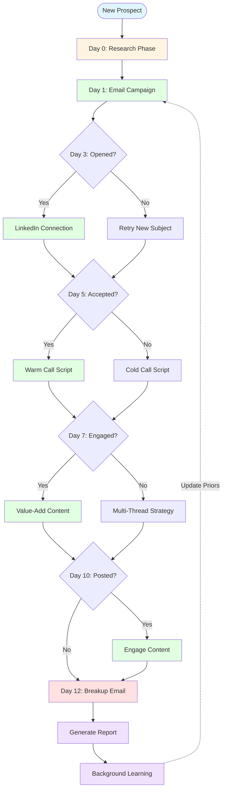
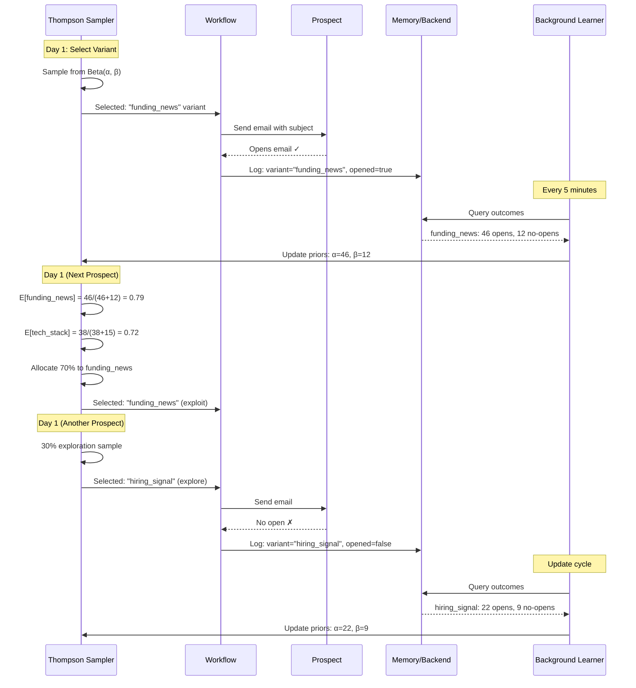
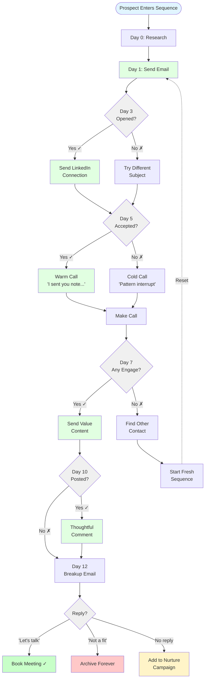
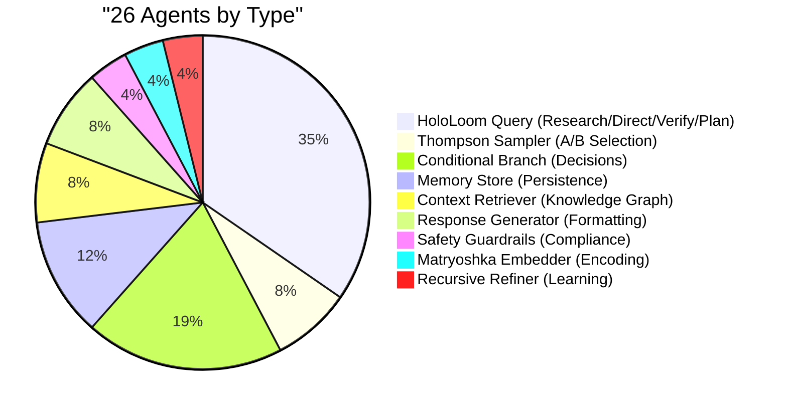
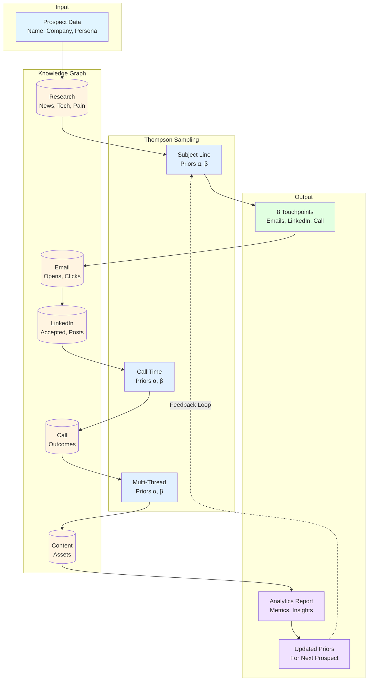
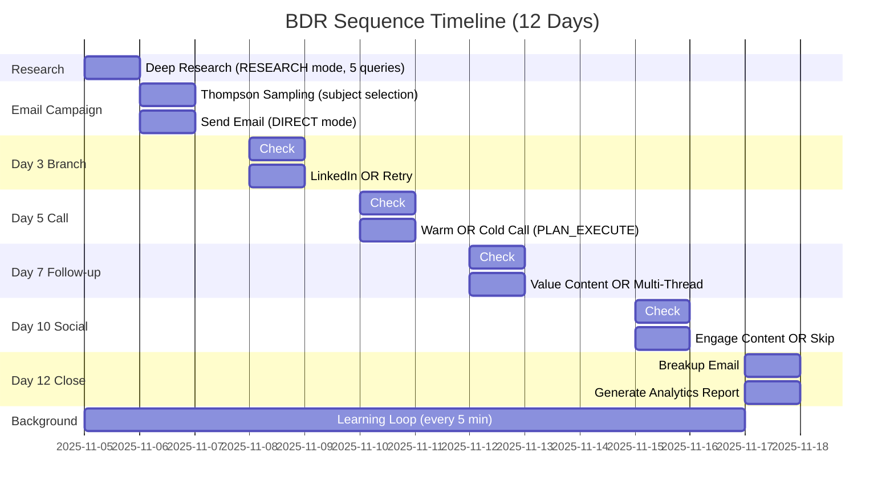
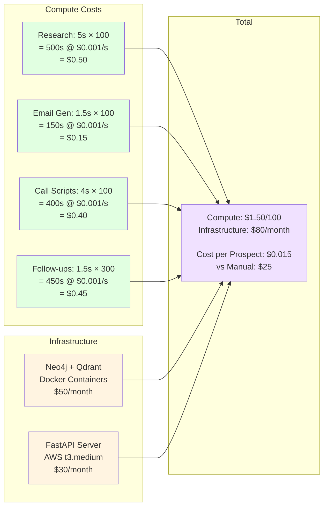
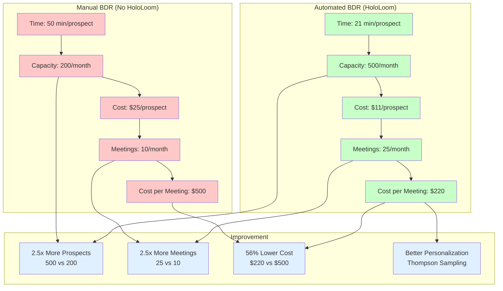

# BDR Outbound Sequence - Visual Architecture

## High-Level Flow

## Detailed Agent Pipeline

```mermaid
graph LR
    subgraph "Day 0: Research"
        A1[HoloLoom Query<br/>RESEARCH mode] --> A2[Matryoshka<br/>Embedder]
        A2 --> A3[Memory Store<br/>Knowledge Graph]
    end

    subgraph "Day 1: Email"
        B1[Thompson<br/>Sampler] --> B2[Context<br/>Retriever]
        B2 --> B3[HoloLoom Query<br/>DIRECT mode]
        B3 --> B4[Safety<br/>Guardrails]
        B4 --> B5[Response<br/>Generator]
    end

    subgraph "Day 3: Branch"
        C1{Conditional<br/>Branch} --> C2[LinkedIn Note<br/>VERIFY mode]
        C1 --> C3[Retry Email<br/>DIRECT mode]
    end

    subgraph "Day 5: Call"
        D1{Conditional<br/>Branch} --> D2[Warm Script<br/>PLAN_EXECUTE]
        D1 --> D3[Cold Script<br/>PLAN_EXECUTE]
        D2 --> D4[Memory Store<br/>Call Outcome]
        D3 --> D4
    end

    subgraph "Day 7: Follow-up"
        E1{Conditional<br/>Branch} --> E2[Context<br/>Retriever]
        E2 --> E3[Value Content<br/>DIRECT mode]
        E1 --> E4[Multi-Query<br/>Find Contacts]
        E4 --> E5[Thompson<br/>Sampler]
    end

    subgraph "Day 10-12: Close"
        F1{Conditional<br/>Branch} --> F2[Comment<br/>DIRECT mode]
        F1 --> F3[Breakup Email<br/>DIRECT mode]
        F3 --> F4[Memory Store<br/>Sequence Outcome]
        F2 --> F3
    end

    subgraph "Background"
        G1[Recursive<br/>Refiner] -.->|Every 5 min| B1
        F4 -.->|Feedback| G1
    end

    A3 --> B1
    B5 --> C1
    C2 --> D1
    C3 --> D1
    D4 --> E1
    E3 --> F1
    E5 --> F1

    style A1 fill:#fff4e1
    style B1 fill:#e1f0ff
    style B4 fill:#ffe1e1
    style C1 fill:#f0f0f0
    style D1 fill:#f0f0f0
    style E1 fill:#f0f0f0
    style F1 fill:#f0f0f0
    style G1 fill:#f0e1ff
```

## Thompson Sampling Learning Loop

## Conditional Branching Decision Tree

## Agent Type Distribution

## Data Flow: Single Prospect Journey

## Performance Timeline

## Cost Breakdown (per 100 Prospects)

## ROI Comparison

---

## Legend

**Node Colors**:
- 🔵 Blue (`#e1f5ff`): Start/Input nodes
- 🟡 Yellow (`#fff4e1`): Research/Knowledge nodes
- 🟢 Green (`#e1ffe1`): Action/Execution nodes
- 🔴 Red (`#ffe1e1`): Safety/Compliance nodes
- 🟣 Purple (`#f0e1ff`): Learning/Analytics nodes
- ⚪ Gray (`#f0f0f0`): Decision/Conditional nodes

**Agent Types**:
- **HoloLoom Query**: Multi-modal reasoning (RESEARCH/DIRECT/VERIFY/PLAN_EXECUTE)
- **Thompson Sampler**: Bayesian A/B testing
- **Conditional Branch**: If/else logic
- **Memory Store**: Knowledge graph persistence
- **Safety Guardrails**: Compliance gating
- **Recursive Refiner**: Background learning loop

**Workflow Execution**:
- Solid lines (→): Synchronous execution
- Dashed lines (-.->): Asynchronous/background
- Decision diamonds (◇): Conditional branches

---

## Usage

These diagrams are rendered with Mermaid. To view:

1. **GitHub**: Automatically renders in `.md` files
2. **VS Code**: Install "Markdown Preview Mermaid Support" extension
3. **Online**: Copy/paste into https://mermaid.live/

**Export Options**:
- PNG: Use Mermaid Live Editor → Export as PNG
- SVG: Use `mmdc` CLI tool (Mermaid CLI)
- PDF: Use Markdown → PDF converter with Mermaid support