# HoloLoom 9-Step Weaving Cycle Architecture

**Created: November 2025** - Elegance Pass Documentation
**Purpose:** Visual reference for the complete weaving cycle

## Complete Weaving Cycle

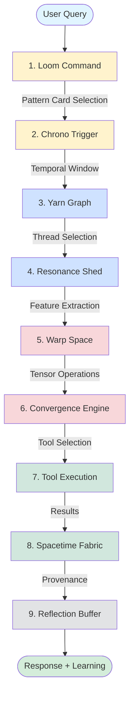

## Detailed Step Breakdown

### Step 1: Loom Command (Pattern Selection)

**Purpose:** Select processing pattern (BARE/FAST/FUSED)
**Input:** User query
**Output:** Pattern card (processing configuration)

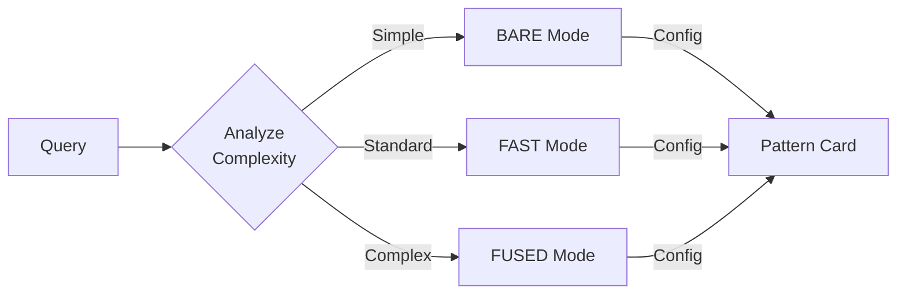

**Decision Criteria:**
- Query length and structure
- Keyword complexity indicators
- Historical performance data
- User preference overrides

---

### Step 2: Chrono Trigger (Temporal Window)

**Purpose:** Create time-based filtering window
**Input:** Pattern card, current time
**Output:** Temporal window with bounds

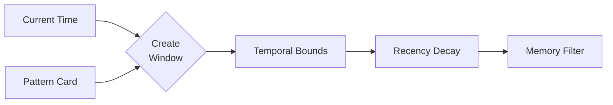

**Components:**
- Start time (temporal window start)
- End time (temporal window end)
- Episode filter (specific memory episodes)
- Recency weighting (decay over time)

---

### Step 3: Yarn Graph (Thread Selection)

**Purpose:** Select relevant memory threads
**Input:** Temporal window, query
**Output:** List of memory shards (threads)

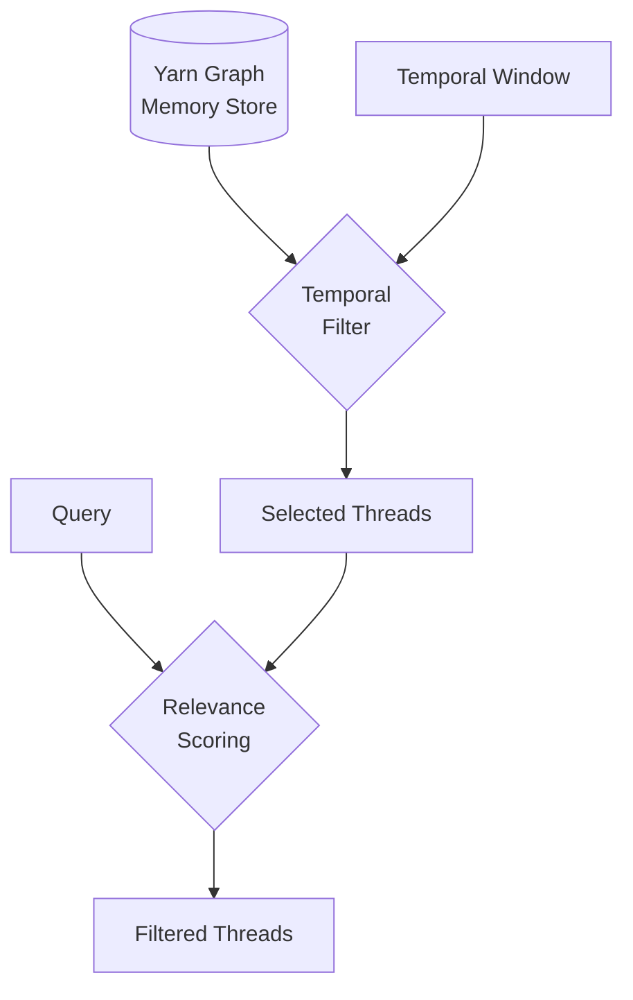

**Filtering Logic:**
- Temporal bounds matching
- Semantic relevance scoring
- Graph relationship traversal
- Activation spreading

---

### Step 4: Resonance Shed (Feature Extraction)

**Purpose:** Extract multi-modal features (DotPlasma)
**Input:** Selected threads, query
**Output:** Features object (motifs, embeddings, spectral)

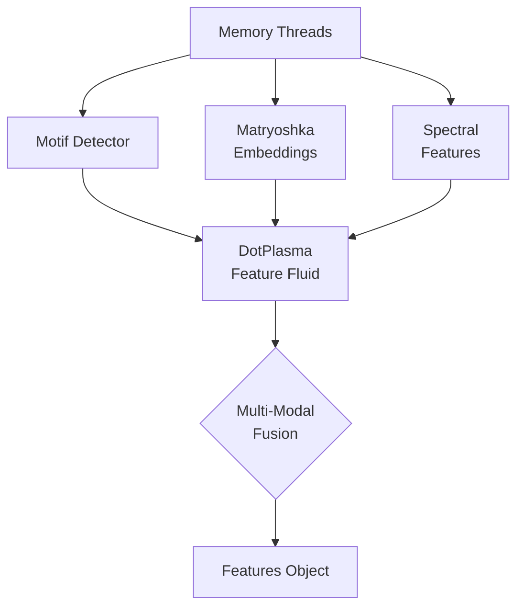

**Feature Types:**
- **Motifs:** Symbolic patterns (regex/NLP)
- **Embeddings:** Multi-scale vectors (96/192/384D)
- **Spectral:** Graph topology (Laplacian eigenvalues)

---

### Step 5: Warp Space (Tensor Operations)

**Purpose:** Tension threads into continuous manifold
**Input:** Features, memory threads
**Output:** Tensioned warp space

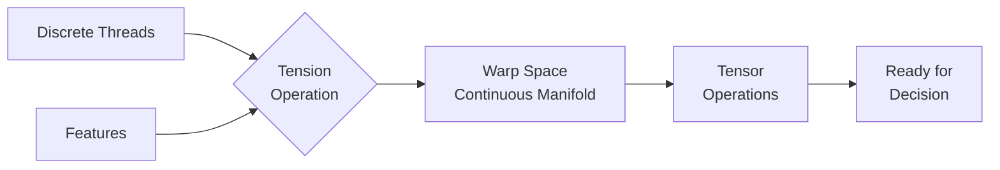

**Operations:**
- Thread tensioning (discrete → continuous)
- Tensor field computation
- Manifold operations
- Detensioning (continuous → discrete)

---

### Step 6: Convergence Engine (Tool Selection)

**Purpose:** Collapse probability distribution to tool choice
**Input:** Warp space, policy network
**Output:** Tool selection + confidence

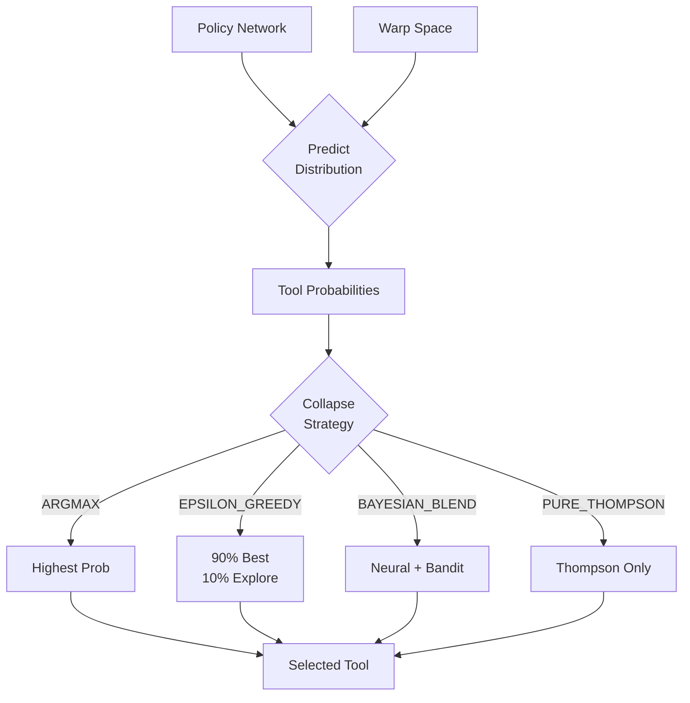

**Strategies:**
- ARGMAX: Deterministic (highest probability)
- EPSILON_GREEDY: 90% exploit, 10% explore
- BAYESIAN_BLEND: 70% neural + 30% bandit
- PURE_THOMPSON: Full Thompson Sampling

---

### Step 7: Tool Execution

**Purpose:** Execute selected tool with context
**Input:** Tool selection, query, context
**Output:** Tool results

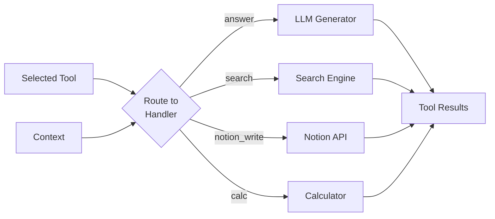

**Tools:**
- **answer:** Generate response using LLM with context
- **search:** Search external knowledge bases
- **notion_write:** Write to Notion database
- **calc:** Perform calculations

---

### Step 8: Spacetime Fabric (Provenance Weaving)

**Purpose:** Weave results with complete lineage
**Input:** Tool results, trace data
**Output:** Spacetime object (4D fabric)

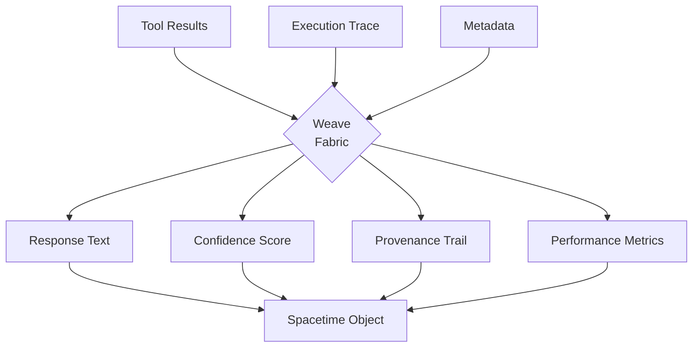

**Spacetime Components:**
- **Response:** Generated response text
- **Confidence:** Decision confidence [0, 1]
- **Trace:** Full computational lineage
- **Metadata:** Tool used, pattern, complexity, timings

---

### Step 9: Reflection Buffer (Learning)

**Purpose:** Learn from outcome for continuous improvement
**Input:** Spacetime, feedback (optional)
**Output:** Learning signals

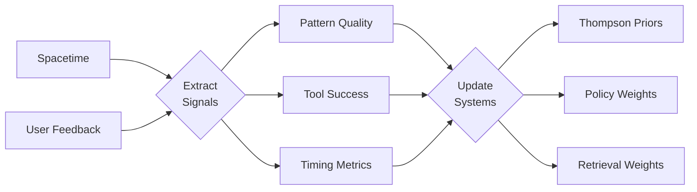

**Learning Signals:**
- Pattern quality (which patterns work best)
- Tool success rates (Thompson Sampling priors)
- Timing metrics (performance optimization)
- Retrieval effectiveness (hot pattern feedback)

---

## Progressive Complexity (3-5-7-9 System)

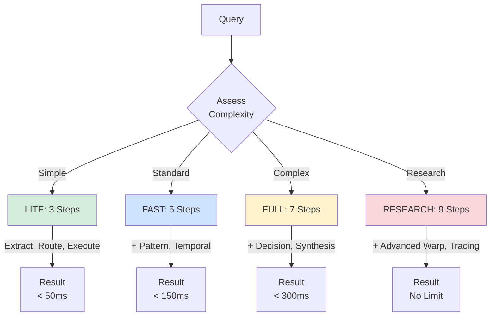

**Complexity Levels:**

| Level | Steps | Target | Use Case |
|-------|-------|--------|----------|
| **LITE** | 3 | <50ms | Simple lookups, cached queries |
| **FAST** | 5 | <150ms | Standard queries, real-time apps |
| **FULL** | 7 | <300ms | Complex queries, production systems |
| **RESEARCH** | 9 | No limit | Research, debugging, quality max |

---

## Module Architecture (Refactored)

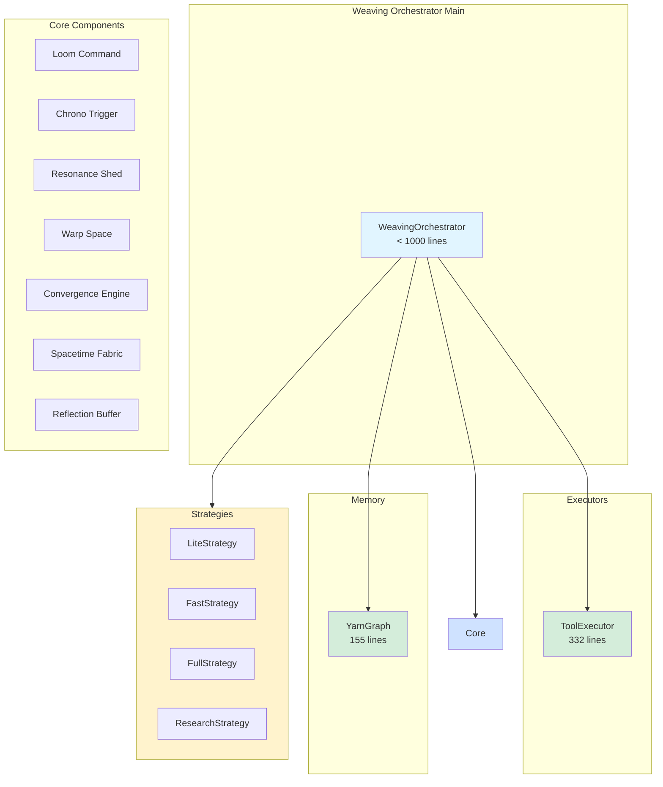

**Refactoring Benefits:**
- **Before:** 3,476 lines in single file
- **After:** Modular architecture with <1,000 lines per file
- **Maintainability:** Each component has single responsibility
- **Testability:** Independent unit testing per module
- **Clarity:** Clear separation of concerns

---

## Performance Characteristics

```mermaid
gantt
    title Weaving Cycle Timing (FULL Mode)
    dateFormat X
    axisFormat %L ms

    section Stages
    Pattern Selection :0, 5
    Temporal Window :5, 10
    Thread Selection :10, 30
    Feature Extraction :30, 100
    Warp Space :100, 150
    Convergence :150, 170
    Tool Execution :170, 280
    Spacetime Weave :280, 295
    Reflection :295, 300
```

**Stage Breakdown (FULL Mode, ~300ms):**
1. Pattern Selection: 5ms
2. Temporal Window: 5ms
3. Thread Selection: 20ms
4. Feature Extraction: 70ms
5. Warp Space: 50ms
6. Convergence: 20ms
7. Tool Execution: 110ms
8. Spacetime Weave: 15ms
9. Reflection: 5ms

---

## Data Flow

**Representation Transitions:**
- **Query:** Natural language text
- **Threads:** Discrete symbolic memory (Yarn Graph)
- **DotPlasma:** Continuous feature fluid (Resonance Shed)
- **Manifold:** Tensioned tensor field (Warp Space)
- **Decision:** Probability distribution (Policy)
- **Tool:** Discrete action choice (Convergence)
- **Spacetime:** 4D woven fabric (output)

---

## Revision History

- **2025-11-17:** Created during Elegance Pass refactoring
- **Author:** Claude Code
- **Purpose:** Comprehensive visual documentation of HoloLoom architecture
