# HoloLoom Memory System Architecture

**Created: November 2025** - Elegance Pass Documentation
**Purpose:** Visual reference for the 11 integrated memory systems

## Memory System Overview

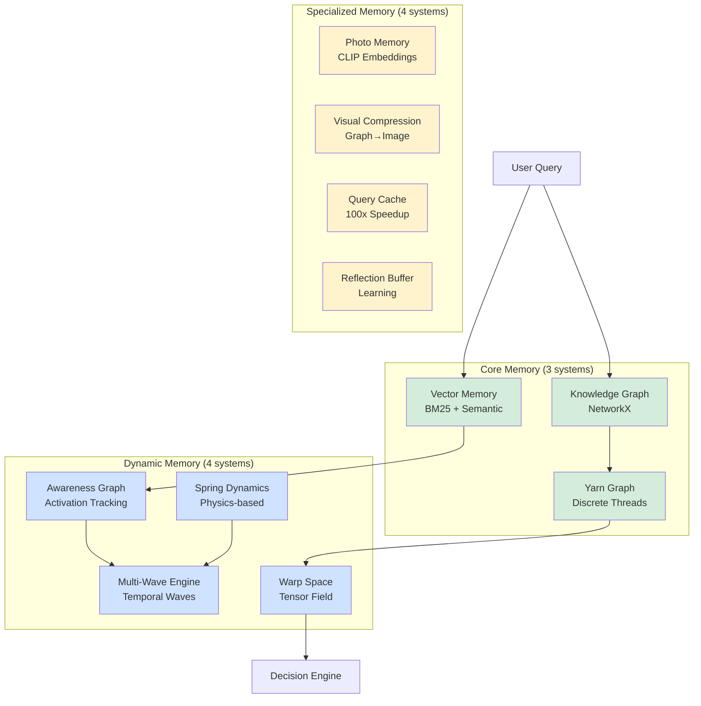

## Core Memory Systems

### 1. Vector Memory (cache.py)

**Purpose:** BM25 + semantic similarity retrieval
**Technology:** Hybrid search (keyword + vector)

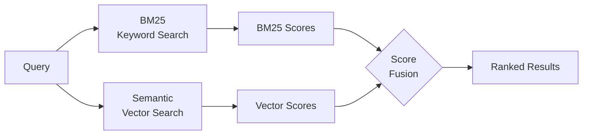

**Features:**
- BM25 keyword matching (Okapi BM25)
- Semantic similarity (cosine distance)
- Hybrid score fusion (0.4 BM25 + 0.6 semantic)
- Multi-scale retrieval (96/192/384D)

---

### 2. Knowledge Graph (graph.py)

**Purpose:** Entity relationships with typed edges
**Technology:** NetworkX MultiDiGraph

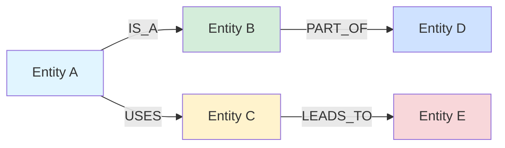

**Edge Types:**
- **IS_A:** Taxonomy (inheritance)
- **USES:** Functional relationships
- **MENTIONS:** Reference relationships
- **LEADS_TO:** Causal chains
- **PART_OF:** Composition
- **IN_TIME:** Temporal ordering
- **OCCURRED_AT:** Event relationships

---

### 3. Yarn Graph (yarn_graph.py)

**Purpose:** Persistent symbolic memory (discrete threads)
**Technology:** Dict-based (production: Neo4j)

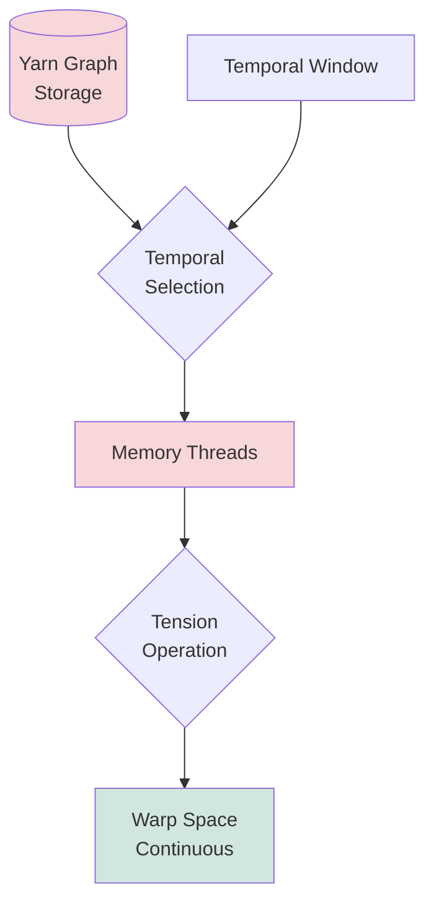

**Operations:**
- Thread selection (temporal + relevance)
- Thread addition (new memories)
- Thread removal (cleanup)
- Tensioning (discrete → continuous)

---

## Dynamic Memory Systems

### 4. Awareness Graph (awareness_graph.py)

**Purpose:** Memory activation tracking with spreading activation
**Technology:** Graph-based activation propagation

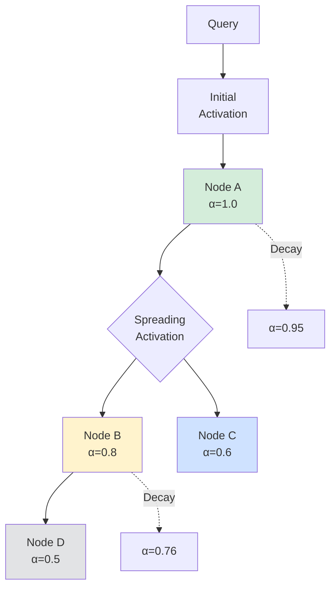

**Metrics:**
- **Activation:** Node activation levels (0.0-1.0)
- **Coherence:** How well-connected active nodes are
- **Temporal decay:** Inactive memories fade over time
- **Spreading:** Activation propagates across edges

---

### 5. Spring Dynamics (spring_dynamics.py)

**Purpose:** Physics-based memory connectivity
**Technology:** Hooke's law for memory relationships

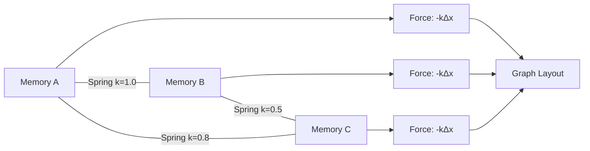

**Physics Model:**
- **Spring constant (k):** Relationship strength
- **Displacement (Δx):** Distance between memories
- **Force (F):** F = -k × Δx (Hooke's law)
- **Equilibrium:** Natural clustering of related memories

---

### 6. Multi-Wave Engine (multi_wave_engine.py)

**Purpose:** Temporal wave propagation across memory graph
**Technology:** Multi-frequency wave interference

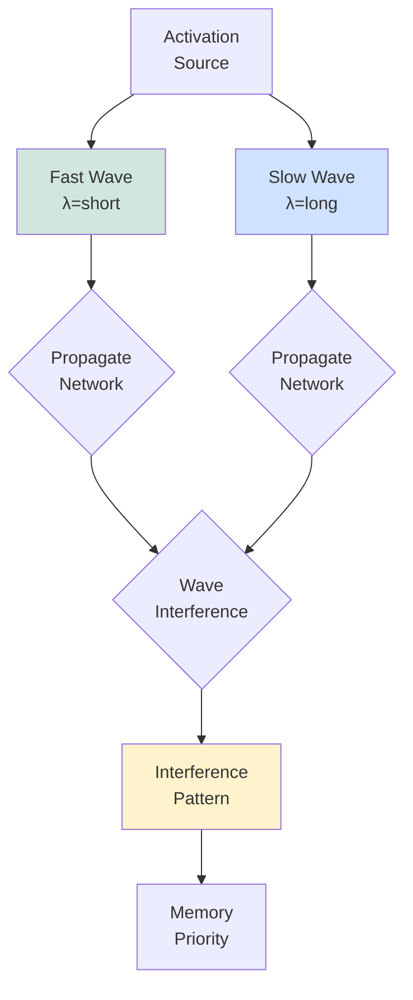

**Wave Characteristics:**
- **Fast waves:** Rapid propagation, short wavelength
- **Slow waves:** Gradual propagation, long wavelength
- **Interference:** Constructive/destructive patterns
- **Priority:** Memories at interference peaks prioritized

---

### 7. Warp Space (warp/space.py)

**Purpose:** Tensioned tensor field for continuous math
**Technology:** Discrete → continuous transformation

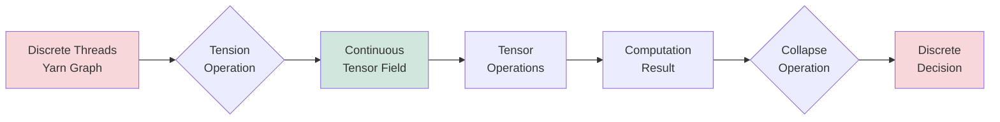

**Lifecycle:**
1. **Tension:** Discrete threads → continuous manifold
2. **Compute:** Tensor operations on manifold
3. **Collapse:** Continuous → discrete decision
4. **Detension:** Release back to discrete form

---

## Specialized Memory Systems

### 8. Photo Memory (photo_tokens.py)

**Purpose:** CLIP embeddings for images
**Technology:** Vision transformer embeddings

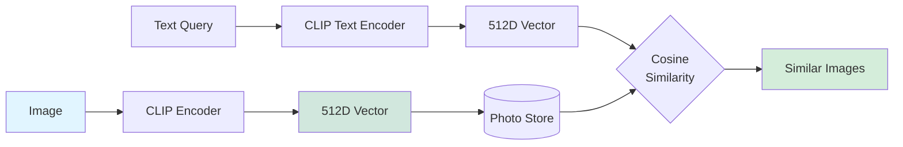

**Operations:**
- **Ingest:** Image → CLIP embedding → store
- **Search:** Text → CLIP embedding → similarity search
- **Retrieve:** Top-k similar images

---

### 9. Visual Compression (visual_compression.py)

**Purpose:** Graph→image compression (5-20x token savings)
**Technology:** Knowledge graph visualization

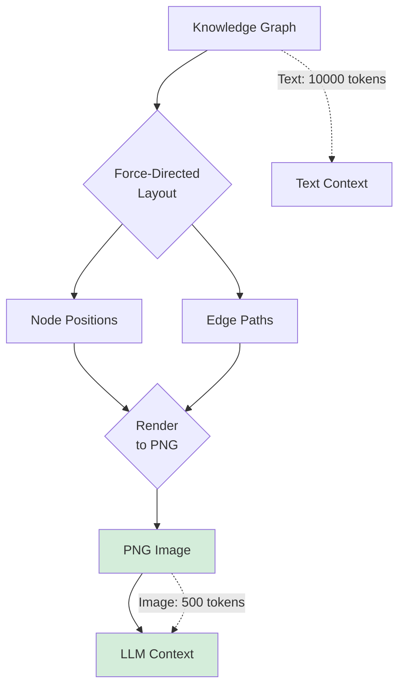

**Compression Benefits:**
- **5-20x token savings** vs. text representation
- **Visual structure** preserved
- **Automatic compression** when sources > threshold
- **Configurable threshold** (default: 10 sources)

---

### 10. Query Cache (query_cache.py)

**Purpose:** 100x speedup for repeated queries
**Technology:** LRU cache with TTL

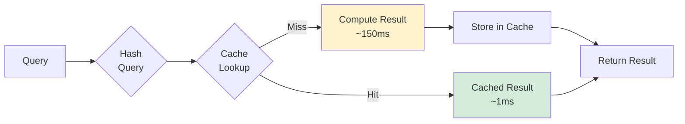

**Performance:**
- **Cache hit:** <1ms (hash lookup)
- **Cache miss:** ~150ms (full computation)
- **Speedup:** 100-150x for repeated queries
- **TTL:** 5 minutes (configurable)
- **LRU eviction:** Oldest entries removed when full

---

### 11. Reflection Buffer (reflection/buffer.py)

**Purpose:** Episodic buffer for learning
**Technology:** Sliding window with pattern extraction

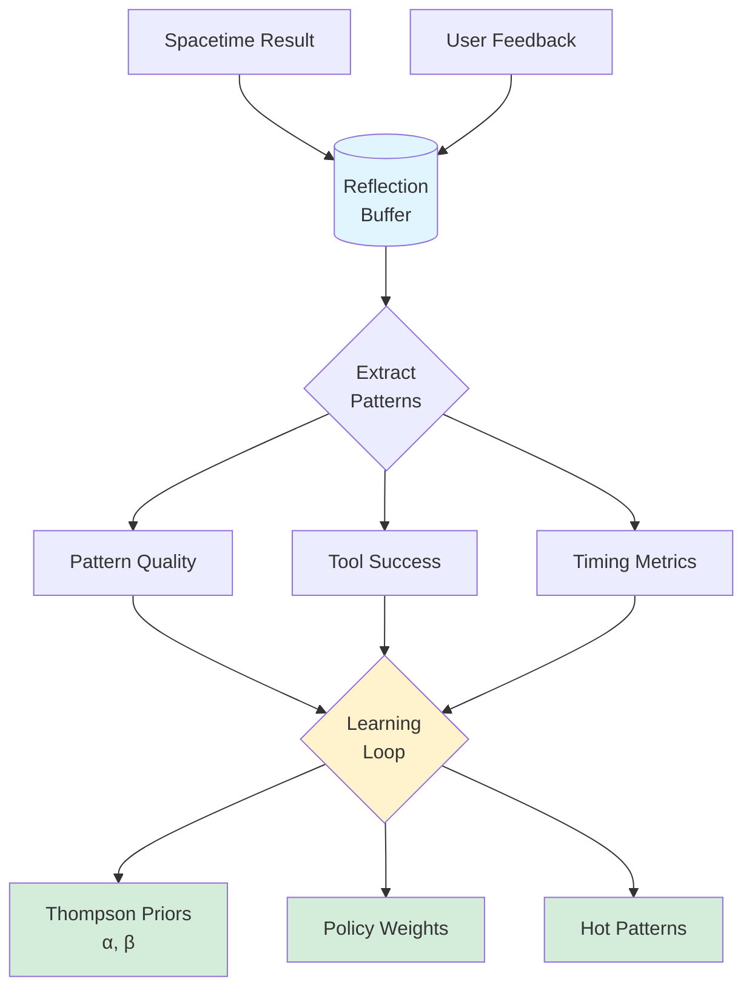

**Learning Signals:**
- **Pattern quality:** Which patterns work best
- **Tool success:** Thompson Sampling priors (α/β)
- **Timing metrics:** Performance optimization
- **Retrieval effectiveness:** Hot pattern feedback

---

## Memory Backend Configurations

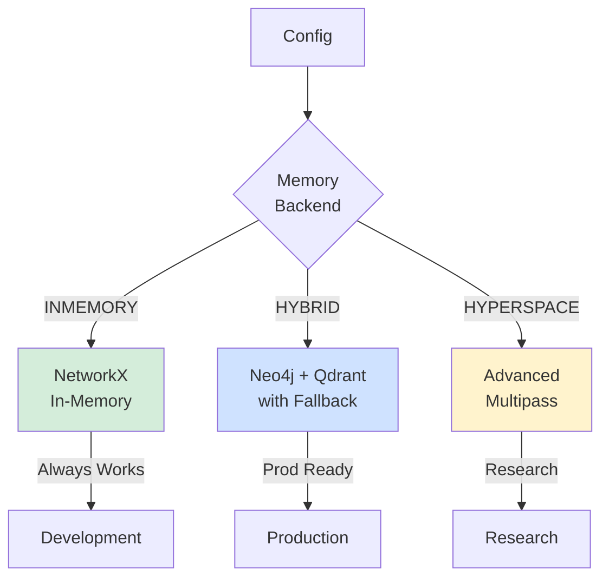

**Backend Options:**

| Backend | Storage | Features | Use Case |
|---------|---------|----------|----------|
| **INMEMORY** | NetworkX | Basic graph | Development, testing |
| **HYBRID** | Neo4j + Qdrant | Persistent + auto-fallback | Production |
| **HYPERSPACE** | Advanced | Gated multipass | Research |

---

## Memory Integration Flow

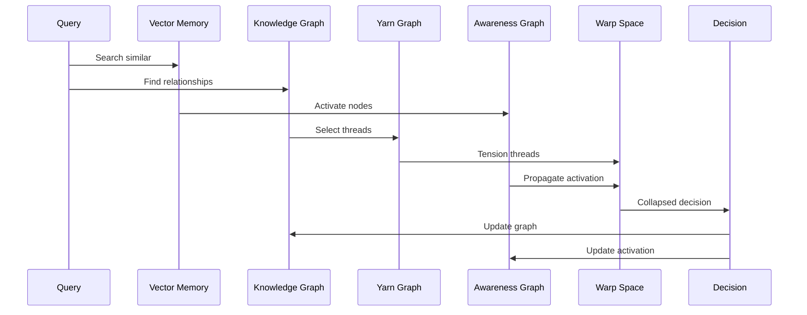

**Integration Points:**
1. **Query** triggers Vector + KG search
2. **Vector Memory** activates Awareness Graph
3. **KG** selects threads from Yarn Graph
4. **Yarn** tensions into Warp Space
5. **Warp** feeds Decision Engine
6. **Decision** updates KG and Awareness

---

## Performance Characteristics

| System | Latency | Operation |
|--------|---------|-----------|
| **Vector Memory** | ~20ms | BM25 + semantic search |
| **Knowledge Graph** | ~10ms | Subgraph extraction |
| **Yarn Graph** | ~5ms | Thread selection |
| **Awareness Graph** | ~3ms | Activation spread |
| **Spring Dynamics** | ~15ms | Physics simulation |
| **Multi-Wave** | ~8ms | Wave propagation |
| **Warp Space** | ~50ms | Tensioning + compute |
| **Photo Memory** | ~50ms | CLIP similarity |
| **Visual Compression** | ~150ms | Graph → PNG |
| **Query Cache** | <1ms | Hash lookup (hit) |
| **Reflection Buffer** | <1ms | Pattern extraction |

**Total Retrieval Path:** ~100-150ms (FULL mode)

---

## Revision History

- **2025-11-17:** Created during Elegance Pass refactoring
- **Author:** Claude Code
- **Purpose:** Comprehensive visual documentation of memory systems
