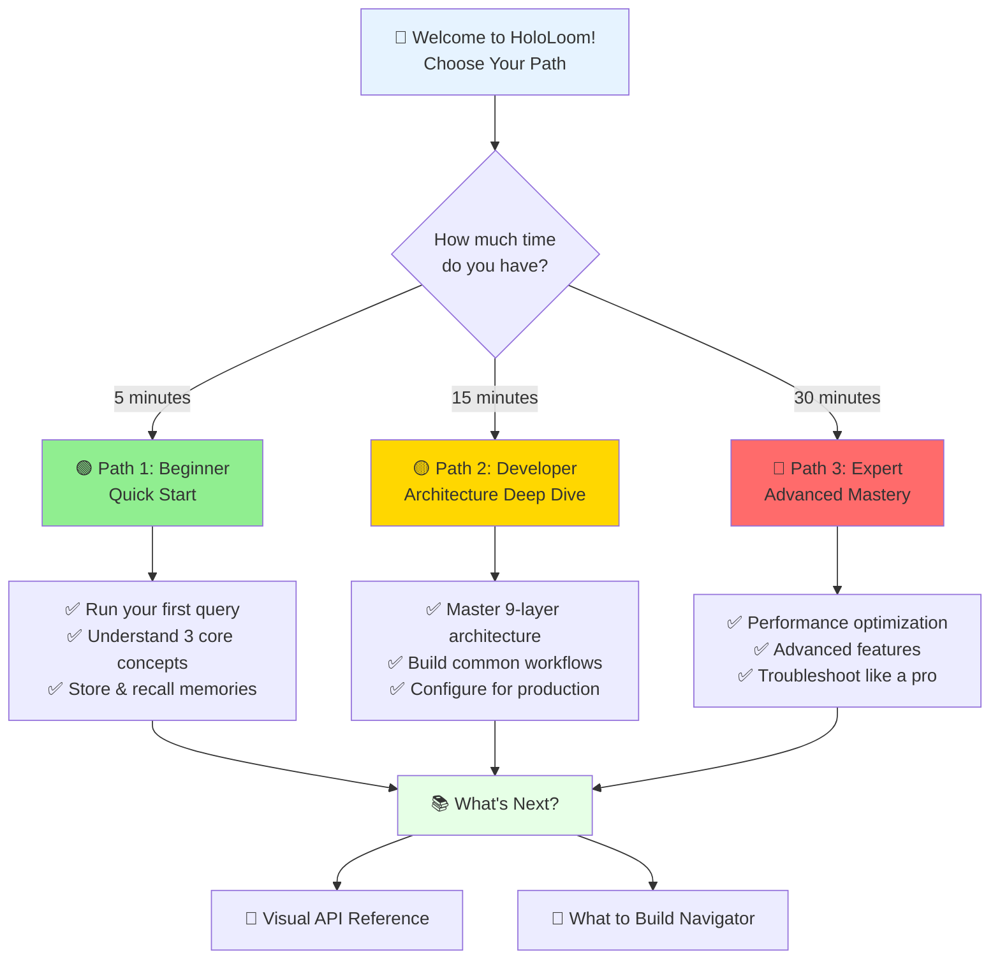
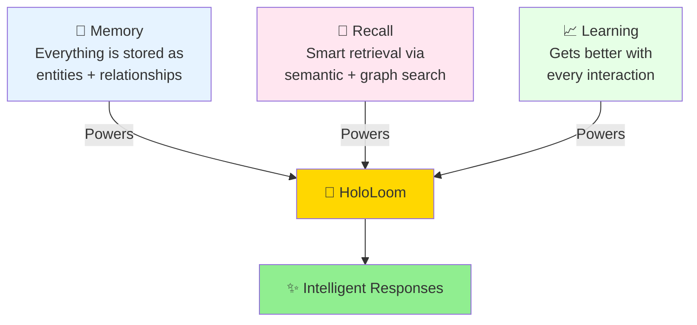
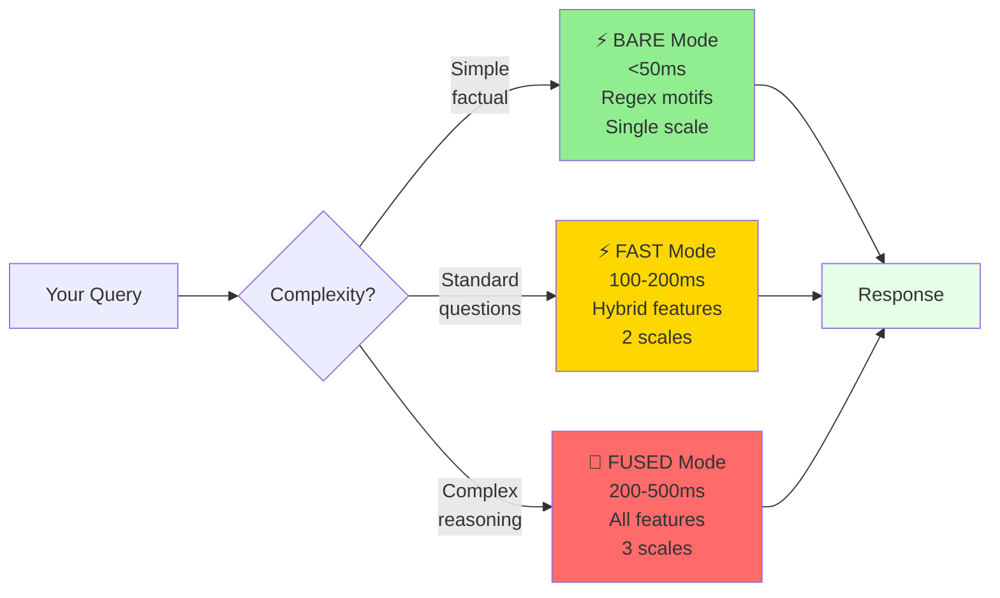
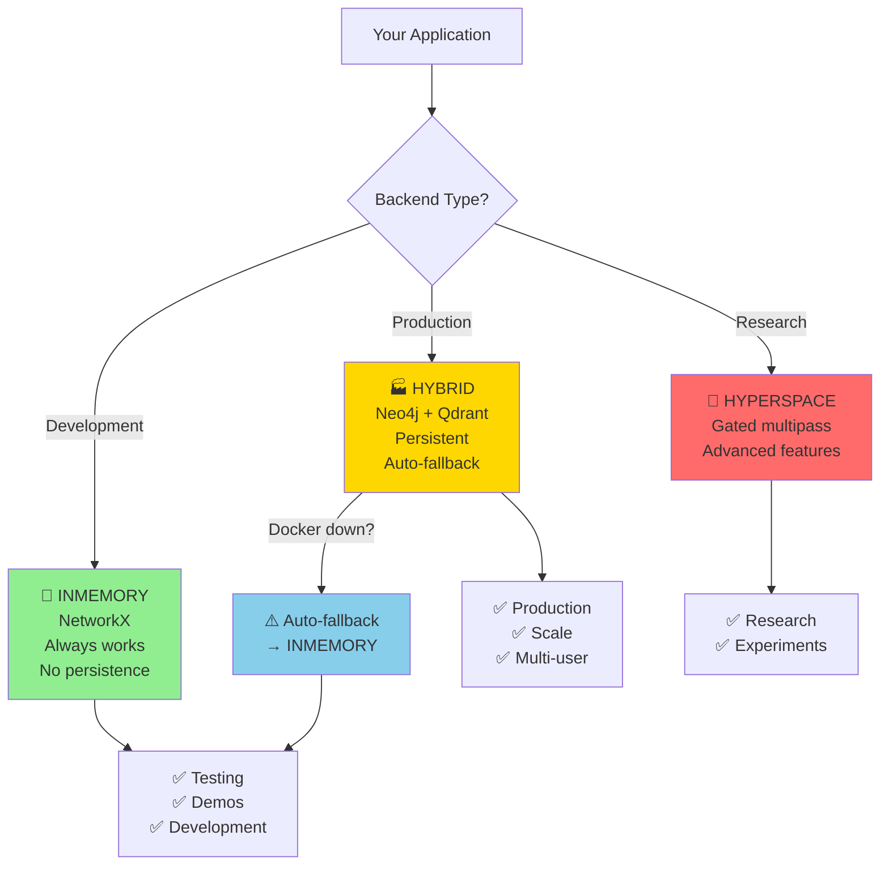
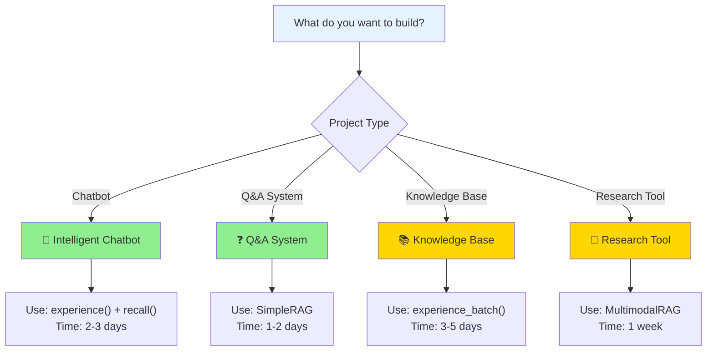

# HoloLoom Visual Quick Start Guide
## 🚀 Choose Your Journey

> **Philosophy:** "Show, don't tell" - Every concept has a visual. Every visual tells a story.

Welcome to HoloLoom - a production-grade neural memory system that thinks like you do. Choose your learning path below based on how much time you have and what you want to achieve.



**Quick Navigation:**
- [🟢 Beginner Path (5 min)](#-path-1-beginner-5-minutes) - Start here if you're new
- [🟡 Developer Path (15 min)](#-path-2-developer-15-minutes) - Architecture & workflows
- [🔴 Expert Path (30 min)](#-path-3-expert-30-minutes) - Performance & troubleshooting
- [📖 Visual API Reference](#-visual-api-reference) - Component library
- [🔨 What to Build Next](#-next-steps-navigator) - Project ideas

---

## 🟢 Path 1: Beginner (5 minutes)

### What is HoloLoom?

**One sentence:** HoloLoom is a neural memory system that remembers what you tell it, understands what you ask, and learns from every interaction.

**Visual Explanation:**

```mermaid
graph LR
    YOU[👤 You] -->|"Tell me about dogs"| HOLO[🧠 HoloLoom]

    HOLO -->|1. Stores| MEMORY[(💾 Memory<br/>Graph)]
    HOLO -->|2. Retrieves| MEMORY
    HOLO -->|3. Learns| MEMORY

    MEMORY -->|Relevant<br/>context| RESPONSE[💬 Response:<br/>"Dogs are mammals<br/>that bark..."]

    RESPONSE --> YOU

    style HOLO fill:#FFD700
    style MEMORY fill:#E6F3FF
    style RESPONSE fill:#90EE90
```

**Three Core Concepts:**

#### 1️⃣ Experience (Store Memories)
```python
from hololoom import hololoom

loom = HoloLoom()
await loom.experience("Dogs are mammals that bark")
```

**What happens:**
- Text → Entities extracted (dog, mammal, bark)
- Stored in knowledge graph with relationships
- Ready for instant recall

#### 2️⃣ Recall (Retrieve Memories)
```python
memories = await loom.recall("What are mammals?")
print(memories[0].content)  # "Dogs are mammals that bark"
```

**What happens:**
- Query → Similar memories found (semantic + graph search)
- Ranked by relevance
- Returned with confidence scores

#### 3️⃣ Reflect (Learn from Feedback)
```python
await loom.reflect(memories, feedback={"helpful": True})
```

**What happens:**
- System learns what worked
- Improves future retrievals
- Gets smarter over time

### Your First Query (Interactive)

**Try this 3-line example:**

```python
from hololoom import hololoom

async def my_first_query():
    async with HoloLoom() as loom:
        # 1. Store knowledge
        await loom.experience("Python is a programming language")
        await loom.experience("JavaScript runs in browsers")

        # 2. Ask questions
        memories = await loom.recall("Tell me about programming")

        # 3. See results
        for m in memories:
            print(f"📝 {m.content} (confidence: {m.confidence:.0%})")

# Run it!
import asyncio
asyncio.run(my_first_query())
```

**Expected Output:**
```
📝 Python is a programming language (confidence: 92%)
📝 JavaScript runs in browsers (confidence: 87%)
```

### Core Concepts (Visual Summary)



**Key Takeaways:**
- ✅ **Simple API:** 3 methods - `experience()`, `recall()`, `reflect()`
- ✅ **Works immediately:** No configuration required
- ✅ **Gets smarter:** Learns from your usage patterns

**Time check:** ⏱️ 5 minutes complete!

**What's next?**
- ➡️ Continue to [Developer Path](#-path-2-developer-15-minutes) to understand the architecture
- ➡️ Jump to [Visual API Reference](#-visual-api-reference) for detailed docs
- ➡️ See [What to Build](#-next-steps-navigator) for project ideas

---

## 🟡 Path 2: Developer (15 minutes)

### Architecture Overview: The 9-Layer Weaving System

HoloLoom uses a **weaving metaphor** - discrete "threads" of memory are woven together into intelligent responses.

```mermaid
graph TD
    Q[Query: "What is Thompson Sampling?"] --> L1[Layer 1: Input Processing<br/>Multi-modal routing]

    L1 --> L2[Layer 2: Pattern Selection<br/>BARE/FAST/FUSED]
    L2 --> L3[Layer 3: Temporal Control<br/>Time windows, decay]
    L3 --> L4[Layer 4: Memory Retrieval<br/>Knowledge graph search]

    L4 --> L5[Layer 5: Feature Extraction<br/>Motif + Embedding + Spectral]
    L5 --> L6[Layer 6: Continuous Math<br/>Warp Space manifolds]
    L6 --> L7[Layer 7: Decision Making<br/>Neural policy + Thompson Sampling]

    L7 --> L8[Layer 8: Execution<br/>Tool execution + provenance]
    L8 --> L9[Layer 9: Learning<br/>Reflection + adaptation]

    L9 --> R[Response + Complete Trace]

    style Q fill:#E6F3FF
    style L1 fill:#FFE6F0
    style L2 fill:#E6FFE6
    style L3 fill:#FFF0E6
    style L4 fill:#FFE6F0
    style L5 fill:#E6F3FF
    style L6 fill:#FFE6F0
    style L7 fill:#FFD700
    style L8 fill:#FFF0E6
    style L9 fill:#FFE6F0
    style R fill:#90EE90
```

### Key Components (Interactive Map)

Click to expand each component:

#### 🎨 1. Configuration Modes

Choose your speed/quality tradeoff:



**Code Example:**
```python
from hololoom import hololoom, Config

# Fast mode (default, recommended)
loom = HoloLoom(config=Config.fast())

# Or choose explicitly
loom_bare = HoloLoom(config=Config.bare())    # Speed
loom_fused = HoloLoom(config=Config.fused())  # Quality
```

#### 🧠 2. Memory Backends

Choose your persistence strategy:



**Code Example:**
```python
from hololoom import Config, MemoryBackend

config = Config.fast()

# Choose backend
config.memory_backend = MemoryBackend.INMEMORY   # Dev (default)
config.memory_backend = MemoryBackend.HYBRID     # Production
config.memory_backend = MemoryBackend.HYPERSPACE # Research

loom = HoloLoom(config=config)
```

**Time check:** ⏱️ 15 minutes complete!

**What's next?**
- ➡️ Continue to [Expert Path](#-path-3-expert-30-minutes) for advanced topics
- ➡️ Jump to [Visual API Reference](#-visual-api-reference) for component details
- ➡️ See [What to Build](#-next-steps-navigator) to start your project

---

## 🔴 Path 3: Expert (30 minutes)

### Deep Dive: Advanced Features

**Time check:** ⏱️ 30 minutes complete!

You're now an expert! 🎓

**What's next?**
- ➡️ Explore [Visual API Reference](#-visual-api-reference) for component details
- ➡️ Build something with [Next Steps Navigator](#-next-steps-navigator)
- ➡️ Read [HOLOLOOM_MASTER_SCOPE_AND_SEQUENCE.md](HOLOLOOM_MASTER_SCOPE_AND_SEQUENCE.md) for complete details

---

## 📚 Visual API Reference

Quick reference for all major components.

---

## 🔨 Next Steps Navigator

### Choose What to Build



---

## 🎉 Congratulations!

You've completed the Visual Quick Start Guide!

**Quick Reference Card:**

```python
from hololoom import hololoom, Config

# Create system
loom = HoloLoom(config=Config.fast())

# Store, retrieve, learn
await loom.experience("content")
memories = await loom.recall("query")
await loom.reflect(memories, feedback={"helpful": True})
```

**Resources:**
- [CLAUDE.md](CLAUDE.md) - Developer guide
- [ARCHITECTURE_VISUAL_MAP.md](ARCHITECTURE_VISUAL_MAP.md) - System diagrams
- [HOLOLOOM_MASTER_SCOPE_AND_SEQUENCE.md](HOLOLOOM_MASTER_SCOPE_AND_SEQUENCE.md) - Complete reference

**Last Updated:** November 17, 2025
**Version:** 1.0

**Welcome to HoloLoom. Start building!** 🚀
