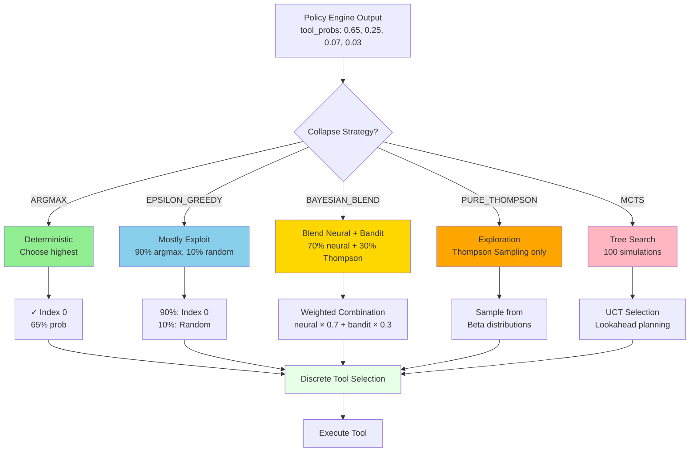

# Convergence Engine - Decision Collapse

**Status**: ✅ Production Ready (November 2025)
**Location**: `hololoom/convergence/`
**Code**: 832 lines across 3 files

---

## Overview

The **Convergence Engine** collapses continuous probability distributions from the Policy Engine into discrete tool selections. It implements the critical transition from **continuous → discrete** that bridges neural decision-making with executable actions.

**Philosophy**: The convergence is the moment of decision—where flowing probabilities crystallize into a single chosen tool.

---

## Architecture

### File Structure

```
hololoom/convergence/
├── __init__.py          # 17 lines - Public exports
├── engine.py            # 406 lines - Main convergence engine
└── mcts_engine.py       # 409 lines - MCTS-based planning
```

### Core Concept: Collapse

**Continuous → Discrete Transition**:
```
Policy Engine outputs:
    tool_probs = [0.65, 0.25, 0.07, 0.03]  # Probabilities
        ↓ Convergence Engine ↓
    chosen_tool = "answer"  # Discrete selection (index 0)
```

---

## Collapse Strategies

The Convergence Engine provides 5 strategies for collapsing continuous probabilities into discrete tool selections:



### 1. ARGMAX (Deterministic)

**Most Confident**: Select tool with highest probability.

```python
from hololoom.convergence import ConvergenceEngine, CollapseStrategy

engine = ConvergenceEngine(strategy=CollapseStrategy.ARGMAX)

# Collapse distribution
tool_probs = np.array([0.65, 0.25, 0.07, 0.03])
chosen_idx = engine.collapse(tool_probs)

print(f"Chosen: {chosen_idx}")  # 0 (highest probability)
```

**When to use**: Production systems requiring consistency.

### 2. EPSILON_GREEDY (Exploration)

**Mostly Exploit, Sometimes Explore**: 90% argmax, 10% random.

```python
engine = ConvergenceEngine(
    strategy=CollapseStrategy.EPSILON_GREEDY,
    epsilon=0.1  # 10% exploration
)

# 90% chance: index 0 (argmax)
# 10% chance: random selection
chosen_idx = engine.collapse(tool_probs)
```

**When to use**: Online learning, need some exploration.

### 3. BAYESIAN_BLEND (Balanced)

**Blend Neural + Thompson Sampling**: Combine neural probs with bandit priors.

```python
from hololoom.policy.thompson_sampling import TSBandit

# Create bandit with priors
bandit = TSBandit(n_arms=4)

engine = ConvergenceEngine(
    strategy=CollapseStrategy.BAYESIAN_BLEND,
    bandit=bandit,
    blend_weight=0.7  # 70% neural, 30% bandit
)

# Blended decision
chosen_idx = engine.collapse(tool_probs)
# Incorporates both neural confidence and bandit priors
```

**When to use**: Want both neural intelligence and exploration.

### 4. PURE_THOMPSON (Maximum Exploration)

**Thompson Sampling Only**: Ignore neural probs, use bandit.

```python
engine = ConvergenceEngine(
    strategy=CollapseStrategy.PURE_THOMPSON,
    bandit=bandit
)

# Neural probs ignored, uses Thompson Sampling
chosen_idx = engine.collapse(tool_probs)
```

**When to use**: Research mode, maximum exploration.

### 5. MCTS (Tree Search)

**Monte Carlo Tree Search**: Plan ahead with lookahead.

```python
from hololoom.convergence.mcts_engine import MCTSEngine

# Create MCTS engine
engine = MCTSEngine(
    n_simulations=100,  # 100 rollouts
    exploration_weight=1.4,  # UCT constant
    max_depth=5  # Lookahead depth
)

# Plan with tree search
chosen_idx = await engine.plan(
    tool_probs,
    state=current_state,
    reward_fn=reward_function
)
```

**When to use**: Complex planning tasks, need lookahead.

---

## Usage Examples

### Example 1: Basic Collapse

```python
from hololoom.convergence import ConvergenceEngine, CollapseStrategy
import numpy as np

# Create engine
engine = ConvergenceEngine(strategy=CollapseStrategy.ARGMAX)

# Tool probabilities from policy
tool_probs = np.array([
    0.65,  # answer
    0.25,  # search
    0.07,  # notion_write
    0.03   # calc
])

# Collapse to discrete choice
chosen_idx = engine.collapse(tool_probs)
tools = ["answer", "search", "notion_write", "calc"]

print(f"Chosen tool: {tools[chosen_idx]}")  # "answer"
```

### Example 2: Epsilon-Greedy Exploration

```python
# 10% exploration
engine = ConvergenceEngine(
    strategy=CollapseStrategy.EPSILON_GREEDY,
    epsilon=0.1
)

# Run 100 times to see exploration
choices = []
for _ in range(100):
    chosen = engine.collapse(tool_probs)
    choices.append(chosen)

# Distribution:
# ~90 times: index 0 (argmax)
# ~10 times: random (exploration)
from collections import Counter
print(Counter(choices))
# {0: 91, 1: 5, 2: 3, 3: 1}
```

### Example 3: Bayesian Blend

```python
from hololoom.policy.thompson_sampling import TSBandit

# Create bandit with history
bandit = TSBandit(n_arms=4)
bandit.update(0, reward=0.8)  # answer worked well
bandit.update(1, reward=0.5)  # search was okay

# Blend neural + bandit
engine = ConvergenceEngine(
    strategy=CollapseStrategy.BAYESIAN_BLEND,
    bandit=bandit,
    blend_weight=0.7  # 70% neural, 30% bandit
)

# Blended probabilities
chosen = engine.collapse(tool_probs)
# Considers both neural confidence and bandit history
```

### Example 4: MCTS Planning

```python
from hololoom.convergence.mcts_engine import MCTSEngine

# Create MCTS engine
mcts = MCTSEngine(
    n_simulations=100,
    exploration_weight=1.4,
    max_depth=5
)

# Define reward function
def reward_fn(state, action):
    # Simulate reward
    if action == 0:  # answer
        return 0.8
    elif action == 1:  # search
        return 0.6
    return 0.3

# Plan with lookahead
chosen = await mcts.plan(
    tool_probs,
    state={'context': 'current_context'},
    reward_fn=reward_fn
)

print(f"MCTS chose: {tools[chosen]}")
# Considers future rewards, not just immediate
```

---

## Integration with Orchestrator

```python
from hololoom.weaving_orchestrator import WeavingOrchestrator
from hololoom.convergence import ConvergenceEngine, CollapseStrategy

# Create convergence engine
engine = ConvergenceEngine(strategy=CollapseStrategy.ARGMAX)

# Orchestrator uses engine for decision collapse
orchestrator = WeavingOrchestrator(
    convergence_engine=engine,
    # ... other config
)

# During weaving:
# 1. Policy outputs tool_probs: [0.65, 0.25, 0.07, 0.03]
# 2. Convergence Engine collapses to discrete: chosen_idx = 0
# 3. Tool executed: "answer"
```

---

## MCTS Engine (Advanced)

### Monte Carlo Tree Search

**Purpose**: Plan ahead with tree search, considering future rewards.

**Algorithm**:
```
1. Selection: Traverse tree using UCT (Upper Confidence Bound for Trees)
2. Expansion: Add new node to tree
3. Simulation: Rollout to terminal state
4. Backpropagation: Update values along path
```

**UCT Formula**:
```
UCT(node) = exploitation + exploration
          = Q(node) / N(node) + c * sqrt(log(N(parent)) / N(node))
```

**Usage**:
```python
from hololoom.convergence.mcts_engine import MCTSEngine, MCTSConfig

# Configure MCTS
config = MCTSConfig(
    n_simulations=100,       # Rollouts per decision
    exploration_weight=1.4,  # c in UCT formula
    max_depth=5,             # Lookahead depth
    discount_factor=0.99     # Future reward discount
)

engine = MCTSEngine(config)

# Plan action
action = await engine.plan(
    tool_probs,
    state=current_state,
    reward_fn=reward_function
)
```

**When to use**: Multi-step planning, games, sequential decision-making.

---

## API Reference

### Core Classes

#### `ConvergenceEngine.__init__()`
```python
def __init__(
    self,
    strategy: CollapseStrategy = CollapseStrategy.ARGMAX,
    epsilon: float = 0.1,
    bandit: Optional[TSBandit] = None,
    blend_weight: float = 0.7
)
```

#### `ConvergenceEngine.collapse()`
```python
def collapse(
    self,
    tool_probs: np.ndarray  # [n_tools] probabilities
) -> int  # Chosen tool index
```

#### `MCTSEngine.__init__()`
```python
def __init__(
    self,
    n_simulations: int = 100,
    exploration_weight: float = 1.4,
    max_depth: int = 5,
    discount_factor: float = 0.99
)
```

#### `MCTSEngine.plan()`
```python
async def plan(
    self,
    tool_probs: np.ndarray,
    state: Dict[str, Any],
    reward_fn: Callable
) -> int  # Chosen action
```

### Enums

```python
class CollapseStrategy(Enum):
    ARGMAX = "argmax"                    # Deterministic
    EPSILON_GREEDY = "epsilon_greedy"    # 90% exploit, 10% explore
    BAYESIAN_BLEND = "bayesian_blend"    # Neural + bandit
    PURE_THOMPSON = "pure_thompson"      # Bandit only
```

---

## Performance

| Strategy | Latency | Notes |
|----------|---------|-------|
| **ARGMAX** | <0.01ms | np.argmax |
| **EPSILON_GREEDY** | <0.01ms | Random check + argmax |
| **BAYESIAN_BLEND** | <0.5ms | Bandit sampling |
| **PURE_THOMPSON** | <0.5ms | Bandit sampling |
| **MCTS (100 sims)** | ~50ms | Tree search |

**Memory**: <1KB (negligible)

---

## Dependencies

**Internal**:
```python
from hololoom.policy.thompson_sampling import TSBandit
from hololoom.documentation.types import ActionPlan
```

**External**:
```python
import numpy as np
from dataclasses import dataclass
from enum import Enum
from typing import Optional, Callable, Dict, Any
```

---

## Quick Reference Card

### Most Common Usage Patterns

**1. Deterministic Collapse (ARGMAX)**
```python
from hololoom.convergence import ConvergenceEngine, CollapseStrategy

engine = ConvergenceEngine(strategy=CollapseStrategy.ARGMAX)
chosen_idx = engine.collapse(tool_probs)
# Always chooses highest probability tool
```

**2. Exploration via Epsilon-Greedy**
```python
engine = ConvergenceEngine(
    strategy=CollapseStrategy.EPSILON_GREEDY,
    epsilon=0.1  # 10% random exploration
)
chosen_idx = engine.collapse(tool_probs)
```

**3. Bayesian Blend (Recommended)**
```python
from hololoom.policy.thompson_sampling import TSBandit

bandit = TSBandit(n_arms=4)
engine = ConvergenceEngine(
    strategy=CollapseStrategy.BAYESIAN_BLEND,
    bandit=bandit,
    blend_weight=0.7  # 70% neural, 30% bandit
)
chosen_idx = engine.collapse(tool_probs)
```

### Strategy Selection Guide

| Strategy | Determinism | Exploration | Latency | Use Case |
|----------|-------------|-------------|---------|----------|
| **ARGMAX** | 100% | 0% | <0.01ms | Production, consistency required |
| **EPSILON_GREEDY** | 90% | 10% | <0.01ms | Online learning, some exploration |
| **BAYESIAN_BLEND** | Adaptive | Balanced | <0.5ms | **Recommended default** |
| **PURE_THOMPSON** | 0% | 100% | <0.5ms | Research, maximum exploration |
| **MCTS** | Planned | Lookahead | ~50ms | Complex planning, games |

### Strategy Comparison

| Aspect | ARGMAX | EPSILON_GREEDY | BAYESIAN_BLEND | PURE_THOMPSON | MCTS |
|--------|--------|----------------|----------------|---------------|------|
| **Exploration** | None | Fixed 10% | Adaptive | Maximum | Planned |
| **Neural Probs** | 100% | 90% | 70% | 0% | Initial |
| **Bandit Priors** | None | None | 30% | 100% | UCT |
| **Latency** | <0.01ms | <0.01ms | <0.5ms | <0.5ms | ~50ms |
| **Memory** | <1KB | <1KB | <1KB | <1KB | ~10KB |
| **Learning** | ❌ | ❌ | ✅ | ✅ | ✅ |

### Collapse Formulas

**ARGMAX**:
```
chosen_idx = argmax(tool_probs)
```

**EPSILON_GREEDY**:
```
if random() < epsilon:
    chosen_idx = random_choice(n_tools)
else:
    chosen_idx = argmax(tool_probs)
```

**BAYESIAN_BLEND**:
```
neural_probs = tool_probs
bandit_samples = [beta.sample(α_i, β_i) for i in tools]
blended = blend_weight × neural_probs + (1 - blend_weight) × bandit_samples
chosen_idx = argmax(blended)
```

**PURE_THOMPSON**:
```
samples = [beta.sample(α_i, β_i) for i in tools]
chosen_idx = argmax(samples)
```

**MCTS**:
```
UCT(node) = Q(node)/N(node) + c × sqrt(log(N(parent))/N(node))
chosen_idx = argmax([UCT(child) for child in root.children])
```

### Key Methods

```python
# Create convergence engine
engine = ConvergenceEngine(
    strategy=CollapseStrategy.BAYESIAN_BLEND,  # Strategy
    epsilon=0.1,                                # For epsilon-greedy
    bandit=TSBandit(n_arms=4),                 # For Bayesian/Thompson
    blend_weight=0.7                            # For Bayesian blend
)

# Collapse probabilities to discrete choice
chosen_idx = engine.collapse(
    tool_probs=np.array([0.65, 0.25, 0.07, 0.03])
)

# Update bandit after tool execution (for learning strategies)
reward = 0.8  # Tool success metric
engine.bandit.update(chosen_idx, reward)

# Get bandit statistics
stats = engine.bandit.get_stats()
# Returns: {0: {'α': 5.2, 'β': 1.5, 'mean': 0.776}, ...}
```

### MCTS Planning (Advanced)

```python
from hololoom.convergence.mcts_engine import MCTSEngine

# Create MCTS engine
mcts = MCTSEngine(
    n_simulations=100,       # Rollouts per decision
    exploration_weight=1.4,  # UCT constant
    max_depth=5,             # Lookahead depth
    discount_factor=0.99     # Future reward discount
)

# Define reward function
def reward_fn(state, action):
    # Return expected reward for action in state
    return simulate_action_reward(state, action)

# Plan with lookahead
chosen_idx = await mcts.plan(
    tool_probs,
    state={'context': 'current'},
    reward_fn=reward_fn
)
```

### Performance Metrics

| Operation | Latency | Memory | Notes |
|-----------|---------|--------|-------|
| **ARGMAX collapse** | <0.01ms | <1KB | np.argmax |
| **Epsilon-greedy** | <0.01ms | <1KB | Random + argmax |
| **Bayesian blend** | <0.5ms | <1KB | Bandit sampling |
| **Thompson sampling** | <0.5ms | <1KB | Bandit sampling |
| **MCTS (100 sims)** | ~50ms | ~10KB | Tree search |

### Troubleshooting

**Problem**: Always selecting same tool (no exploration)
- **Cause**: ARGMAX strategy selected
- **Solution**: Switch to EPSILON_GREEDY or BAYESIAN_BLEND
- **Check**: Verify `strategy != CollapseStrategy.ARGMAX`

**Problem**: Too much exploration, poor tool selections
- **Cause**: Epsilon too high or using PURE_THOMPSON
- **Solution**: Reduce epsilon to 0.05-0.1, or use BAYESIAN_BLEND
- **Check**: Monitor selection distribution, should favor high-prob tools

**Problem**: Bandit not learning from feedback
- **Cause**: Forgetting to call `bandit.update()` after tool execution
- **Solution**: Always update bandit with reward after tool completes
- **Check**: Verify bandit statistics changing: `bandit.get_stats()`

**Problem**: MCTS taking too long (>100ms)
- **Cause**: Too many simulations or deep lookahead
- **Solution**: Reduce `n_simulations` to 50, `max_depth` to 3
- **Check**: Monitor latency, MCTS should be <50ms for most use cases

**Problem**: Blended probabilities seem wrong
- **Cause**: Blend weight too extreme (0.0 or 1.0)
- **Solution**: Use balanced weight (0.6-0.8) for neural + bandit fusion
- **Check**: Verify `blend_weight` in range 0.5-0.9

### Integration Example

```python
from hololoom.weaving_orchestrator import WeavingOrchestrator
from hololoom.convergence import ConvergenceEngine, CollapseStrategy
from hololoom.policy.thompson_sampling import TSBandit

# Create convergence engine with bandit
bandit = TSBandit(n_arms=4)  # 4 tools
engine = ConvergenceEngine(
    strategy=CollapseStrategy.BAYESIAN_BLEND,
    bandit=bandit,
    blend_weight=0.7
)

# Orchestrator integrates convergence engine
async with WeavingOrchestrator(
    cfg=config,
    convergence_engine=engine,
    shards=shards
) as orchestrator:
    # During weaving:
    # 1. Policy outputs tool_probs: [0.65, 0.25, 0.07, 0.03]
    # 2. Convergence Engine collapses to discrete: chosen_idx = 0
    # 3. Tool executed: "answer"
    # 4. Bandit updated with reward

    spacetime = await orchestrator.weave(query)

    # Update bandit with outcome
    reward = 1.0 if spacetime.confidence > 0.8 else 0.5
    engine.bandit.update(chosen_idx, reward)
```

---

## Summary

The Convergence Engine provides:

✅ **Continuous → discrete collapse** (probabilities → tool selection)
✅ **5 collapse strategies** (argmax, epsilon-greedy, Bayesian blend, Thompson, MCTS)
✅ **Thompson Sampling integration** (exploration via bandits)
✅ **MCTS planning** (lookahead with tree search)
✅ **Sub-millisecond latency** (<0.5ms for non-MCTS strategies)
✅ **Flexible exploration** (deterministic to maximum exploration)

The Convergence Engine is where decisions crystallize—the moment probabilities become actions.
