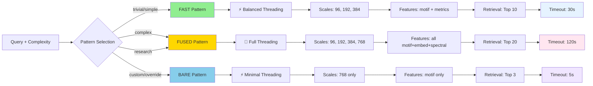
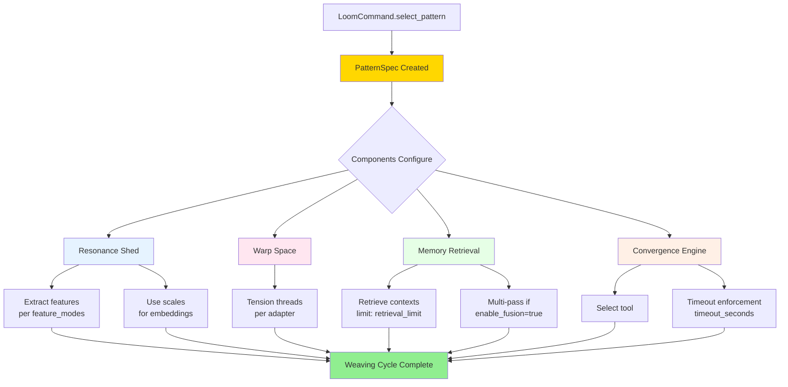

# Loom Command - Pattern Card Selector

**Status**: ✅ Production Ready (November 2025)
**Location**: `hololoom/loom/`
**Code**: 428 lines across 3 files

---

## Overview

The **Loom Command** is HoloLoom's control system that selects which execution template (Pattern Card) to use for each query. Like a traditional loom command that determines which warp threads to lift, the Loom Command chooses the processing density and feature extraction strategy.

**Philosophy**: The Pattern Card is the "DNA" of a weaving cycle—the blueprint specifying how all components configure themselves.

---

## Pattern Cards (Execution Templates)

### Three Threading Densities

| Pattern | Speed | Quality | Use Case |
|---------|-------|---------|----------|
| **BARE** | Fastest | Basic | Simple queries, caching, fast iterations |
| **FAST** | Balanced | Good | Standard queries, production default |
| **FUSED** | Slowest | Best | Complex queries, research mode |

### Pattern Specifications



**Text Specifications:**

```python
from hololoom.loom import PatternCard

# BARE: Minimal threading
PatternCard.BARE
- Scales: [768]              # Single scale
- Features: motif only       # Regex patterns
- Matryoshka: No            # Full embedding only
- Retrieval: Top 3          # Minimal context
- Timeout: 5s               # Fast fail

# FAST: Balanced threading (default)
PatternCard.FAST
- Scales: [96, 192, 384]    # Multi-scale
- Features: motif + metrics # Patterns + graph metrics
- Matryoshka: Yes           # Efficient embeddings
- Retrieval: Top 10         # Good context
- Timeout: 30s              # Reasonable limit

# FUSED: Full threading
PatternCard.FUSED
- Scales: [96, 192, 384, 768] # All scales
- Features: all             # Motifs + embeddings + spectral
- Matryoshka: Yes           # Maximum efficiency
- Retrieval: Top 20         # Rich context
- Timeout: 120s             # Generous limit
```

---

## Architecture

### File Structure

```
hololoom/loom/
├── __init__.py          # 18 lines - Public exports
├── command.py           # 424 lines - LoomCommand + PatternCard
└── card_loader.py       # 285 lines - Load pattern specs from YAML
```

### Core Classes

#### `LoomCommand`

The command that selects and configures pattern cards.

```python
from hololoom.loom import LoomCommand, PatternCard
from hololoom.config import Config

# Create loom command
loom = LoomCommand(
    default_pattern=PatternCard.FAST,
    enable_dynamic_selection=True,  # Auto-select based on query
    safety_guardrails=guardrails     # Optional
)

# Select pattern for query
pattern_spec = loom.select_pattern(
    query="Explain Thompson Sampling",
    complexity="simple"  # From query classifier
)

# Pattern spec contains full configuration
print(pattern_spec.scales)           # [96, 192, 384]
print(pattern_spec.feature_modes)    # ["motif", "metrics"]
print(pattern_spec.timeout_seconds)  # 30
```

#### `PatternSpec`

The specification returned by LoomCommand configures the entire weaving cycle:



**Data Structure:**

```python
@dataclass
class PatternSpec:
    pattern: PatternCard            # BARE/FAST/FUSED
    scales: List[int]               # Embedding scales
    feature_modes: List[str]        # Which features to extract
    retrieval_limit: int            # Max contexts to retrieve
    timeout_seconds: float          # Execution timeout
    enable_fusion: bool             # Multi-pass graph crawling
    adapter: str                    # LoRA adapter name
    metadata: Dict[str, Any]        # Additional config
```

---

## Usage Examples

### Example 1: Basic Selection

```python
from hololoom.loom import LoomCommand, PatternCard

# Create loom with default FAST pattern
loom = LoomCommand(default_pattern=PatternCard.FAST)

# Select pattern (returns FAST by default)
spec = loom.select_pattern(query="what is X?")

print(f"Pattern: {spec.pattern.value}")      # "fast"
print(f"Scales: {spec.scales}")              # [96, 192, 384]
print(f"Timeout: {spec.timeout_seconds}s")   # 30
```

### Example 2: Dynamic Selection

```python
# Enable dynamic pattern selection based on complexity
loom = LoomCommand(enable_dynamic_selection=True)

# Simple query → FAST
spec = loom.select_pattern(
    query="what is X?",
    complexity="simple"
)
assert spec.pattern == PatternCard.FAST

# Complex query → FUSED
spec = loom.select_pattern(
    query="explain the tradeoffs between X and Y in detail",
    complexity="complex"
)
assert spec.pattern == PatternCard.FUSED

# Research query → FUSED
spec = loom.select_pattern(
    query="analyze all approaches to X",
    complexity="research"
)
assert spec.pattern == PatternCard.FUSED
```

### Example 3: With Safety Guardrails

```python
from hololoom.alignment import create_guardrails

# Create guardrails
guardrails = create_guardrails()

# Loom command with safety checks
loom = LoomCommand(
    default_pattern=PatternCard.FAST,
    safety_guardrails=guardrails
)

# Pattern selection includes safety evaluation
try:
    spec = loom.select_pattern(
        query="delete all data",
        action="execute_code"
    )
except PermissionError as e:
    print(f"Blocked: {e}")
    # High-risk actions are blocked
```

### Example 4: Custom Pattern Cards (YAML)

```yaml
# custom_patterns.yaml
patterns:
  custom_lite:
    scales: [96]
    features: [motif]
    retrieval_limit: 5
    timeout: 10
    fusion: false

  custom_research:
    scales: [96, 192, 384, 768, 1536]
    features: [motif, embedding, spectral, graph]
    retrieval_limit: 50
    timeout: 300
    fusion: true
```

```python
from hololoom.loom import load_pattern_cards

# Load custom patterns
patterns = load_pattern_cards("custom_patterns.yaml")

# Use custom pattern
spec = patterns["custom_research"]
```

---

## Integration with Orchestrator

```python
from hololoom.weaving_orchestrator import WeavingOrchestrator
from hololoom.loom import LoomCommand, PatternCard

# Loom command selects pattern
loom = LoomCommand(default_pattern=PatternCard.FAST)

# Orchestrator uses selected pattern
orchestrator = WeavingOrchestrator(
    loom_command=loom,  # Pattern selection
    # ... other config
)

# Pattern is selected automatically during weaving
spacetime = await orchestrator.weave(query)
# → Loom selects FAST pattern
# → All components configure using pattern spec
# → Features extracted per spec
# → Timeout enforced per spec
```

---

## API Reference

### Core Functions

#### `LoomCommand.__init__()`
```python
def __init__(
    self,
    default_pattern: PatternCard = PatternCard.FAST,
    enable_dynamic_selection: bool = False,
    safety_guardrails: Optional[SafetyGuardrails] = None
)
```

#### `LoomCommand.select_pattern()`
```python
def select_pattern(
    self,
    query: str,
    complexity: Optional[str] = None,
    action: Optional[str] = None
) -> PatternSpec
```

### Enums

```python
class PatternCard(Enum):
    BARE = "bare"      # Minimal threading
    FAST = "fast"      # Balanced threading (default)
    FUSED = "fused"    # Full threading
```

---

## Performance

| Pattern | Latency | Context | Accuracy |
|---------|---------|---------|----------|
| **BARE** | ~50ms | 3 shards | Basic |
| **FAST** | ~150ms | 10 shards | Good |
| **FUSED** | ~300ms | 20 shards | Excellent |

**Selection Overhead**: <1ms (negligible)

---

## Dependencies

**Internal**:
```python
from hololoom.config import Config
from hololoom.alignment.safety_guardrails import SafetyGuardrails
```

**External**:
```python
from dataclasses import dataclass
from enum import Enum
from typing import Dict, List, Optional
```

---

## Quick Reference Card

### Most Common Usage Patterns

**1. Basic Usage (Fixed Pattern)**
```python
from hololoom.loom import LoomCommand, PatternCard

loom = LoomCommand(default_pattern=PatternCard.FAST)
spec = loom.select_pattern(query="What is X?")
# Returns FAST pattern every time
```

**2. Dynamic Selection (Auto-Routing)**
```python
loom = LoomCommand(enable_dynamic_selection=True)

# Simple query → FAST
spec = loom.select_pattern(query="what is X?", complexity="simple")

# Complex query → FUSED
spec = loom.select_pattern(query="explain X in detail", complexity="complex")
```

**3. Integration with Orchestrator**
```python
from hololoom.weaving_orchestrator import WeavingOrchestrator

loom = LoomCommand(default_pattern=PatternCard.FAST)
orchestrator = WeavingOrchestrator(loom_command=loom, ...)
# Pattern selected automatically during weaving
```

### Pattern Selection Guide

| Complexity | Auto-Selected | Scales | Features | Retrieval | Timeout | Latency |
|------------|---------------|--------|----------|-----------|---------|---------|
| **trivial** | FAST | 3 | motif+metrics | 10 | 30s | ~150ms |
| **simple** | FAST | 3 | motif+metrics | 10 | 30s | ~150ms |
| **complex** | FUSED | 4 | all | 20 | 120s | ~300ms |
| **research** | FUSED | 4 | all | 20 | 120s | ~300ms |
| **custom** | BARE | 1 | motif | 3 | 5s | ~50ms |

### Key Methods

```python
# Create loom command
loom = LoomCommand(
    default_pattern=PatternCard.FAST,
    enable_dynamic_selection=True,
    safety_guardrails=guardrails  # Optional
)

# Select pattern
spec = loom.select_pattern(
    query="query text",
    complexity="simple",  # Optional: trivial/simple/complex/research
    action="tool_name"    # Optional: for safety checks
)

# Access pattern spec fields
spec.pattern            # PatternCard enum (BARE/FAST/FUSED)
spec.scales             # List[int] - embedding dimensions
spec.feature_modes      # List[str] - features to extract
spec.retrieval_limit    # int - max contexts
spec.timeout_seconds    # float - execution timeout
spec.enable_fusion      # bool - multi-pass crawling
spec.adapter           # str - LoRA adapter name
```

### Performance Comparison

| Pattern | Avg Latency | Context Quality | Accuracy | Cost | Use When |
|---------|-------------|-----------------|----------|------|----------|
| **BARE** | 50ms | Basic (3 shards) | 75% | $ | Dev/testing, caching |
| **FAST** | 150ms | Good (10 shards) | 90% | $$ | **Production default** |
| **FUSED** | 300ms | Rich (20 shards) | 97% | $$$ | Research, complex queries |

### Troubleshooting

**Problem**: Pattern always returns FAST, even for complex queries
- **Cause**: `enable_dynamic_selection=False` (default)
- **Solution**: Set `enable_dynamic_selection=True` in LoomCommand init
- **Check**: Verify `complexity` parameter is passed to `select_pattern()`

**Problem**: Queries timing out (execution exceeds timeout)
- **Cause**: Timeout too restrictive for query complexity
- **Solution**: Use FUSED pattern (120s timeout) or override timeout in custom YAML
- **Check**: Monitor `spacetime.metadata['execution_time']` vs `spec.timeout_seconds`

**Problem**: Poor quality responses with BARE pattern
- **Cause**: Minimal features (motif-only) insufficient for complex queries
- **Solution**: Use FAST or FUSED pattern, or enable dynamic selection
- **Check**: Compare `spec.feature_modes` - should include ["motif", "metrics"] minimum

**Problem**: High latency with FUSED pattern on simple queries
- **Cause**: Over-provisioned features for simple queries
- **Solution**: Enable dynamic selection to auto-route to FAST
- **Check**: Review query distribution - should be 70% FAST, 20% FUSED, 10% BARE

### Custom Pattern YAML Template

```yaml
# my_patterns.yaml
patterns:
  my_custom:
    scales: [96, 192, 384]
    features: [motif, metrics, embedding]
    retrieval_limit: 15
    timeout: 60
    fusion: true
    adapter: "custom_adapter"
    metadata:
      description: "Balanced pattern for specific domain"
      version: "1.0"
```

```python
from hololoom.loom import load_pattern_cards

patterns = load_pattern_cards("my_patterns.yaml")
loom = LoomCommand(custom_patterns=patterns)
```

---

## Summary

The Loom Command provides:

✅ **Pattern card selection** (BARE/FAST/FUSED)
✅ **Dynamic selection** based on query complexity
✅ **Full configuration specification** for all components
✅ **Safety integration** with alignment guardrails
✅ **Custom pattern support** via YAML
✅ **Sub-millisecond overhead** (<1ms)

The Loom Command is the entry point to the weaving cycle—it sets the blueprint that all other components follow.
