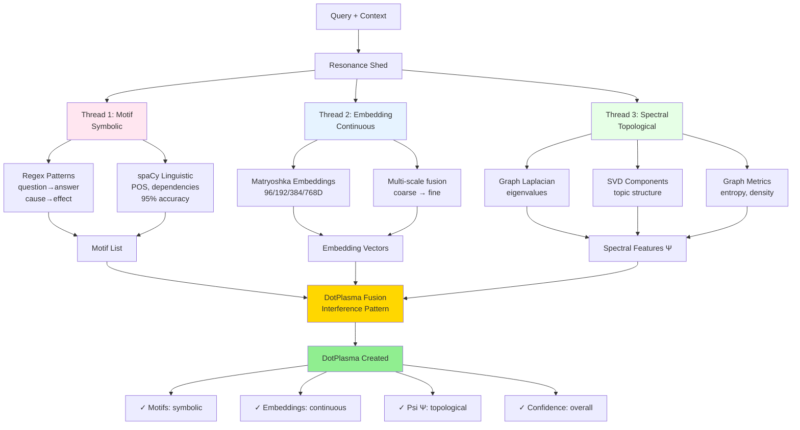

# Resonance Shed - Feature Extraction Hub

**Status**: ✅ Production Ready (November 2025)
**Location**: `hololoom/resonance/`
**Code**: 846 lines across 2 files

---

## Overview

The **Resonance Shed** is HoloLoom's feature extraction hub where multiple feature threads (motif, embedding, spectral) are "lifted" and combined through interference patterns to create a rich, multi-modal representation called **DotPlasma**.

**Weaving Metaphor**: In traditional weaving, the **shed** is the vertical space created when some warp threads are lifted and others lowered. HoloLoom's Resonance Shed lifts feature threads and creates interference patterns through multi-modal fusion.

---

## Architecture

### File Structure

```
hololoom/resonance/
├── __init__.py     # 12 lines - Public exports
└── shed.py         # 834 lines - ResonanceShed implementation
```

### Core Concept: DotPlasma

**DotPlasma** (alias for `Features`) is the "feature fluid"—a flowing continuous representation created by lifting and fusing three feature threads:



**Data Structure:**

```python
@dataclass
class DotPlasma:  # Alias: Features
    psi: np.ndarray              # Ψ (spectral features - 6D)
    motifs: List[str]            # Detected linguistic patterns
    metrics: Dict[str, float]    # Graph metrics
    confidence: float            # Overall confidence (0-1)
    embedding: Optional[np.ndarray]  # Optional full embedding
    scales: Optional[List[int]]  # Active scales [96, 192, 384]
```

**Three Feature Threads**:

1. **Motif Thread** (Symbolic)
   - Linguistic patterns: "question→answer", "cause→effect"
   - Regex and spaCy detection
   - Controls neural pathways

2. **Embedding Thread** (Continuous)
   - Matryoshka multi-scale embeddings
   - 96/192/384/768 dimensions
   - Semantic similarity

3. **Spectral Thread** (Topological)
   - Graph Laplacian eigenvalues
   - SVD topic components
   - Structural features

---

## Core Class: ResonanceShed

### Initialization

```python
from hololoom.resonance import ResonanceShed
from hololoom.embedding.spectral import MatryoshkaEmbeddings
from hololoom.motif.unified import create_motif_detector

# Create embedder and motif detector
embedder = MatryoshkaEmbeddings(sizes=[96, 192, 384])
motif_detector = create_motif_detector(mode="hybrid")

# Create resonance shed
shed = ResonanceShed(
    embedder=embedder,
    motif_detector=motif_detector,
    scales=[96, 192, 384],
    enable_spectral=True
)
```

### Main Method: `lift_threads()`

Extracts all feature threads and creates DotPlasma:

```python
# Lift feature threads from query
dot_plasma = await shed.lift_threads(
    query="What is Thompson Sampling?",
    context_shards=retrieved_shards,
    kg_subgraph=subgraph
)

print(f"Motifs: {dot_plasma.motifs}")
# ["question→answer"]

print(f"Spectral features: {dot_plasma.psi.shape}")
# (6,)  # [eigen1, eigen2, svd1, svd2, entropy, density]

print(f"Confidence: {dot_plasma.confidence:.2f}")
# 0.85
```

---

## Feature Extraction Pipeline

### Step-by-Step Process

```
Query + Context → ResonanceShed
    ↓
1. Motif Detection (symbolic thread)
   - Regex patterns: "what is", "explain", etc.
   - spaCy linguistic patterns
   - Output: ["question→answer", "explanation"]
    ↓
2. Embedding (continuous thread)
   - Encode query with MatryoshkaEmbeddings
   - Multi-scale: 96D, 192D, 384D
   - Output: embedding vectors per scale
    ↓
3. Spectral Analysis (topological thread)
   - Graph Laplacian: eigenvalues capture structure
   - SVD: topic components
   - Graph metrics: entropy, density
   - Output: Ψ (6-dimensional spectral vector)
    ↓
4. Fusion (interference pattern)
   - Combine all threads
   - Compute overall confidence
   - Create DotPlasma
    ↓
Output: DotPlasma (malleable feature representation)
```

---

## Usage Examples

### Example 1: Basic Feature Extraction

```python
from hololoom.resonance import ResonanceShed

# Create shed
shed = ResonanceShed(
    embedder=embedder,
    motif_detector=motif_detector,
    scales=[384]  # Single scale for speed
)

# Extract features
dot_plasma = await shed.lift_threads(
    query="Explain neural networks",
    context_shards=[]
)

print(f"Motifs: {dot_plasma.motifs}")
# ["explanation", "technical_explanation"]

print(f"Confidence: {dot_plasma.confidence:.2f}")
# 0.78
```

### Example 2: Multi-Scale Features

```python
# Multi-scale extraction
shed = ResonanceShed(
    embedder=embedder,
    motif_detector=motif_detector,
    scales=[96, 192, 384],  # Three scales
    enable_spectral=True
)

dot_plasma = await shed.lift_threads(
    query="What are the tradeoffs?",
    context_shards=retrieved_shards
)

print(f"Scales: {dot_plasma.scales}")
# [96, 192, 384]

print(f"Spectral (Ψ): {dot_plasma.psi}")
# [0.15, 0.08, 0.22, 0.31, 1.45, 0.62]
# [eigen1, eigen2, svd1, svd2, entropy, density]
```

### Example 3: With Knowledge Graph

```python
from hololoom.memory.graph import KG

# Create knowledge graph
kg = KG()
kg.add_edge("Thompson Sampling", "exploration", "USES")
kg.add_edge("Thompson Sampling", "Bayesian", "IS_A")

# Extract subgraph
subgraph = kg.get_subgraph("Thompson Sampling", max_depth=2)

# Lift threads with graph context
dot_plasma = await shed.lift_threads(
    query="What is Thompson Sampling?",
    context_shards=[],
    kg_subgraph=subgraph
)

# Spectral features capture graph structure
print(f"Graph entropy: {dot_plasma.psi[4]:.2f}")
# Higher entropy = more complex structure
```

### Example 4: Confidence-Based Escalation

```python
# Extract features with confidence threshold
dot_plasma = await shed.lift_threads(
    query="complex technical query",
    context_shards=retrieved_shards
)

if dot_plasma.confidence < 0.7:
    print("Low confidence - escalating to FUSED mode")
    # Re-extract with more features
    shed_fused = ResonanceShed(
        embedder=embedder,
        motif_detector=motif_detector,
        scales=[96, 192, 384, 768],  # More scales
        enable_spectral=True
    )
    dot_plasma = await shed_fused.lift_threads(
        query, context_shards
    )
```

---

## Integration with Orchestrator

```python
from hololoom.weaving_orchestrator import WeavingOrchestrator
from hololoom.resonance import ResonanceShed

# Orchestrator creates resonance shed
orchestrator = WeavingOrchestrator(
    resonance_shed=shed,  # Feature extractor
    # ... other config
)

# During weaving:
# 1. Query arrives
# 2. Resonance Shed lifts feature threads
# 3. DotPlasma created (multi-modal representation)
# 4. DotPlasma flows to Policy Engine for decision
# 5. Policy uses features to select tool
```

---

## Feature Thread Details

### Motif Thread (Symbolic)

**Detected Patterns**:
- `question→answer`: "what is", "who is", "where is"
- `explanation`: "explain", "describe", "elaborate"
- `comparison`: "vs", "versus", "compare"
- `cause→effect`: "because", "therefore", "leads to"
- `procedure`: "how to", "step by step"

**Detection Modes**:
- Regex (fast, 88% accuracy)
- spaCy (slower, 95% accuracy)
- Hybrid (best of both)

### Embedding Thread (Continuous)

**Matryoshka Scales**:
```
96D  → Coarse semantic similarity
192D → Mid-level semantic similarity
384D → Fine-grained semantic similarity
768D → Maximum semantic fidelity
```

**Properties**:
- Prefix property: 96D is prefix of 192D, etc.
- Zero-copy slicing for efficiency
- Adaptive scale selection

### Spectral Thread (Topological)

**6 Spectral Features** (Ψ):
```python
psi = [
    eigen1,    # 1st Laplacian eigenvalue (connectivity)
    eigen2,    # 2nd Laplacian eigenvalue (bipartiteness)
    svd1,      # 1st SVD component (main topic)
    svd2,      # 2nd SVD component (secondary topic)
    entropy,   # Graph entropy (complexity)
    density    # Edge density (interconnectedness)
]
```

---

## API Reference

### Core Methods

#### `ResonanceShed.__init__()`
```python
def __init__(
    self,
    embedder: MatryoshkaEmbeddings,
    motif_detector: MotifDetector,
    scales: List[int] = [384],
    enable_spectral: bool = True
)
```

#### `ResonanceShed.lift_threads()`
```python
async def lift_threads(
    self,
    query: str,
    context_shards: List[MemoryShard] = [],
    kg_subgraph: Optional[KG] = None
) -> DotPlasma
```

#### `DotPlasma` (Features)
```python
@dataclass
class DotPlasma:
    psi: np.ndarray              # Spectral features (6D)
    motifs: List[str]            # Detected patterns
    metrics: Dict[str, float]    # Graph metrics
    confidence: float            # Overall confidence (0-1)
    embedding: Optional[np.ndarray]  # Full embedding
    scales: Optional[List[int]]  # Active scales
```

---

## Performance

| Operation | Latency | Notes |
|-----------|---------|-------|
| **Motif detection (regex)** | ~0.5ms | Fast patterns |
| **Motif detection (spaCy)** | ~10ms | Linguistic patterns |
| **Embedding (1 scale)** | ~5ms | Single forward pass |
| **Embedding (3 scales)** | ~8ms | Zero-copy slicing |
| **Spectral features** | ~15ms | SVD + eigenvalues |
| **Total (FAST mode)** | ~25ms | All threads |

**Memory**: ~2-5MB (embeddings dominate)

---

## Dependencies

**Internal**:
```python
from hololoom.embedding.spectral import MatryoshkaEmbeddings
from hololoom.motif.unified import MotifDetector
from hololoom.memory.protocol import MemoryShard
from hololoom.memory.graph import KG
from hololoom.documentation.types import Features  # Alias: DotPlasma
```

**External**:
```python
import numpy as np
from dataclasses import dataclass
from typing import List, Dict, Optional
```

---

## Quick Reference Card

### Most Common Usage Patterns

**1. Basic Feature Extraction**
```python
from hololoom.resonance import ResonanceShed

shed = ResonanceShed(embedder=embedder, motif_detector=motif_detector)
dot_plasma = await shed.lift_threads(query="What is Thompson Sampling?")
# Returns DotPlasma with motifs, embeddings, and spectral features
```

**2. Multi-Scale Extraction**
```python
shed = ResonanceShed(
    embedder=embedder,
    motif_detector=motif_detector,
    scales=[96, 192, 384],  # Multi-scale
    enable_spectral=True
)
dot_plasma = await shed.lift_threads(query, context_shards=shards)
```

**3. With Knowledge Graph**
```python
subgraph = kg.get_subgraph("Thompson Sampling", max_depth=2)
dot_plasma = await shed.lift_threads(query, kg_subgraph=subgraph)
# Spectral features capture graph structure
```

### Feature Thread Comparison

| Thread | Type | Output | Latency | Use Case |
|--------|------|--------|---------|----------|
| **Motif** | Symbolic | List[str] patterns | ~0.5-10ms | Neural pathway control |
| **Embedding** | Continuous | Multi-scale vectors | ~5-8ms | Semantic similarity |
| **Spectral** | Topological | 6D Ψ vector | ~15ms | Graph structure |

### Motif Detection Modes

| Mode | Accuracy | Latency | Features |
|------|----------|---------|----------|
| **Regex** | 88% | ~0.5ms | Fast, patterns only |
| **spaCy** | 95% | ~10ms | Linguistic analysis (POS, deps) |
| **Hybrid** | 95% | ~10ms | **Recommended default** |

### Spectral Features (Ψ - 6D)

| Dimension | Feature | Interpretation |
|-----------|---------|----------------|
| **Ψ[0]** | Eigen 1 | Graph connectivity |
| **Ψ[1]** | Eigen 2 | Bipartiteness |
| **Ψ[2]** | SVD 1 | Main topic |
| **Ψ[3]** | SVD 2 | Secondary topic |
| **Ψ[4]** | Entropy | Graph complexity |
| **Ψ[5]** | Density | Edge interconnectedness |

### Matryoshka Scales

| Scale | Dimensions | Semantic Fidelity | Use Case |
|-------|------------|-------------------|----------|
| **96D** | 96 | Coarse | Quick similarity, caching |
| **192D** | 192 | Medium | Standard retrieval |
| **384D** | 384 | Fine | **Production default** |
| **768D** | 768 | Maximum | Research, critical queries |

**Prefix Property**: 96D is prefix of 192D, which is prefix of 384D, etc. (zero-copy slicing)

### Key Methods

```python
# Create resonance shed
shed = ResonanceShed(
    embedder=MatryoshkaEmbeddings(sizes=[96, 192, 384]),
    motif_detector=create_motif_detector(mode="hybrid"),
    scales=[96, 192, 384],  # Active embedding scales
    enable_spectral=True    # Enable spectral thread
)

# Lift feature threads (main method)
dot_plasma = await shed.lift_threads(
    query="Query text",
    context_shards=[],      # Optional: retrieved contexts
    kg_subgraph=None        # Optional: knowledge graph
)

# Access DotPlasma fields
dot_plasma.motifs           # List[str] - detected patterns
dot_plasma.psi              # np.ndarray (6D) - spectral features
dot_plasma.embedding        # Optional[np.ndarray] - full embedding
dot_plasma.metrics          # Dict[str, float] - graph metrics
dot_plasma.confidence       # float (0-1) - overall confidence
dot_plasma.scales           # List[int] - active scales
```

### Detected Motif Patterns

| Motif | Pattern Examples | Use Case |
|-------|------------------|----------|
| **question→answer** | "what is", "who is", "where is" | Activate answer neural pathway |
| **explanation** | "explain", "describe", "elaborate" | Activate explanation pathway |
| **comparison** | "vs", "versus", "compare", "tradeoffs" | Activate comparison pathway |
| **cause→effect** | "because", "therefore", "leads to" | Activate causal reasoning |
| **procedure** | "how to", "step by step" | Activate procedural pathway |

### Performance Metrics

| Operation | Latency | Pattern | Memory |
|-----------|---------|---------|--------|
| **Motif (regex)** | ~0.5ms | BARE | <1MB |
| **Motif (spaCy)** | ~10ms | FAST/FUSED | ~50MB (spaCy model) |
| **Embedding (1 scale)** | ~5ms | BARE | ~2MB |
| **Embedding (3 scales)** | ~8ms | FAST | ~5MB |
| **Spectral features** | ~15ms | FUSED | ~2MB |
| **Total (FAST mode)** | ~25ms | All threads | ~7MB |

### Troubleshooting

**Problem**: Low confidence scores consistently
- **Cause**: Insufficient features being extracted
- **Solution**: Enable spectral thread, use more scales (FUSED pattern)
- **Check**: Verify `enable_spectral=True`, `scales=[96, 192, 384, 768]`

**Problem**: High latency (>50ms)
- **Cause**: Too many scales or spaCy motif detection
- **Solution**: Use fewer scales, switch to regex motifs for BARE pattern
- **Check**: Reduce to single scale [384], use motif mode="regex"

**Problem**: Empty motif list
- **Cause**: Query doesn't match any patterns
- **Solution**: Normal for some queries, check pattern coverage
- **Check**: Review detected patterns, consider adding custom patterns

**Problem**: Spectral features all zeros
- **Cause**: No knowledge graph provided or graph too small
- **Solution**: Pass `kg_subgraph` parameter with sufficient structure
- **Check**: Verify subgraph has >5 nodes and edges

**Problem**: Embedding vectors are identical across scales
- **Cause**: Matryoshka embeddings not properly configured
- **Solution**: Ensure embedder initialized with correct sizes
- **Check**: Verify `embedder.sizes == [96, 192, 384]`

### Integration Example

```python
from hololoom.weaving_orchestrator import WeavingOrchestrator
from hololoom.resonance import ResonanceShed
from hololoom.embedding.spectral import MatryoshkaEmbeddings
from hololoom.motif.unified import create_motif_detector

# Create resonance shed
embedder = MatryoshkaEmbeddings(sizes=[96, 192, 384])
motif_detector = create_motif_detector(mode="hybrid")

shed = ResonanceShed(
    embedder=embedder,
    motif_detector=motif_detector,
    scales=[96, 192, 384],
    enable_spectral=True
)

# Orchestrator integrates shed
async with WeavingOrchestrator(
    cfg=config,
    resonance_shed=shed,  # Feature extractor
    shards=shards
) as orchestrator:
    # During weaving:
    # 1. Query arrives
    # 2. Resonance Shed lifts feature threads
    # 3. DotPlasma created (multi-modal representation)
    # 4. DotPlasma flows to Policy Engine
    # 5. Policy uses features to select tool

    spacetime = await orchestrator.weave(query)
```

---

## Summary

The Resonance Shed provides:

✅ **Multi-modal feature extraction** (symbolic + continuous + topological)
✅ **DotPlasma creation** (malleable feature representation)
✅ **Three feature threads** (motif, embedding, spectral)
✅ **Confidence scoring** for escalation decisions
✅ **Multi-scale support** (96/192/384/768D embeddings)
✅ **Knowledge graph integration** (spectral features from structure)
✅ **~25ms total latency** (FAST mode, all threads)

The Resonance Shed creates the feature-rich DotPlasma that flows through the rest of the weaving cycle.
